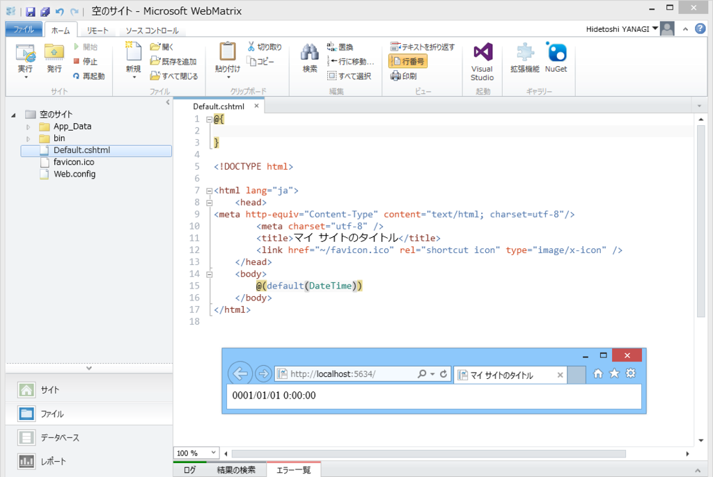
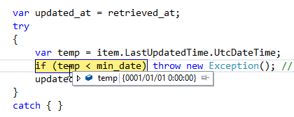

だいぶ悩んで、Visual Studio まで立ち上げていろいろデバッグしていたのだけど、原因は簡単だった。

<blockquote cite="https://technet.microsoft.com/ja-jp/library/ms172424(v=sql.110).aspx">

<h3>datetime</h3>

300 分の 1 秒、つまり 3.33 ミリ秒の精度で、<b>1753 年 1 月 1 日から 9999 年 12 月 31 日まで</b>の日付と時刻のデータを格納するデータ型です。値は .000、.003、または .007 ミリ秒の単位になるように丸められます。

2 つの 4 バイト整数として格納されます。最初の 4 バイトは、base date である 1900 年 1 月 1 日からの日数、またはこの日までの日数を格納します。基準日とは、システムが参照する日付です。datetime 型の値には、1753 年 1 月 1 日より前の日付を使用できません。もう一方の 4 バイトは、午前 0 時から数えた時間をミリ秒単位で格納します。秒の有効範囲は 0 から 59 までです。

<cite><a href="https://technet.microsoft.com/ja-jp/library/ms172424(v=sql.110).aspx">&#x30C7;&#x30FC;&#x30BF;&#x578B;</a></cite>
</blockquote>

一方、C# の <code>default(DateTime)</code> は <code>0001/01/01 0:00:00</code>。つまり、SyndicationFeed オブジェクトの LastUpdateTime プロパティあたりにちゃんと値がセットされてなくて（そういうフィードを配信しているサイトは割とある）、<code>default(DateTime)</code> を返してくるとき、それをそのまま SQL CE データベースに格納しようとするとエラーになる。

SQL CE の datetime 型を扱う場合は、事前に値の範囲に収まるかチェックして、ダメな場合はハネておかないといけないんだね。

<pre class="code lang-cs" data-lang="cs" data-unlink>var min_date = new DateTime(1753, 1, 1); // ほんとは readonly でどこかに
var updated_at = item.LastUpdatedTime.UtcDateTime &lt; min_date
? new DateTimeOffset(DateTime.Now).UtcDateTime
: item.LastUpdatedTime.UtcDateTime;

// Database.Execute();
</pre>

<h3>教訓</h3>

ちゃんとマニュアルは読もう。

