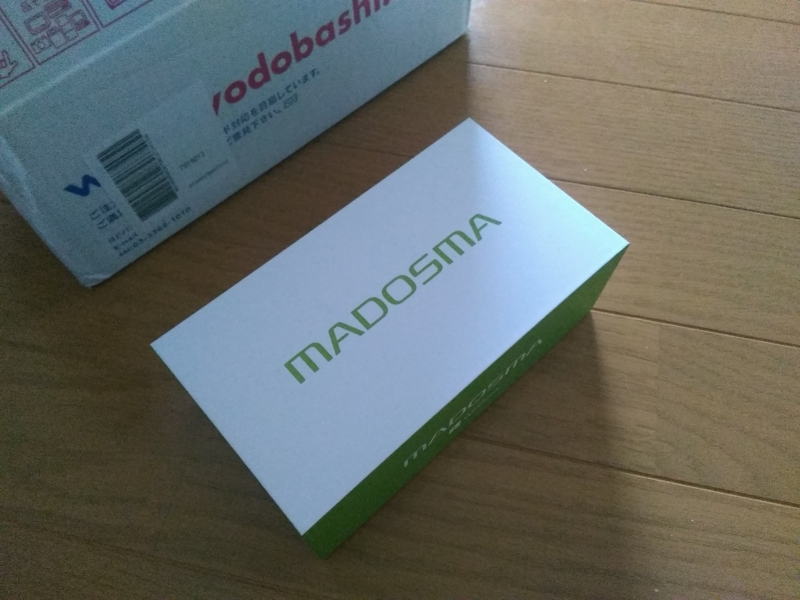

そろそろ落ち着いてきたと思うので、MADOSMA の評判を適当に集めてみた（ググって5ページ目ぐらいまでと、目についた Twitter だけ拾った）。一部買っていないヒトの感想も混じっていますが、気にしないでくだサイ。
 

関係ないけど、WordPress ってデフォルトで oEmbed に対応していないのかな？　引用のときにカードが出ていないのはそういうことで。

<h3>「燦然と輝く技適」</h3>

<iframe src="https://hatenablog-parts.com/embed?url=https%3A%2F%2Ftyheeeee.hateblo.jp%2Fentry%2F2015%2F06%2F18%2F%25E5%2590%2588%25E6%25B3%2595_Windows_Phone_%25E3%2581%2593%25E3%2581%25A8_MADOSMA_%25E8%25B2%25B7%25E3%2581%25A3%25E3%2581%259F%25E3%2581%25A3%25E3%2581%259F" title="合法 Windows Phone こと MADOSMA 買ったった - ほげほげー" class="embed-card embed-blogcard" scrolling="no" frameborder="0" style="display: block; width: 100%; height: 190px; max-width: 500px; margin: 10px 0px;"></iframe> 

<h3>「隣の席にいた一般の方からの視線が痛かった」</h3>

<a href="href">MADOSMAという名の輝き</a> 

<h3>「パッケージはキムワイプっぽい」</h3>

<iframe src="https://hatenablog-parts.com/embed?url=https%3A%2F%2Fblog.shibayan.jp%2Fentry%2F20150618%2F1434628975" title="流行っているみたいなので MADOSMA を買いました - しばやん雑記" class="embed-card embed-blogcard" scrolling="no" frameborder="0" style="display: block; width: 100%; height: 190px; max-width: 500px; margin: 10px 0px;"></iframe> 

<h3>「充電中は右上付近が赤色にちょっと光る」</h3>

<iframe src="https://hatenablog-parts.com/embed?url=https%3A%2F%2Fbuchizo.wordpress.com%2F2015%2F06%2F19%2Fmadosma-q501wh" title="MADOSMA Q501WH" class="embed-card embed-webcard" scrolling="no" frameborder="0" style="display: block; width: 100%; height: 155px; max-width: 500px; margin: 10px 0px;"></iframe> 

<h3>「思った以上に使えるな」</h3>

<iframe src="https://hatenablog-parts.com/embed?url=http%3A%2F%2Festpolis.com%2F2015%2F06%2F18755.html" title="Zenfone2とMADOSMAがやってきた！第29回岡山スマホユーザー会を開催しました | アナザーディメンション" class="embed-card embed-webcard" scrolling="no" frameborder="0" style="display: block; width: 100%; height: 155px; max-width: 500px; margin: 10px 0px;"></iframe> 

<h3>「2台目のサブ機」</h3>

<iframe src="https://hatenablog-parts.com/embed?url=http%3A%2F%2Fwww.itmedia.co.jp%2Fmobile%2Farticles%2F1506%2F18%2Fnews061.html" title="Windows Phone「MADOSMA」は“格安スマホ”として買いか？" class="embed-card embed-webcard" scrolling="no" frameborder="0" style="display: block; width: 100%; height: 155px; max-width: 500px; margin: 10px 0px;"></iframe> 

<h3>「ミドルスペックのスマホに33800円を支払うというのはちょっとお金の使い方としてもったいないのではないでしょうか」</h3>

<iframe src="https://hatenablog-parts.com/embed?url=http%3A%2F%2Fcareersmaho.com%2Fmadosma-q501%2F" title="MADOSMA Q501、貴重なWindows Phoneではあるがコスパは悪い" class="embed-card embed-webcard" scrolling="no" frameborder="0" style="display: block; width: 100%; height: 155px; max-width: 500px; margin: 10px 0px;"></iframe> 

<h3>「みなさんもちろん購入済みだと思います。私は買ってません」</h3>

<iframe src="https://hatenablog-parts.com/embed?url=http%3A%2F%2Fshinji-japan.hatenadiary.jp%2Fentry%2F2015%2F06%2F18%2F225529" title="MADOSMAでおすすめの鳥よけアプリ - shinji-japanのブログ" class="embed-card embed-blogcard" scrolling="no" frameborder="0" style="display: block; width: 100%; height: 190px; max-width: 500px; margin: 10px 0px;"></iframe> 

<h3>「端末が好き！という方でもなければ一気に乗り換えるのは危険」</h3>

<iframe src="https://hatenablog-parts.com/embed?url=http%3A%2F%2Foctoba.net%2Farchives%2F20150618-android-feature-windows-phone-madosma.html" title="4年ぶりのWindows Phone「MADOSMA」がやってきた！基本的な動きは問題ないレベル　あとはアプリが揃えば | オクトバ" class="embed-card embed-webcard" scrolling="no" frameborder="0" style="display: block; width: 100%; height: 155px; max-width: 500px; margin: 10px 0px;"></iframe> 

<h3>「電話として使うことたぶん一度もないと思います」</h3>

<blockquote class="twitter-tweet" data-lang="ja">
MADOSMA使ってると「この電話この電話」言われるけど電話として使うことたぶん一度もないと思います。
&mdash; おのでら (@onodera_sf) <a href="https://twitter.com/onodera_sf/status/613562815412973568?ref_src=twsrc%5Etfw">2015年6月24日</a></blockquote> 

<h3>「あえて火中の栗を拾おうとしたマウスコンピューターの漢気を買いたい」</h3>

<iframe src="https://hatenablog-parts.com/embed?url=https%3A%2F%2Fblog.daruyanagi.jp%2Fentry%2F2015%2F06%2F18%2F175723" title="懺悔：MADOSMA 買いました。 - だるろぐ" class="embed-card embed-blogcard" scrolling="no" frameborder="0" style="display: block; width: 100%; height: 190px; max-width: 500px; margin: 10px 0px;"></iframe> 

<h3>おまけ：実際の売れ行き</h3>

<blockquote class="twitter-tweet" data-lang="ja">
とうとう、「家電・カメラ」部門の売れ筋ランキングでベスト100入りしてる!! (＠＠; 携帯電話ジャンル(アクセサリとSIM込み)では59位!<a href="https://twitter.com/hashtag/wpjp?src=hash&amp;ref_src=twsrc%5Etfw">#wpjp</a> <a href="https://twitter.com/hashtag/MADOSMA?src=hash&amp;ref_src=twsrc%5Etfw">#MADOSMA</a><a href="https://twitter.com/biac?ref_src=twsrc%5Etfw">@biac</a>
&mdash; 山本康彦＠BluewaterSoft (@biac) <a href="https://twitter.com/biac/status/606083750804398081?ref_src=twsrc%5Etfw">2015年6月3日</a></blockquote>

<blockquote class="twitter-tweet" data-lang="ja">
<a href="http://t.co/T268B9nV66">http://t.co/T268B9nV66</a> MADOSMA ヨドバシで携帯電話・スマートフォンランキング 1526位か… 短い夢だった
&mdash; しんじ (@shinji_japan) <a href="https://twitter.com/shinji_japan/status/608858470163423232?ref_src=twsrc%5Etfw">2015年6月11日</a></blockquote>

