
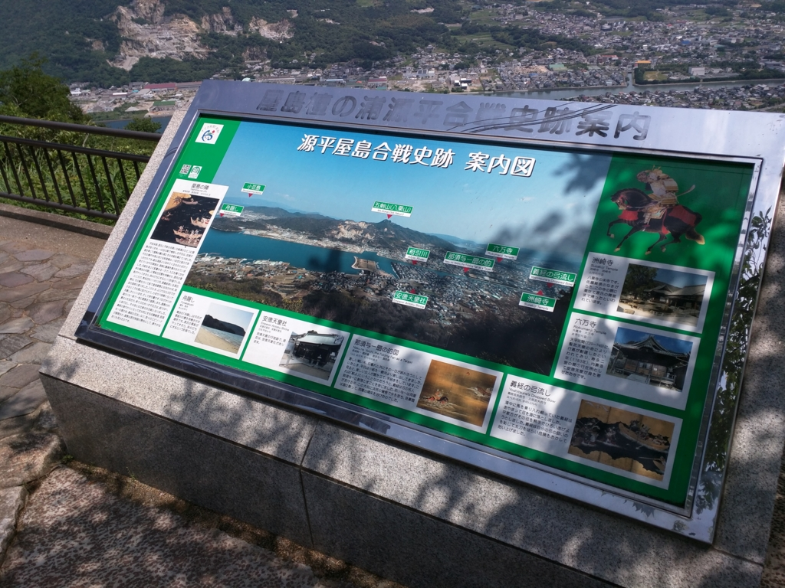

屋島寺・屋嶋城をみたあとは、屋島をぐるっと一周。

<iframe src="https://hatenablog-parts.com/embed?url=https%3A%2F%2Fblog.daruyanagi.jp%2Fentry%2F2015%2F06%2F30%2F190041" title="古代の&quot;幻の城”屋嶋城（やしまのき）を見てきた。 - だるろぐ" class="embed-card embed-blogcard" scrolling="no" frameborder="0" style="display: block; width: 100%; height: 190px; max-width: 500px; margin: 10px 0px;"></iframe>

ここからは、源平合戦で名高い「檀ノ浦」の古戦場が見渡せる。<i>「え？　“だんのうら”って下関の方じゃなかったっけ？」</i>自分も一瞬そう思ったのだけど、あっちの“だん”は<b>“壇（土偏：土を盛り上げてつくった、祭りその他の儀式を行う場所）”</b>、こっちの“だん”は<b>“檀（木編：ニシキギ科の落葉樹の名。マユミ）”</b>なんだな。“だんみつ（壇蜜）”はあっちで、“だんれい（檀れい）”はこっちだ。漢字は本当に難しいな。

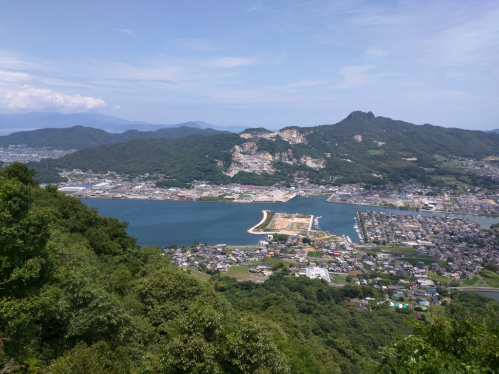

今ではかなり埋め立てられているようだが、かつてはもっと大きな入り江だったのだろう。ところどころ山が禿げているのは、石切り場のようだ。その右上の方に聳え立つのが、五剣山。この山には

<blockquote cite="http://www.88shikokuhenro.jp/kagawa/85yakuriji/">

天長６年、大師がこの山に登り求聞寺法を修めた時に、五振りの剣が天振り注ぎ、山の鎮守蔵王権現が現れました。そして「この山は仏教相応の霊地なり」と告げられたので、大師はそれらの剣を山中に埋め鎮護とし五剣山と名づけらました。

<cite><a href="http://www.88shikokuhenro.jp/kagawa/85yakuriji/">&#x56DB;&#x56FD;&#x516B;&#x5341;&#x516B;&#x30F6;&#x6240;&#x970A;&#x5834;&#x516C;&#x5F0F;&#x30DB;&#x30FC;&#x30E0;&#x30DA;&#x30FC;&#x30B8;&#xFF1A;&#x7B2C;85&#x756A;&#x672D;&#x6240; &#x4E94;&#x5263;&#x5C71; &#x89B3;&#x81EA;&#x5728;&#x9662; &#x516B;&#x6817;&#x5BFA;</a></cite>
</blockquote>

という由来があり、名前のごとく五本の剣のような峯が――といいたいところだが、残念ながら五の剣は1707年（宝永4年）の宝永地震で割れ、今はない。

そして、その五剣山の八合目あたりにあるのが、 四国八十八ヶ所霊場第85番札所「八栗寺」。どうせなら足を延ばしていってみることにする。

<h3>高松琴平電気鉄道</h3>

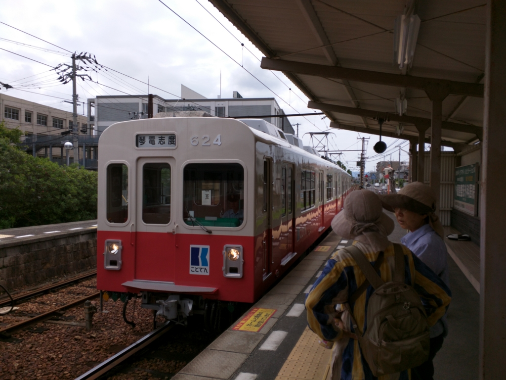

行きに乗ったバスで琴電屋島までもどり、二駅先の八栗まで。琴電の券売機は食券みたいで、でてくる切符もペラペラだ。はじめ見たときはちょっとびっくりするけれど、これで十分事足りているのだろう。

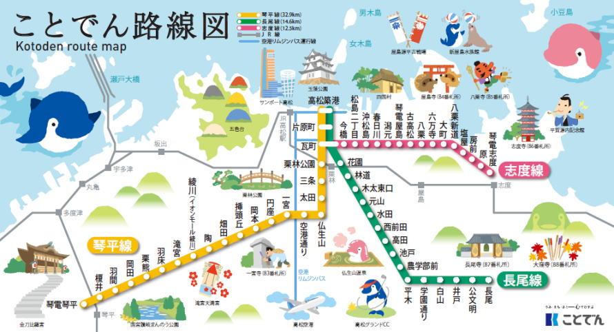

松山を走っている伊予鉄と違い、市内の循環路線はなく、郊外列車に相当する路線が高松から琴平・長尾・志度の三方向へ伸びている。

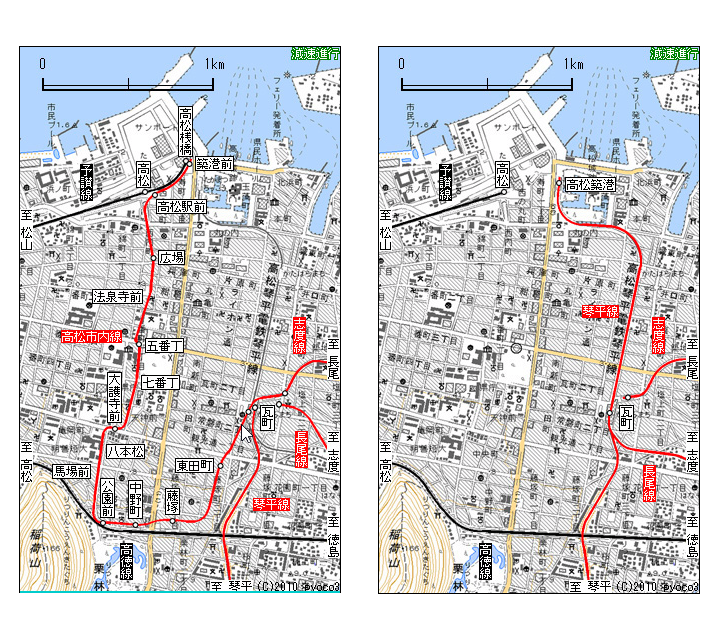

しかし昔からそうであったわけではないらしい。戦前は「市内線」と呼ばれる路線があったのだけど、それが戦災で焼失。戦後に瓦町付近の路線整理と、琴平線を延伸するかたちで高松築港まで新線を敷き、旧市内線は廃線になったのだという。

現在の JR 高松駅と琴電高松築港駅が少し離れているのも、JR 高松駅－高松桟橋駅間が廃線になったのと、琴電市内線が廃線になり琴平線が延伸されたという事情があったんだね。

<h3>八栗寺</h3>

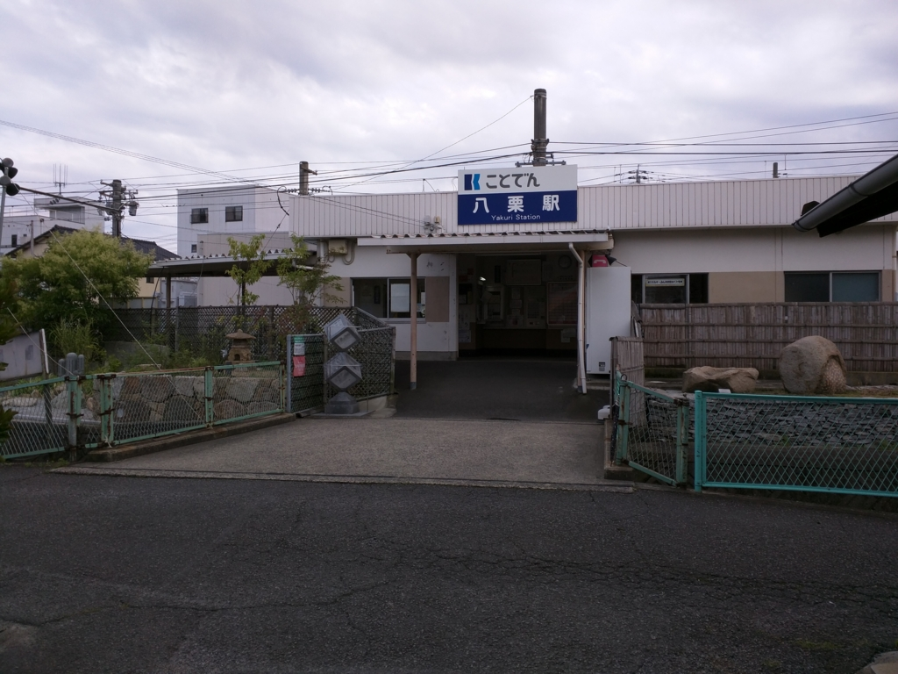

八栗駅到着。八栗寺へ上るケーブルカーまでは、ここから割と歩かなきゃいけない。

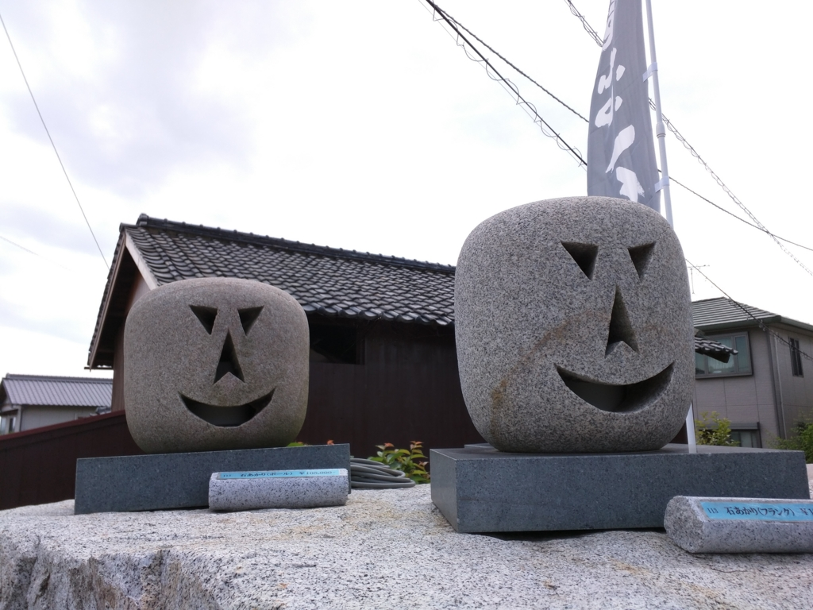

とはいえ、それほど苦痛には感じない。というのも、このあたりは石工が集まっているらしく、いろいろな石のオブジェが行く人の目を楽しませてくれるからだ。

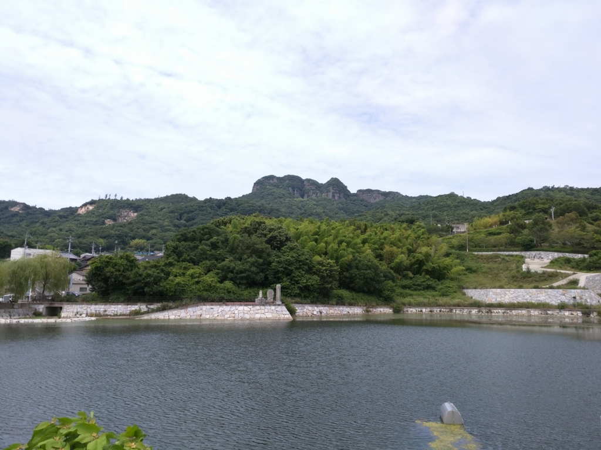

うどん県名物のため池の向こうに、五剣山が見えてきた。

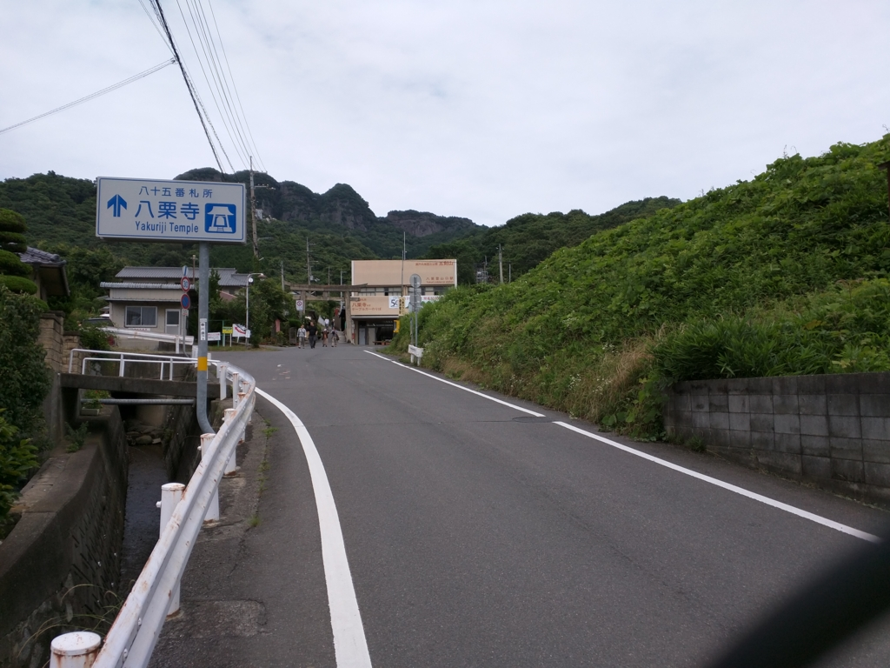

到着。

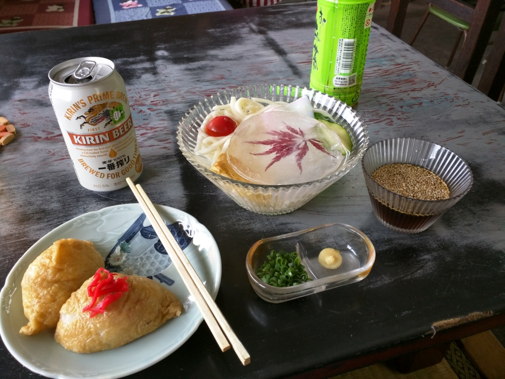

そのまま上に上がろうかと思ったけれど、すでに3時を回ろうかという時間なのに、朝、電車の中で駅弁を食べてから何も口にしていない。途中で倒れても嫌なので、炭水化物とビールを補給することにした。

ケーブルカー乗り場の前にある食堂はイイ感じにさびれていて、うどん県にしてはごくフツウのおうどんをだしてくれる。ちょっと物足りなかったのでお稲荷さんを頼んだ。なかは五目になっていて、少し酸っぱめ。でも、登り道で疲れているカラダには、それがちょっぴりありがたい。どこからともなく食欲がわいてきて、ペロッと平らげてしまった。冬はイイダコのおでんが名物とのことなので、その時期に行くのがほんとはイイのかもしれない。

ちなみに、本気のうどんを食べたい場合は、ここにくる途中にあるうどん屋さんがお勧めらしい。

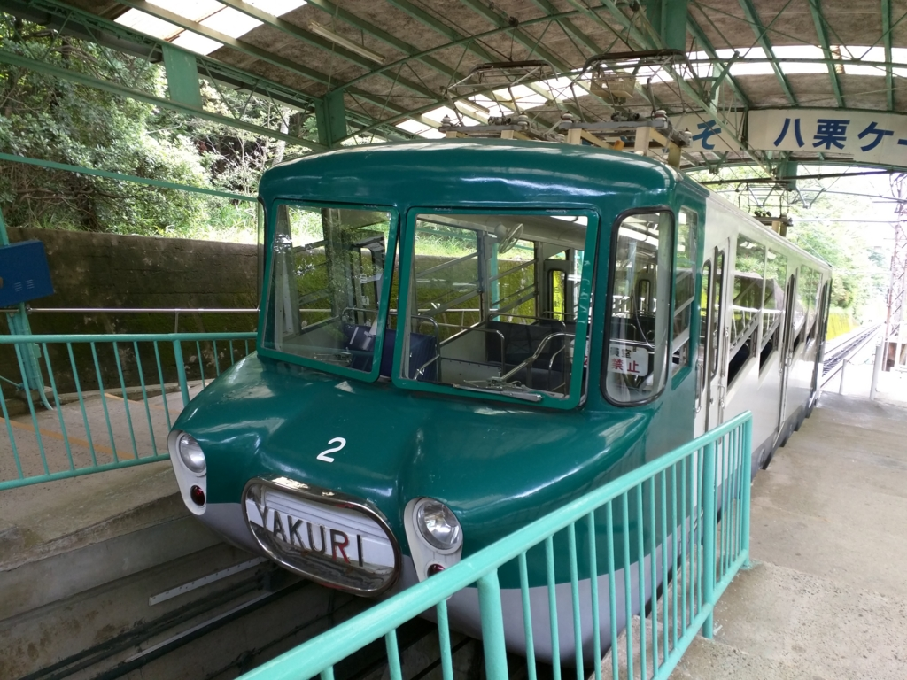

八栗寺のケーブルカーは超レトロ。そういえば屋島寺にもケーブルカーだかなんだかがあったそうだけど、今はない。ここも耐用年数が過ぎてしまえばどうなることやら。

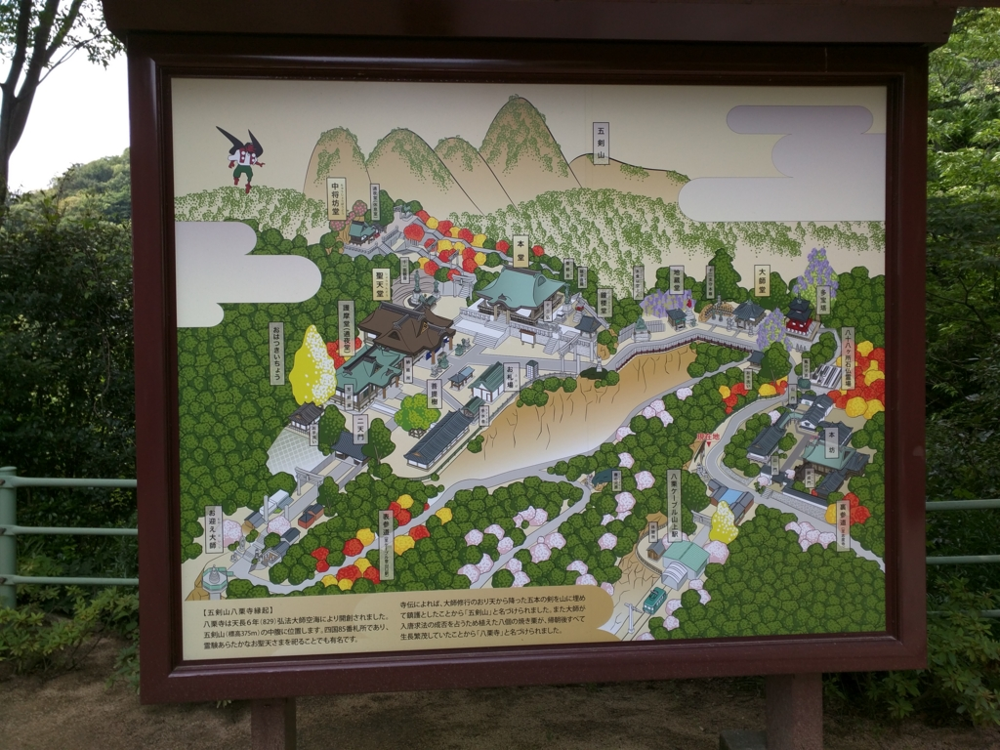

先にも言ったけれど、八栗寺は五剣山の八合目にある。その上は崩れやすくなっているので、一般の人は立ち入り禁止との由。

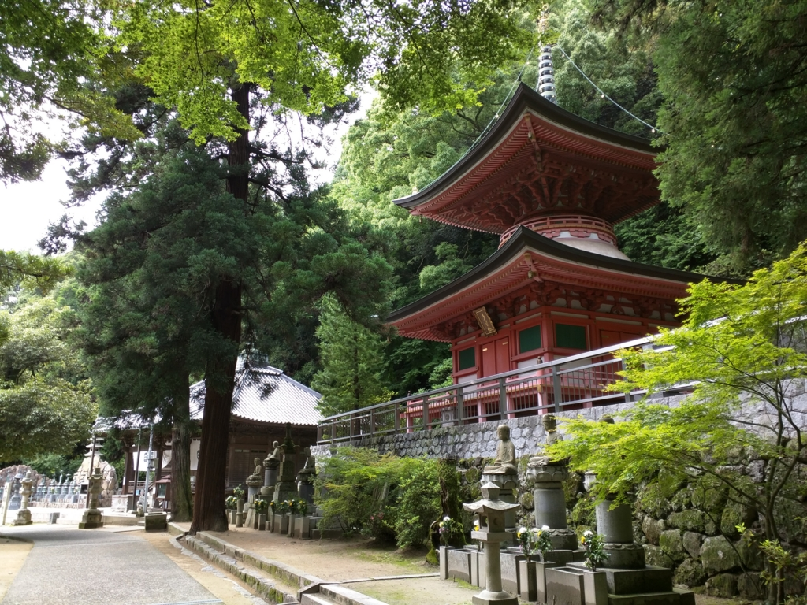

来る人が少ないせいか、屋島寺よりものんびりしていて、静か。とても居心地のいい空間だった。

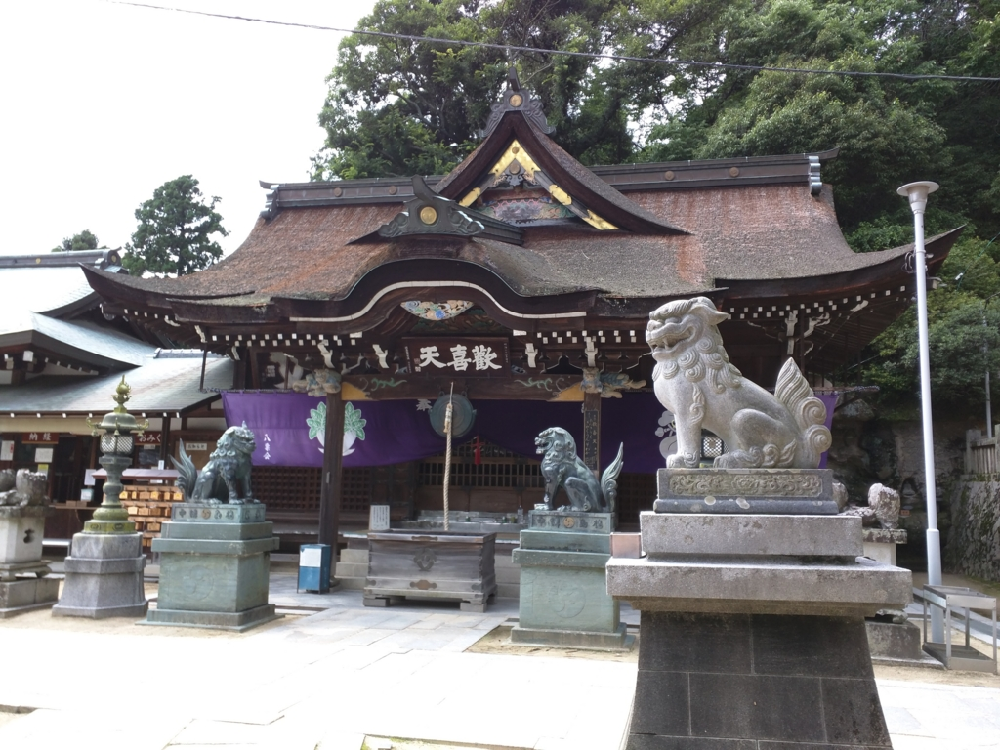

ちょっと気になったのは歓喜天をお祭りしているお堂。なんか変だなーと思ったのだけど、これ、神社っぽいよね。狛犬とか……そういえば、あまりにも当然のごとく置かれているので気が付かなかったのだけど、入り口にも鳥居がデーンと置いてあった。どうやら、明治に巻き起こった廃仏毀釈の嵐も、この山の上にある寺にまでは及ばなかったらしい。

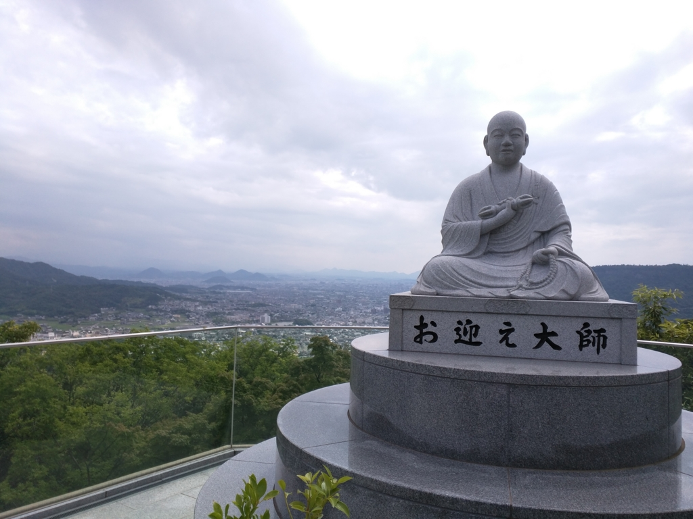

あと、敷地の奥にはお迎え大師がいる。屋島が望める絶景ポジション！

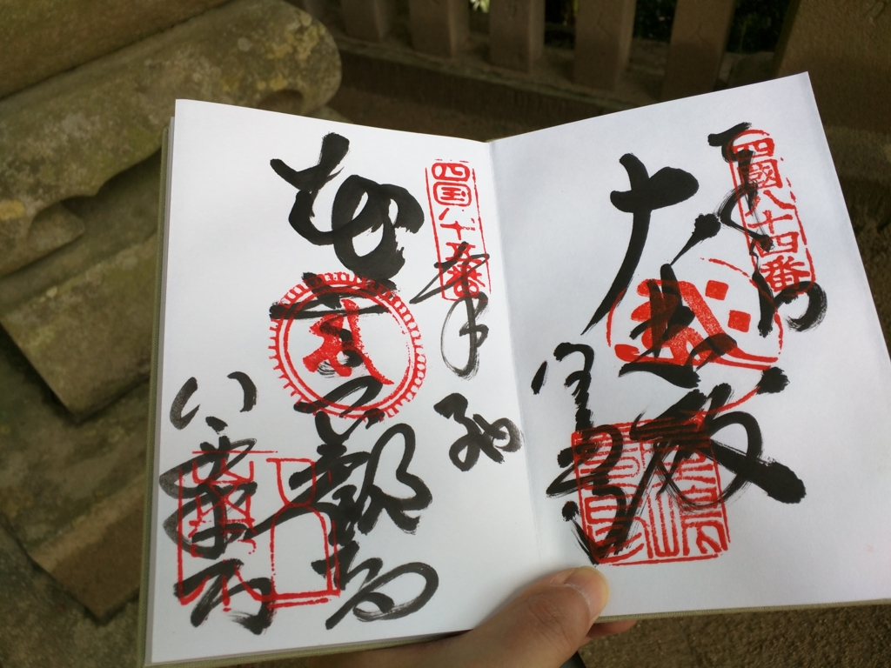

んなわけで、屋島寺と八栗寺の御朱印をゲットして、高松まで帰りました。その日は高松で泊まって、骨付き鶏などのグルメを楽しむ予定！――だったのだが……まぁ、そろそろ書くの飽きたので次回に続く。

