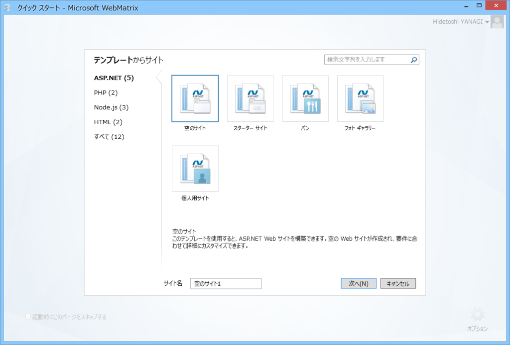
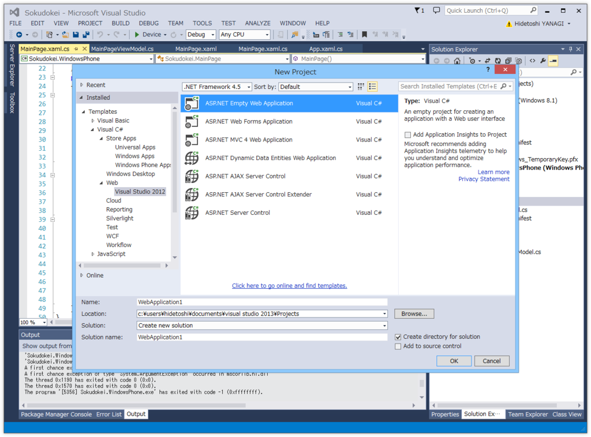
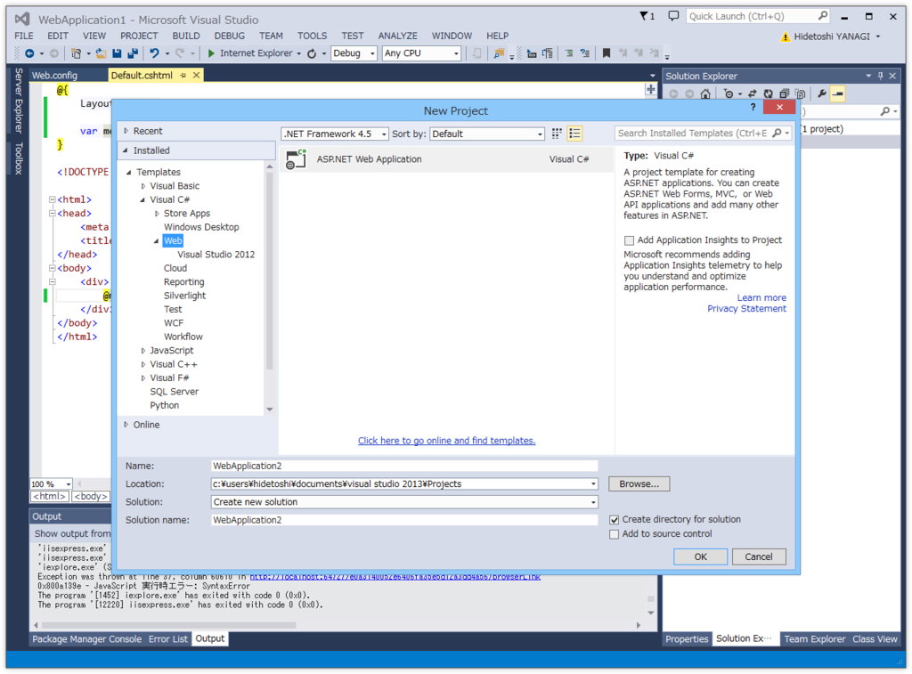
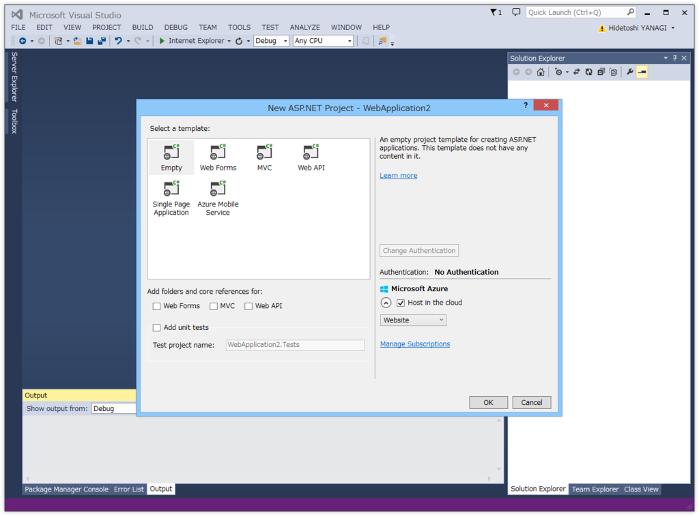
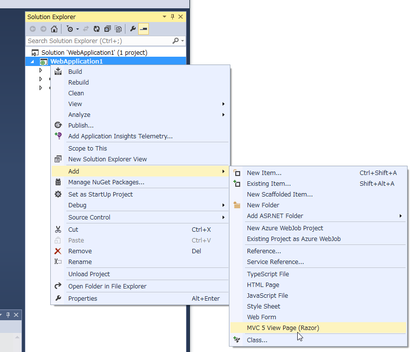
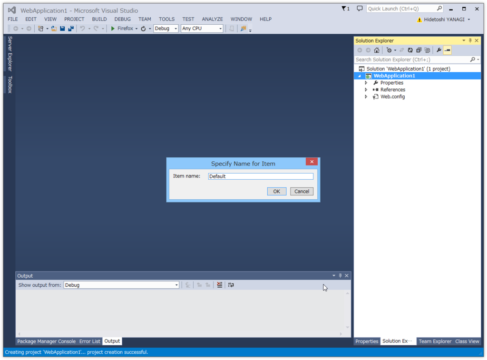
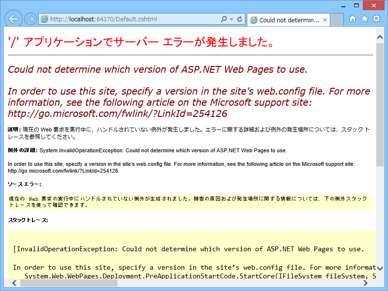
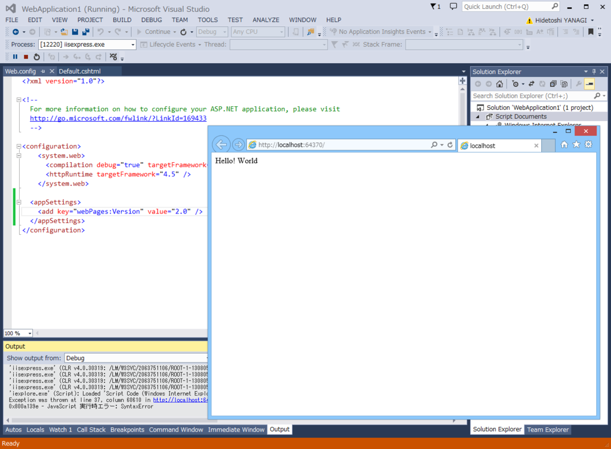

みんなも大好きな「WebMatrix」ですが、そろそろ本格的に“なかったこと”になっているような気がしてならない今日この頃。代わりとなるのはおそらく「Visual Studio Code」なのでしょうが、まだちょっとベータ版なので、今回は定評のありまくる「Visual Studio Community」で ASP.NET Web Pages をはじめる方法を調べてみました。「WebMatrix」で“空のサイト”に相当するものを作るのが今回の目標です。

<h3>とりあえずプロジェクトを作成する</h3>

まずはプロジェクトを作成する必要があります。プロジェクトの新規作成ダイアログで［Templates］－［Visual C#］－［Web］－［Visual Studio 2012］とツリーを辿り、「ASP.NET Empty Web Application」を選択します。Visual Basic じゃないと死んでしまう病に冒されている人は、［Visual C#］の代わりに［Visual Basic］を選択するとよいでしょう。

ちなみに、［Templates］－［Visual C#］－［Web］にある「ASP.NET Web Application」テンプレートを使っても構いません。

このテンプレートを選択すると、プロジェクトの種類なんかを選べるダイアログが現れるので、ここで「Empty」を選択すればさっきと同じ結果になると思います（厳密にくらべたわけじゃないから知らんけど）。このダイアログからプロジェクトを作ると Azure Web Sites も同時に作れるので、必要な場合はこっちを選ぶと手間が省けるかも。

<h3>ページの追加</h3>

プロジェクトを作成したら、ページの追加。コンテストメニューを開いて［Add］－［MVC 5 View Page (Razor)］を選択します。

あとは名前を付けると、cshtml ファイルが生成されます。ASP.NET（Web Pages）の流儀にしたがって、最初のファイルの名前は Default.cshtml にしておきましょうか。中身はこんな感じです。

<pre class="code lang-cs" data-lang="cs" data-unlink>@{
Layout = null;
}

&lt;!DOCTYPE html&gt;

&lt;html&gt;
&lt;head&gt;
&lt;meta name=&quot;viewport&quot; content=&quot;width=device-width&quot; /&gt;
&lt;title&gt;&lt;/title&gt;
&lt;/head&gt;
&lt;body&gt;
&lt;div&gt;

&lt;/div&gt;
&lt;/body&gt;
&lt;/html&gt;
</pre>
body が空っぽなので、ついでにこんな感じでサンプルコードを加えておきます。

<pre class="code lang-cs" data-lang="cs" data-unlink>@{
Layout = null;
var message = &quot;Hello! World&quot;; // 追加
}

&lt;!DOCTYPE html&gt;

&lt;html&gt;
&lt;head&gt;
&lt;meta name=&quot;viewport&quot; content=&quot;width=device-width&quot; /&gt;
&lt;title&gt;&lt;/title&gt;
&lt;/head&gt;
&lt;body&gt;
&lt;div&gt;
@message &lt;!-- 追加 --&gt;
&lt;/div&gt;
&lt;/body&gt;
&lt;/html&gt;
</pre>
これで［F5］キーを押せば、"Hello! World" と書かれたサイトが立ち上がるはず――

――だったのですが、ダメでした。<a href="http://go.microsoft.com/fwlink/?LinkId=254126">http://go.microsoft.com/fwlink/?LinkId=254126</a> を読めと言われるのでそれに目を通してみますと、Web.config で利用する ASP.NET Web Pages のバージョンを指定しろと書いてあります。仕方ないので、言われたとおりにキーを追加。

<pre class="code lang-xml" data-lang="xml" data-unlink>&lt;?xml version=&quot;1.0&quot; encoding=&quot;utf-8&quot;?&gt;
&lt;!--
  For more information on how to configure your ASP.NET application, please visit
  http://go.microsoft.com/fwlink/?LinkId=169433
  --&gt;
&lt;configuration&gt;
&lt;system.web&gt;
&lt;compilation debug=&quot;true&quot; targetFramework=&quot;4.5&quot; /&gt;
&lt;httpRuntime targetFramework=&quot;4.5&quot; /&gt;
&lt;/system.web&gt;

&lt;appSettings&gt; &lt;!-- このセクションを追加 --&gt;
&lt;add key=&quot;webPages:Version&quot; value=&quot;2.0&quot; /&gt;
&lt;/appSettings&gt;
&lt;/configuration&gt;
</pre>

すると、サイトが立ち上がりました！　めでたしめでたし！　あとは SQL CE データベースを読み書きできるようにしたり、その中身を見るためのよさげなツールを探したり（クッソめんどくせー！）、追加の NuGet パッケージを入れたりするだけですね。これで WebMatrix を窓からポイできます。スターターサイトなんかは、Yeoman かなにかで準備する感じになるのかなぁ……ちょっとずつ新しい流儀に慣れていかないとね。

<h3>おまけ</h3>

ASP.NET Web Pages は .NET 言語で PHP っぽく Web ページのロジックを記述できるフレームワークです。PHP よりも安全に作られているので、お仕事で使わなければならないかわいそうな人でもなければ、こっちの方がお勧めデス。

書き方は @shibayan のサイトでも参考にしてください。PHP の記法と比べながら簡単に解説してくれています。

<iframe src="http://blog.shibayan.jp/embed/20110714/1310652120" title="PHP と比較して覚える ASP.NET Web Pages (1) - しばやん雑記" class="embed-card embed-blogcard" scrolling="no" frameborder="0" style="display: block; width: 100%; height: 190px; max-width: 500px; margin: 10px 0px;"><a href="http://blog.shibayan.jp/entry/20110714/1310652120">PHP と比較して覚える ASP.NET Web Pages (1) - しばやん雑記</a></iframe>

「（1）」って書いてあるのに続編がないのは気にしないでおきましょう。あとは

<iframe src="//hatenablog-parts.com/embed?url=http%3A%2F%2Fwebmatrix.g.hatena.ne.jp%2Fcx20%2F20110228%2F1298841518" title="ASP.NET Razor 記法 基礎文法最速マスター - CX&#39;s WebMatrix Diary" class="embed-card embed-webcard" scrolling="no" frameborder="0" style="display: block; width: 100%; height: 155px; max-width: 500px; margin: 10px 0px;"><a href="http://webmatrix.g.hatena.ne.jp/cx20/20110228/1298841518">ASP.NET Razor 記法 基礎文法最速マスター - CX&#39;s WebMatrix Diary</a></iframe>

なんかが詳しいかもしれません。

