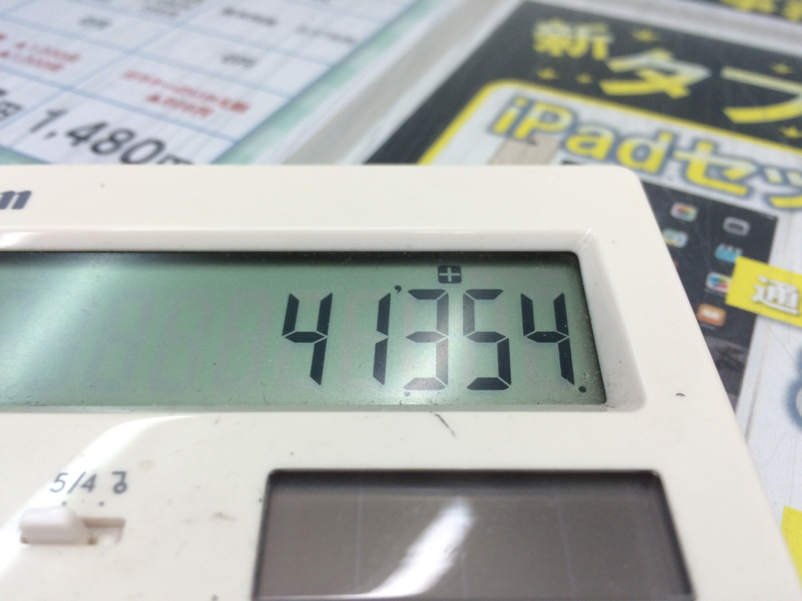
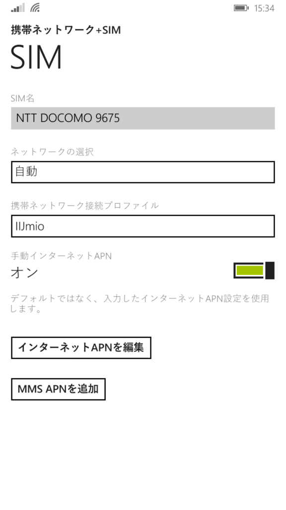
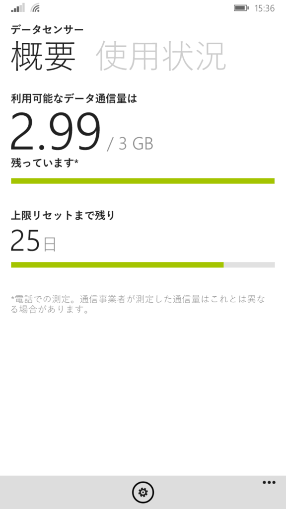

この前ふとソフトバンクの明細を確認したところ、2年縛りを2カ月ほどオーバーしているのに気が付いた。iPhone 5 から iPhone 5s へ機種変更下のが一昨年の9月で、なぜかその時に解約すればいいとばかり思い込んでいた。違約金なしで解約するには、あと1年10カ月ほど使い続けなければならない。

<iframe src="https://hatenablog-parts.com/embed?url=https%3A%2F%2Fblog.daruyanagi.jp%2Fentry%2F2013%2F09%2F24%2F072910" title="iPhone 5S 買ったった。 - だるろぐ" class="embed-card embed-blogcard" scrolling="no" frameborder="0" style="display: block; width: 100%; height: 190px; max-width: 500px; margin: 10px 0px;"></iframe>

まぁ、そのまま MADOSMA（まだ SIM を挿してない！）の回線として使い続けてもいいのだけど、設定間違って料金が青天井になってもイヤだし（たぶん大丈夫だろうけど、僕はケータイに疎いから何をするやわからぬ）、そもそも無職になってめっきり外に出なくなったので、モバイルデータ回線はそれほど必要がない。とはいえ、電話番号は変えたくない。なぜなら、長年メインの番号として利用していた関係で、あちこちでこの番号を登録しているからだ。今さらいちいち手続き変更なんてやりたくない。

というわけで思い立ったが吉日、解約金1万円ちょっとを払ってでもこの回線を解約し、生まれて初めての MNP をしてみようと思った。格安音声 SIM でお金を浮かし、毎月の呑み代に振り分けるぜ！

<h3>生まれて初めての……</h3>

<blockquote cite="http://e-words.jp/w/%E3%83%8A%E3%83%B3%E3%83%90%E3%83%BC%E3%83%9D%E3%83%BC%E3%82%BF%E3%83%93%E3%83%AA%E3%83%86%E3%82%A3.html">

ナンバーポータビリティとは、携帯電話の加入者が別の事業者（キャリア）に契約を切り替えても、元の番号がそのまま使える制度およびシステム。日本では2006年10月24日にスタートした。

<cite><a href="http://e-words.jp/w/%E3%83%8A%E3%83%B3%E3%83%90%E3%83%BC%E3%83%9D%E3%83%BC%E3%82%BF%E3%83%93%E3%83%AA%E3%83%86%E3%82%A3.html">&#x30CA;&#x30F3;&#x30D0;&#x30FC;&#x30DD;&#x30FC;&#x30BF;&#x30D3;&#x30EA;&#x30C6;&#x30A3;&#xFF08;&#x756A;&#x53F7;&#x30DD;&#x30FC;&#x30BF;&#x30D3;&#x30EA;&#x30C6;&#x30A3;&#xFF09;&#x3068;&#x306F; - IT&#x7528;&#x8A9E;&#x8F9E;&#x5178;</a></cite>
</blockquote>

MNP をするにはソフトバンクに電話をして、MNP 番号とやらを取得しなければならないらしい。電話……ね。繋がるのかしらね。なんか必殺技を使えばオペレーターのお姉さんに直接繋がるらしいが、あんまりそういう方法をとるのも気が引けるので、テケテケと10分ほど歩いて最寄りのソフトバンクのお店に行ってきた。東京だったら整理券もらって並ばなければいけないところだが、そこは愛媛、整理券の機械すらない。サクッと応対してもらえて、ホックホクだった。

――あの説明を聞くまでは。

受付のお姉さんに調べてもらったところ、なんか身に覚えのない契約がもう一件あり、両方解約すると違約金が2倍になるという。

<blockquote>

だるやなぎは激怒した。必ず、かの 邪智暴虐（ じゃちぼうぎゃく ）のソフトバンクを除かなければならぬと決意した。だるやなぎにはケータイがわからぬ。だるやなぎは、田舎の無職である。ビールを飲み、艦これで遊んで暮して来た。けれども邪悪に対しては、人一倍に敏感であった。

</blockquote>

最初は納得がいかず、思わず怒気を顔に表してしまったが、話を聞くうちにある記憶がよみがえってきた。

むかーし、千葉のヨドバシカメラで iPhone 5 から iPhone 5s へ乗り換えるとき、ケータイコーナーのおっさんが「古い iPhone 5 が SIM なしになると困るでしょう。タダで SIM を契約できるので挿しておきましょう。ただし、電話はしないでくださいね……お金がかかりますよー」みたいな勧誘をされたっけ。要らないし、そんなわけのわからんもん押し付けられても困るけれど、やたらしつこかったので、メンドクサくて OK をしてしまった気がする。その SIM にも2年縛りがあるだなんていう話は聞いた記憶はないが……。

ともあれ、受付のお姉さんには罪はない。ステルス SIM に愛しの諭吉が殺害されたのも、すべては私の不徳の致すところ。最後に翌月末の支払いの金額だけ計算してもらって（ここでまた卒倒しかける）、店を辞した。おそらく10年以上もソフトバンクモバイルに忠誠を誓っていたのに、こんな仕打ちあんまりだ……いや、これはソフトバンクモバイルのせいではなく、悪質な販売員のせいなのだろう。

まぁ、ちゃんと契約を把握していなかった自分が悪いんだが、それとこれとは別、これに対しては断固として無慈悲な報復を行うつもりだ。たとえば、ヨドバシカメラ千葉店でさんざん品物を物色した上で、注文はアマゾンでやるとか。カメラのレンズをさんざんつけさせてもらった挙句、「買うのは今度にします（＾ｖ＾）」と言って去るとか……くくく、正義の鉄槌におののくがいい……。

<h3>IIJmio の召喚</h3>

さて、代わりとなる SIM を何にするか、だが。家に帰っていろいろ調べていたが、いろいろあってややこしい。個人的には Biglobe がいいかなって思ったけれど、とりあえず今回は IIJ にすることにした。なんか Twitter で新端末の対応状況がよく流れてくるし、対応もよさそうだ。

<blockquote cite="https://help.iijmio.jp/app/answers/detail/a_id/1583/">

データ通信専用SIMカード、SMS機能付きSIMカードをご利用の場合は、解約に際し、手数料などの料金が発生することはありません。 
音声通話機能付きSIMカードをご利用の場合は、音声通話機能付きSIMカードの利用開始日から12ヶ月以内に音声通話機能を解除（解約、MNP転出、音声通話機能つきSIMカードを削除）される場合、音声通話機能解除調定金が発生いたします。

<cite><a href="https://help.iijmio.jp/app/answers/detail/a_id/1583/">https://help.iijmio.jp/app/answers/detail/a_id/1583/</a></cite>
</blockquote>

ちなみに、違約金は12カ月以内に音声 SIM を解約する場合だけ発生する見たい。どこぞのメジャーキャリアみたいにこそこそカネをとろうとしない姿勢が気に入った。

確か金曜日に Web で SIM を申し込み、運転免許証の写真を送ると、土曜日には回線切り替えのメールが来て、日曜日に SIM が到着した。週末を挟んでいたのにフットワークが軽い。好感度うなぎのぼりだ。

さっそく MADOSMA に装着。最初はなかなか認識してくれなかったけれど、どうやらロックがちゃんとかかっていなかったらしく、キッチリはめて再起動したら認識してくれた。

 

そのまま使えそうな雰囲気もあったけれど、一応手動で APN の設定をし……

 

データセンサーを有効化。これでウチの MADOSMA も電話ができるようになった。まぁ、ほとんど受信専用だけど。古い iPhone 5s は売り飛ばすか（幸いアーマーを付けていたおかげで傷が少なく、かなりキレイだ）、検証用に取っておくかちょっと迷ってる。一度中古屋で鑑定してもらうかなぁ。 

