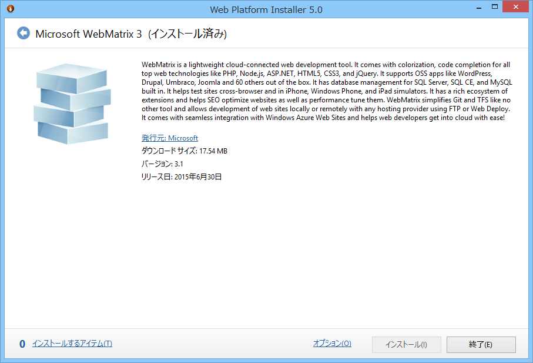
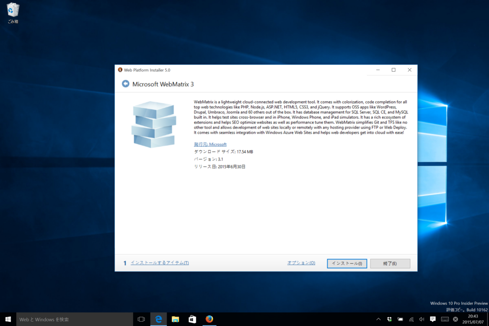
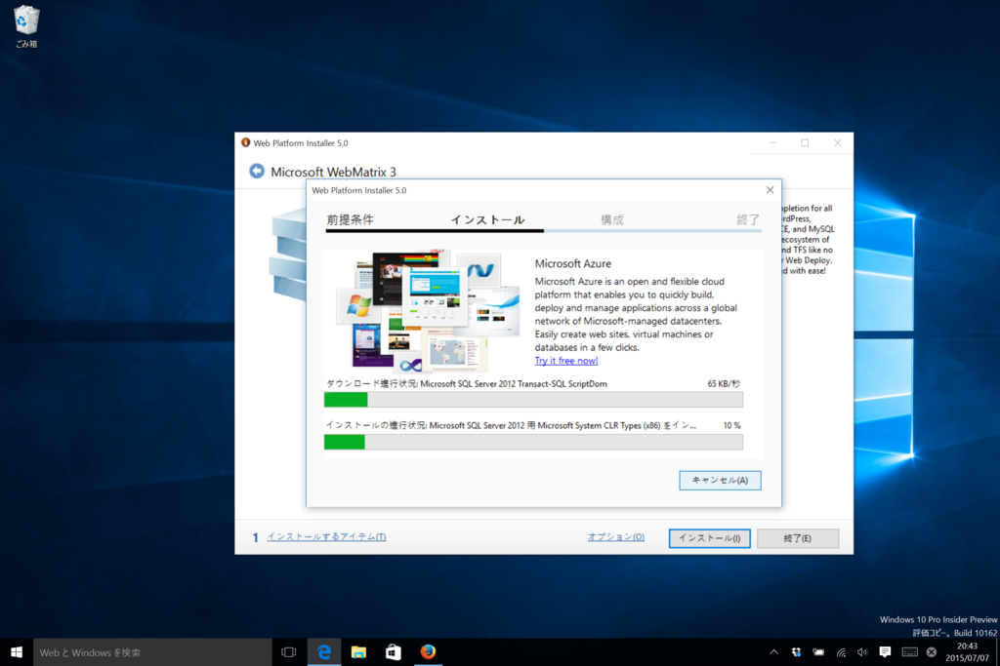
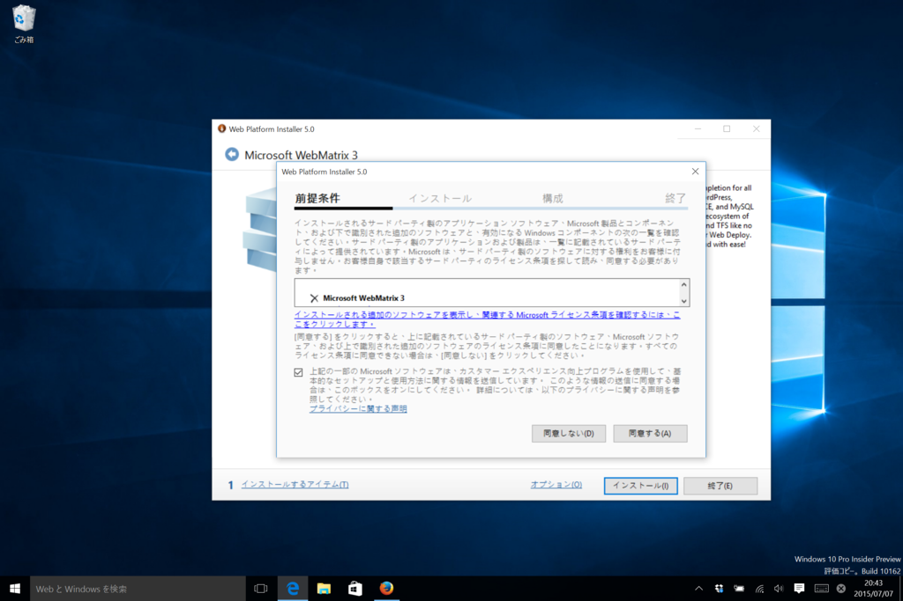
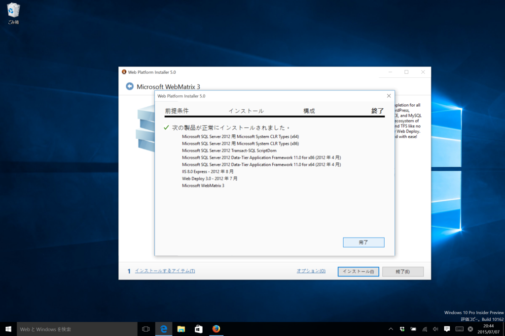
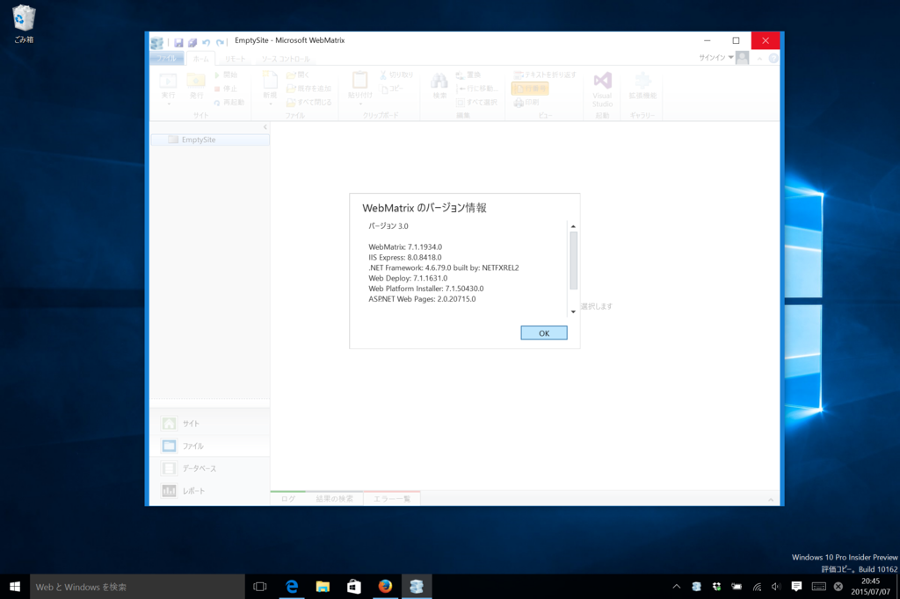
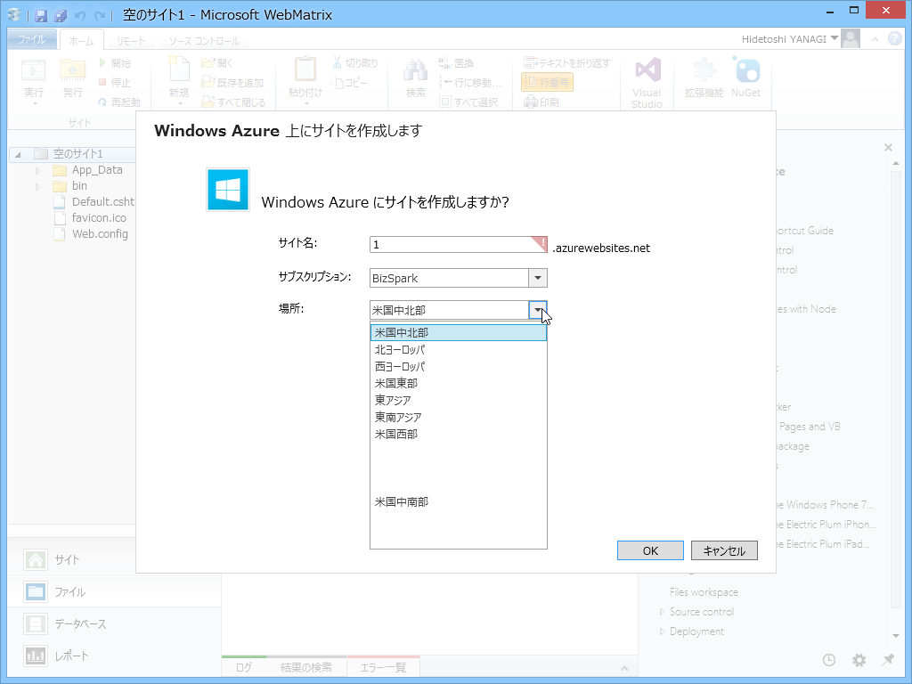

@shibayan からもたらされた極秘情報によると、6月30日に WebMatrix 3.1 がリリースされていたらしい。

<blockquote class="twitter-tweet" data-lang="ja">
<a href="https://twitter.com/daruyanagi?ref_src=twsrc%5Etfw">@daruyanagi</a> インスコ済みの WebMatrix のバージョン教えて
&mdash; しばやん (@shibayan) <a href="https://twitter.com/shibayan/status/617690333673984000?ref_src=twsrc%5Etfw">2015年7月5日</a></blockquote> 
<blockquote class="twitter-tweet" data-lang="ja">
<a href="https://twitter.com/daruyanagi?ref_src=twsrc%5Etfw">@daruyanagi</a> 6/30 にアップデートされてたくさい
&mdash; しばやん (@shibayan) <a href="https://twitter.com/shibayan/status/617690586645016577?ref_src=twsrc%5Etfw">2015年7月5日</a></blockquote>

変更点が相変わらずよくわからなかったので、その日はそのまま寝て、このこともすっかり忘れていたのだけど、ふと思い立って Windows 10 にインストールしてみたところ……

<i>ｷﾀ━(ﾟ∀ﾟ)━(∀ﾟ )━(ﾟ　 )━(　　)━(　　)━(　 ﾟ)━( ﾟ∀)━(ﾟ∀ﾟ)━!!</i>

ちょっと端っこが欠けてるような気がするけど、きっと気にしたら負けだ！！　ちゃんと息をしてくれているだけで、おじさんは満足です。これでいちいちわざわざゴニャゴニャしなくても、Windows 10 でちゃんと WebMatrix がインストールできる！

<iframe src="https://hatenablog-parts.com/embed?url=https%3A%2F%2Fblog.daruyanagi.jp%2Fentry%2F2015%2F04%2F28%2F023803" title="先生助けてっ！ WebMatrix ちゃんが息をしてないのっっ！！ - だるろぐ" class="embed-card embed-blogcard" scrolling="no" frameborder="0" style="display: block; width: 100%; height: 190px; max-width: 500px; margin: 10px 0px;"></iframe>

みんな大好き Visual Basic 6 ともども、Windows 10 でも WebMatrix をよろしくお願いいたします（＾ｖ＾）ﾉ

<h3>おまけ</h3>

もしお手すきでしたらこれも直していただければ幸いです(`・ω・́)ゝ

