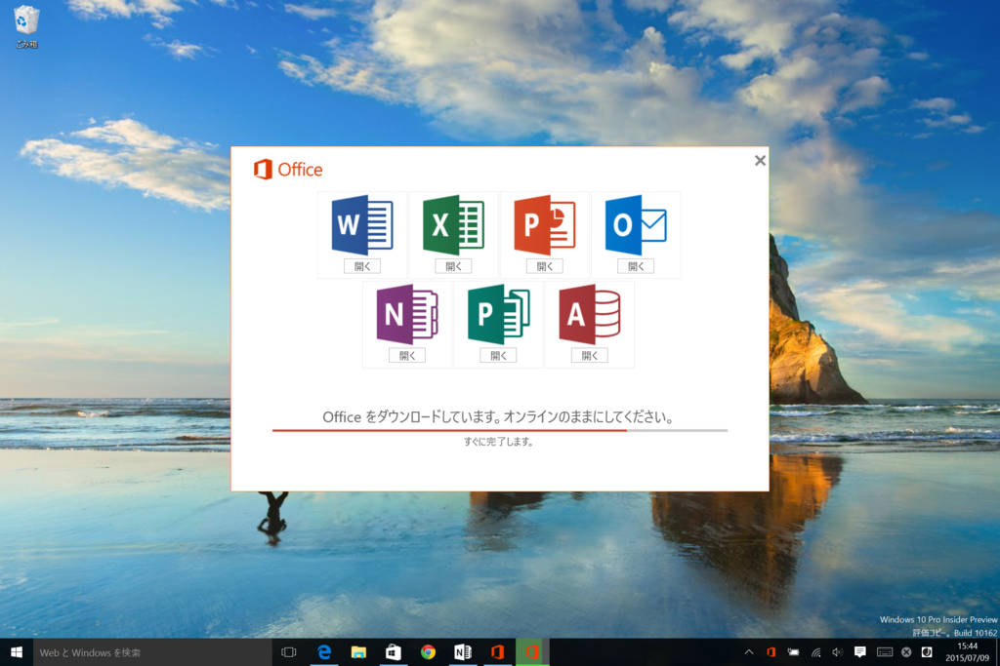
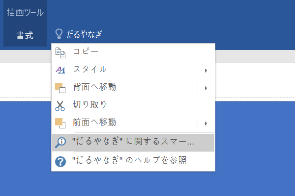
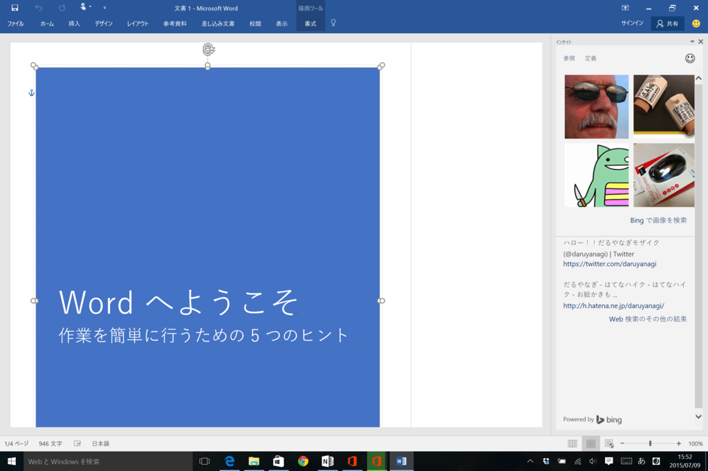
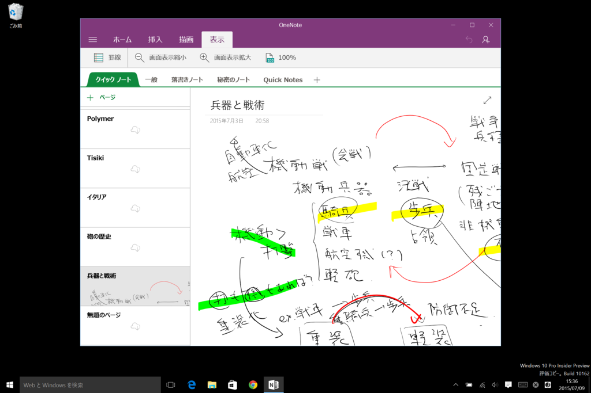
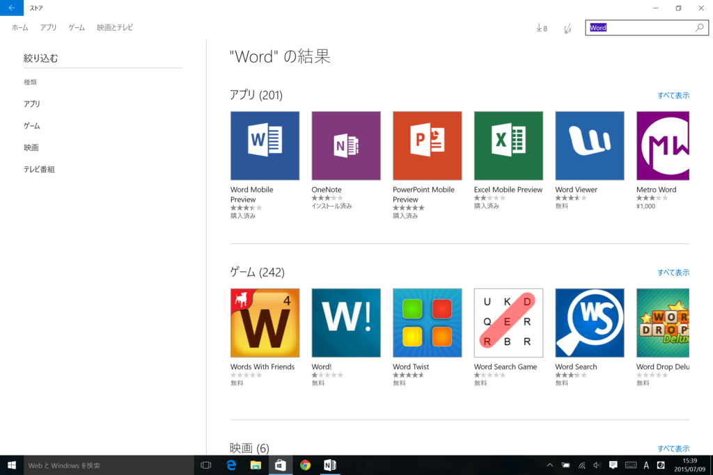
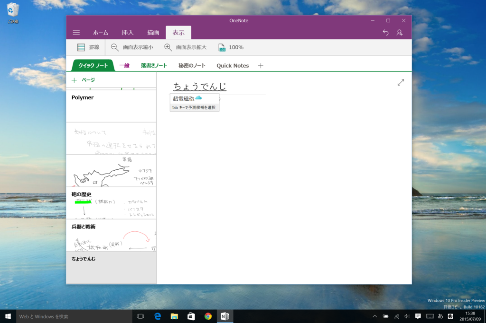

 

<blockquote>

Windows Insider の皆様、こんにちは。

オペレーティング システム グループ (OSG) の Gabe です。Windows Insider Program の最新情報をお知らせします。 Windows 10 の一般提供開始を 7 月 29 日に控え、現在調整と安定化に力を注いでいます。今回のメールでも引き続きチェックする価値がある新機能をご紹介します。 新機能とその他の最新情報については、こちら (英語) でご確認いただけます。

それから、嬉しいご報告が 1 つあります。<b>Windows Insider の皆様は、Windows 10 で Office 2016 のプレビュー版をご利用いただけるようになりました。</b>Office 2016 のプレビュー版には新機能が搭載されており、2015 年の後半に Office ユーザーへの配信を予定しています。 Windows Insider の皆様には、早期にフィードバックをお寄せいただきたいと考えております。 ぜひ今すぐ Office 2016 Preview をダウンロードして、ご利用ください。

</blockquote>

執筆時現在、Update 2 が利用できる（<a href="http://www.forest.impress.co.jp/docs/news/20150702_709931.html">Microsoft&#x3001;&#x300C;Office 2016 Preview Update 2&#x300D;&#x3092;&#x516C;&#x958B;&#x3002;&#x624B;&#x66F8;&#x304D;&#x6570;&#x5F0F;&#x306E;&#x8A8D;&#x8B58;&#x306A;&#x3069;&#x306B;&#x5BFE;&#x5FDC; - &#x7A93;&#x306E;&#x675C;</a>）。

<ul>
<li><a href="https://products.office.com/ja-jp/office-2016-preview">Office 2016 Preview</a></li>
</ul>
早速うちの Windows 10 環境にも入れてみた。エラーが出てインストールできなかったりもしたけれど、再起動とかしてみるとなんとか入った。

とりあえずちゃんと動いている感じはする。イマイチ便利なのかどうかわかんないけど、コマンド検索ツールがついたのはイイのかもしれない。

なお、Windows 10 では“モバイル版<a href="#f-01532578" name="fn-01532578" title="Windows ストア アプリ版？ ユニバーサル アプリ版？　なんだっけ？">*1</a>”の「Microsoft Office」も利用できる。ユーザーインターフェイスは iOS/Android と似通った感じで、正直、「Word」あたりはこっちの方が使いやすいと思う（俺には「ワードパッド」で十分なのかもしれぬ……）。一方、「Excel」なんかはピボットテーブルとか使いたいので少し物足りないかもしれないけど。

「OneNote」はデフォルトでインストール済み。

ほかのは「ストア」から入手する必要がある。

ちょっと前に使ったときには日本語変換ができなかったのだけど、さっき試したらバッチリ。クラウド変換機能も動いた。ようやく Windows 10 もリリースへの準備が整ってきた感じ。まだちょっと不安だけど……。

<a href="#fn-01532578" name="f-01532578" class="footnote-number">*1</a>:Windows ストア アプリ版？ ユニバーサル アプリ版？　なんだっけ？

