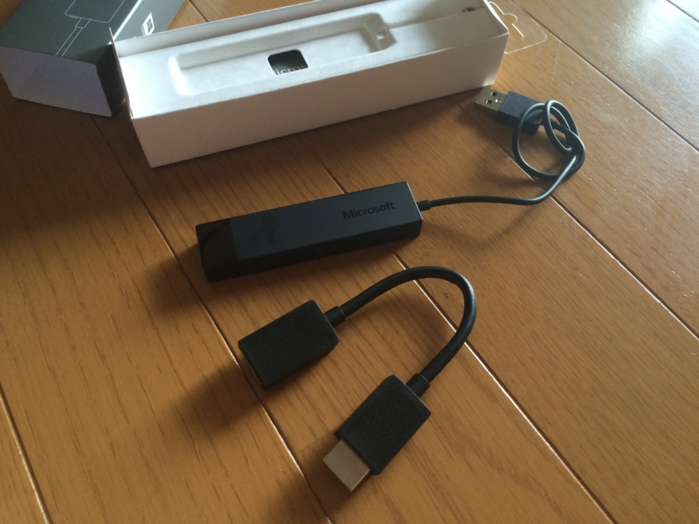
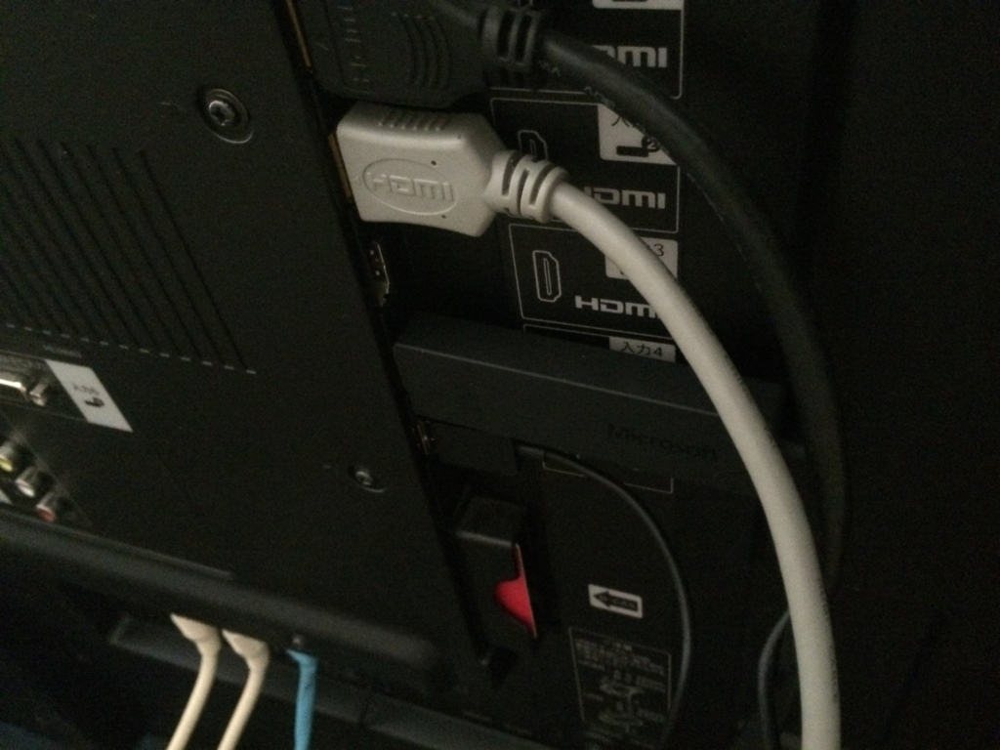
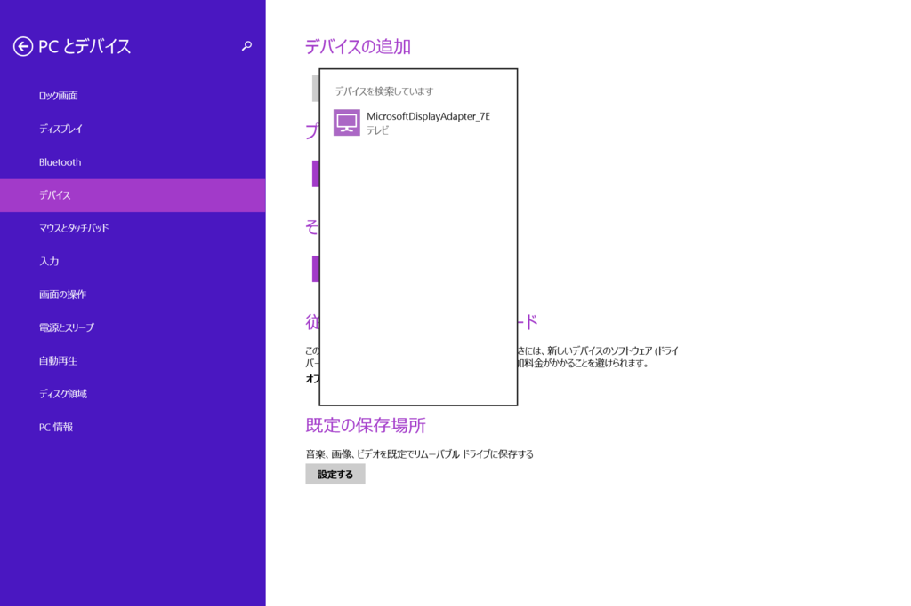
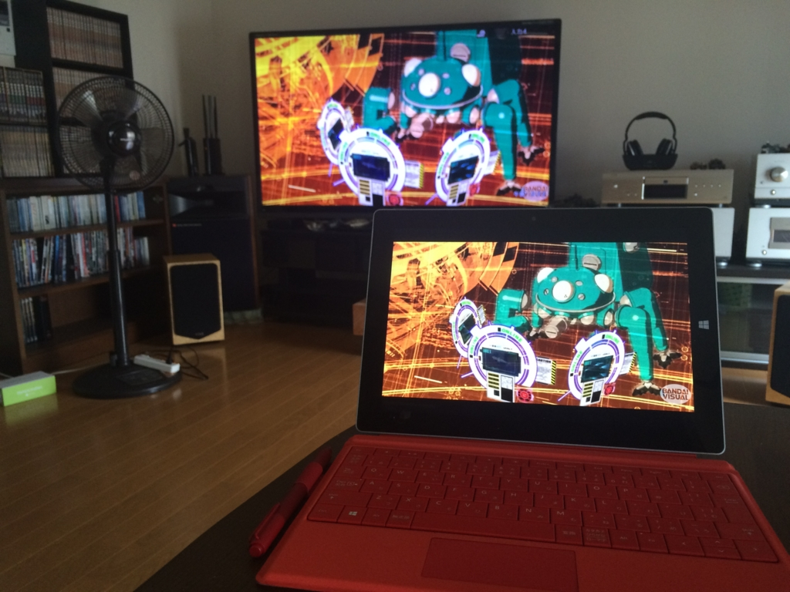
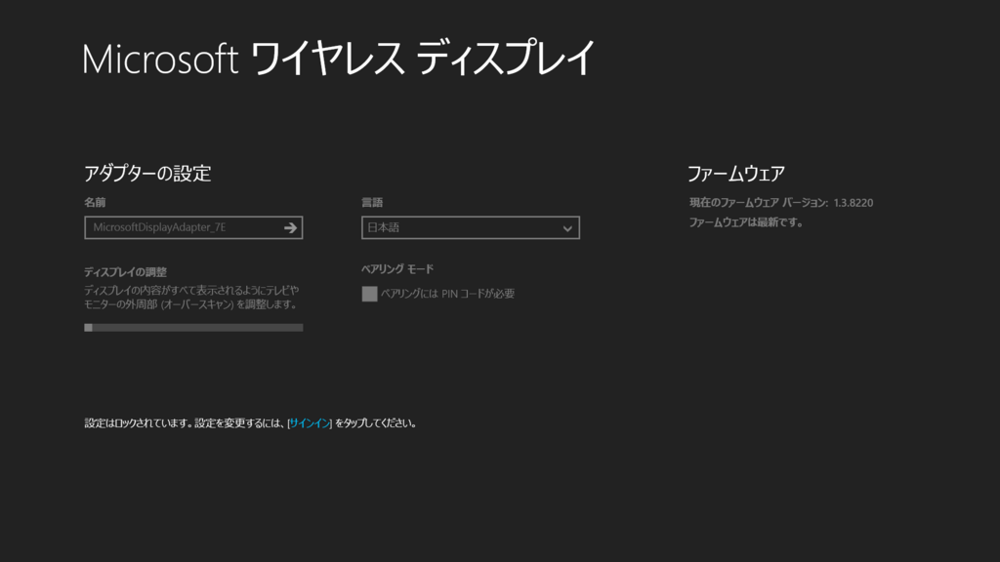
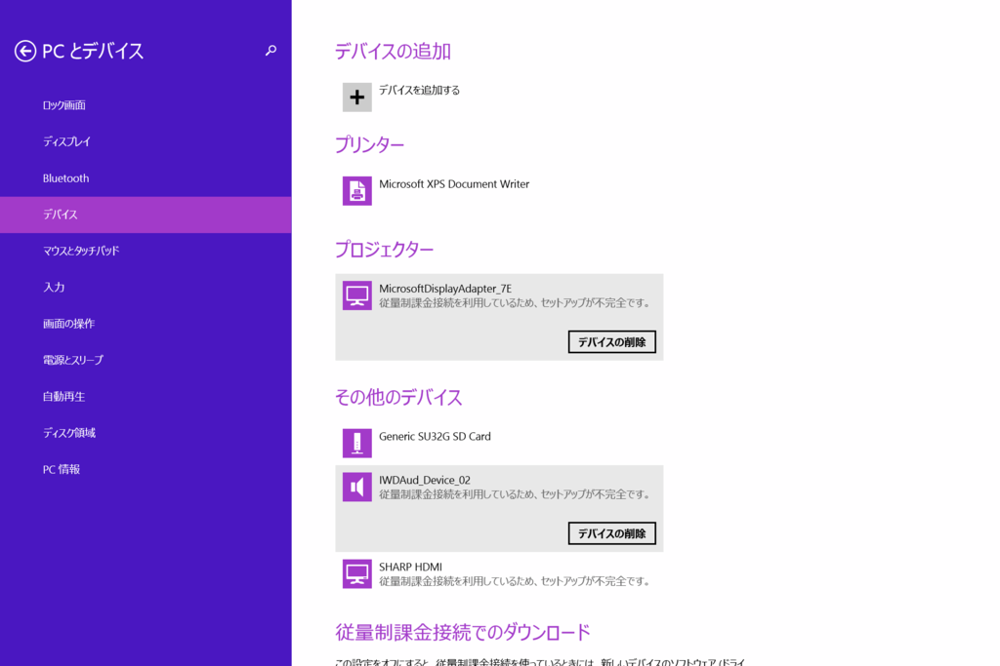
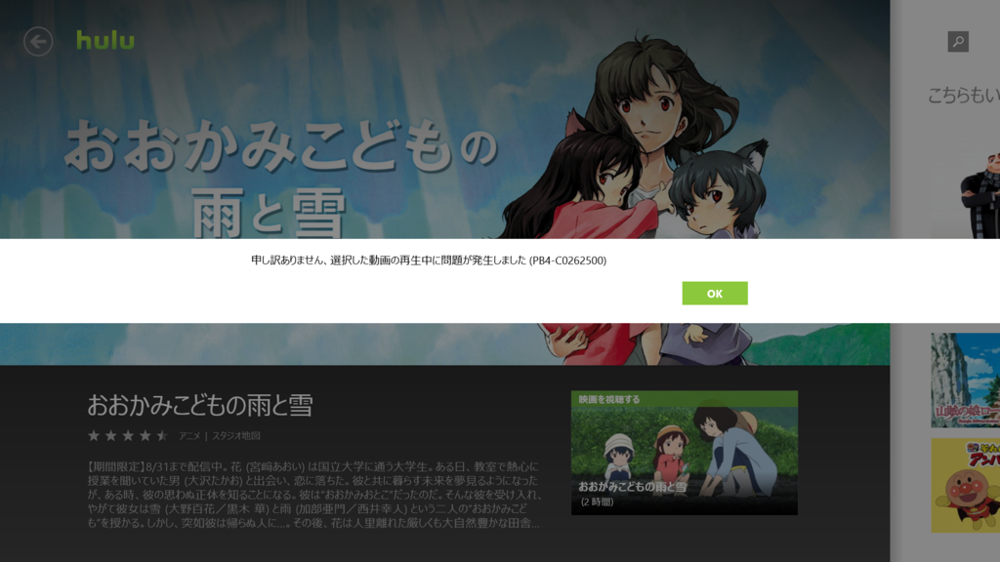

Twitter でクーポン割引があると聞いたのでポチった。おかげさまで 1,288円安く、5000円ちょいで買えました。ありがたや……ありがたや……。

<a href="http://www.amazon.co.jp/exec/obidos/ASIN/B00S7ZNWAK/bestylesnet-22/">マイクロソフト ワイヤレスディスプレイアダプター【Wi-Fi不要】Miracast technology搭載デバイス対応 CG4-00009</a>
<ul><li>出版社/メーカー: マイクロソフト</li><li>発売日: 2015/03/06</li><li>メディア: Personal Computers</li><li><a href="http://d.hatena.ne.jp/asin/B00S7ZNWAK/bestylesnet-22" target="_blank">この商品を含むブログ (2件) を見る</a></li></ul>

ずっとほしかったんだけど、なかなか踏ん切りがつかなかったんだよね。

この子は Miracast という技術で Windows や Android の画面を TV へワイヤレス送信するデバイスらしい。HDMI と USB（給電用なんだろうか？）にブスッと挿しこんで、Windows からごにょごにょっとするだけで、Windows の画面を TV へ飛ばせるようになる。

Apple の AirPlay や Google の Chromecast と似たようなものかな。AV 関係にはあんまり興味がもてなくて（そもそも TV をほとんどつけない）、違いがイマイチ分かっていない。

<blockquote cite="https://ja.wikipedia.org/wiki/Miracast">

Miracast（ミラキャスト）とはWi-Fi Allianceによって策定された、1対1の無線通信によるディスプレイ伝送技術である。AppleのAirPlayのミラーリングに代わるオープンな代替技術と銘打たれた。A社の携帯電話からB社のテレビの上にディスプレイをミラーリングし​​たり、リアルタイムで会議室のプロジェクターとノートパソコンの画面を共有したり、家のケーブルボックスからライブ番組をタブレットで見たりできる。Miracast接続はP2P型のWi-Fi接続を可能にするWi-Fi Directを介して接続する。MiracastはWi-Fi Direct経由でのみ動作する。標準的なWi-Fiネットワーク経由でイーサネット接続のデバイスにストリームするために使用することはできない。

2012年10月29日、GoogleはAndroid 4.2にてMiracastに標準対応することを発表した。2012年12月4日現在、Nexus 4, Sony Xperia T, Sony Xperia Vなどが公式にサポートしている。ELUGA X P-02EなどAndroid 4.1以前にも対応端末があり、また、Android 4.2以降でも非対応端末がある。

<cite><a href="https://ja.wikipedia.org/wiki/Miracast">Miracast - Wikipedia</a></cite>
</blockquote>

なんやいろいろ難しいが、要するにこういうことができるというわけ。Hulu が捗るぜ！

ファームウェアの更新やディスプレイの調整は、専用のアプリから行う。なんかパスワードで設定をロックできるようになってるんだけど、ビジネス用途を考えているのかな？　家庭用途では無駄な機能だと思った。

<h4>ちょっと気になったこと</h4>

なんかうちの環境だと毎回“デバイスの追加”からアダプターを一旦削除して再セットアップしなくちゃいけないんだけど（しかも従量制課金接続では不可。これは設定変えればいけると思う）、これはメンドクサイな。もっとサクッとつながらないんだろうか。

<blockquote cite="https://www.microsoft.com/hardware/ja-jp/help/support/how-to/adapters/setup">

ご使用の製品に Windows 8.1 または Windows RT 8.1 がインストール済みで、ワイヤレス ディスプレイが Miracast をサポートしている場合は、Microsoft Wireless Display Adapter に接続して映写できる状態になっています。

ただし、以前のバージョンの Windows から PC をアップグレードした場合は、ご使用の PC が Miracast をサポートしていることと映写できる状態になっていることを確認する必要があります。

<cite><a href="https://www.microsoft.com/hardware/ja-jp/help/support/how-to/adapters/setup">&#x30C7;&#x30A3;&#x30D7;&#x30EC;&#x30A4; &#x30A2;&#x30C0;&#x30D7;&#x30BF;&#x30FC;&#x306E;&#x30CF;&#x30A6;&#x30C4;&#x30FC; | Microsoft Hardware</a></cite>
</blockquote>

Surface 3（もとから Windows 8.1）から接続したのだけど、微妙に説明と動作が違う気もする。TV が古いからだろうか？（うちのは2011年3月発売の LC60Z5 という機種だった）

あと、家のネットワークの調子が悪いと描画が遅くなったり、最悪切断されることがある。あと、デバイスの追加がうまくいかなくて、音だけ Surface 側から出たりする。起こる頻度はそんなに高くないんだけど（というか、割と稀）、のんびりと映画を楽しんでいるときにこういうトラブルに遭うとだいぶイラッとくるな。

Hulu を再生するときに PB4-C0262500 エラーが出る場合もあったけれど、これはデバイスを削除して追加したり、再ログインしているうちに治った。よくわかんないけど、たぶん著作権保護機能絡みかなにかのエラーなんじゃないかな。知らんけど。

<ul>
<li><a href="http://www.hulu.com/help/articles/22321036">What is error PB4 on my Windows 8 device?</a></li>
</ul>
まぁ、そんな感じの細かいトラブルはあるけれど、おおむねいい感じに使えていて、買ってよかったと思う。

<iframe src="http://kiyokura.hateblo.jp/embed/2014/11/09/235121" title="Microsoft Wireless Display Adapterを買ってみた - きよくらの備忘録" class="embed-card embed-blogcard" scrolling="no" frameborder="0" style="display: block; width: 100%; height: 190px; max-width: 500px; margin: 10px 0px;"><a href="http://kiyokura.hateblo.jp/entry/2014/11/09/235121">Microsoft Wireless Display Adapterを買ってみた - きよくらの備忘録</a></iframe>

あとは @kiyokura さんのブログでも参考にしていただければ。

<h4>おまけ</h4>

<iframe width="480" height="270" src="https://www.youtube.com/embed/wwaM8bjLXh4?feature=oembed" frameborder="0" allowfullscreen></iframe>

