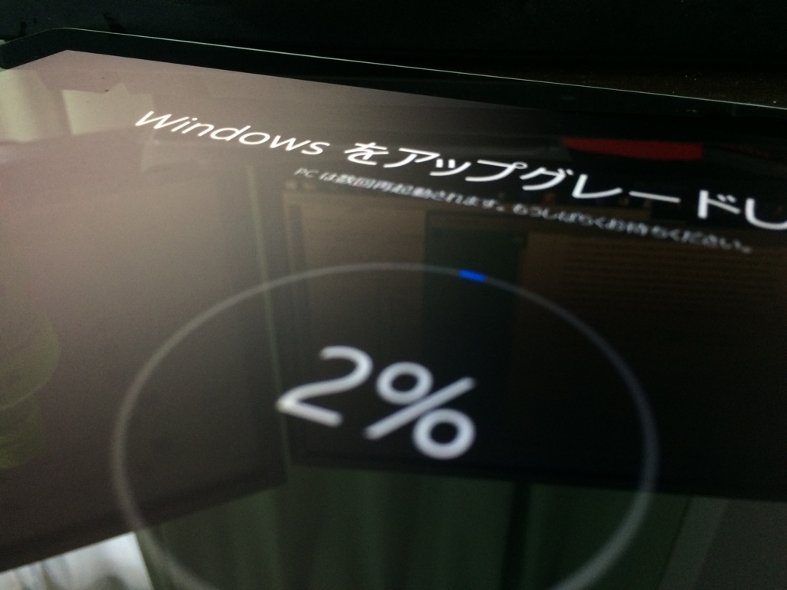
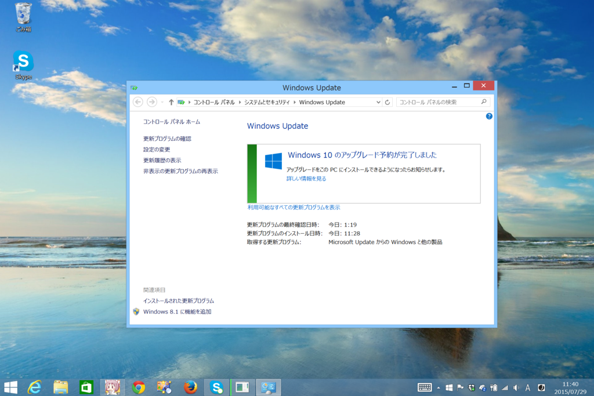
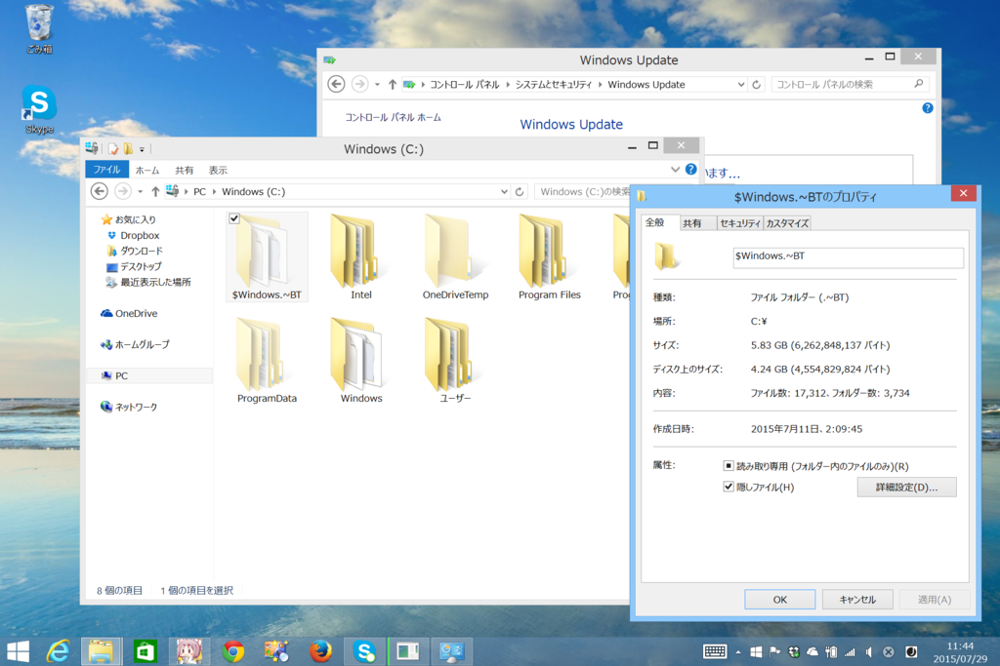
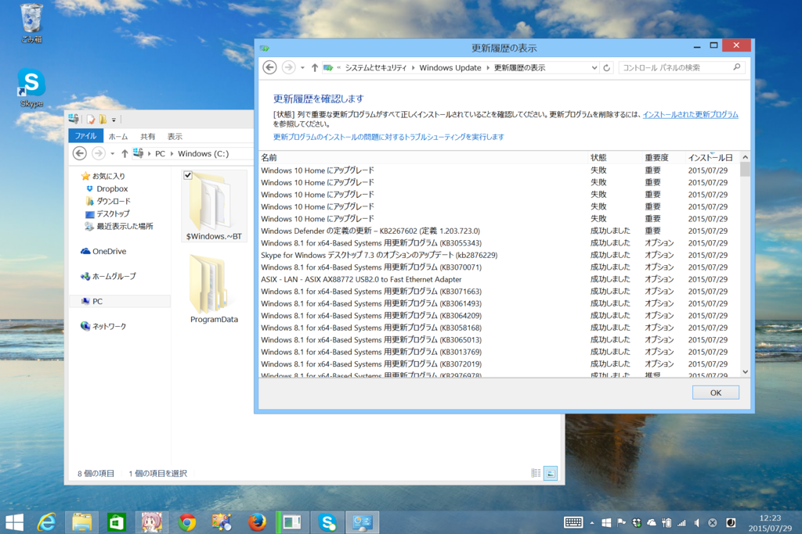
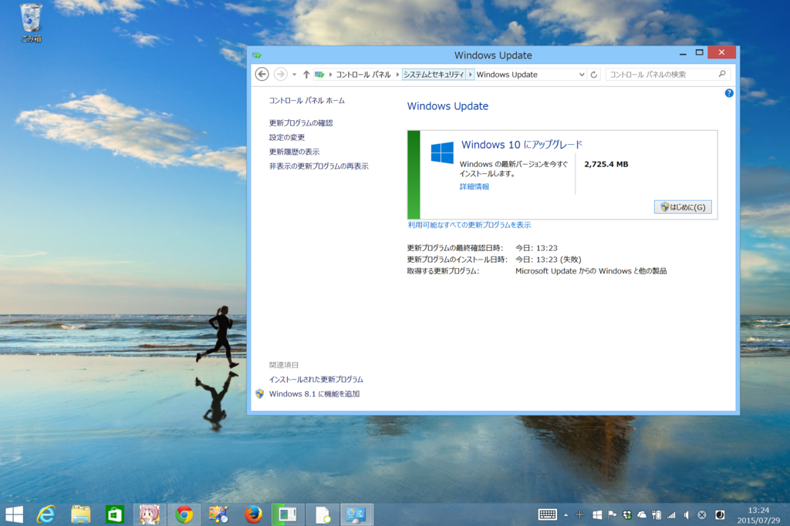
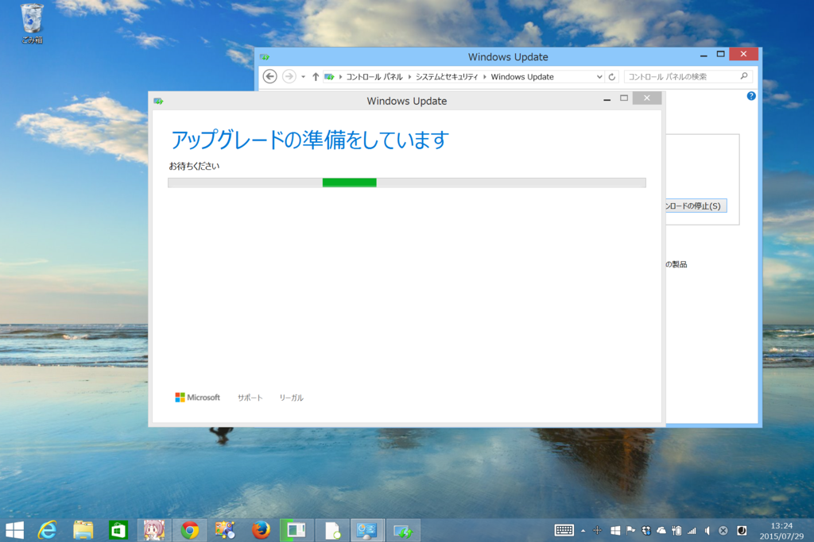
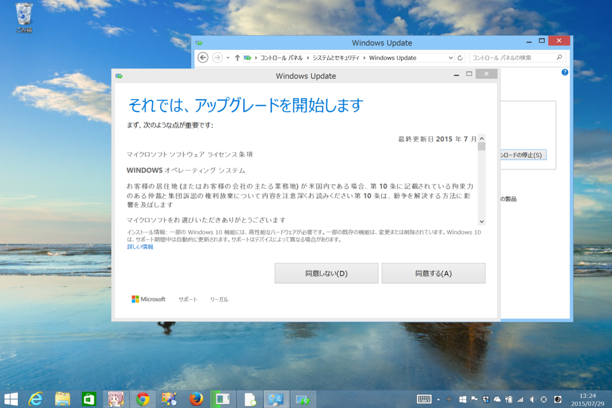
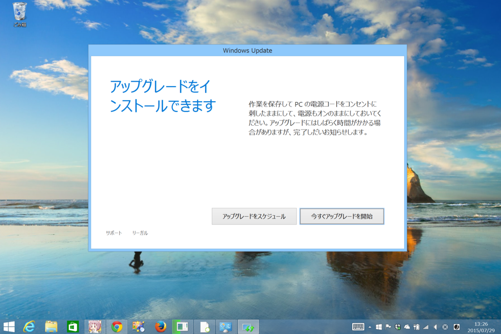
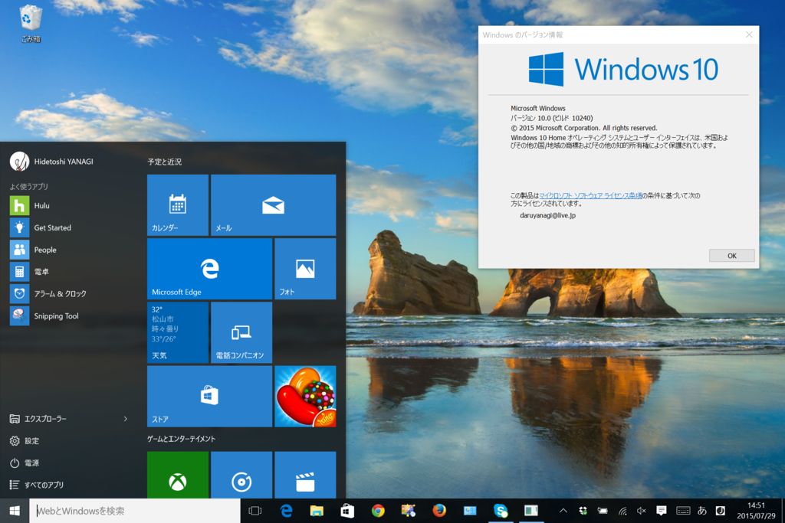

Surface 3 で Windows 10 への無償アップグレードを試してみたのでメモ。

Windows 10 のアップグレードを予約しておく（Windows 10 にたくないなら無視すればよい。迷ってるならグダグダ言ってねーでアップデートすること）。

$Windows.~BT という隠しフォルダーに Windows 10 がバックグラウンドでダウンロードされる。フォルダーのサイズは、最後に確認したときで 6GB 弱だった。

手動でアップデートを試みるが、失敗続き。

<blockquote cite="https://support.microsoft.com/ja-jp/kb/910340">

自動更新サービスでは、ダウンロードのトラフィックが多い間、ダウンロード要求を毎日再スケジュールすることがあります。この再スケジュールは、数日間行われます。

<cite><a href="https://support.microsoft.com/ja-jp/kb/910340">https://support.microsoft.com/ja-jp/kb/910340</a></cite>
</blockquote>

これに該当するのかどうかは知らんが、トラフィック制限かなにかで蹴られてるんだろう。というわけで、ごにょごにょする。

無事アップグレードが始まった。

［アップグレードをスケジュール］ボタンを押すと、アップグレード処理を行う日時を指定できる（スクリーンショット撮り忘れた）。

なんだかんだで1時間弱かかったかも。ビルドナンバーは 10240。

