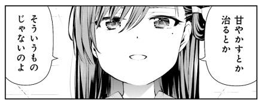

<a href="http://www.amazon.co.jp/exec/obidos/ASIN/4832242369/bestylesnet-22/">がっこうぐらし!  (1) (まんがタイムKRコミックス フォワードシリーズ)</a>
<ul><li>作者: 原作:海法紀光(ニトロプラス),作画:千葉サドル</li><li>出版社/メーカー: 芳文社</li><li>発売日: 2012/12/12</li><li>メディア: コミック</li><li>購入: 1人 クリック: 6回</li><li><a href="http://d.hatena.ne.jp/asin/4832242369/bestylesnet-22" target="_blank">この商品を含むブログ (9件) を見る</a></li></ul>

とりあえず今期のアニメをチェックするおれ様 <i>「『がっこうぐらし！』？　また日常系か……『のんのんびより りぴーと』で間に合ってんだよ！」</i>アニメ一話、開始10分程度で切る。しかし、その後、Twitter で<i>「『がっこうぐらし！』の超展開がやばい」</i>という噂を頻繁に耳にする。

とりあえず再び第一話をチェックするおれ様<i>「ふぁっ……！？　なんぞこれ」</i>もちろん、今期のアニメチェックリストに追加。

それでもコミックまでは買う気がなかったのだけど、今晩、Windows 10 に備えて徹夜して眠いはずなのになぜか寝付けず、とうとう Kindle で全巻（5巻までかな）大人買いして読破した。

ちなみに僕は<b>めぐねえ</b>より、<b>スコップをもったツインテールの女の子</b>（名前覚えられねえ）が好みです（＾ｖ＾） <i>@okazuki さん、(・∀・)人(・∀・)ﾅｶｰﾏ</i> 3巻か4巻でスコップちゃんがあーなってこーなってしまったときは、つい取り乱しそうになりましたさ。

<iframe src="http://okazuki.hatenablog.com/embed/2015/07/29/201422" title="#devcussion でがっこうぐらしを読んだ - かずきのBlog@hatena" class="embed-card embed-blogcard" scrolling="no" frameborder="0" style="display: block; width: 100%; height: 190px; max-width: 500px; margin: 10px 0px;"><a href="http://okazuki.hatenablog.com/entry/2015/07/29/201422">#devcussion でがっこうぐらしを読んだ - かずきのBlog@hatena</a></iframe>

<iframe src="http://blog.ch3cooh.jp/embed/20150716/1437057000" title="「がっこうくらし！」を読んだ - 酢ろぐ！" class="embed-card embed-blogcard" scrolling="no" frameborder="0" style="display: block; width: 100%; height: 190px; max-width: 500px; margin: 10px 0px;"><a href="http://blog.ch3cooh.jp/entry/20150716/1437057000">「がっこうくらし！」を読んだ - 酢ろぐ！</a></iframe>

<h4>おまけ</h4>

