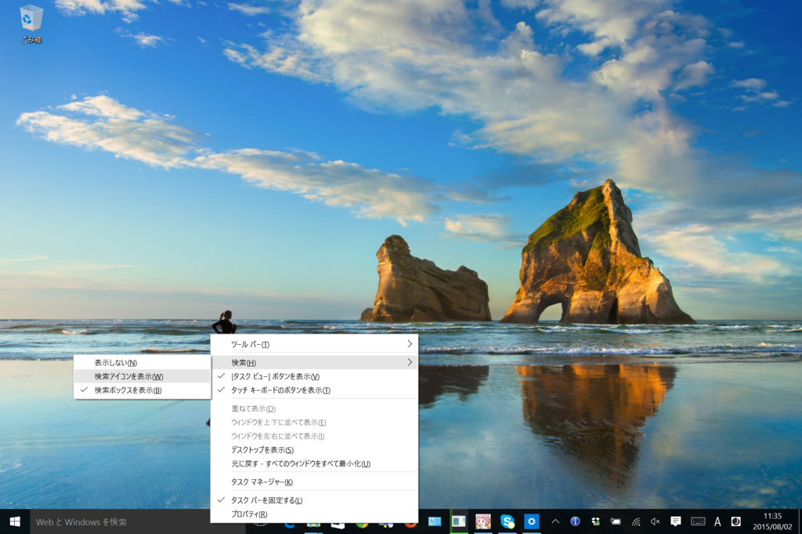
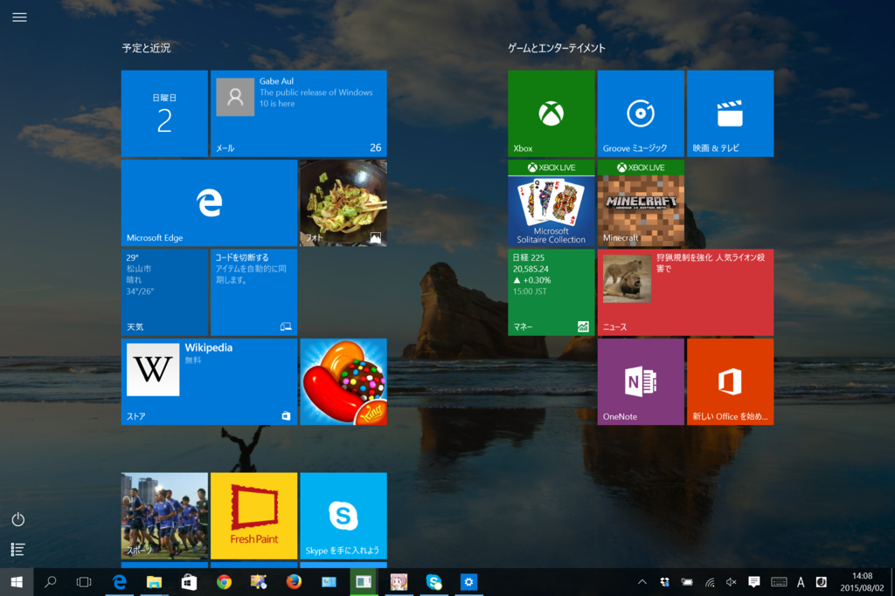
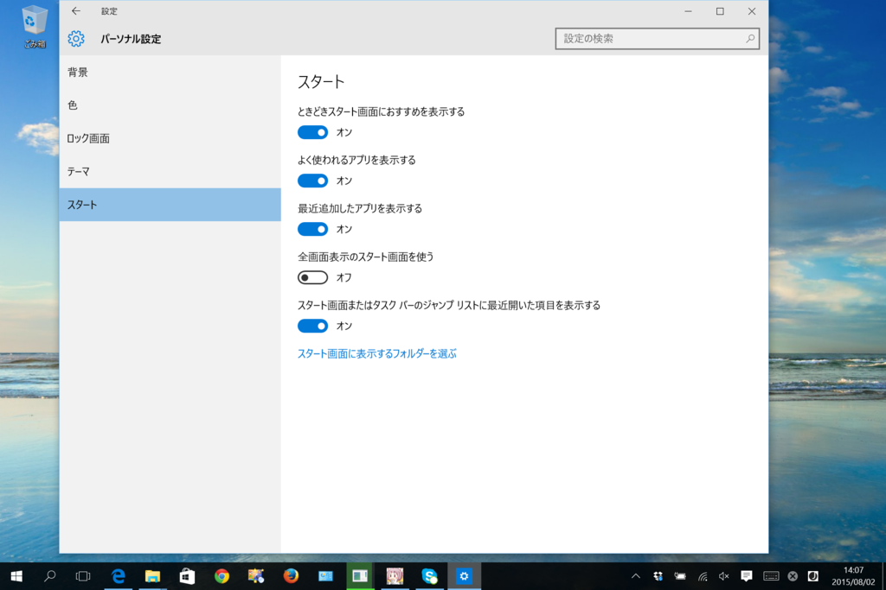
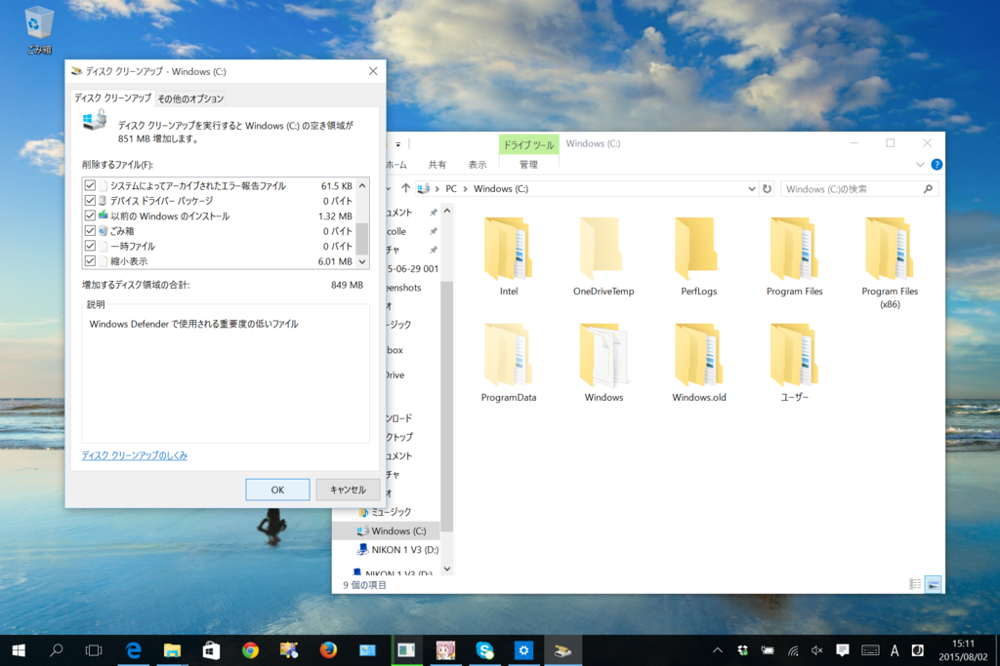

自分は基本的にデフォルトの設定で使う派なのだけど、Surface 3 LTE を Windows 10 にしたあとでちょっとだけイジった。

<h3>タスクバーを広げる</h3>

検索ボックスは要らないのでボタンにしておく（いっそのこと、表示しないでもよいだろう）。これでタスクバーがだいぶ広くなる。

なぜこっちがデフォルトの設定じゃないのだろう。おそらく検索機能をアピールしたかったんだろうけど、アプリを5，6個立ち上げただけでタスクバーがオーバーフローして二段表示になるのはかなり使いづらいと思う。

ちなみに、この状態でも［Windows］＋［S］キーを押せば検索機能にアクセスできる。［Windows］キーを押してスタートを表示させた状態でキーワードをタイプしてもよい（自分は後者を多用しており、マウスはあまり使わないほどだ）。

<h3>スタートを全画面にする</h3>

巷ではチマチマしたスタート“メニュー”が好まれているようだが、全画面表示されるスタート“画面”の方が一度にたくさんタイルが表示できていいじゃないか？　なぜわざわざ縦スクロールをせにゃならん？　こっちがデフォルトでいいぐらいだ。

まぁ、百歩譲ってマウスで動作するときはコンパクトなメニュータイプの方がいいっていうのは認める。

でも、そういう人たちにとって Windows 10 のスタート“メニュー”はきっと「コレジャナイ」。メニューの階層構造が分かりやすく、表示がコンパクトでマウス移動量の少なくて済む“クラシックな”メニューがほしかったのではないだろうか。そういう人たち向けのオンラインソフトもあるので、適当にググって入れればいいと思う。

俺からしたら、毎度ちまちまサブメニューをたどるのなんかやってられんが……よく使うアプリはピン留めしときゃいいし、まれにしか使わないモノは検索した方が早い。

ともかく、タッチパネルのある Surface 3 ならばスタート“画面”の方がおススメだと思う。

<h3>不要なファイルを消す</h3>

管理者権限で「ディスク クリーンアップ」を起動し、不要なファイルを一掃する（ロールバックできなくなるから、一通り動作を試した後にやるのがいい）。これでも消えないファイルもあるっぽいけど（うちは Windows.old にドライバーの類が残っていた）、まぁ、自分はあんまり気にしないかな。そういうのを気にする人は、アップグレードしたあとにクリーンインストールするといいらしいが自分は面倒くさいのでしない。

そのほかにもいろいろある気はするけど（プライバシー設定なんかは気になる人は気になるだろうと思う）、自分は設定をいじるのが面倒くさいタイプなので、とりあえずこれで使い続けるつもり。

<h3>おまけ</h3>

<iframe src="https://hatenablog-parts.com/embed?url=https%3A%2F%2Fblog.daruyanagi.jp%2Fentry%2F2013%2F10%2F18%2F003351" title="Windows 8.1 を入れたらまずやることを独断と偏見で3つだけ選んでみた。 - だるろぐ" class="embed-card embed-blogcard" scrolling="no" frameborder="0" style="display: block; width: 100%; height: 190px; max-width: 500px; margin: 10px 0px;"></iframe>

Windows 10 で自分が唯一残念に思っているのは、OneDrive がプレースホルダースタイルからフォルダーの選択同期スタイルになってしまったこと。確かに動作は分かりにくいし、たまに動作が怪しかったけれど、あれはかなり先進的な機能だった。人類には早すぎたといえばそれまでだけど、返す返すも惜しまれる。

