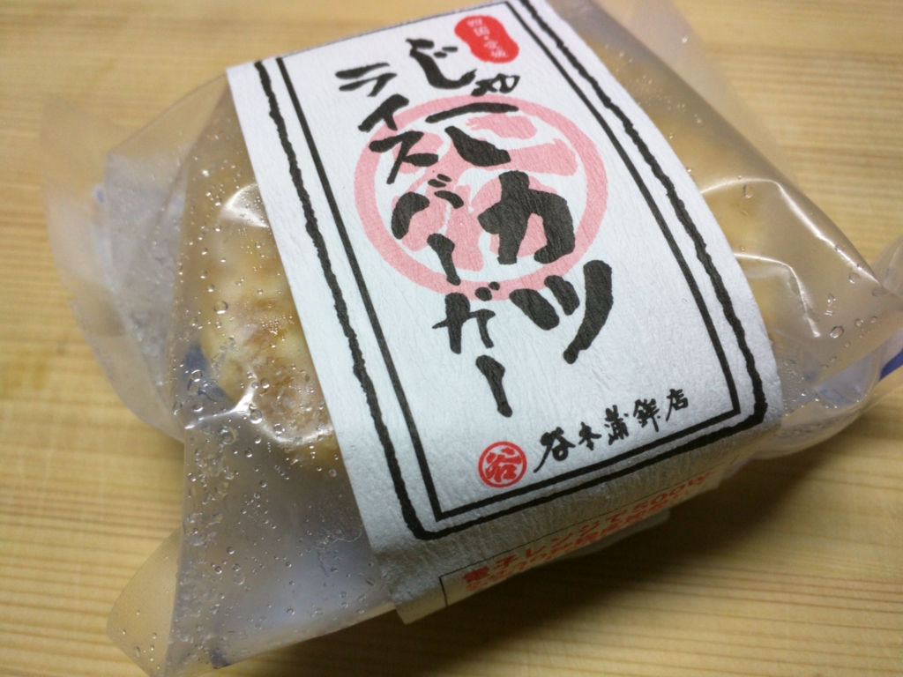
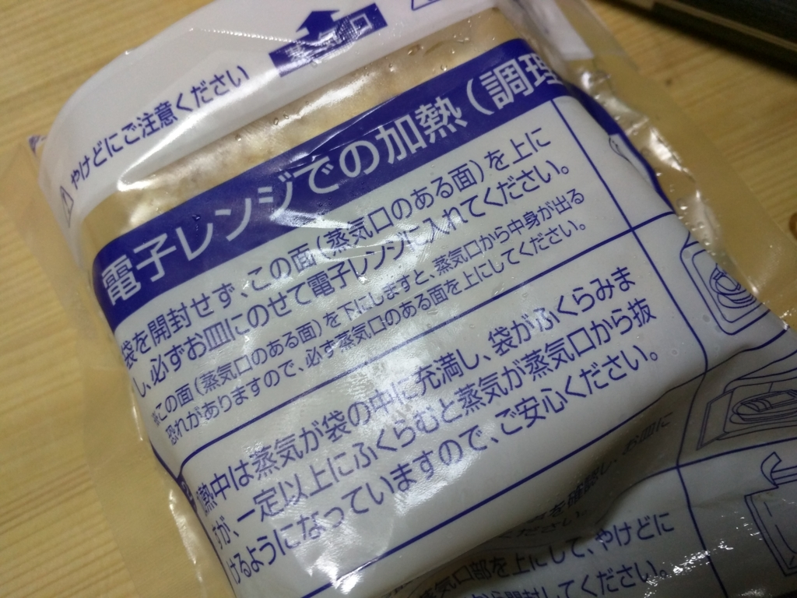
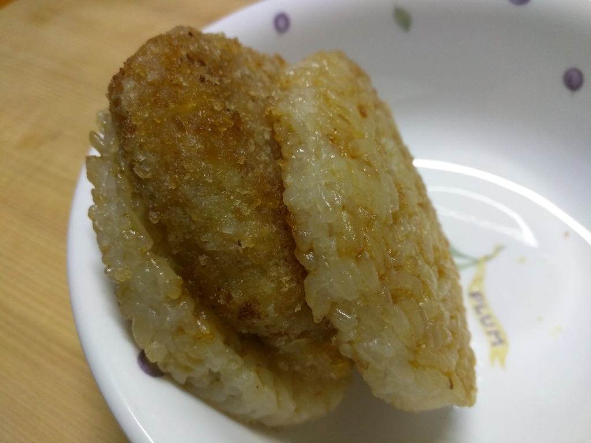

以前に草加せんべいをいただいたので、そろそろそのお返しがしたいものだと思い、愛媛名物“じゃこ天”を売ってる近所の店に入ってみた。そしたら<i>「じゃこカツライスバーガー」</i>なるものが売っている。聞いてみると、割かし最近開発されたフードらしい。食べてみたくなったので、お店の人にバラ売りをお願いして、2個ばかり買ってきた。お値段は1個450円ぐらいだと思う。

電子レンジであっためて食べられるので、夜食なんかにちょうどよさげ。温めは 500W で2分30秒が目安らしいけれど、うちの電子レンジがしょぼいのか、冷蔵庫に入れている間にカッチカチになってしまったのか、もう少し長めでもよいと感じた。蒸気が袋を突き破るぐらいがいいんじゃないだろうか。

 

<blockquote>

じゃこカツとは、じゃこ天のすり身にニンジン・タマネギ等を加えパン粉をつけてコロッケ風にアレンジしたものです。 
そのじゃこカツを甘い醤油で味付けされたライスバーガーで挟みました。

</blockquote>

“じゃこカツ”は“じゃこ天”をコロッケ風にしたもので、実は自分も割と好きだったりする。“じゃこ天”は冷えるとイマイチなのだけど、“じゃこカツ”はコロモが熱を閉じ込めてくれるし、食感もよくなる。遠方から松山へ勉強会にきてくれる人のあいだでも割と評判がいい。

電子レンジを開けると、“じゃこカツ”の香りがプーンと漂ってくる。じゃこじゃこしさと、妙に食欲をそそる油の匂いが入り混じった、あの感じ。そして、その“じゃこカツ”を挟むのが、モチっとしたライス。醤油のフレーバーが、また食欲をそそる

見た目は、ズバリ、わしが作るお弁当みたいやな。油断してると茶色いおかずばっかり入れてるみたいな……。

でも、思いっきり齧るとモチっ、カリッ、ムニュッという食感の三重奏がなかなかよい。こら、小麦色に肌を焼いたおにぎりお姉ちゃんのパイズリやでぇ！！　派手さはないが、素朴で飽きのこない味もぐっど。2個ぐらいはペロッと食べちゃいそう。お酒の〆にもいい感じだな。

あえて弱点を言えば、ライスが熱くて持つところがないところかな。せっかくこの形なのに、箸で食うのはちょっともったいない。あとはお値段。贈答用なら許容範囲内（ひと箱5000円ぐらい）だけど、これが単品でメジャーになるにはちょっと高い。どうせなら、新しい松山のソウルフードを目指してもらいたいところだ。

とりあえず、個人的に気に入ったので、実家にもひと箱送ってあげようと思った。

<iframe src="//hatenablog-parts.com/embed?url=http%3A%2F%2Fwww.jyakoten.jp%2Fproduct-list%2F22" title="じゃこカツライスバーガー - 株式会社　谷本蒲鉾店" class="embed-card embed-webcard" scrolling="no" frameborder="0" style="display: block; width: 100%; height: 155px; max-width: 500px; margin: 10px 0px;"><a href="http://www.jyakoten.jp/product-list/22">じゃこカツライスバーガー - 株式会社　谷本蒲鉾店</a></iframe>

