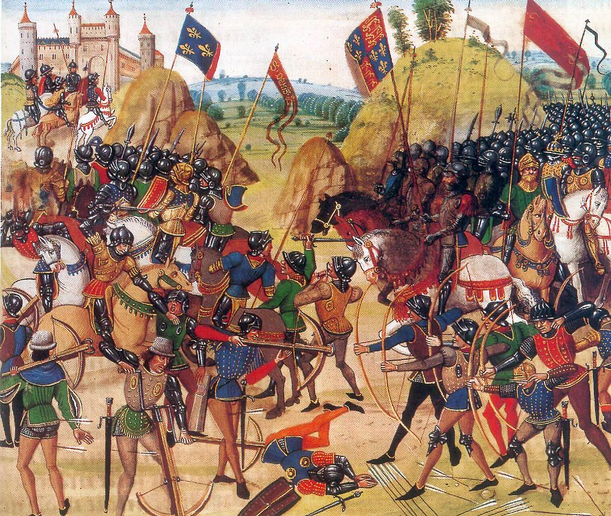
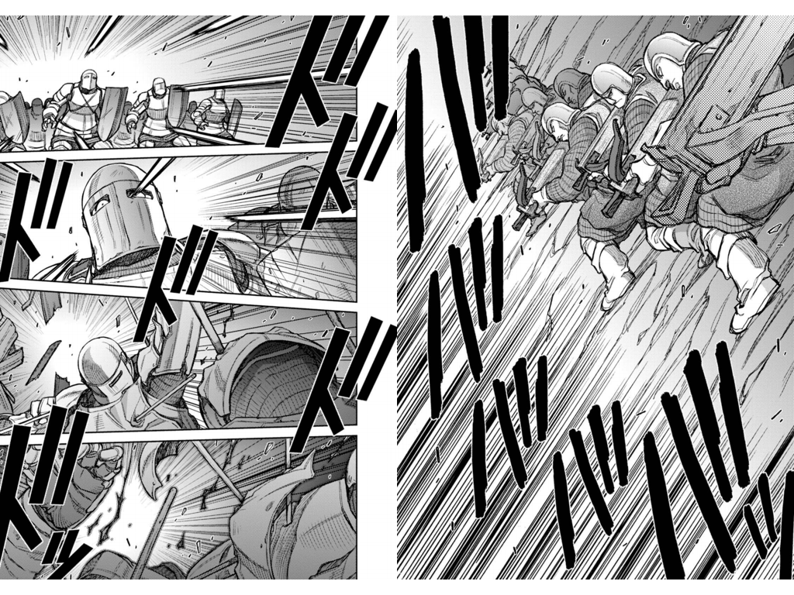

<a href="http://www.amazon.co.jp/exec/obidos/ASIN/B00DSGG0R0/bestylesnet-22/"> (コミックフラッパー)" title="ホークウッド<ホークウッド> (コミックフラッパー)"></a>

<a href="http://www.amazon.co.jp/exec/obidos/ASIN/B00DSGG0R0/bestylesnet-22/">ホークウッド<ホークウッド> (コミックフラッパー)</a>
<ul><li>作者: トミイ大塚</li><li>出版社/メーカー: KADOKAWA / メディアファクトリー</li><li>発売日: 2013/07/15</li><li>メディア: Kindle版</li><li><a href="http://d.hatena.ne.jp/asin/B00DSGG0R0/bestylesnet-22" target="_blank">この商品を含むブログを見る</a></li></ul>

実在した傭兵隊長（コンドッティエーレ）<a href="https://ja.wikipedia.org/wiki/%E3%82%B8%E3%83%A7%E3%83%B3%E3%83%BB%E3%83%9B%E3%83%BC%E3%82%AF%E3%82%A6%E3%83%83%E3%83%89">&#x30B8;&#x30E7;&#x30F3;&#x30FB;&#x30DB;&#x30FC;&#x30AF;&#x30A6;&#x30C3;&#x30C9;</a>を題材にしたマンガ。7巻まで刊行されていて、今は英仏百年戦争の<a href="https://ja.wikipedia.org/wiki/%E3%82%AF%E3%83%AC%E3%82%B7%E3%83%BC%E3%81%AE%E6%88%A6%E3%81%84">&#x30AF;&#x30EC;&#x30B7;&#x30FC;&#x306E;&#x6226;&#x3044;</a>辺り。

<b>クレシーの戦い</b>というのは、イングランドの長弓兵部隊がフランスの重装騎兵を破った有名な戦い。世界史では「騎士の時代の終わりの始まり」みたいな位置付けになっている。日本における長篠の戦いにちょっと似てるかも。あっちは火縄銃対騎兵だったけれど（諸説あり）。

<b>モード・アングレ</b>きたこれ(ﾟ∀ﾟ)!!　ひたすら降り注ぐ矢の描写がいいですなぁ。絶望的な感じが出てますなぁ。

対するフランス軍はジェノヴァの弩弓兵（石弓兵）を連れていたのだけど、当時のクロスボウの射程はだいたい200m（有効射程50m）、発射速度は毎分1～2発程度だったらしい。それにたいして長弓の射程は250m（射程重視で“空へ”発射する）、発射速度は6～10発分。殺傷力はクロスボウに劣るけれども、主目的は騎兵の集団突撃を攪乱し、逆茂木を備えた歩兵陣へ誘導することにあるし、数を揃えて弾幕を張れば命中率の低さも問題にはならないんですねぇ。

突撃するしか能のないフランス騎兵には有効な“待ち”の戦法でしたが、フランス側も学んでいくので（もうちょっと早く学んでもよかった）、残念ながらそのうち通用しなくなりますが。

ちなみに、石弓部隊がジェノヴァの傭兵なのは、当時の海軍が<b>ガレー船＋石弓兵</b>を中心にしており（帆船＋大砲の時代が来るまで）、ヴェネツィアやジェノヴァなどの海洋国家の石弓兵が地中海世界では精鋭とされていたからだと思います<a href="#f-cab57012" name="fn-cab57012" title="ジェノヴァのほかだと、ヴェネツィアがよくつかうクレタ弓兵とか？　あと傭兵で有名なのはスイス歩兵（長槍）、ドイツ歩兵ですかね">*1</a>。とくにジェノヴァは、長く独立を守ったヴェネツィアと異なり、個人主義の横行で内乱が絶えず、外国からの干渉をうけ自立を保てなかったこともあり、名門貴族が傭兵隊長として海軍・石弓兵を提供するケースが少なからずあったようですね（<a href="https://ja.wikipedia.org/wiki/%E3%82%A2%E3%83%B3%E3%83%89%E3%83%AC%E3%82%A2%E3%83%BB%E3%83%89%E3%83%BC%E3%83%AA%E3%82%A2">&#x30A2;&#x30F3;&#x30C9;&#x30EC;&#x30A2;&#x30FB;&#x30C9;&#x30FC;&#x30EA;&#x30A2;</a>なんかが有名かも）。

あと、自分は知らなかったけど、クレシーの戦いって大砲も使ったんだな。西欧で14世紀だとかなり早い登場かも。

雰囲気は『ベルセルク』のグロさを抑えて、魔物系のヒトを出入り禁止にした感じです（その説明でいいのか？）。個人的にはエドワード黒太子の描写が軽いかな？　とか、チャンドスをもっと無敵ジジイっぽくしてほしかったとか勝手に思っているのですが、お話自体はまぁまぁ面白いので、これからも買い続けようかなって思います。それにしても、イタリア編までずーっとやるのかなぁ。頑張るなぁ。

ちなみに、テキストでこういう時代の小説を読みたいのであれば、佐藤賢一おすすめ。本作でもベルトラン・デュ・ゲクランが出てくるかも。

<a href="http://www.amazon.co.jp/exec/obidos/ASIN/4104280011/bestylesnet-22/">双頭の鷲</a>
<ul><li>作者: 佐藤賢一</li><li>出版社/メーカー: 新潮社</li><li>発売日: 1999/01</li><li>メディア: 単行本</li><li> クリック: 32回</li><li><a href="http://d.hatena.ne.jp/asin/4104280011/bestylesnet-22" target="_blank">この商品を含むブログ (9件) を見る</a></li></ul>

<a href="#fn-cab57012" name="f-cab57012" class="footnote-number">*1</a>:ジェノヴァのほかだと、ヴェネツィアがよくつかうクレタ弓兵とか？　あと傭兵で有名なのはスイス歩兵（長槍）、ドイツ歩兵ですかね

