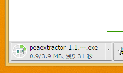
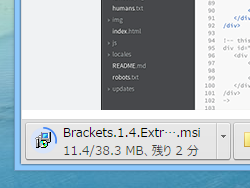

<blockquote class="twitter-tweet" lang="ja">
今回のベータ版から？　カコイイ（割とどうでもいいけど <a href="http://t.co/gmFCbvuPOm">pic.twitter.com/gmFCbvuPOm</a>
&mdash; ハロー！！だるやなぎモザイク (@daruyanagi) <a href="https://twitter.com/daruyanagi/status/625886822132879361">2015, 7月 28</a></blockquote>

Google Chrome 44 → 45 でダウンロードの進捗を示すプログレスインジケーターのデザインがちょっと変わっていたのでメモ。

Google Chrome 44

Google Chrome 45（beta）

<iframe src="//hatenablog-parts.com/embed?url=http%3A%2F%2Fwww.forest.impress.co.jp%2Fdocs%2Fnews%2F20150728_713758.html" title="「Google Chrome 45」がベータ版に。新しいJavaScriptの言語機能をサポート - 窓の杜" class="embed-card embed-webcard" scrolling="no" frameborder="0" style="display: block; width: 100%; height: 155px; max-width: 500px; margin: 10px 0px;"><a href="http://www.forest.impress.co.jp/docs/news/20150728_713758.html">「Google Chrome 45」がベータ版に。新しいJavaScriptの言語機能をサポート - 窓の杜</a></iframe>

