
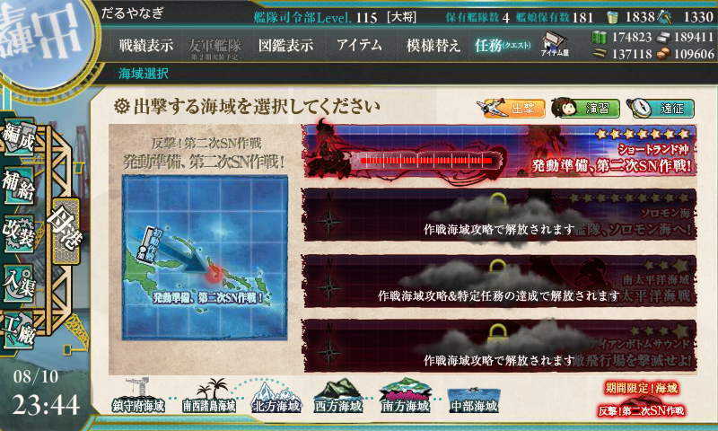 

<h3>ショートランド</h3>

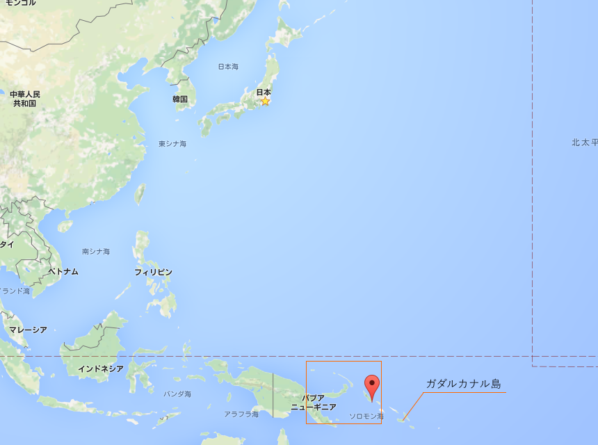 

<blockquote cite="https://ja.wikipedia.org/wiki/%E3%82%B7%E3%83%A7%E3%83%BC%E3%83%88%E3%83%A9%E3%83%B3%E3%83%89%E8%AB%B8%E5%B3%B6">

<B>ショートランド諸島（Shortland Islands）</B>はソロモン諸島 西部州に属する諸島。位置は南緯6.92度 東経155.88度。ソロモン諸島の北西端にあり、パプアニューギニアのブーゲンビル島に近い。最大の島はショートランド島で、その他にオヴァウ島(Ovau Island)、ピルメリ島(Pirumeri Island)、マグサイアイ島(Magusaiai Island)、ファウロ島(Fauro Island)、バラレ島などがある。

<cite><a href="https://ja.wikipedia.org/wiki/%E3%82%B7%E3%83%A7%E3%83%BC%E3%83%88%E3%83%A9%E3%83%B3%E3%83%89%E8%AB%B8%E5%B3%B6">&#x30B7;&#x30E7;&#x30FC;&#x30C8;&#x30E9;&#x30F3;&#x30C9;&#x8AF8;&#x5CF6; - Wikipedia</a></cite>
</blockquote>

いまだにこっちの方の島の位置関係がよくわからんので Google Map にプロットしてみたけど、改めてみるとめちゃくちゃ遠いなぁ……。ちなみにガダルカナル島はその右下の方にある島。

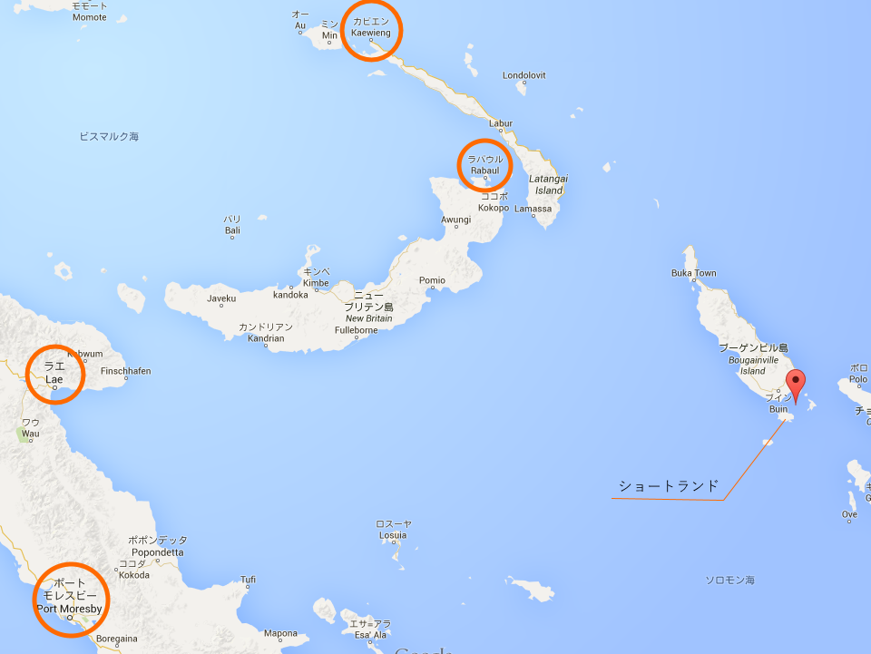 

<blockquote>

太平洋戦争が始まると日本軍は1942年（昭和17年）3月30日にショートランド島に上陸して占領した（<B>ショートランド泊地</B>）。日本海軍は同島南東部とマグサイアイ島、ポポラング島(Poporang Island)に挟まれた水域を泊地として使用した。特にガダルカナル島での戦いの際は駆逐艦の多くがここから出港して同方面に向かった。またポポラング島に水上機基地が作られ、ソロモン諸島方面の最前線基地の一つとなった。

</blockquote>

最前線の（本格的な）航空基地があるラバウルまでは約500km（あんまり知らんけど、ブイン基地は緊急着陸ができる程度の規模だったらしい）。カビエン～ショートランド～ガダルカナルというルートが補給の生命線で、多くの駆逐艦が途中のソロモン海で沈んだんだのぉ。

<h3>戦闘経過</h3>

<blockquote class="twitter-tweet" lang="HASH(0x85e90a0)">
しまった、お札付いた <a href="http://t.co/GVc0a5Yo1W">pic.twitter.com/GVc0a5Yo1W</a>
&mdash; ハロー！！だるやなぎモザイク (@daruyanagi) <a href="https://twitter.com/daruyanagi/status/630753284328849408">August 10, 2015</a></blockquote>

この海域は

<ul>
<li>軽巡1、駆逐2が必要</li>
<li>ボスを撃破しなくてもゲージは減る</li>
<li>難易度甲で5回ぐらいボスを撃破すればゲージ破壊</li>
<li><B>出撃した艦娘には“お札”がつく</B></li>
</ul>
って感じみたい。とくにお札は痛い（たぶん E4 まで使えなくなる）。なんとなく「大淀」を使ってしまって、すごく後悔した……。しかも、最後は 軽巡1＋駆逐5 でクリアしたのであんまり使わなかったし。これがあとで響かなければいいなぁ。

<ol>
<li>軽巡2＋駆逐4
<ul>
<li>川内改二(Lv122) 白露改(Lv81) 村雨改(Lv81) 五月雨改(Lv81) 涼風改(Lv81) 大淀改(Lv96)</li>
<li>A → B</li>
</ul></li>
<li>軽巡2＋駆逐4
<ul>
<li>川内改二(Lv122) 白露改(Lv81) 村雨改(Lv81) 五月雨改(Lv81) 涼風改(Lv81) 大淀改(Lv96)</li>
<li><B>A → B → Z（打ち漏らし）</B> 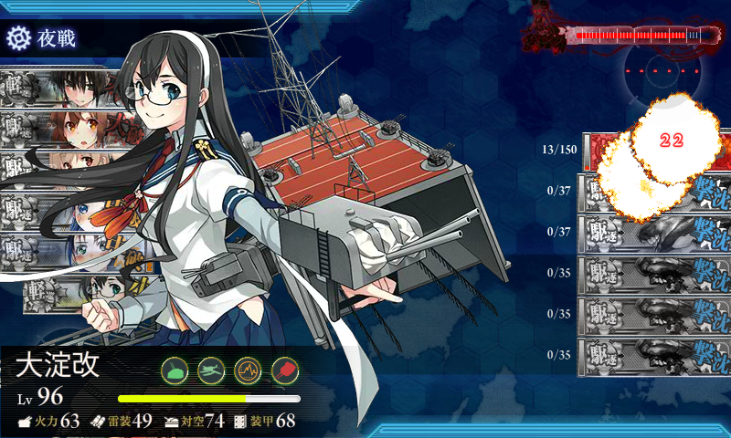</li>
</ul></li>
<li>軽巡1＋駆逐5
<ul>
<li>川内改二(Lv122) 白露改(Lv81) 村雨改(Lv81) 五月雨改(Lv81) 涼風改(Lv81) 綾波改(Lv70)</li>
<li>A</li>
</ul></li>
<li>軽巡1＋駆逐5
<ul>
<li>川内改二(Lv122) 白露改(Lv81) 村雨改(Lv81) 五月雨改(Lv81) 朝潮改(Lv70) 綾波改(Lv70)</li>
<li>A → B</li>
</ul></li>
<li>軽巡2＋駆逐4
<ul>
<li>川内改二(Lv122) 高波改(Lv70) 野分改(Lv70) 朝霜改(Lv70) 山雲改(Lv70) 大淀改(Lv96)</li>
<li>A</li>
</ul></li>
<li>軽巡2＋駆逐4
<ul>
<li>川内改二(Lv122) 高波改(Lv70) 朝雲改(Lv70) 朝霜改(Lv70) 清霜改(Lv70) 大淀改(Lv96)</li>
<li><B>A → B → Z</B> 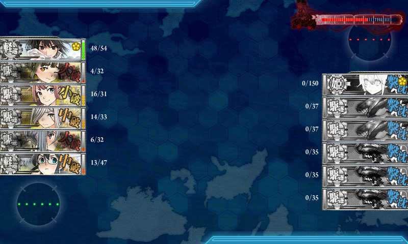</li>
</ul></li>
<li>軽巡1＋駆逐5
<ul>
<li>川内改二(Lv122) 磯風改(Lv70) 時津風改(Lv70) 春雨改(Lv81) 早霜改(Lv70) 浦風改(Lv70)</li>
<li><B>A → Z</B> 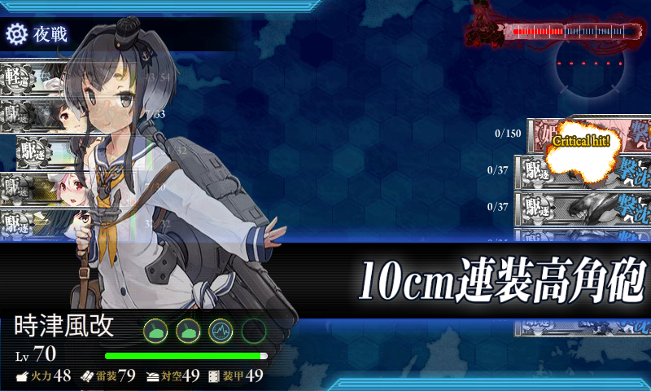</li>
<li>ドロップ「時津風」 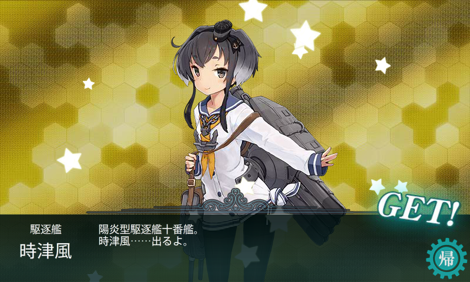</li>
</ul></li>
<li>軽巡1＋駆逐5
<ul>
<li>川内改二(Lv122) 天津風改(Lv70) 時津風改(Lv70) 谷風改(Lv70) 早霜改(Lv70) 浜風改(Lv70)</li>
<li><B>A → B → Z</B> 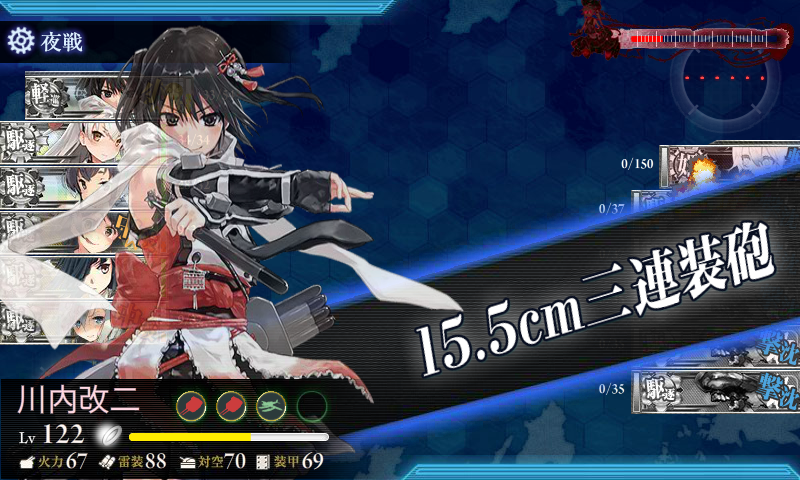</li>
</ul></li>
<li>軽巡1＋駆逐5
<ul>
<li>川内改二(Lv122) 山雲改(Lv70) 時津風改(Lv70) 高波改(Lv70) 野分改(Lv70) 朝霜改(Lv70)</li>
<li>A</li>
</ul></li>
<li>軽巡1＋駆逐5
<ul>
<li>川内改二(Lv122) 早霜改(Lv70) 時津風改(Lv70) 高波改(Lv70) 清霜改(Lv70) 朝雲改(Lv70)</li>
<li><B>A → B → Z（打ち漏らし）</B> 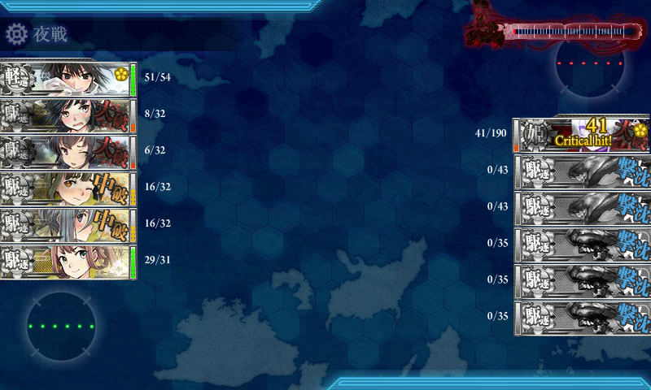</li>
</ul></li>
<li>軽巡1＋駆逐5
<ul>
<li>川内改二(Lv122) 春雨改(Lv81) 白露改(Lv81) 村雨改(Lv81) 五月雨改(Lv81) 涼風改(Lv81)</li>
<li>A → B</li>
</ul></li>
<li>軽巡1＋駆逐5
<ul>
<li>川内改二(Lv122) 野分改(Lv70) 山雲改(Lv70) 朝雲改(Lv70) 清霜改(Lv70) 早霜改(Lv70)</li>
<li>A → F → G 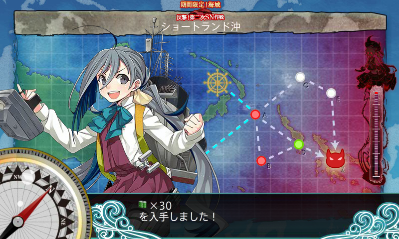</li>
</ul></li>
<li>軽巡1＋駆逐5
<ul>
<li>川内改二(Lv122) 清霜改(Lv70) 時津風改(Lv70) 磯風改(Lv70) 浦風改(Lv70) 天津風改(Lv70)</li>
<li><B>A → Z</B> 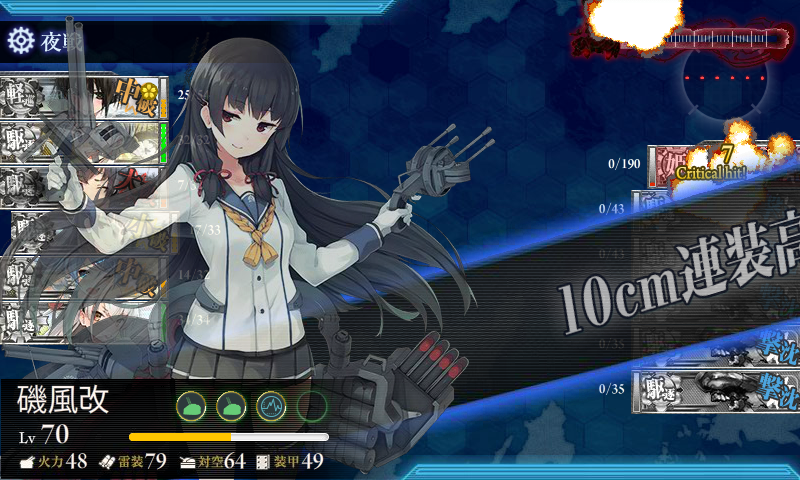</li>
</ul></li>
</ol>
13回出撃でクリア。ボス到達は6回で、S 勝利4回。

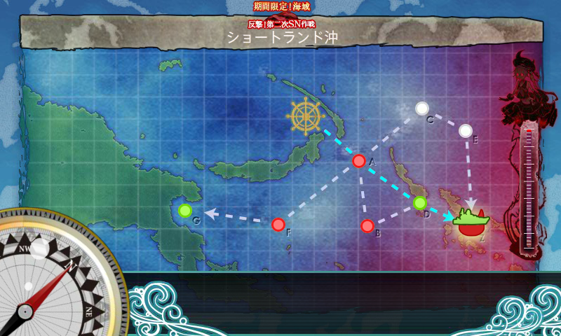

ルート分岐は確定ではないけれど、

<ul>
<li>軽巡1＋駆逐5：A → B → Z（A → Z をとることもあり）</li>
<li>軽巡2＋駆逐4：A → B → Z</li>
</ul>
装備はいたってオーソドックスだけど、索敵が絡んでいる可能性はあるので、軽巡には水偵、駆逐には電探を載せておくといいかもしれない。あと、ボスを確実に仕留めたい場合は夜戦道具があるとよい。

編成は……B マスは戦艦が3匹いてメンドクサいので、これを避けられる可能性のある 軽巡1＋駆逐5 がいいと思った。

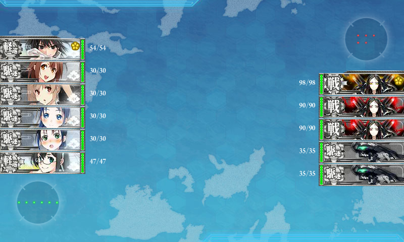

ここの突破はどっちにしろ運頼みになるので、軽巡2＋駆逐4 にしてもしょうがない。軽巡を増やすことで多少道中の安定性が向上し、ボスを仕留められる可能性が若干上がるかもしれないが、ほとんど気休めだと思う。

A → F → G に逸れる条件は分かんないけど、確率は低そうなのであんまり気にしないでもよさそう（索敵ではなさそうな気がする）。ツラギ泊地進出の際に戦没した<B>「菊月」</B>を入れておくと A → Z 固定という噂もあるけれど、あいにく遠征に出かけてて試すことができなかった。

あと、最終形態ではボスが強くなる（震え声

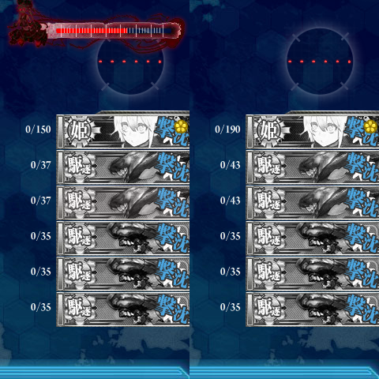 

<h3>報酬</h3>

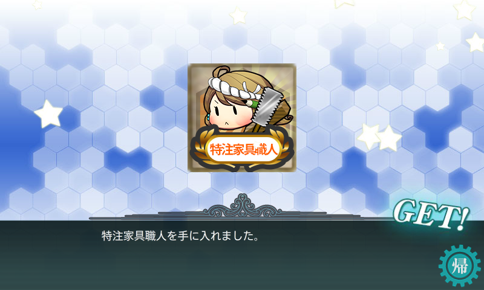

特注家具職人。

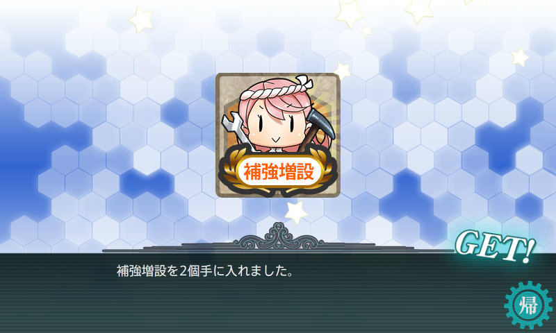

新アイテム「補強増設」が2個。

<blockquote class="twitter-tweet" lang="ja">
08▼「補強増設」について&#10;新アイテム「補給増設」は、練度(レベル)30以上の任意の艦娘を1隻、ダメコン(応急修理要員/女神)や戦闘糧食などを兵装とは別に装備できる補強装備スロットを増設改修することが可能です。アイテム屋さんでも扱っていますが、夏イベで複数入手可能です。&#10;<a href="https://twitter.com/hashtag/%E8%89%A6%E3%81%93%E3%82%8C?src=hash">#艦これ</a>
&mdash; 「艦これ」開発/運営 (@KanColle_STAFF) <a href="https://twitter.com/KanColle_STAFF/status/630724800390926336">2015, 8月 10</a></blockquote>

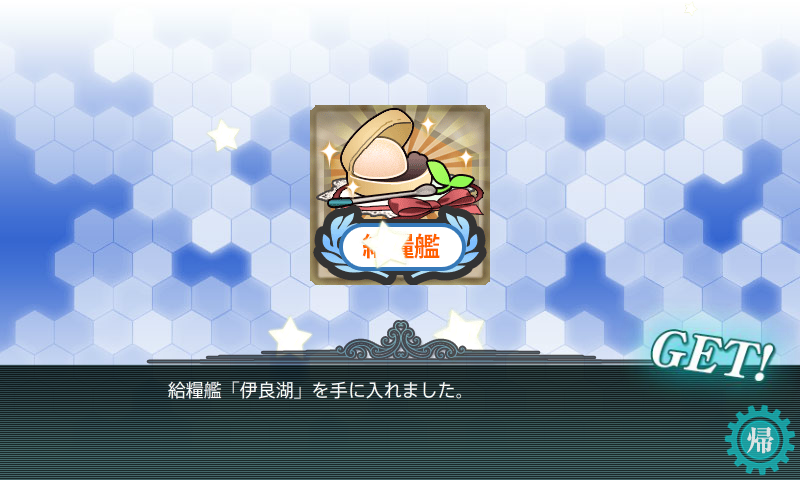

給糧艦「伊良湖」。「間宮」の方がほしかった！

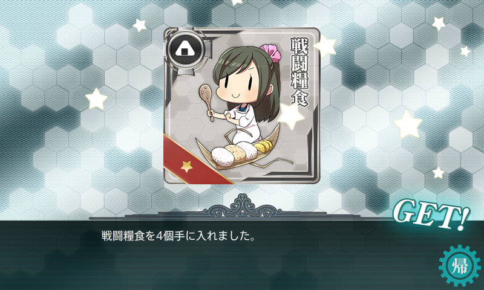

新アイテム「戦闘糧食」4個。かわいらしい。

<blockquote class="twitter-tweet" lang="HASH(0x85e90a0)">
09▼「戦闘糧食」について&#10;「戦闘糧食」は、装備スロットに用意できる新アイテムです。戦闘航海時において連戦する場合、合戦前に一定の確率で発動します。発動艦娘と大きく、上下の隣の艦娘にも少しお裾分け…戦闘開始前に士気が少し高揚します。※発動するとアイテムは消費されます。&#10;<a href="https://twitter.com/hashtag/%E8%89%A6%E3%81%93%E3%82%8C?src=hash">#艦これ</a>
&mdash; 「艦これ」開発/運営 (@KanColle_STAFF) <a href="https://twitter.com/KanColle_STAFF/status/630725801223131136">August 10, 2015</a></blockquote>

