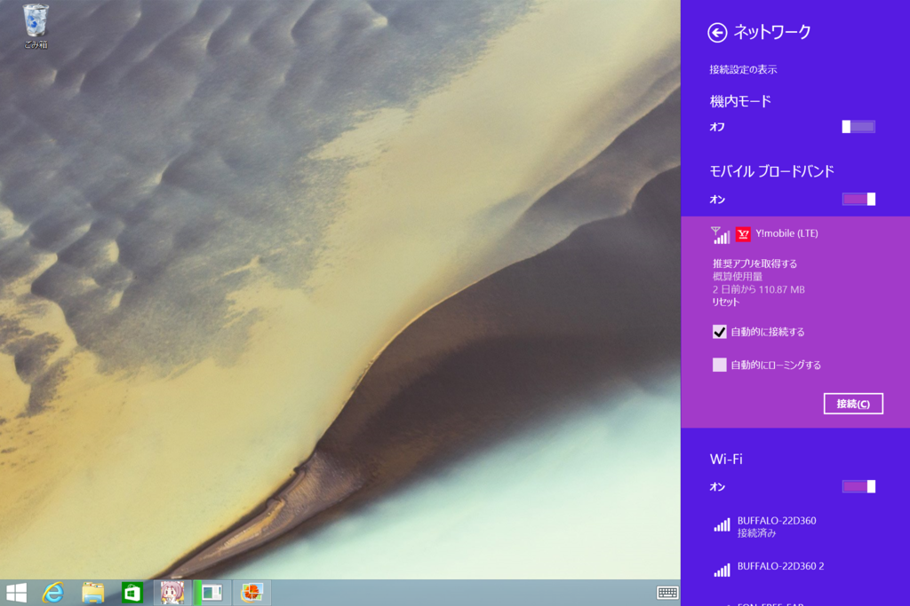
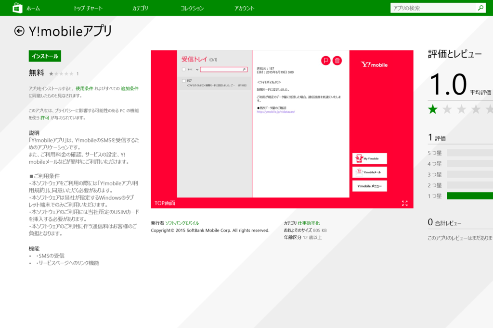
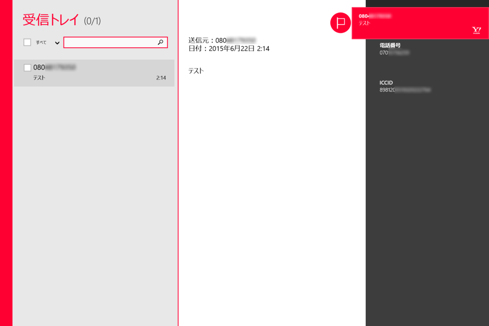
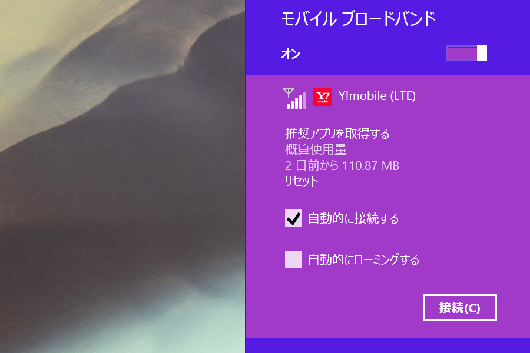
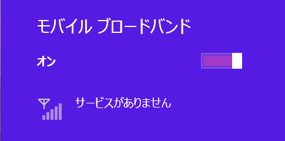
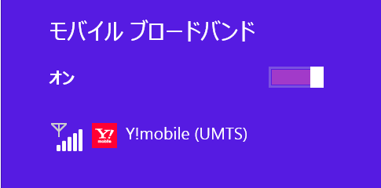
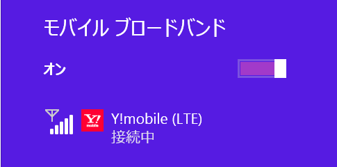
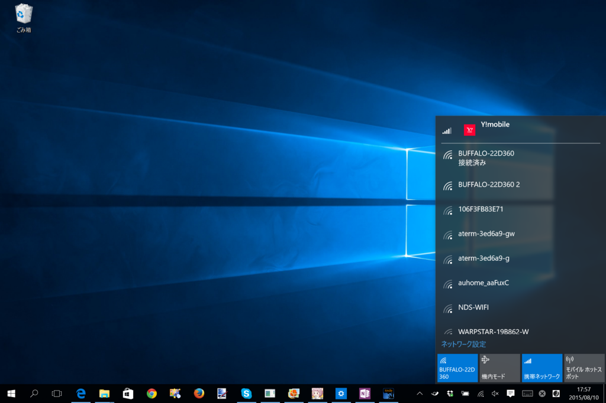
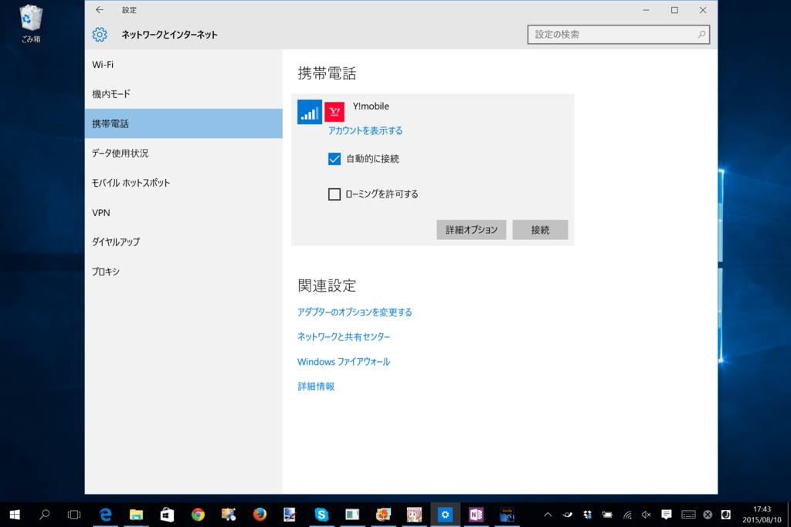
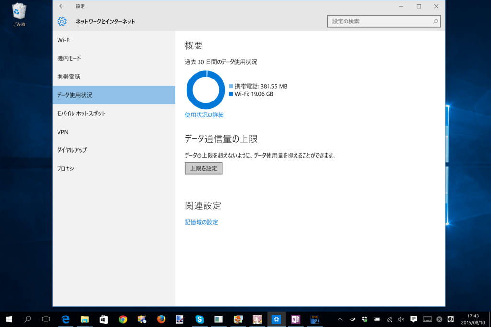

<h3>Windows 8.1</h3>

［推奨アプリを取得する］を選択すると、Y! Mobile の Windows ストア アプリを入手できる。

 

<blockquote cite="https://www.microsoft.com/ja-JP/store/Apps/Y-mobile%E3%82%A2%E3%83%97%E3%83%AA/9NBLGGH3185Z">

「Y!mobileアプリ」は、Y!mobileのSMSを受信するためのアプリケーションです。 また、ご利用料金の確認、サービスの設定、Y!mobileメールなどが簡単にご利用いただけます。

<cite><a href="https://www.microsoft.com/ja-JP/store/Apps/Y-mobile%E3%82%A2%E3%83%97%E3%83%AA/9NBLGGH3185Z">Y!mobile&#x30A2;&#x30D7;&#x30EA; - Microsoft &#x30B9;&#x30C8;&#x30A2;</a></cite>
</blockquote>

多分あんまり使うことはないと思うけれど、一応入れておいた。毎月の請求なんかが SMS で通知されるんだろうと思っていたのだけど、そういうこともなく、ただインストールしただけになっている。まぁ、タブレットの SMS 送れるのはちょっと面白いかもだけど。

あと、接続した状態でコンテキストメニューを開き、［概算データ使用量の表示］と［定額課金接続として設定］を有効化しておくとよいかも。

［概算データ使用量の表示］を有効化しておくと、通信量が簡単にチェックできる。また［定額課金接続として設定］を有効化しておくと、システムや「OneDrive」をはじめとする一部アプリケーションでバックグラウンド通信が無効化される。パッチのダウンロードやファイルの同期で通信制限に引っかかってしまうと厄介なので、設定しておいた方がいいと思う。

たぶん電波がない状態。

3G 接続の状態（UMTS、W-CDMA）。

4G 接続の状態（LTE）。

あと、ドライバーが死ぬと（？）ON/OFF の切り替えができなくなったりするっぽい。モバイルネットワークに接続した状態で電源を落とした状態で（Connected Standby/Instant Go）移動すると割と高い確率でそうなる気がするけど、再現条件はいまいち分からん。とりあえず自分は「利用するときだけ接続し、そうでないときは手動で切断する」という運用にしている。

<h3>Windows 10</h3>

Windows 10 ではポップアップで通信量のチェックや接続処理が行えなくなって、若干不便になった。

モバイルネットワークをタップすると［設定］画面が開き、接続が行える。

通信量は［データ使用状況］画面でチェック可能。ただし、この画面をスタートへピン留めしても、ライブタイルでデータを表示してくれたりはしない（Windows Phone ならやってくれそうなのだが）。Windows 10 はこういうところがイケいないと思う。

