
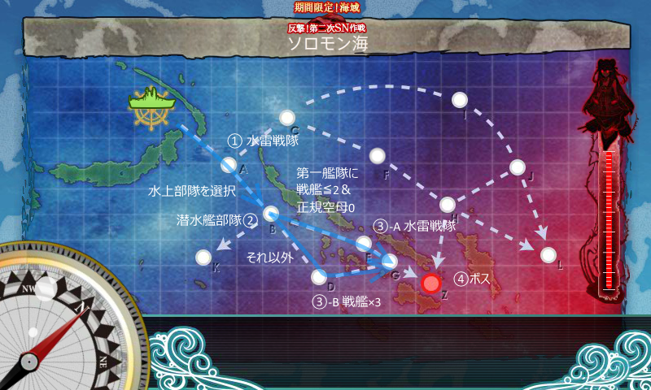

難易度甲、水上部隊を選択（お札が E1 と共通なので、艦娘を使いまわしたかった）。

<h3>基本方針</h3>

2.5軍ぐらいで、史実が絡まない海外戦艦、潜水艦対策の航戦などから編成。火力が足りなかったので、第二艦隊の強化（重巡・雷巡投入）。また、途中でルート制御のために第一艦隊を再編成した。

<ol>
<li>第一艦隊
<ol>
<li>Italia(Lv83) 日向改(Lv80) 伊勢改(Lv81) Roma改(Lv82) 龍鳳改(Lv96) 飛鷹改(Lv96) </li>
<li>熊野改(Lv92) 日向改(Lv81) 伊勢改(Lv81) 鈴谷改(Lv92) 龍鳳改(Lv96) 飛鷹改(Lv96)</li>
</ol></li>
<li>第二艦隊
<ol>
<li>川内(Lv122) Lv70～80の駆逐艦×5</li>
<li>木曾(Lv96) 衣笠(Lv89) 青葉(Lv92) 白露(Lv81) 村雨(Lv81) 川内(Lv122)</li>
</ol></li>
</ol>
装備はぶっちゃけ適当。

<h3>戦闘経過</h3>

11回出撃（うち4回ほどは編成を探るための小手調べ、1回はブラウザーを誤って閉じる。正味6回）、ボス4回撃破でクリア。

<ol>
<li>第一艦隊　戦艦×4＋軽空母×2　第二艦隊　軽巡×1＋駆逐×5
<ul>
<li>A → B 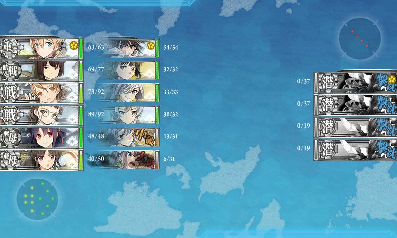</li>
<li>マスの潜水艦がクソ痛い死ぬ（→ 艦隊司令部施設を装備）</li>
</ul></li>
<li>第一艦隊　戦艦×4＋軽空母×2　第二艦隊　軽巡×1＋駆逐×5
<ul>
<li>A → B → D</li>
</ul></li>
<li>第一艦隊　戦艦×4＋軽空母×2　第二艦隊　軽巡×1＋駆逐×5
<ul>
<li>A</li>
</ul></li>
<li>第一艦隊　戦艦×4＋軽空母×2　第二艦隊　軽巡×1＋駆逐×5
<ul>
<li>退避艦をだした状態ではボスきつい…… 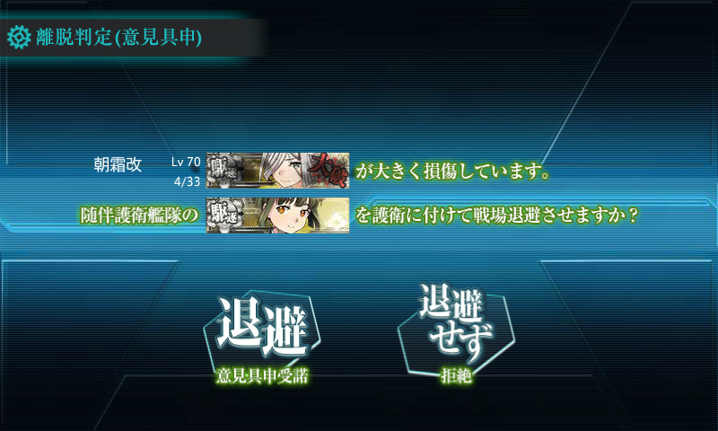</li>
<li><b>A → B → D → G → Z</b></li>
<li>ボスにかすり傷一つつかず 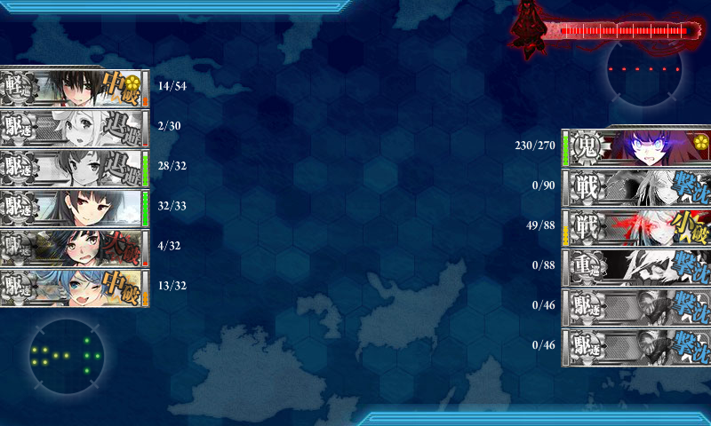</li>
</ul></li>
<li>第一艦隊　戦艦×4＋軽空母×2　第二艦隊　軽巡×1＋<b>雷巡×1＋重巡×2</b>＋駆逐×2
<ul>
<li>第二艦隊の大幅増強が功を奏してボス到達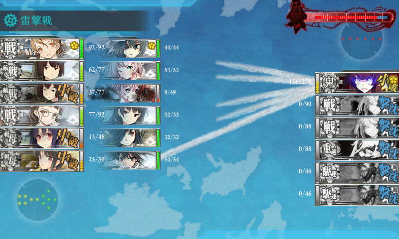</li>
<li>A → B → D → G → Z（撃破1回目） 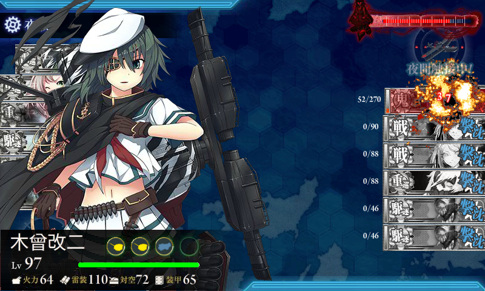</li>
</ul></li>
<li>第一艦隊　戦艦×4＋軽空母×2　第二艦隊　軽巡×1＋雷巡×1＋重巡×2＋駆逐×2
<ul>
<li>A → B → D 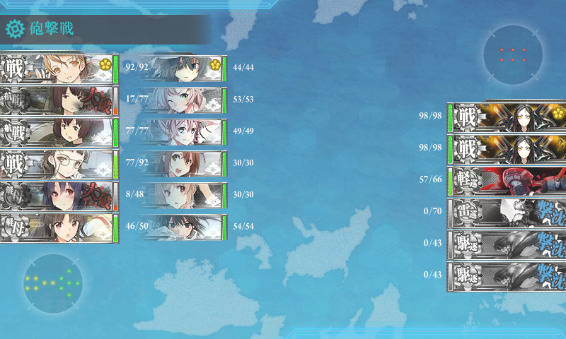</li>
<li>D マスの戦艦痛い死ぬ（→ ルート制御のために編成変更）</li>
</ul></li>
<li>第一艦隊　<b>戦艦×2＋航巡×2</b>＋軽空母×2　第二艦隊　軽巡×1＋雷巡×1＋重巡×2＋駆逐×2
<ul>
<li>第一艦隊を戦艦2隻以下に押さえる → 直進ルート 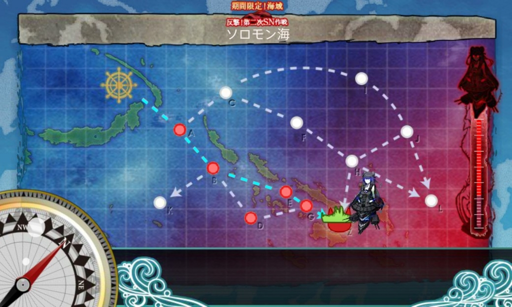</li>
<li>A → B → E → G → Z（撃破2回目） 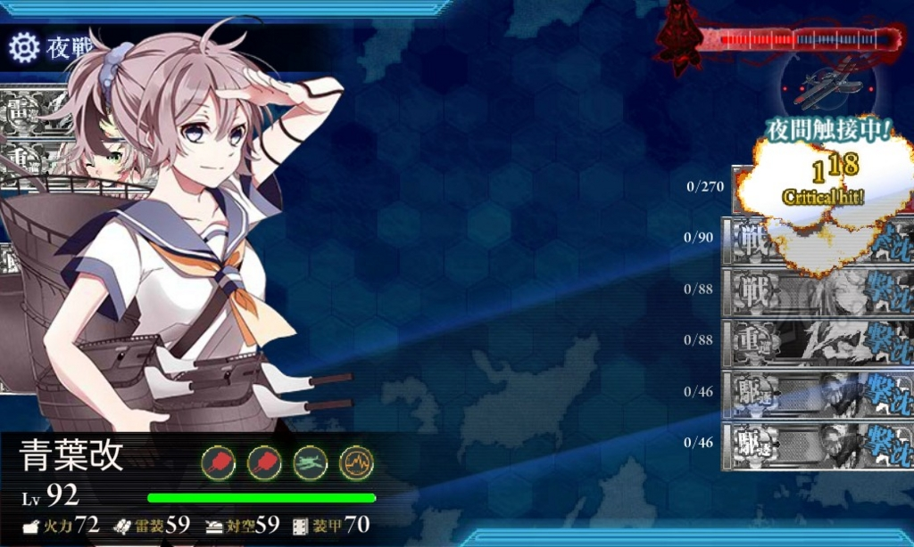</li>
</ul></li>
<li>第一艦隊　戦艦×2＋航巡×2＋軽空母×2　第二艦隊　軽巡×1＋雷巡×1＋重巡×2＋駆逐×2
<ul>
<li>A → B → E（<b>間違ってブラウザ閉じた／(＾o＾)＼</b>）</li>
</ul></li>
<li>第一艦隊　戦艦×2＋航巡×2＋軽空母×2　第二艦隊　軽巡×1＋雷巡×1＋重巡×2＋駆逐×2
<ul>
<li>A → B → E → G → Z（撃破3回目） 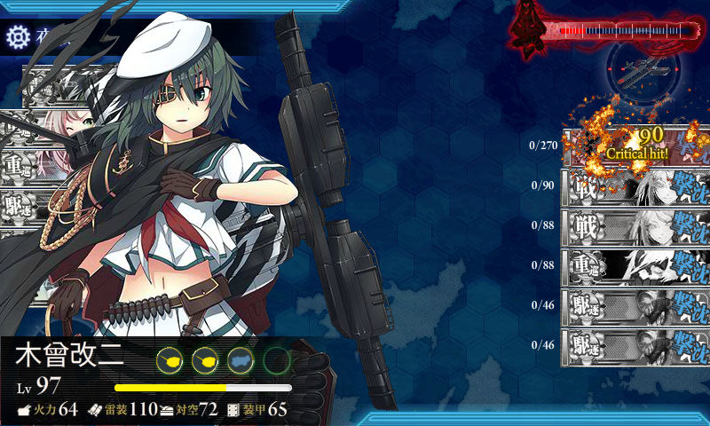</li>
</ul></li>
<li>第一艦隊　戦艦×2＋航巡×2＋軽空母×2　第二艦隊　軽巡×1＋雷巡×1＋重巡×2＋駆逐×2
<ul>
<li>A → B → E → G → Z（ボス最終形態、打ち漏らし） 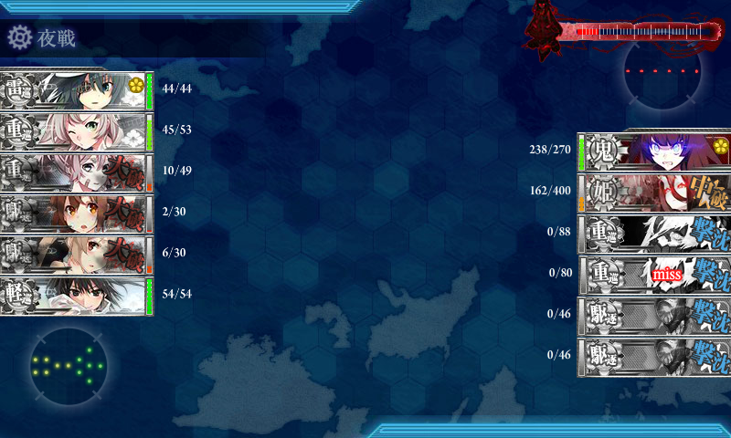</li>
</ul></li>
<li>第一艦隊　戦艦×2＋航巡×2＋軽空母×2　第二艦隊　軽巡×1＋雷巡×1＋重巡×2＋駆逐×2
<ul>
<li>決戦支援（戦艦×2、正規空母×2、駆逐×2）を送る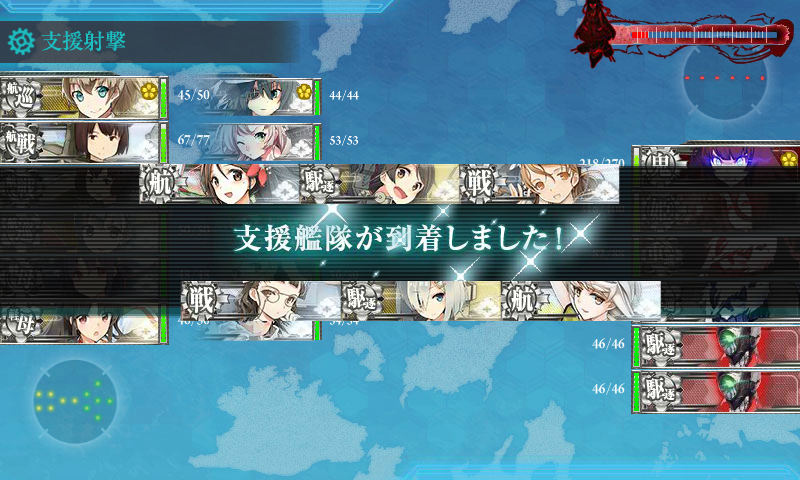</li>
<li>A → B → E → G → Z（撃破4回目） 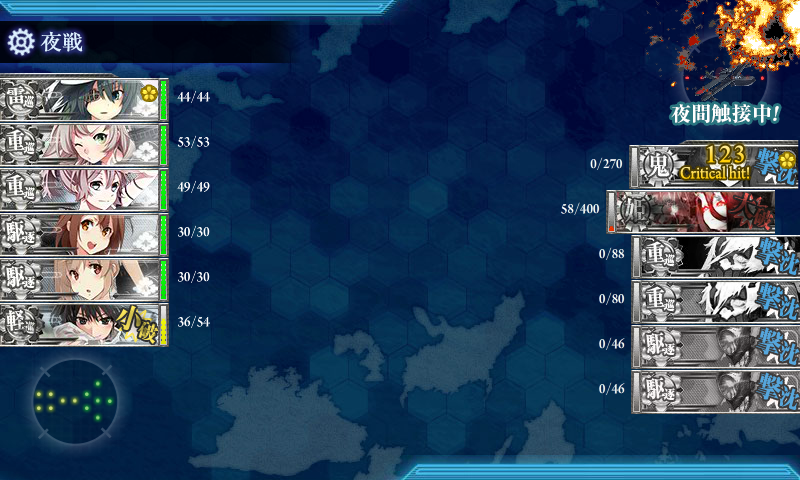</li>
<li>ドロップ「初風」 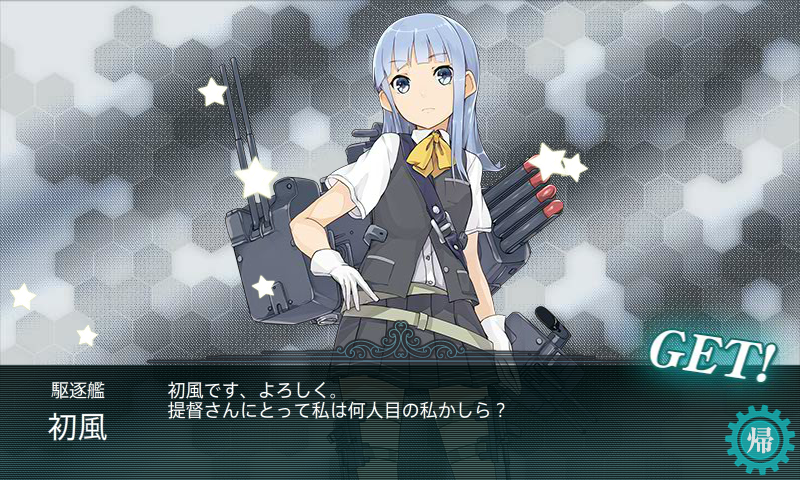</li>
</ul></li>
</ol>

<h3>まとめ</h3>

艦隊編成を手探りしてた4戦目までは割とキツいと思っていたけれど、編成を見つけてからは楽だった。

<ul>
<li>第一艦隊は直進（A → B → E → G → Z）できる正規空母0＋戦艦2以下の編成（確定じゃないけど、多分そうだと思う）がお勧め</li>
<li>第二艦隊は連合艦隊の縛りが許す限りで強力に（ただし、先のことも考えること）。第二艦隊を強化したら、B マスの雷撃で撤退することがなくなったが、因果関係は不明</li>
<li>トドメは決戦支援の艦隊を出すのがお勧めかも</li>
</ul>

