
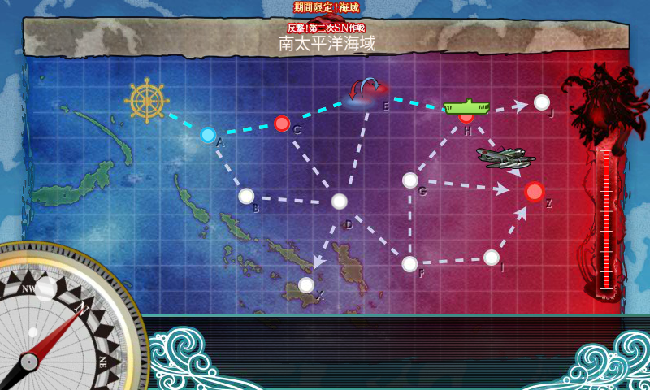

上ルート（A → C → E → H → Z）のみで8回出撃クリア。

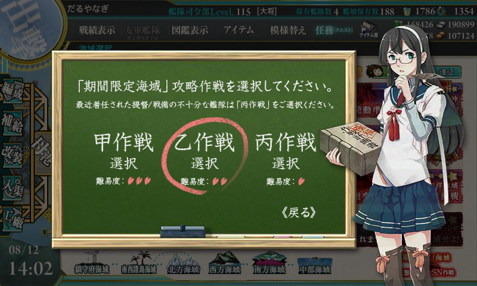

ただし、難易度は「丙！提督ぅ～」（CV：金剛）で。

<h3>編成</h3>

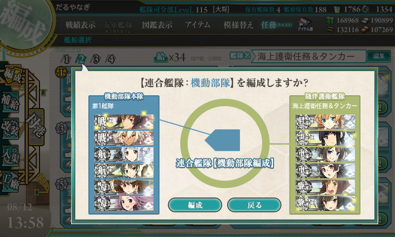

このステージは連合艦隊マップで、【水上部隊】と【機動部隊】が選べる。今回は【機動部隊】を選択。序盤の山場らしいので、一軍を惜しみなく投入。

<h4>第一艦隊</h4>

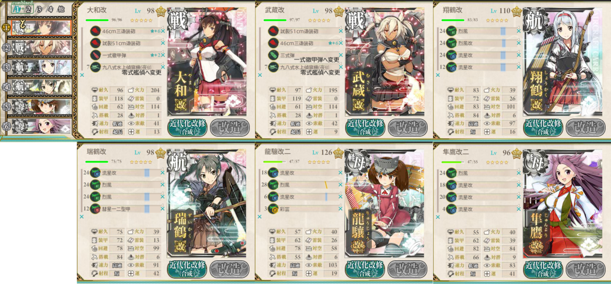

戦艦2＋正規空母2＋軽空母2に（軽空母2というのがルート制御に重要なのかな？　いきなりこれでうまくいったので、ほかを試してないが）、適当な初期装備を載せる。これで制空値は 263 ぐらいになるらしいが、道中困ることはなかった。最初、誤って和姉妹に夜偵を積んでいたのを零観にした。加えて、ラストアタックで「武蔵」の三式弾を一式徹甲弾に換装（後述）。

<h4>第二艦隊</h4>

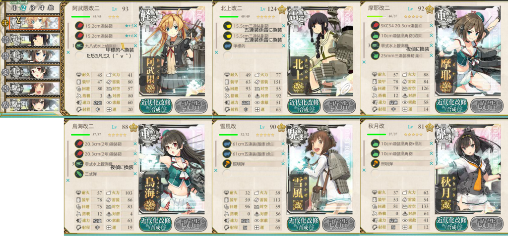

軽巡1＋雷巡1＋重巡2＋駆逐1の基本セットに、連撃装備と夜戦道具（夜偵2機＋照明弾2個）を搭載。

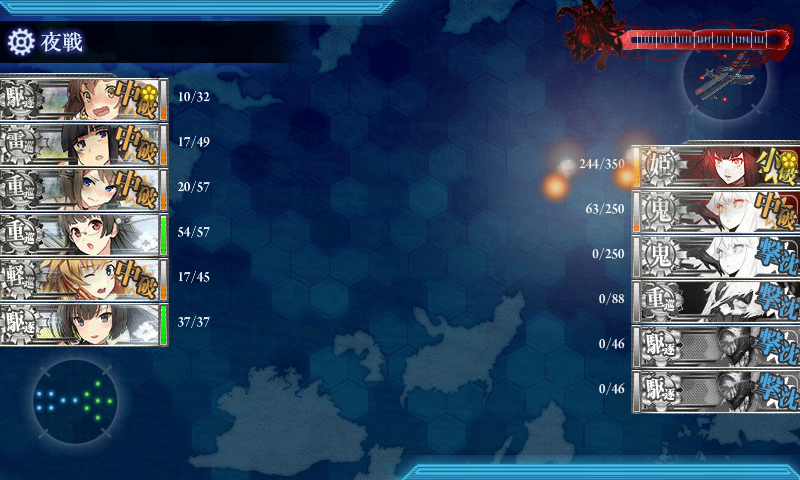

軽巡は甲標的を載せて先制雷撃ができる「阿武隈」を採用。雷巡「北上」と二人で開幕で敵をなるべく減らす。

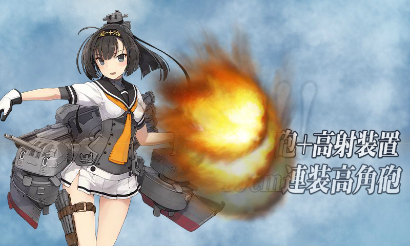

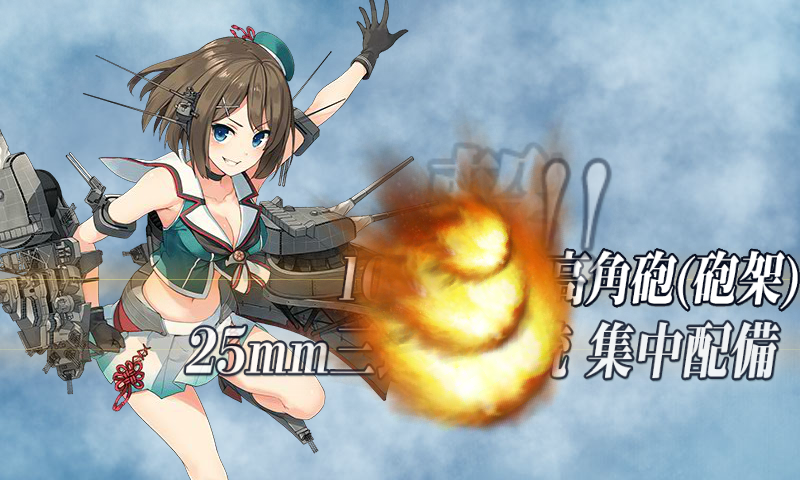

「摩耶」「秋月」は対空カットイン要員。二人いるとかなり安定してカットインが発生する感じ。

残りの駆逐枠は頼りになる「雪風」さん。重巡の相方はなんでもいいかとおもったので、「摩耶」に合わせて「鳥海」を入れた。

艦隊の並び順はあんまり考えてなかったが、途中で「雪風」を旗艦に。難易度甲だったらもう少し練ったかもしれないが、乙だったのでこれでもだいたいいけた。

<h3>戦闘経過</h3>

すべてボスまで到達。

<ol>
<li>A → C → E → H → Z（ボス撃破1回目）
<ul>
<li>ボスS勝利 ドロップ「龍驤」</li>
</ul></li>
<li>A → C → E → H → Z（ボス撃破2回目）
<ul>
<li>ボスS勝利 ドロップ「舞風」 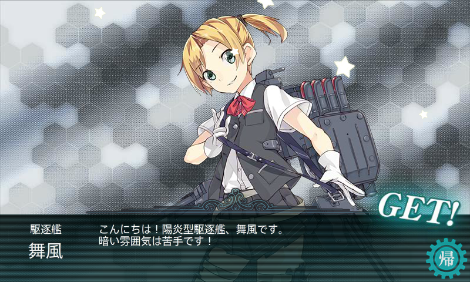</li>
</ul></li>
<li>A → C → E → H → Z（ボス撃破、打ち漏らし）
<ul>
<li>基本的に決戦支援は要らないが、ボスで反航戦だと打ち漏らしがあるかもしれない（震え声 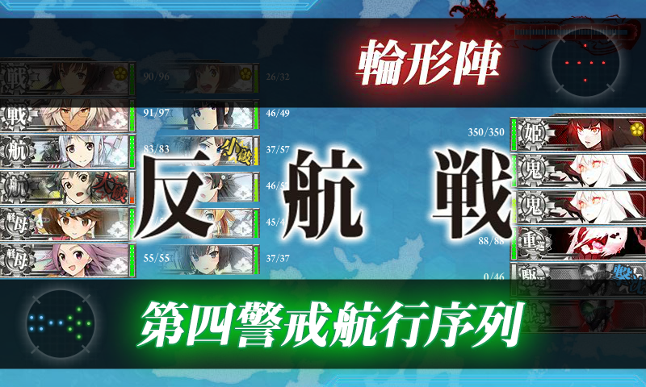</li>
<li>ボスA勝利 ドロップ <s>たまご焼き</s>「瑞鳳」 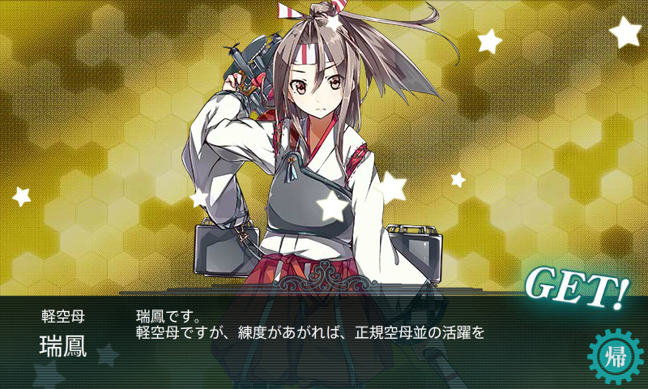</li>
</ul></li>
<li>A → C → E → H → Z（ボス撃破3回目）
<ul>
<li>ボスS勝利 ドロップ「北上」</li>
</ul></li>
<li>A → C → E → H → Z（ボス撃破4回目）
<ul>
<li>ボスS勝利 ドロップ「高雄」</li>
</ul></li>
<li>A → C → E → H → Z（ボス撃破5回目、以後ラストアタック）
<ul>
<li>この回から決戦支援艦隊（戦艦2＋正規空母2＋駆逐2）を導入してみた。駆逐艦の一掃はできそう 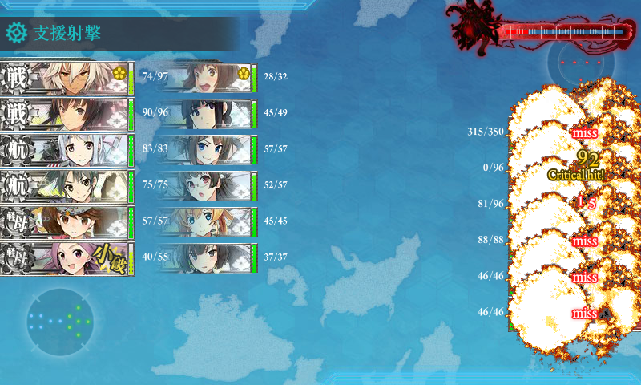</li>
<li>ボスS勝利 ドロップ「最上」</li>
</ul></li>
<li>A → C → E → H → Z（ボス撃破、打ち漏らし）
<ul>
<li>最終形態。難易度甲ではこの編成が通常らしい。決戦支援なしでは無理だな（白目 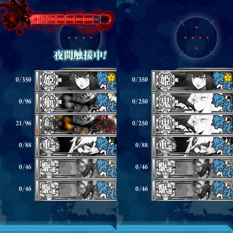</li>
<li>痛恨の打ち漏らし。「武蔵」を徹甲弾に、「北上」を魚雷カットイン装備に 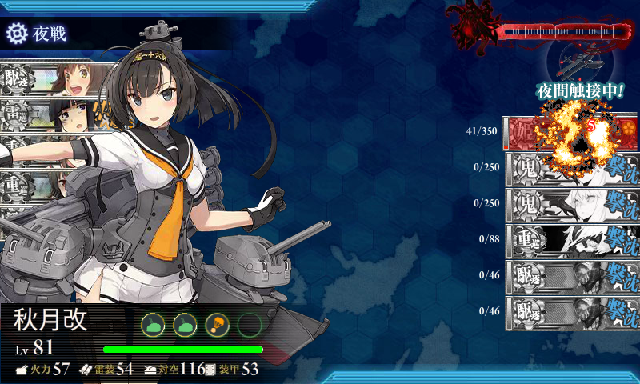</li>
<li>ボスA勝利 ドロップ「北上」</li>
</ul></li>
<li>A → C → E → H → Z（ボス撃破6回目）
<ul>
<li>中破三艦も出してて（過去最悪）撃破が危ぶまれたが…… 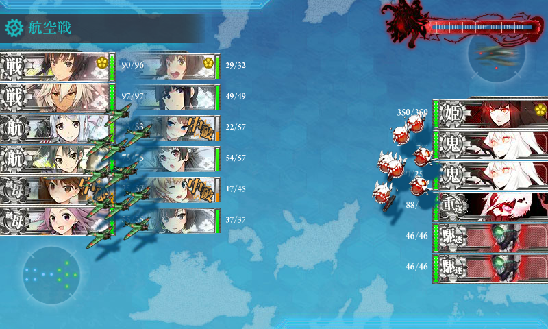</li>
<li>装備見直しの甲斐もあって「鳥海」さんがボスを撃破。 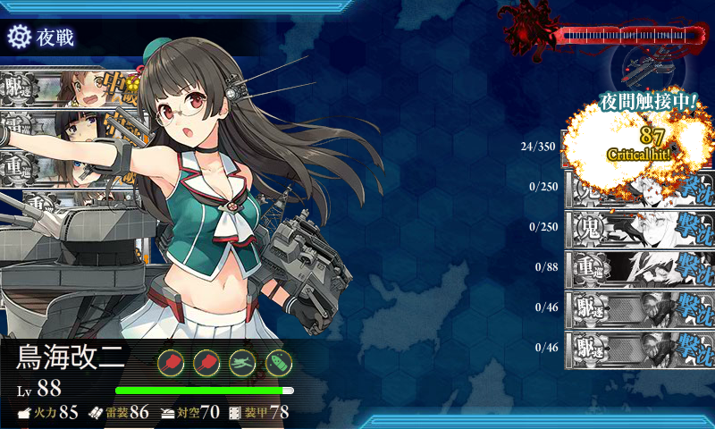</li>
<li>ボスS勝利 ドロップ「夕雲」 </li>
</ul></li>
</ol>
結果論だけど、甲でもクリアそのものは不可能ではないと思う。ただ、レア艦掘りのことを考えると、決戦支援艦隊が要らない乙じゃないとやる気になれない感じ。

<h3>追記</h3>

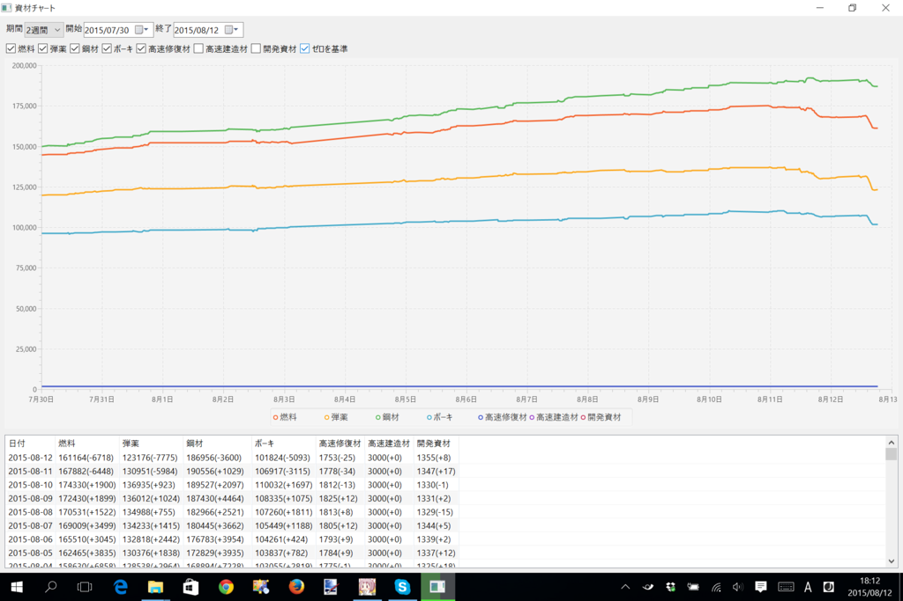

遠征による増減もあるが――

<table>
<tr>
<td> </td>
<td> </td>
<td>燃料</td>
<td>弾薬</td>
<td>鋼材</td>
<td>ボーキサイト</td>
<td>高速修復剤</td>
</tr>
<tr>
<td>2015-08-10</td>
<td>E1</td>
<td>+1900</td>
<td>+923</td>
<td>+2097</td>
<td>+1697</td>
<td>-13</td>
</tr>
<tr>
<td>2015-08-11</td>
<td>E2</td>
<td>-6448</td>
<td>-5984</td>
<td>+1029</td>
<td>-3115</td>
<td>-34</td>
</tr>
<tr>
<td>2015-08-12</td>
<td>E3</td>
<td>-6718</td>
<td>-7775</td>
<td>-3600</td>
<td>-5093</td>
<td>-25</td>
</tr>
</table>
修復剤を少し無駄遣いしてるかもしれない（疲労を抜くためにも使ってる）。あと、弾薬が薄いので、燃料・弾薬重視に遠征を切り替えようっと（忘れてた

