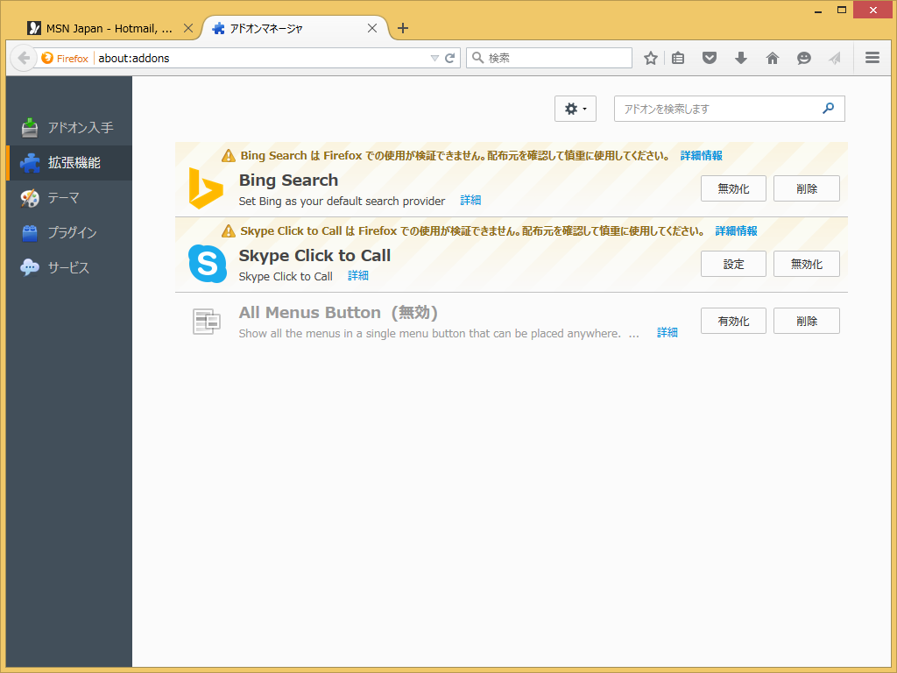
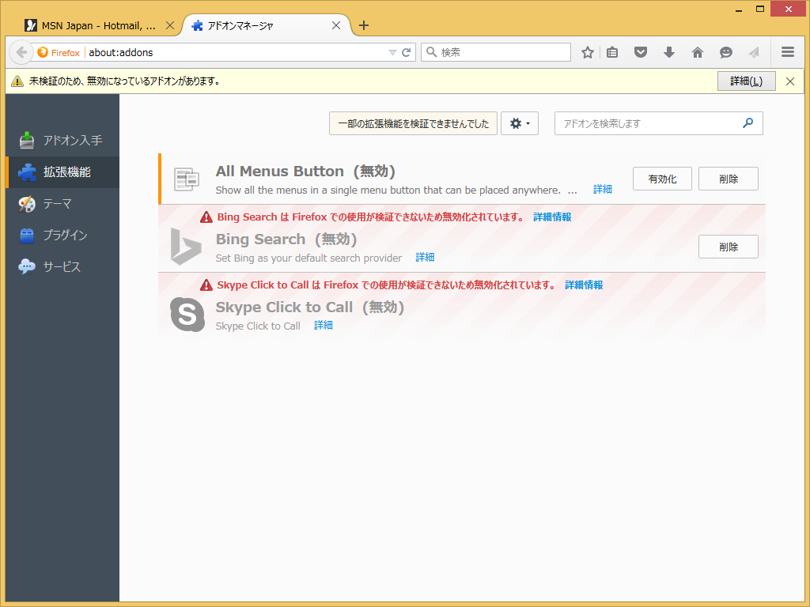
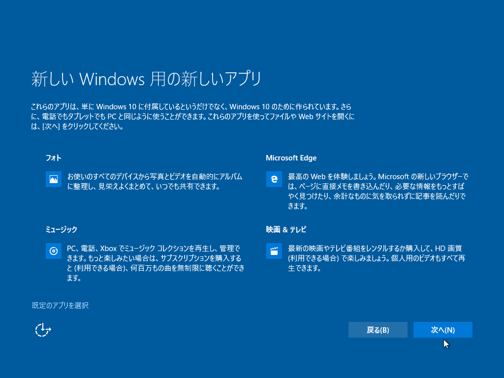
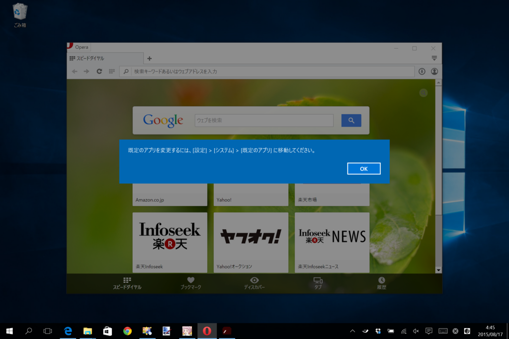
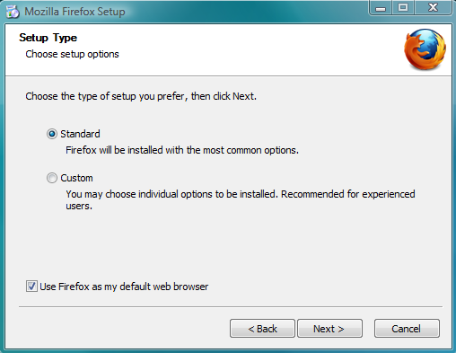
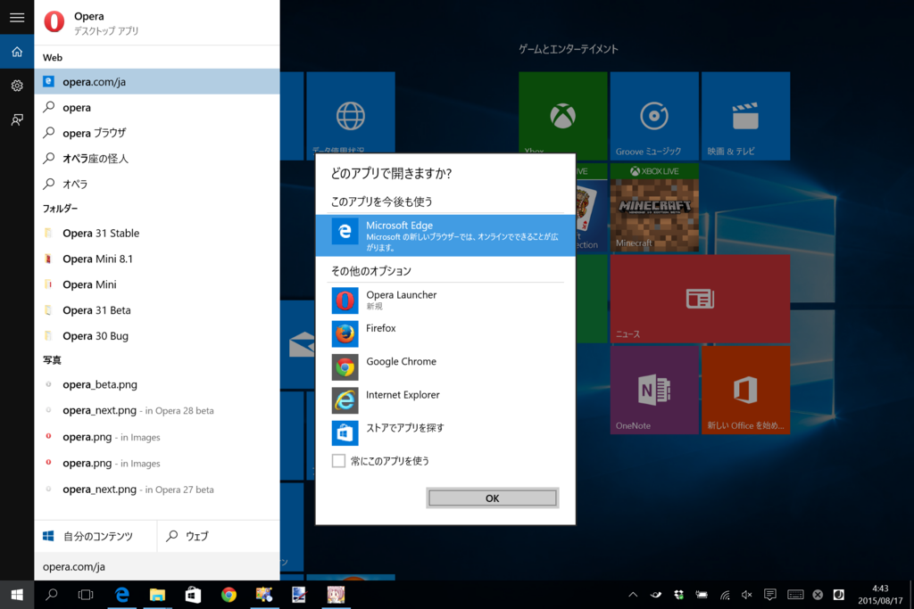

<blockquote cite="https://support.mozilla.org/ja/kb/add-on-signing-in-firefox">

Mozilla verifies and "signs" add-ons that follow a set of guidelines to ensure that users' information will not be stolen or manipulated. All add-ons hosted on addons.mozilla.org undergo this review process in order to be verified and signed. Add-ons hosted on other sites will need to follow the same guidelines in order to be signed by Mozilla.

Add-on signing targets only malware and browser hijacking. It does not control or censor the content that you choose to see.

<cite><a href="https://support.mozilla.org/ja/kb/add-on-signing-in-firefox">Add-on signing in Firefox | Mozilla &#x30B5;&#x30DD;&#x30FC;&#x30C8;</a></cite>
</blockquote>

<h3>Firefox 40（stable）</h3>

警告の表示。

<h3>Firefox 41（beta）</h3>

アドオンの無効化（通知バーによるお知らせ付き）。

<h4>おまけ：デフォルトブラウザー</h4>

 

<blockquote cite="http://www.mozilla.jp/blog/entry/10493/">

ユーザの選択肢という点では、Microsoft の Windows 10 は同社の過去のバージョンと比較しても、はるかに及びません。以前の設定やデフォルト設定を維持することは技術的には可能ですが、新しい Windows 10 のアップグレード体験とユーザインタフェースでは、そのことがはっきり分かるようになっているわけではなく、簡単にできるようにもなっていません。

<cite><a href="http://www.mozilla.jp/blog/entry/10493/">&#x30AA;&#x30F3;&#x30E9;&#x30A4;&#x30F3;&#x4E0A;&#x306E;&#x9078;&#x629E;&#x80A2;&#x3068;&#x30B3;&#x30F3;&#x30C8;&#x30ED;&#x30FC;&#x30EB;&#x6A29;&#x306E;&#x4FDD;&#x8B77; | Mozilla Japan &#x30D6;&#x30ED;&#x30B0;</a></cite>
</blockquote>

まぁ、言いたいことはわかる（ぁ

でも、代わりに案内されている方法（<a href="http://www.mozilla.jp/blog/entry/10491/">Windows 10 &#x5411;&#x3051; Firefox: Firefox &#x3092;&#x30C7;&#x30D5;&#x30A9;&#x30EB;&#x30C8;&#x30D6;&#x30E9;&#x30A6;&#x30B6;&#x306B;&#x9078;&#x629E;&#x307E;&#x305F;&#x306F;&#x623B;&#x3059;&#x65B9;&#x6CD5; | Mozilla Japan &#x30D6;&#x30ED;&#x30B0;</a>）がブサイクなのには閉口する<a href="#f-cbda2fd6" name="fn-cbda2fd6" title="しかも、慌ててリリース（？）した 40.0.2 で加えられたちょっとした“改善”により、この手順はあまり役に立たなくなっているようにも思える">*1</a>。もっといい方法がなかったんだろうか。

そもそもこんなことになったのは、Windows 10 ではプログラムから既定のアプリを変更できなくした（ユーザーが明示的に変更するようにプロセスを改善）せいだ。これは「サードパーティー製アプリが勝手に既定のアプリを変更するのを防止する」ためのもので、最近 Mozilla が自分のブラウザーに対して施している改善と本質的には変わらない。

こんな感じのインストーラーはもうやめていきましょうぜってことやね<a href="#f-7ef84196" name="fn-7ef84196" title="これが“勝手に”かどうか、“分かりやすい”かどうかを議論しはじめるとメンドクサイ">*2</a><a href="#f-b1f059ee" name="fn-b1f059ee" title="今はトップページからのダウンロードがスタブインストーラーになってるから、このタイプのインストーラーじゃないことが多いはず">*3</a>。

ちなみに、新しい Web ブラウザーをシステムに追加すると、次回利用時に既定のアプリを選択できるのはこれまで通り<a href="#f-9605f45d" name="fn-9605f45d" title="デフォルトブラウザーを変更するボタンを押した後にこれが出せるようになれば、ご注文にお応えできたのかも知れない">*4</a>。これは十分わかりやすいと思う。

確かに“アップグレード体験”<a href="#f-a9f89997" name="fn-a9f89997" title="こういう日本語、最近流行ってるけどすごくキラい！">*5</a>については、“はっきり分かるようになっているわけではなく、簡単にできるようにもなってい”ないことに同意するけどね。自分もうっかりデフォルトブラウザーを「Microsoft Edge」にしちゃったクチだし。もっとも、「Mozilla Firefox」からではなく「Google Chrome」からなのだが……。

<a href="#fn-cbda2fd6" name="f-cbda2fd6" class="footnote-number">*1</a>:しかも、慌ててリリース（？）した 40.0.2 で加えられたちょっとした“改善”により、この手順はあまり役に立たなくなっているようにも思える

<a href="#fn-7ef84196" name="f-7ef84196" class="footnote-number">*2</a>:これが“勝手に”かどうか、“分かりやすい”かどうかを議論しはじめるとメンドクサイ

<a href="#fn-b1f059ee" name="f-b1f059ee" class="footnote-number">*3</a>:今はトップページからのダウンロードがスタブインストーラーになってるから、このタイプのインストーラーじゃないことが多いはず

<a href="#fn-9605f45d" name="f-9605f45d" class="footnote-number">*4</a>:デフォルトブラウザーを変更するボタンを押した後にこれが出せるようになれば、ご注文にお応えできたのかも知れない

<a href="#fn-a9f89997" name="f-a9f89997" class="footnote-number">*5</a>:こういう日本語、最近流行ってるけどすごくキラい！

