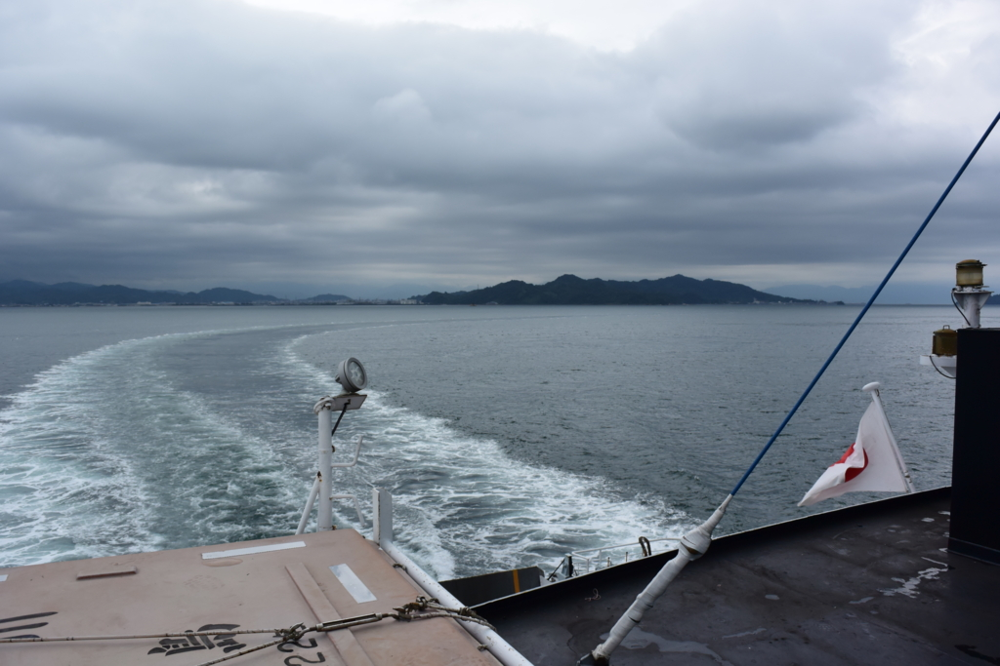
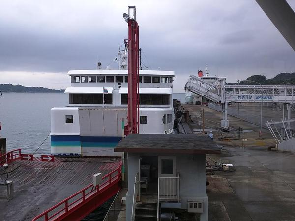
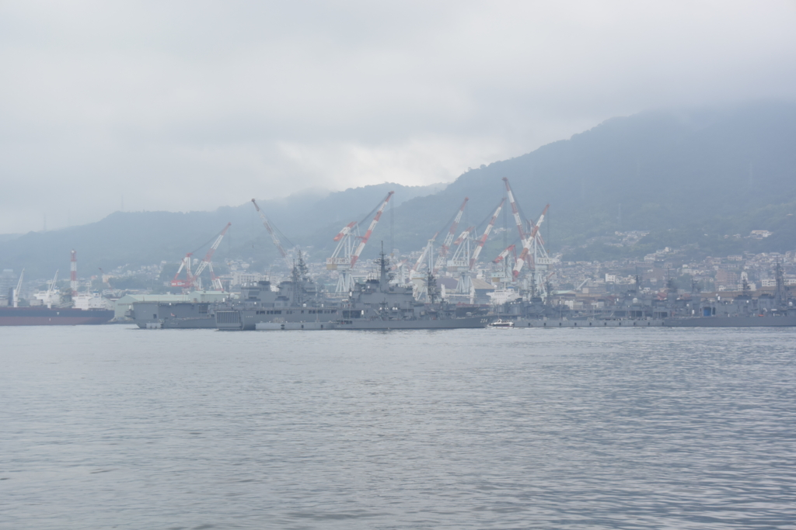

お盆は船に乗って広島・呉に行ってきた。

<iframe src="https://hatenablog-parts.com/embed?url=https%3A%2F%2Fblog.daruyanagi.jp%2Fentry%2F2014%2F08%2F30%2F221903" title="戦艦陸奥のお墓参り行ってきた - だるろぐ" class="embed-card embed-blogcard" scrolling="no" frameborder="0" style="display: block; width: 100%; height: 190px; max-width: 500px; margin: 10px 0px;"></iframe>

前回は<b>三津港</b>から柳井行き（降りたのは途中の周防大島にある伊保田）に乗ったけれど、今回は<b>松山観光港</b>からの乗船になる。ここからは、広島行きのほかにも小倉行きが出ている（これも今度乗りたいものだ）。

先に文句を言っとくけど、この松山観光港というのがめちゃくちゃアクセス悪い。伊予鉄高浜駅から、さらに連絡バスに乗らなくてはならない（運賃180円）。

行きはそれほど苦にも思わなかったが、帰りは30分ほどバスを待たされ、高浜駅でも電車の発車までに15分ほど待つ羽目になって、かなり堪えた。松山市駅行きのリムジンバスが出ているので、市内中心部に用がある人はそっちを利用するのがいいようだ。個人的には三津港か衣山、古町あたりで止まってくれると助かるのだが、生憎、そんな配慮はない。

地元民はマイカーでのお迎えが一般的のようで、バスト列車を利用する人は少なかった。みんながマイカーを利用するから公共交通機関がダメなのか、公共交通機関がダメだからみんなマイカーでお出迎えするのか。とりあえず“おもてなし No.1”を詐称する暇があったら、伊予鉄の延伸とかマジで考えた方がいいと思う。

<h3>松山 → 呉</h3>

行きしなは呉で降りて、1日観光した。その話はまた今度、今日は船に乗った話だけ。

松山 ⇔ 広島・呉 間には、足の速い“<b>スーパージェット</b>”と、クルマも乗れる“<b>クルーズフェリー</b>”の2種類がある。

<table>
<tr>
<td> </td>
<td>スーパージェット</td>
<td>クルーズフェリー</td>
<td>備考</td>
</tr>
<tr>
<td>広島までの所要時間</td>
<td>約1時間</td>
<td>約2時間</td>
<td>呉寄港便は＋15分程度</td>
</tr>
<tr>
<td>広島までの運賃</td>
<td>7,100円</td>
<td>3,600円</td>
<td> </td>
</tr>
<tr>
<td>車両乗船</td>
<td>不可</td>
<td>可</td>
<td> </td>
</tr>
</table>

行きは安いフェリーの方をチョイス。フェリーは JAF 割引（1割）が効いたので、呉までは2,410円（正規運賃は 2,670円）。だいぶ安いと思った。今度バイクで呉に行こう。

<blockquote class="twitter-tweet" data-lang="ja">
呉止まる便ないマン <a href="http://t.co/sGvUsWV4b5">pic.twitter.com/sGvUsWV4b5</a>
&mdash; だるやなぎ に天使が舞い降りた！ (@daruyanagi) <a href="https://twitter.com/daruyanagi/status/631611770776391680?ref_src=twsrc%5Etfw">2015年8月12日</a></blockquote>

ちなみにスーパージェットは呉に停まらない便が多いので、あらかじめ運行表をチェックしておいた方がいいかも（フェリーも一便目は呉に停まらないようだ）。

<blockquote class="twitter-tweet" data-lang="ja">
フリーWi-Fiあるやんって思って艦これ行ったら怒られた <a href="http://t.co/t2VNqCWDBW">pic.twitter.com/t2VNqCWDBW</a>
&mdash; だるやなぎ に天使が舞い降りた！ (@daruyanagi) <a href="https://twitter.com/daruyanagi/status/631632583542050816?ref_src=twsrc%5Etfw">2015年8月13日</a></blockquote>

あと、船内には無料の Wi-Fi があるので、艦これだって楽しめる……はずだったが、ポリシー違反だとかなんだとかでブロックされてた／(＾o＾)＼

ただし、洋上でも Y! モバイルがつながったので、ケータイはだいたいイケるんじゃないだろうか。自分はテザリングでネットしたり、持ってきた本を読んだりしてのんびり過ごした。

船は15ノットで快調に進む。途中で、スーパージェットとすれ違った。

やがて橋が架かった狭い海峡に差し掛かり（本土と江田島の間にある“音戸の瀬戸”というところらしい）、船足が遅くなる。ここを抜けると、呉の港はすぐそこ。右舷に林立した大型クレーン、鼠色の護衛艦、艤装中のタンカーなんかがひしめいている。「呉にきた！」って感じやね！

<h3>広島 → 呉</h3>

帰りは広島観光をしたので、広島港（宇品）経由。広電に乗ったの、小さい頃以来かもしれない。

<blockquote class="twitter-tweet" data-lang="ja">
大出費や <a href="http://t.co/WOjazkS1du">pic.twitter.com/WOjazkS1du</a>
&mdash; だるやなぎ に天使が舞い降りた！ (@daruyanagi) <a href="https://twitter.com/daruyanagi/status/632496520395227136?ref_src=twsrc%5Etfw">2015年8月15日</a></blockquote>

広島港に着いたのが午後7時前ということもあり、残りはスーパージェット2便、クルーズフェリー1便だけだった。どっちに乗るか散々迷ったけれど（あぁ、貧乏人の悲しいところだ！！）、結局、奮発してスーパージェットに乗ってみた。JAF 割引はないようだが、期間限定の謎割引が効いて運賃は 6,850円。

2階席はなんかいいシートっぽくて500円余計にかかる。まぁ、混んでない限りは1階席でも十分快適だった。自販機でビール飲んだり、Surface 3 広げて艦これしたりしているうちに、松山観光港に到着。フェリーよりも早くて快適、さすが倍の値段はとるだけあると思った。

――まぁ、それも連絡バスを待ったり、高浜駅で電車を待ってる時間で無駄になってしまったんだけど（＾ｖ＾）……

フェリーとタクシーで帰るのが、自分的には最適解だった。所要時間と運賃はスーパージェット＋電車・バスと変わらないけれど、そっちの方が断然楽だ。っていうか、スーパージェットとタクシー使って帰れる身分になりたい……。

