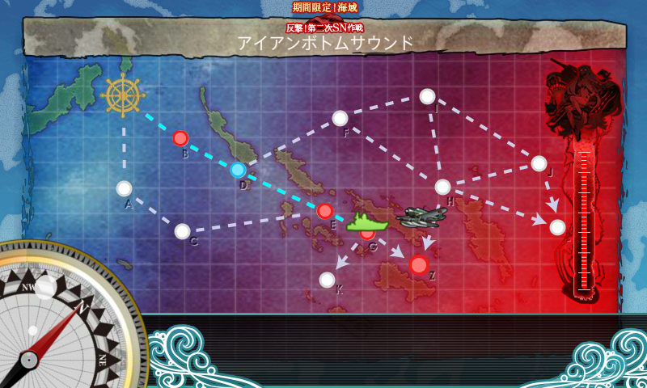
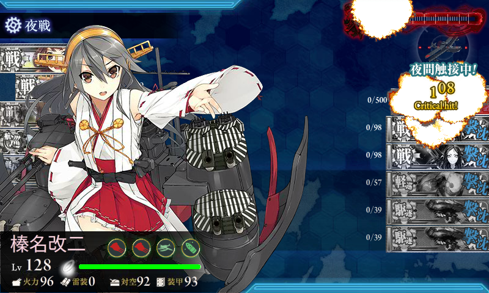
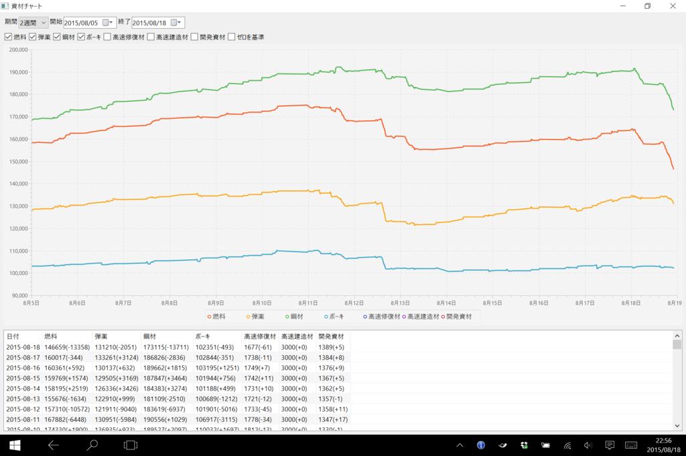

だらだら書いてる時間が取れないので、今回はメモ程度。難易度は乙。

旅行前にちょっと<b>直進（夜戦）ルート</b>（トドメに適していると言われている）と<b>迂回ルート</b>（削りに適していると言われる）を試してみたが、直進ルートの方で立て続けにボス B 勝利、S 勝利をとれたので、そっちを選択。支援艦隊が出したりといった手間がない（道中は夜戦なので無意味、決戦は到達率が低いのでもったいない）ので、仕事の片手間で艦隊を出せるというのも大きかった。

――が、蓋を開けてみれば53回出撃（うち、5回は迂回ルートを試した）、ボス10回到達（S勝利×4）という散々な結果だった(ノД`)・゜・。

まぁ、クリアできたからいいんだけど。

メンバーはこんな感じ。

<ul>
<li>金剛改二(Lv98)：主砲×2、夜偵、三式弾</li>
<li>榛名改二(Lv128)：主砲×2、夜偵、三式弾</li>
<li>比叡改二(Lv98)：主砲×2、夜偵、三式弾</li>
<li>最上改(Lv94)：主砲×2、瑞雲、三式弾</li>
<li>雪風改(Lv79)：探照灯×2、照明弾 or WG42</li>
<li>加賀改(Lv107)：艦戦×3、偵察機</li>
</ul>
ごり押しで行けばいつかクリアできる感じはあったのであまり気にしてなかったが、もう少し工夫できたか。

<ul>
<li>金剛改二(Lv98)：主砲×2、夜偵、三式弾</li>
<li>榛名改二(Lv128)：主砲×2、夜偵、三式弾</li>
<li>比叡改二(Lv98)：主砲×2、夜偵、三式弾</li>
<li>最上改(Lv94)：主砲×2、瑞雲、三式弾</li>
<li>千代田航改二(Lv96)：艦戦×2、艦爆、偵察機</li>
<li>加賀改(Lv107)：艦戦×2、艦爆、偵察機</li>
</ul>
最後だけ制空値が足りなかったので軽空母を入れた。

夜戦ルートを通った48回分の成績はこんな感じ。

B：46勝2敗 → E：40勝6敗 → G：10勝30敗

陣形は、単縦陣と複縦陣を比較すると、若干複縦陣の方が生存率が高いようだ（単横陣を2度、梯形陣を1度だけ試したが、あまり好きじゃないのでやめた）。

単縦陣 
E：25勝4敗 → G：6勝19敗（25%）

複縦陣 
E：13勝1敗 → G：4勝7敗（36%）

たらればだけど、すべて複縦陣で挑んでいたら37戦程度（10戦程度少なく）で終わったはず。それでも平均より<s>ちょっと</s>だいぶ多いみたいだけど。

ボス戦10戦はこんな感じ。

<ol>
<li>B	反航戦</li>
<li><b>S	同航戦</b></li>
<li><b>S	同航戦</b></li>
<li>A	同航戦</li>
<li><b>S	同航戦</b></li>
<li>A	反航戦</li>
<li>A	反航戦</li>
<li>D	反航戦</li>
<li>A	反航戦</li>
<li><b>S	Ｔ字戦(有利)</b></li>
</ol>
同航戦を引かないとしんどいのが分かる感じ。

榛名さん、ありがとう！　でも、ドロップはたいしたものがなかった……ここを掘る気はしないなぁ。

消費は燃料13k、弾薬2k、鋼材13k、ボーキ500（旅行前に編成を手探りした分は除く、30戦分ぐらいの消費）。まぁ、想定の範囲内って感じ。

来週末も用事あるし、ちゃんとイベント完遂できるか不安になってきた……。

