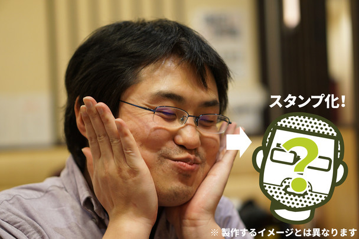
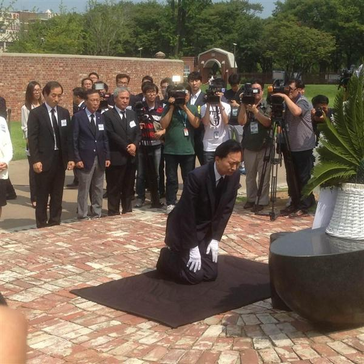

<i>「世界のフリー素材に、俺はなる！」</i>高い志を胸に始められた“柳 英俊（だるやなぎ）LINE スタンプ プロジェクト”はプログラマー界隈からの熱烈な支持を受け、またたくまに8万円を超える資金を得た。

<iframe src="//hatenablog-parts.com/embed?url=https%3A%2F%2Fmotion-gallery.net%2Fprojects%2Fdaruyanagi" title="柳 英俊（だるやなぎ）LINE スタンプ プロジェクト" class="embed-card embed-webcard" scrolling="no" frameborder="0" style="display: block; width: 100%; height: 155px; max-width: 500px; margin: 10px 0px;"><a href="https://motion-gallery.net/projects/daruyanagi">柳 英俊（だるやなぎ）LINE スタンプ プロジェクト</a></iframe>

しかし、順風満帆かと思われたプロジェクトに突如、暗雲が立ち込める。

<blockquote class="twitter-tweet" lang="HASH(0x85605a0)">
1ヶ月以上1円も投資されていません！！　残りあとわずか皆さんお金を捨てるつもりで応援してください！！　 柳 英俊（だるやなぎ）LINE スタンプ プロジェクト <a href="https://t.co/XJwqBTvLLB">https://t.co/XJwqBTvLLB</a> <a href="http://t.co/wYE7unljvC">pic.twitter.com/wYE7unljvC</a>
&mdash; ＪＺ５ (@jz5) <a href="https://twitter.com/jz5/status/630953630523244544">August 11, 2015</a></blockquote>

スタートダッシュでそこそこの資金を<s>だまし取った</s>獲得したものの、そこから伸び悩んでしまったのだ。

<blockquote class="twitter-tweet" lang="HASH(0x85605a0)">
死ん…でる <a href="http://t.co/TQE7DGWN5z">pic.twitter.com/TQE7DGWN5z</a>
&mdash; ＪＺ５ (@jz5) <a href="https://twitter.com/jz5/status/632416285725323266">August 15, 2015</a></blockquote>

<i>「俺の LINE スタンプなど、誰も欲していなかったのか……」</i>ショックを受け、倒れ伏すだるやなぎ。そこに颯爽と現れた敏腕プロデューサー  @jz5 が囁く。<i>「クラウドファンディングはスタートダッシュと締め切り間近が一番カネがあるまるんや……（ニヤリ」</i>

お願い、死なないでだるやなぎ！あんたが今ここで倒れたら、世界のフリー素材になる約束はどうなっちゃうの？ 締め切りまで日はまだ残ってる。ここを耐えれば、LINE スタンプをゲットできるんだから！

次回「だるやなぎ死す」。デュエルスタンバイ！

<h3>追記</h3>

<blockquote class="twitter-tweet" lang="HASH(0x85605a0)">
平和の土下座してきた <a href="http://t.co/glGywZiwg8">pic.twitter.com/glGywZiwg8</a>
&mdash; ハロー！！だるやなぎモザイク (@daruyanagi) <a href="https://twitter.com/daruyanagi/status/632420048552898560">August 15, 2015</a></blockquote>

残り3万円、どうかよろしくお願いいたします。

<h3>お詫びと訂正</h3>

土下座してお願いしたつもりでしたが、正しくは韓国の最敬礼「クンジョル」だったかもしれないです。僕にはよくわかんないので、とりあえずお詫びしておきます。

