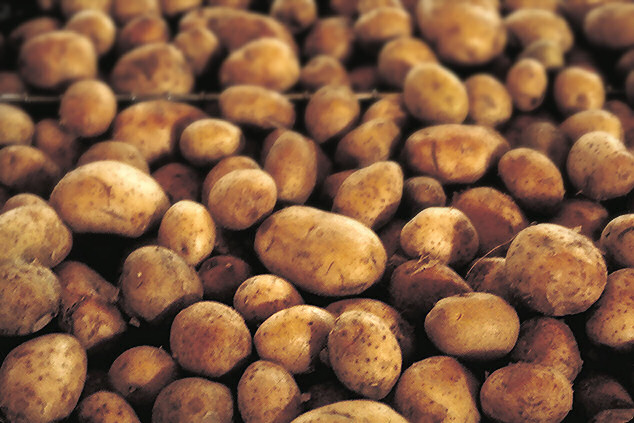
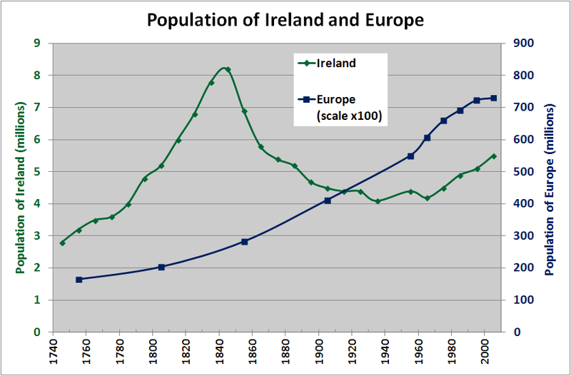
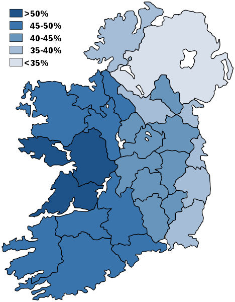
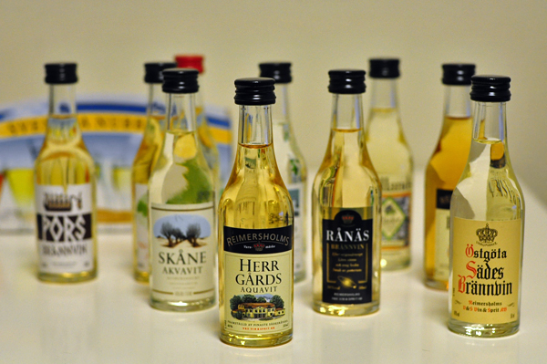

 

<blockquote cite="http://www.nikkei.com/article/DGXLASFS19H2K_Z10C15A8PP8000/">

　農林水産省は19日、ジャガイモやトマトなどの農作物を枯らす病害虫「ジャガイモシロシストセンチュウ」を北海道網走市内の数カ所の農場で確認したと発表した。農作物に大きな被害を与える恐れのある「重要病害虫」に指定されており、国内での確認は初めて。

　同害虫はインドや欧州、米国などに広く分布する線虫の一種で、国内への侵入経路は不明。農水省は「土壌の消毒を徹底するなどでまん延を防ぎ、価格への影響が出ないようにしたい」としている。

<cite><a href="http://www.nikkei.com/article/DGXLASFS19H2K_Z10C15A8PP8000/">&#x30B8;&#x30E3;&#x30AC;&#x30A4;&#x30E2;&#x67AF;&#x3089;&#x3059;&#x75C5;&#x5BB3;&#x866B;&#x3001;&#x56FD;&#x5185;&#x3067;&#x521D;&#x78BA;&#x8A8D; &#x5317;&#x6D77;&#x9053;&#x7DB2;&#x8D70; :&#x65E5;&#x672C;&#x7D4C;&#x6E08;&#x65B0;&#x805E;</a></cite>
</blockquote>

この前『魚で始まる世界史』という新書を読んだけど、これはジャガイモでもおんなじことが言えそうだなーとか思った。

<iframe src="https://hatenablog-parts.com/embed?url=https%3A%2F%2Fblog.daruyanagi.jp%2Fentry%2F2015%2F08%2F04%2F231815" title="『魚で始まる世界史: ニシンとタラとヨーロッパ』 - だるろぐ" class="embed-card embed-blogcard" scrolling="no" frameborder="0" style="display: block; width: 100%; height: 190px; max-width: 500px; margin: 10px 0px;"></iframe> 

<h3>そもそもジャガイモとは</h3>

<blockquote cite="https://ja.wikipedia.org/wiki/%E3%82%B8%E3%83%A3%E3%82%AC%E3%82%A4%E3%83%A2">

<b>ジャガイモ（馬鈴薯、英: potato、学名：Solanum tuberosum L.）</b>は、ナス科ナス属の植物。地下茎を食品として利用する。

ジャガイモは地下の茎の部分（塊茎）を食用にする。加熱調理して食べられるほかに、デンプン原料としても利用される。比較的保存がきく食材であるが、暗くても温度の高いところに保存すると発芽しやすいため、涼しい場所での保管が望ましい。芽や緑化した塊茎には毒性成分ポテトグリコアルカロイド（ソラニンなど）が多く含まれ中毒の元になる。

ジャガイモの原産は南米アンデス山脈の高地といわれる。16世紀には、スペイン人によりヨーロッパにもたらされた。このとき運搬中の船内で芽が出たものを食べて、毒にあたった為「悪魔の植物」と呼ばれた。日本には、1600年ごろにオランダ船によりジャカルタ港より運ばれた。日本では当時は観賞用として栽培されたという。

日本では北海道が最大の生産地で、夏の終わりから秋にかけて収穫される。九州の長崎では冬に植え付けて春に出荷する。

<cite><a href="https://ja.wikipedia.org/wiki/%E3%82%B8%E3%83%A3%E3%82%AC%E3%82%A4%E3%83%A2">&#x30B8;&#x30E3;&#x30AC;&#x30A4;&#x30E2; - Wikipedia</a></cite>
</blockquote>

ジャガイモの食べるところというのは、実は「茎」であって「根」ではない（中学校入試の問題とかで出てきそうなウンチクだな）。

「ナス科ナス属の植物」だっていうのは、まったく知らなかった。ナスの栄養はキュウリにも劣るそうだが、その点、ジャガイモはビタミンCやデンプンが豊富。ビタミンCは過熱で壊れやすいが、その点、ジャガイモならばでんぷんに保護されるから大丈夫だ。その上、寒冷地や痩せた土壌でも栽培しやすく、茹でる等の簡単な調理で食べることができる――ナスさん、ちょっとは見習った方がいいと思う。

<blockquote cite="http://d.hatena.ne.jp/asin/4532133262/bestylesnet-22">

「小麦の三倍の生産量がある」

<cite><a href="http://d.hatena.ne.jp/asin/4532133262/bestylesnet-22">国富論 国の豊かさの本質と原因についての研究(上)</a></cite>
</blockquote>

ジャガイモはペルー南部に位置するチチカカ湖の畔が発祥とされており、<b>インカ帝国</b>ではトウモロコシと並んで主食であったらしい。

欧州へ伝えられたのは、15世紀から16世紀頃。当初は植物学者が趣味で育てる程度だったが、17世紀、三十年戦争でプロイセン（ドイツ）が荒廃し、飢饉が頻発すると俄かに脚光を浴びるようになる。寒冷に強く、年に複数回の栽培が可能で、地中に作られることから鳥害や兵馬による踏みつけにも影響されないジャガイモは当時のプロイセンには打ってつけで、国王の勅命がなくともいずれ普及したことだろう。以後、<b>ドイツ人</b>はすっかりジャガイモ（とビール）の虜となってしまう。

もう一つ、ジャガイモスキーの民族として忘れてはいけないのが、<b>アイルランド人</b>だ。

1801年のグレートブリテンおよびアイルランド連合王国（舌噛みそうだ！）の成立以降、アイルランド島はロンドンの政府により植民地支配されていたが、イングランドのように製造業が発展せず、国民の大半は農業に依存していた。さらに、アイルランドでは兄弟全員で農地を分割相続していたため、農地の細分化と零細化が進んでいた。あぁ、食べるものすらねえ、どうしよう！

そこで目をつけたのが、ジャガイモ。ジャガイモならば庭先で育てられるし、自分の家の庭ならば地主に地代を納めなくてもよい。何より生産性が高い！　そんなわけで、ジャガイモはアイルランドの貧農の“主食”となった。19世紀半ばの時点で、人口の3割がジャガイモに食料を依存する状態になっていたという。また、アイルランド移民の手により北アメリカへ渡ったジャガイモは、アメリカ独立戦争における兵士たちの胃袋を満たす貴重な食料源にもなった。

しかし、そんなジャガイモを未曽有の出来事が襲う。1845年から1849年の4年間にわたってヨーロッパ全域でジャガイモの疫病が大発生し、壊滅的な被害を受けたのだ。<i>「ジャガイモがなければ、パンを食べればいいじゃない」</i>マリーなんとかネットであればそう言ったであろうし、実際、それで解決したであろう。しかし、ブリテン島に住むイングランド貴族にはそんな気がさらさらなかった。パンを分け与えてしまえば、収入が減ってしまうじゃないか！　こうして、アイルランドの貧農が飢える傍ら、アイルランドの農作物の輸出は続けられた（こういうやり方を“<b>飢餓輸出</b>”といったりする。本当に“飢餓輸出”が行われたかどうかの議論は決着していないが、ブレア首相は1997年に正式に謝罪している）。

結局、被支配層のアイルランド人から100万人以上の餓死・病死者を出す事態に。生き残った人々もアメリカ、イギリス、カナダ、オーストリアなどへと散っていった。とくにアメリカ合衆国に渡った移民はアメリカ社会で大きなグループを形成し（名字に「O'」「Mc」「Mac」とか付く人たちだ）、経済界や特に政治の世界で大きな影響力を持つようになった。そのなかには、ケネディ家の祖先も含まれている（オバマ大統領も母方の祖先がアイルランド人だ）。その一方、アイルランドの人口は激減。19世紀の人口に比べて20世紀の人口が減少した西欧では唯一の国となり、21世紀の現在でも<b>“大飢饉”</b>以前の人口を回復していない。

また、“大飢饉”の影響は人口減だけにとどまらなかった。

まず、<b>アイルランド人とイングランド人の間に決定的な軋轢が</b>生じた。プロテスタントによるカトリック教徒への迫害なども相まって（イングランドは新教国、アイルランドは旧教国）、アイルランドはグレートブリテンからの独立を図るようになっていく。

次に、犠牲者の多くが被支配層のアイルランド人であったため、<b>アイルランド語（ゲール語）話者が激減</b>。残ったアイルランド人も、その後の政策や生活上の便宜から次第に英語を話すようになった。今でもアイルランド語を話すのは「ゲールタハト」(Gaeltacht) と呼ばれる一部の地域に限られる（ただし、民族主義的な観点から公用語はいまだにアイルランド語で義務教育においては必修、交通標識や国号軍の号令などはアイルランド語で行われているという）。

<h3>まとめ</h3>

ちょっと強引にまとめると、

<ul>
<li>ジャガイモはインカ帝国の繁栄を築いた</li>
<li>ジャガイモは戦争で荒廃したドイツを復活させ、国民をジャガイモスキーにした</li>
<li>ジャガイモ不足でアイルランド人激減……
<ul>
<li>アイルランド人がイングランド人を嫌い、新大陸へ移民するきっかけになった</li>
<li>最近ようやくおとなしくなったけど IRA とか？</li>
<li>独立戦争のときに、兵士のごはんになった。たぶん今もそう</li>
<li>アイルランド語話者がほとんどいなくなった……</li>
</ul></li>
</ul>
みたいな感じ。

あと、ジャガイモで作ったアクアビットなんていうお酒もあるよね。このお酒はデンマーク・スウェーデン・ノルウェー・ドイツなどの“ジャガイモ共和国連邦”で作られている。

<ul>
<li><a href="https://ja.wikipedia.org/wiki/%E3%82%B8%E3%83%A3%E3%82%AC%E3%82%A4%E3%83%A2">&#x30B8;&#x30E3;&#x30AC;&#x30A4;&#x30E2; - Wikipedia</a></li>
<li><a href="http://www.newsweekjapan.jp/joyce/2014/06/post-79.php">&#x6B74;&#x53F2;&#x7684;&#x78BA;&#x57F7;&#x306E;&#x4E57;&#x308A;&#x8D8A;&#x3048;&#x65B9;&#x306F; | &#x30B3;&#x30EA;&#x30F3;&#x30FB;&#x30B8;&#x30E7;&#x30A4;&#x30B9; | &#x30B3;&#x30E9;&#x30E0; | &#x30CB;&#x30E5;&#x30FC;&#x30BA;&#x30A6;&#x30A3;&#x30FC;&#x30AF;&#x65E5;&#x672C;&#x7248; &#x30AA;&#x30D5;&#x30A3;&#x30B7;&#x30E3;&#x30EB;&#x30B5;&#x30A4;&#x30C8;</a></li>
<li><a href="http://www.independent.co.uk/news/blair-issues-apology-for-irish-potato-famine-1253790.html">http://www.independent.co.uk/news/blair-issues-apology-for-irish-potato-famine-1253790.html</a></li>
</ul>

