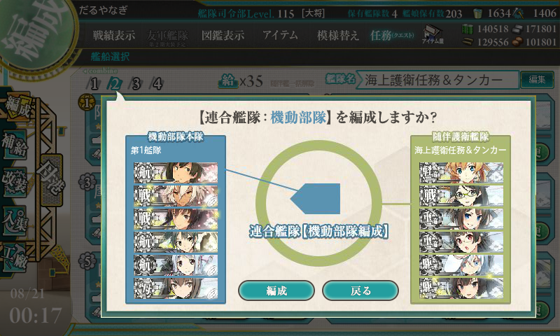
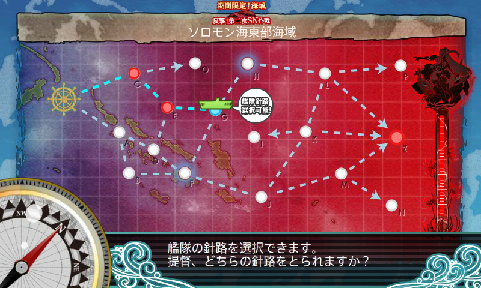
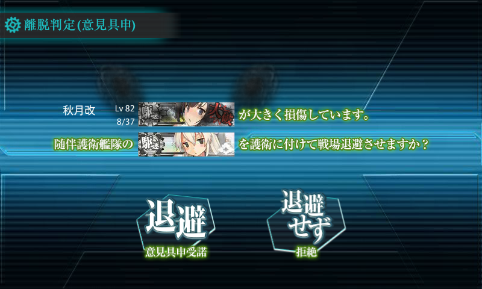
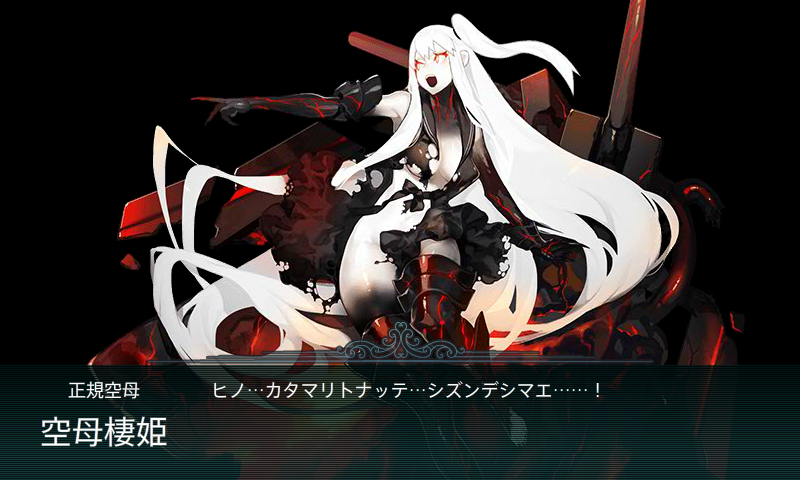
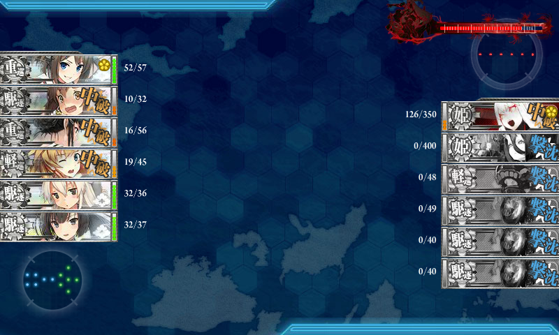
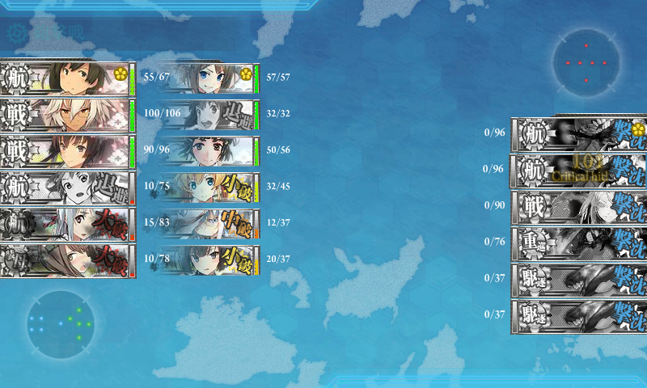
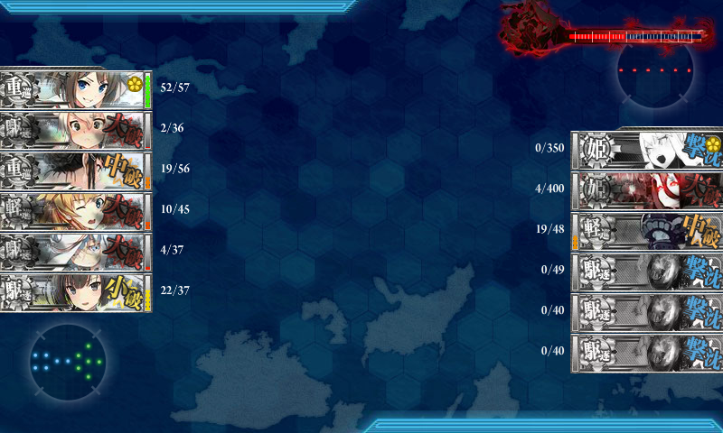
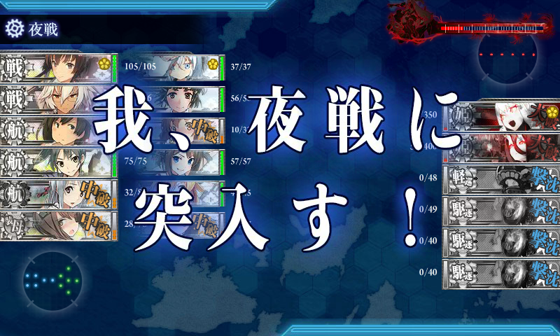
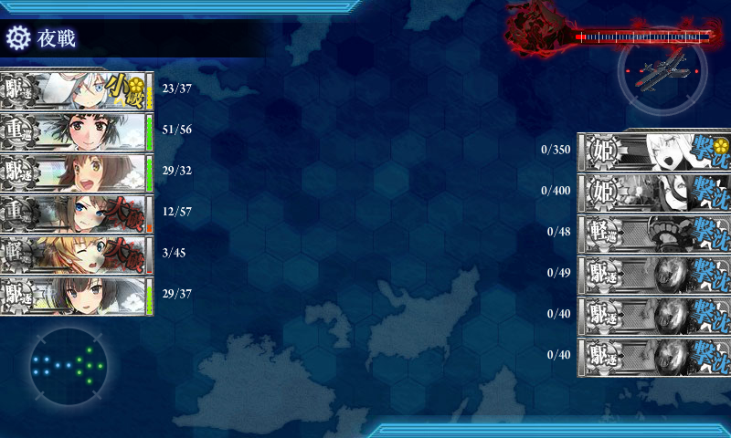
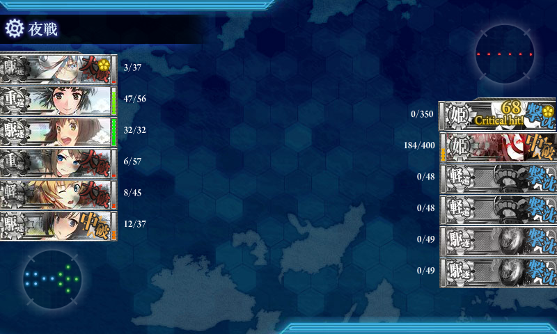

E6 ソロモン海東部海域を木曜日の晩にクリア。

高速戦艦を使いきっていて、機動部隊の第二艦隊に戦艦がいないという緊急事態に。

というわけで、難易度は【乙】に下げた。そのおかげか、割とすんなりクリアできたように思う。

<h3>マップと編成</h3>

 

<ul>
<li>第一艦隊
<ul>
<li>飛龍改二(Lv97)：艦隊司令部施設、のちにはずして順番も後ろに</li>
<li>武蔵改(Lv104)：徹甲弾</li>
<li>大和改(Lv100)：徹甲弾</li>
<li>瑞鶴改(Lv98)	</li>
<li>翔鶴改(Lv112)</li>
<li>大鳳改(Lv129)</li>
</ul></li>
<li>第二艦隊：順番はときどきイジった
<ul>
<li>阿武隈改二(Lv94)：甲標的＋連撃</li>
<li>妙高改(Lv88)：連撃＋夜戦道具（照明弾）＋夜偵</li>
<li>摩耶改(Lv93)：連撃＋対空カットイン＋夜偵</li>
<li>島風改(Lv84)：カットイン＋熟練見張り員＋夜偵</li>
<li>雪風改(Lv92)：カットイン＋熟練見張り員＋夜偵</li>
<li>秋月改(Lv82)：連撃＋対空カットイン＋夜戦道具（探照灯）</li>
</ul></li>
</ul>
第二艦隊に高速戦艦がいれられれば、もっと安定したと思う。

<h3>戦闘経過</h3>

C → E → G → H → L → Z。15戦出撃、10回ボス到達、S 勝利4回。

<table>
<tr>
<td> </td>
<td>C</td>
<td>E</td>
<td>H</td>
<td>L</td>
<td>Z</td>
<td>備考</td>
</tr>
<tr>
<td>1</td>
<td>S</td>
<td>B</td>
<td>B</td>
<td>S</td>
<td>A</td>
<td> </td>
</tr>
<tr>
<td>2</td>
<td>S</td>
<td>B</td>
<td>B</td>
<td>S</td>
<td>A</td>
<td> </td>
</tr>
<tr>
<td>3</td>
<td>S</td>
<td>B</td>
<td>B</td>
<td>S</td>
<td>S</td>
<td>決戦支援も出してみる</td>
</tr>
<tr>
<td>4</td>
<td>S</td>
<td>B</td>
<td>A</td>
<td>S</td>
<td>S</td>
<td> </td>
</tr>
<tr>
<td>5</td>
<td>S</td>
<td>B</td>
<td>C</td>
<td>S</td>
<td> </td>
<td> </td>
</tr>
<tr>
<td>6</td>
<td>S</td>
<td>B</td>
<td>B</td>
<td>S</td>
<td>A</td>
<td> </td>
</tr>
<tr>
<td>7</td>
<td>S</td>
<td>B</td>
<td>B</td>
<td>S</td>
<td>A</td>
<td> </td>
</tr>
<tr>
<td>8</td>
<td>S</td>
<td>A</td>
<td>B</td>
<td>S</td>
<td> </td>
<td> </td>
</tr>
<tr>
<td>9</td>
<td>S</td>
<td>B</td>
<td>B</td>
<td>S</td>
<td>A</td>
<td> </td>
</tr>
<tr>
<td>10</td>
<td>S</td>
<td>A</td>
<td>B</td>
<td>S</td>
<td>S</td>
<td>艦隊司令部施設の装備やめ。道中支援を出す</td>
</tr>
<tr>
<td>11</td>
<td>S</td>
<td> </td>
<td> </td>
<td> </td>
<td> </td>
<td> </td>
</tr>
<tr>
<td>12</td>
<td>S</td>
<td> </td>
<td> </td>
<td> </td>
<td> </td>
<td> </td>
</tr>
<tr>
<td>13</td>
<td>S</td>
<td>A</td>
<td>B</td>
<td>S</td>
<td>S</td>
<td> </td>
</tr>
<tr>
<td>14</td>
<td>S</td>
<td> </td>
<td> </td>
<td> </td>
<td> </td>
<td> </td>
</tr>
<tr>
<td>15</td>
<td>S</td>
<td>B</td>
<td>A</td>
<td>S</td>
<td>A</td>
<td>ゲージ破壊</td>
</tr>
</table>
最後の方でなぜか所詮撤退を強いられまくってハゲそうになった。

艦隊司令部施設のお世話になってみたけど、旗艦ボーナスの活用＋道中支援をちゃんと出すほうがよかったかもしれない。

ボスのみの戦績。

<ol>
<li>A	Ｔ字戦(有利) </li>
<li>A	同航戦 </li>
<li>S	反航戦：退避艦をだしていても運次第で S は十分とれる。でも、航空戦で空母を失ったりした場合は、司令部施設があっても撤退した方がいいと思った。 </li>
<li>S	同航戦：この後全艦沈める </li>
<li>A	反航戦 </li>
<li>A	同航戦 </li>
<li>A	反航戦（撮り忘れ）</li>
<li>S	同航戦 </li>
<li>S	反航戦 </li>
<li>A	同航戦：ラストはツ級軽巡が増える。夜戦戦力がちょっとキツかったけど「妙高」さんがスナイプしてくれた </li>
</ol>

