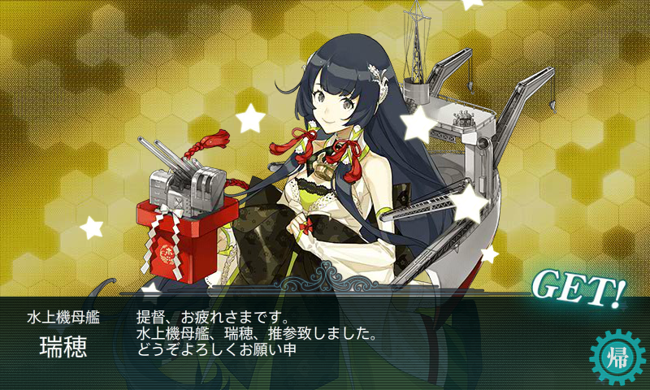

難易度乙。連合艦隊なので資源消費が少し辛いけど、ボス S 勝利は容易だったので、辛くはなかった感じ。

<iframe src="https://hatenablog-parts.com/embed?url=https%3A%2F%2Fblog.daruyanagi.jp%2Fentry%2F2015%2F08%2F12%2F180857" title="艦これ夏イベント2015：E3 南太平洋海域 - だるろぐ" class="embed-card embed-blogcard" scrolling="no" frameborder="0" style="display: block; width: 100%; height: 190px; max-width: 500px; margin: 10px 0px;"></iframe>

編成はクリア時とだいたい同じ（龍驤 → 祥鳳はレベル上げの都合と装備変更が面倒だったのデ。秋月 → 照月もレベル上げの都合）。装備だけ変えた。

<ul>
<li>第一艦隊
<ul>
<li>大和改(Lv113)：主砲×2＋水偵<b>＋徹甲弾</b></li>
<li>武蔵改(Lv113)：主砲×2＋水偵<b>＋徹甲弾</b></li>
<li>瑞鶴改(Lv107)</li>
<li>翔鶴改(Lv115)</li>
<li><b>祥鳳改(Lv96)</b></li>
<li>隼鷹改二(Lv97)</li>
</ul></li>
<li>第二艦隊
<ul>
<li><b>照月（Lv35）</b>：主砲＋主砲（高射装置つき）＋対空電探［対空カットイン］</li>
<li>雪風改(Lv90)：魚雷×3</li>
<li>鳥海改(Lv88)：主砲×2＋夜偵＋三式弾</li>
<li>摩耶改(Lv92)：主砲＋高角砲＋夜偵＋集中配備機銃［対空カットイン］</li>
<li>北上改(Lv125)：甲標的＋<b>副砲×2</b></li>
<li>阿武隈改二(Lv97)：甲標的＋<b>魚雷×2</b></li>
</ul></li>
</ul>
第一艦隊は三式弾を載せるよりも、徹甲弾で雑魚排除に専念したほうがよさげ。カットインが入ればボスにも割と攻撃が通るし、昼戦で終わることすらたまにあった。夜戦も「摩耶」まで回ることはほとんどなし。

33回出撃、ボス29回到達、S勝利27回。ごくまれに事故はあるけど、ほぼ確実にボス S 勝利がとれる（掘りでボス S 勝利がとれなかったケースは皆無だった。途中の事故は H マスで戦艦の直撃を食らった駆逐艦の大破が2回）。

<ol>
<li>龍驤</li>
<li><b>舞風</b></li>
<li>北上</li>
<li>高雄</li>
<li>最上</li>
<li><b>夕雲</b></li>
<li>川内</li>
<li>比叡</li>
<li>衣笠</li>
<li><b>浜風</b></li>
<li>飛鷹</li>
<li>高雄</li>
<li><b>夕雲</b></li>
<li>榛名</li>
<li><b>翔鶴</b></li>
<li>利根</li>
<li>北上</li>
<li>比叡</li>
<li>祥鳳</li>
<li>金剛</li>
<li>北上</li>
<li><b>翔鶴</b></li>
<li>霧島</li>
<li>霧島</li>
<li>最上</li>
<li>川内</li>
<li><b>瑞穂</b></li>
</ol>
翔鶴姉が2回でてちょっとビックリ。鶴姉妹がいない提督は「瑞穂」のついでに狙ってもいいカモ。

あとは「風雲」でおわり！

