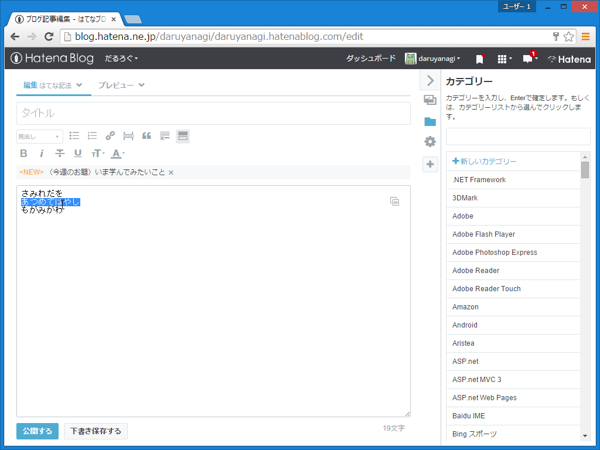
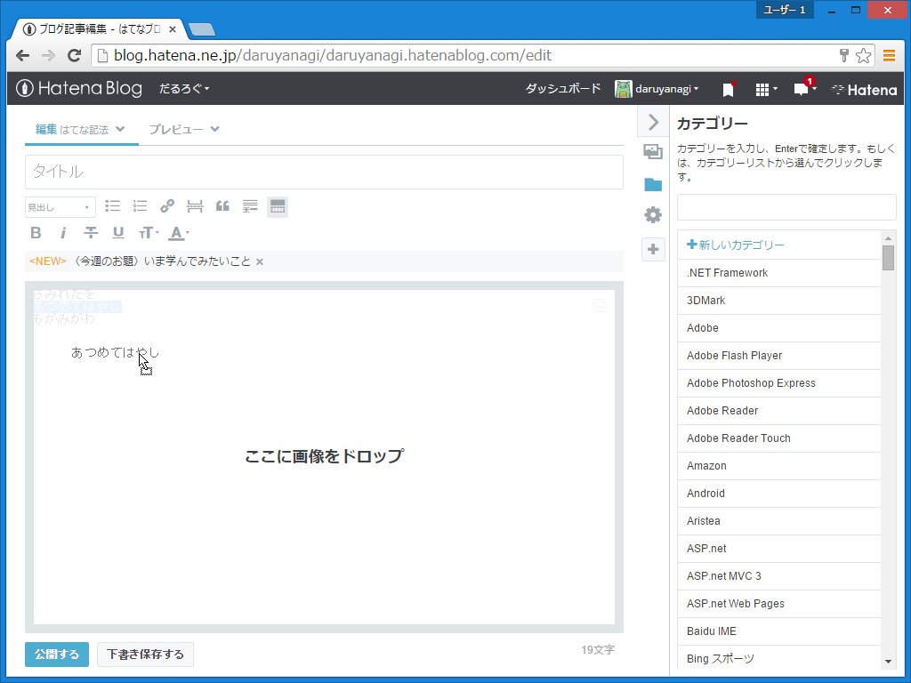
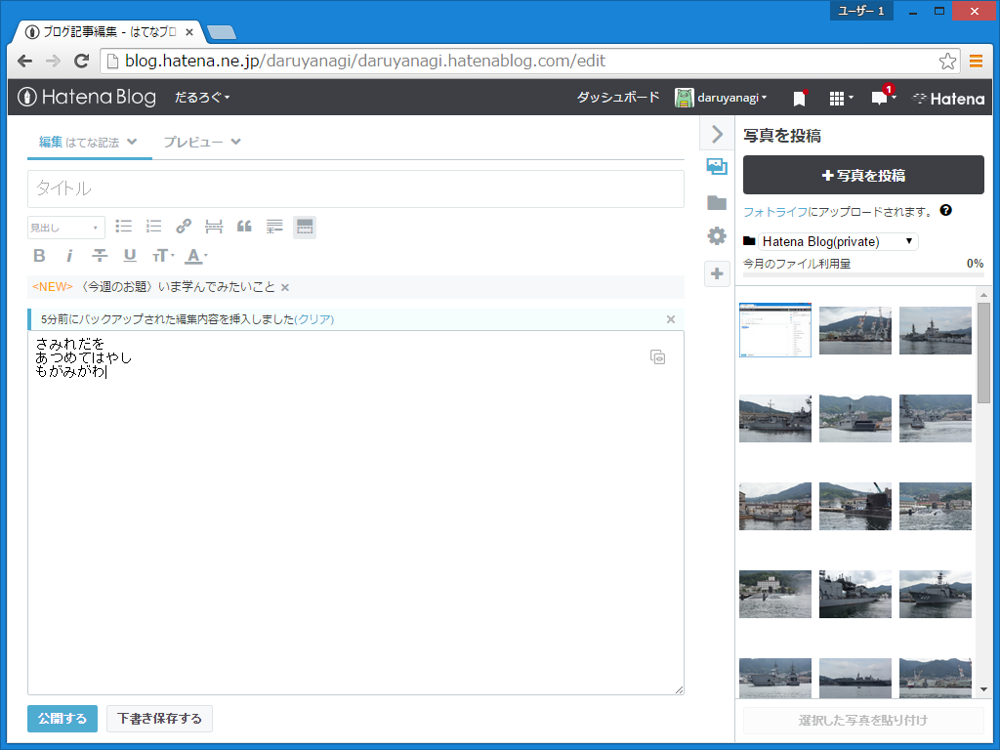
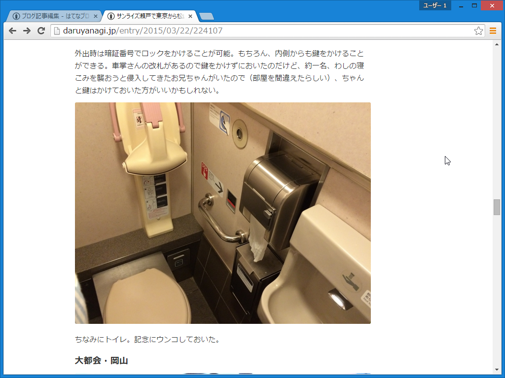
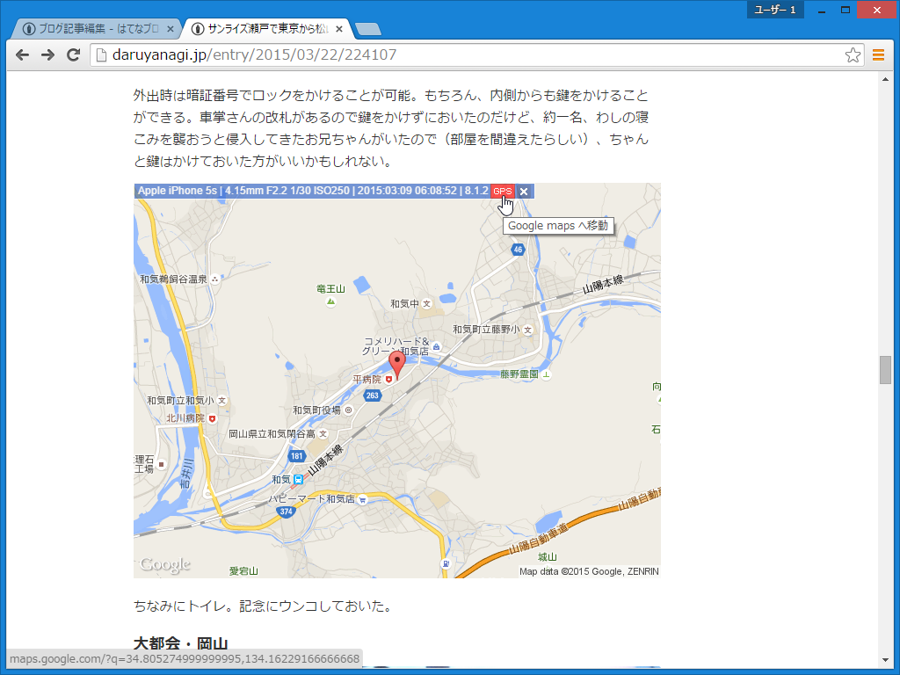

「はてなブログに○○すると○○してしまう不思議」というエントリーを書くと、はてなブログの開発チームが修正してくれると聞いて。

<iframe src="http://blog.ch3cooh.jp/embed/20150902/1441167879" title="【解決済み】はてなブログにメールで記事を投稿するとAmazonアソシエイトのIDが「hatena-blog-22」になってしまう不思議 - 酢ろぐ！" class="embed-card embed-blogcard" scrolling="no" frameborder="0" style="display: block; width: 100%; height: 190px; max-width: 500px; margin: 10px 0px;"><a href="http://blog.ch3cooh.jp/entry/20150902/1441167879">【解決済み】はてなブログにメールで記事を投稿するとAmazonアソシエイトのIDが「hatena-blog-22」になってしまう不思議 - 酢ろぐ！</a></iframe>

以下の不具合は、「Google Chrome 45」（Windows 64bit）で確認。

まず編集部にテキトーなテキスト（ここ笑うところやで）をカキカキする。そして、その一部（全部でもいいんだけど）を選択し、ドラッグ＆ドロップする。

すると、「ここに画像をドロップ」と表示され、テキストが編集できなくなる。

自分は文章を作るとき（書くときじゃなくて）、書くべきことを適当に書きだして、それをドラッグ＆ドロップで並べ直して接続詞や助詞で繋げながら整形する癖がある。まぁ、そんなことする奴なんて他にいないかもしれないが、「はてなブログ」だけそれができないのはすごく不便なので、お手すきのときに治していただけるとありがたい。来年も有料ライセンス更新するから。

ちなみに、リロードをして自動復元機能に頼るか、一度下書き保存して開きなおせば、またテキストを編集することができる（はず）。

<h3>ついでにお願い</h3>

<iframe src="http://staff.hatenablog.com/embed/2015/06/24/123000" title="「写真を投稿」機能を改善し、画像サイズを大きく、位置情報を削除するようにしました。また、無料ユーザーの写真容量を10倍に増量しました - はてなブログ開発ブログ" class="embed-card embed-blogcard" scrolling="no" frameborder="0" style="display: block; width: 100%; height: 190px; max-width: 500px; margin: 10px 0px;"><a href="http://staff.hatenablog.com/entry/2015/06/24/123000">「写真を投稿」機能を改善し、画像サイズを大きく、位置情報を削除するようにしました。また、無料ユーザーの写真容量を10倍に増量しました - はてなブログ開発ブログ</a></iframe>

自分は意図して写真に位置情報をつけているので、「はてなダイアリー」のサイドバーから写真をアップロードする際に位置情報を削除しない（そのままにする）オプションを追加してほしい。「はてなフォトライフ」にアップロードすればよいと案内されたけど、今まで簡単にできたことが面倒になるのはイヤだ。デフォルトで位置情報の削除を行うようにするのは、確かに正しいと思うけれどね。

（<a href="http://www.forest.impress.co.jp/docs/review/20140827_663833.html">&#x3010;&#x30EC;&#x30D3;&#x30E5;&#x30FC;&#x3011;&#x5199;&#x771F;&#x3078;&#x30DE;&#x30A6;&#x30B9;&#x30AA;&#x30FC;&#x30D0;&#x30FC;&#x3059;&#x308B;&#x3060;&#x3051;&#x3067;Exif&#x60C5;&#x5831;&#x3092;&#x30C1;&#x30A7;&#x30C3;&#x30AF;&#x3067;&#x304D;&#x308B;Chrome&#x62E1;&#x5F35;&#x300C;EXIF Viewer&#x300D; - &#x7A93;&#x306E;&#x675C;</a>）

位置情報のない写真なんて、給与明細をさらさない退職エントリーみたいで味気ない。

