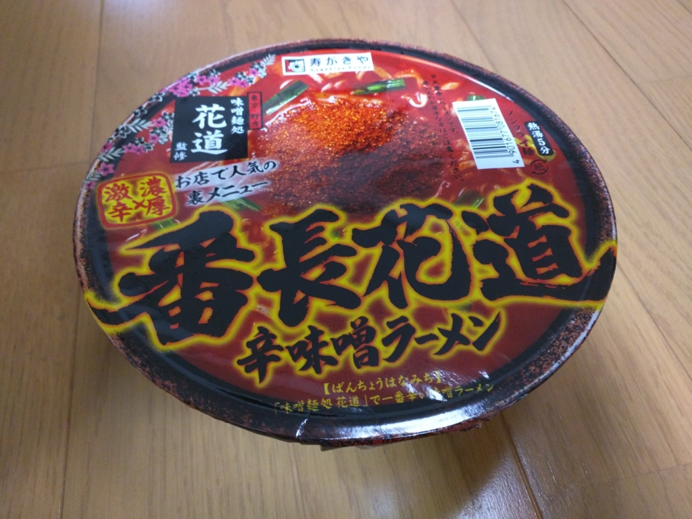
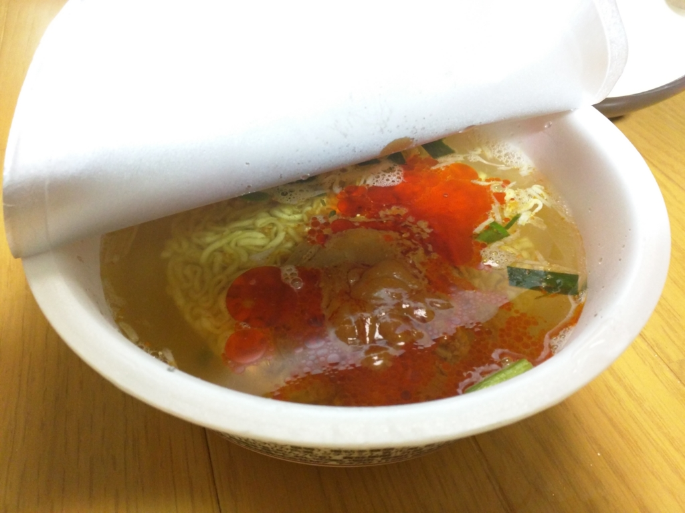
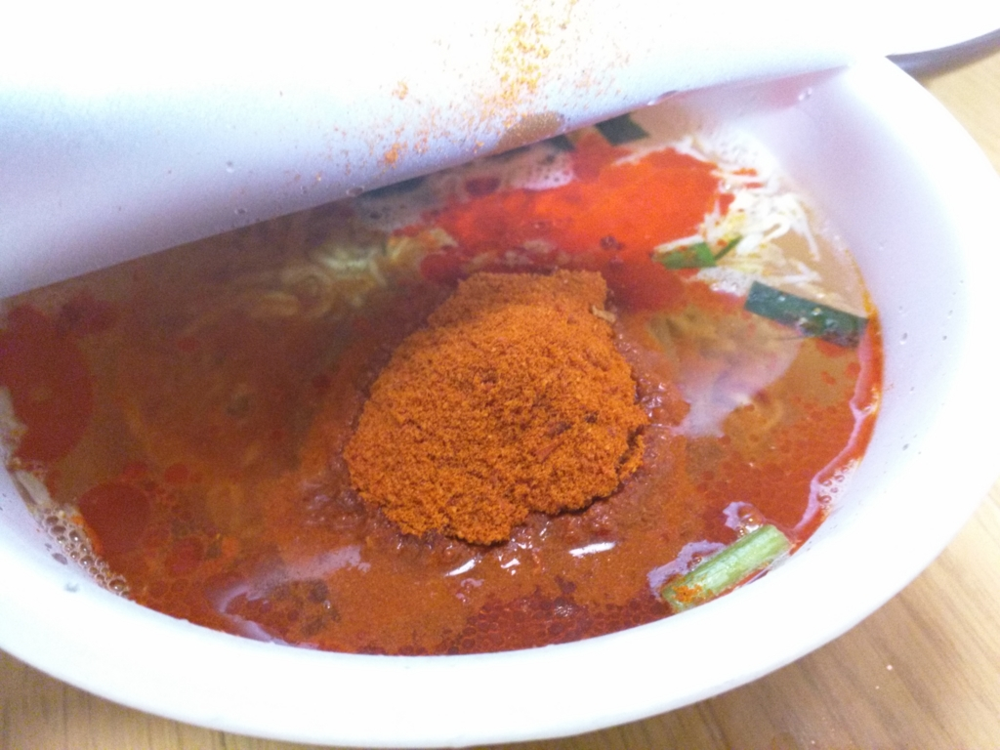
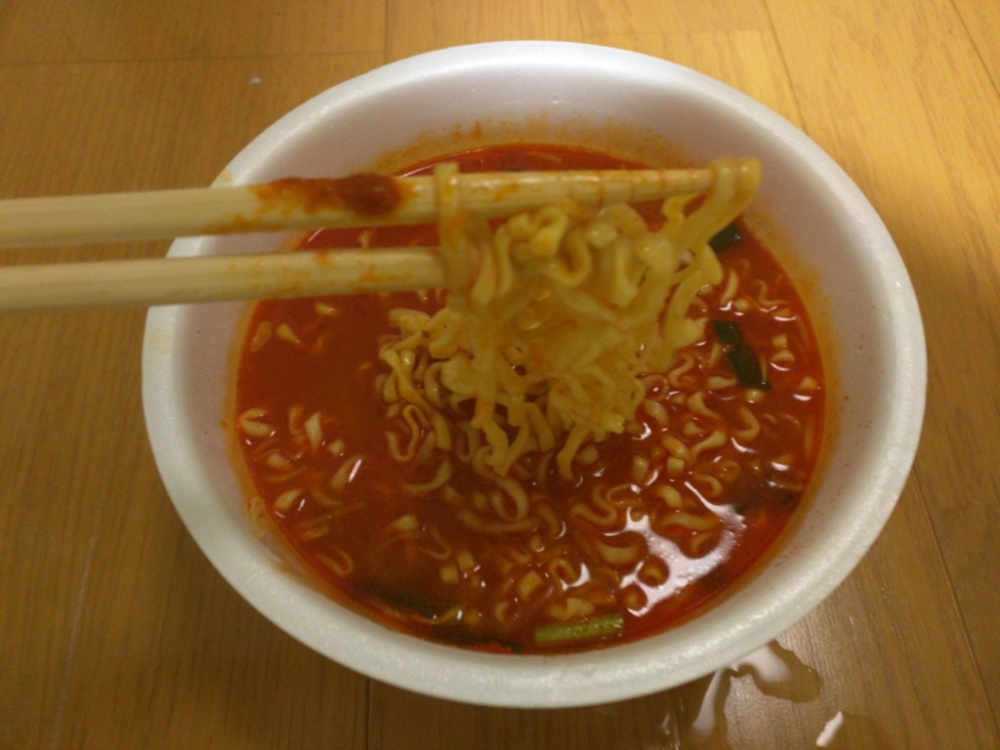

予告もなく突然、我が家にこれが1ケース（12個）送られてきた。<i>「食えるもんなら食ってみろ」</i>ってことらしい。「辛辛魚」ではポンポンが瀕死の憂き目にあったが、こいつはどんなもんだろうか。

<iframe src="https://hatenablog-parts.com/embed?url=https%3A%2F%2Fblog.daruyanagi.jp%2Fentry%2F2015%2F02%2F04%2F204808" title="「辛辛魚」が送られてきたので食べてみた。 - だるろぐ" class="embed-card embed-blogcard" scrolling="no" frameborder="0" style="display: block; width: 100%; height: 190px; max-width: 500px; margin: 10px 0px;"></iframe>

<iframe src="https://hatenablog-parts.com/embed?url=https%3A%2F%2Fblog.daruyanagi.jp%2Fentry%2F2015%2F02%2F10%2F003213" title="「辛辛魚」で死にかけた → リベンジ - だるろぐ" class="embed-card embed-blogcard" scrolling="no" frameborder="0" style="display: block; width: 100%; height: 190px; max-width: 500px; margin: 10px 0px;"></iframe>

まずはお湯を注いで、みそっぽいものを投入。一応みそラーメンなのかこれ。

次に粉末を投入。なんかあからさまに辛そうな色をしている。これはヤバい気がする。

5分待って完成。真っ赤なスープが血の池地獄のようだ。

けれど結論から言うと、見た目とは裏腹、「辛辛魚」よりも辛くは感じなかった。翌日下痢になることもなし。

とはいえ、フツーに辛い。三口ぐらい食べると全身からブワッと汗（加齢臭付き）が噴き出る感じ。スープを飲み干してぶはぁっと息を吐くと、唐辛子の香りがする。ヨガフレイムだ。

一方、麺はあまり印象に残らなかった。「辛辛魚」の方がモチっとした太麺だった印象。もしかしたらスープの違いでそう感じただけで、同じものかもしれないけれど。

見た目はイカついけど、実際に話してみると案外フレンドリーなヤクザかヤンキーのような風味だった。Amazon で☆付けるなら4つかなぁ。

<a href="http://www.amazon.co.jp/exec/obidos/ASIN/B00WFUW218/bestylesnet-22/">寿がきや 番長花道辛味噌ラーメン 150g×12個</a>
<ul><li>出版社/メーカー: 寿がきや食品</li><li>発売日: 2015/05/18</li><li>メディア: 食品&飲料</li><li><a href="http://d.hatena.ne.jp/asin/B00WFUW218/bestylesnet-22" target="_blank">この商品を含むブログ (1件) を見る</a></li></ul>

