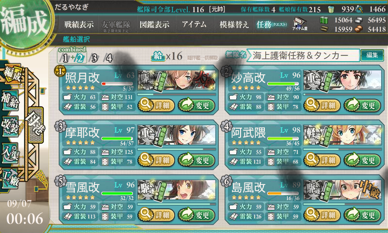
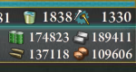

難易度【乙作戦】で M → Z 掘り。

<iframe src="https://hatenablog-parts.com/embed?url=https%3A%2F%2Fblog.daruyanagi.jp%2Fentry%2F2015%2F08%2F22%2F212652" title="艦これ夏イベント2015：E7 FS方面海域 - だるろぐ" class="embed-card embed-blogcard" scrolling="no" frameborder="0" style="display: block; width: 100%; height: 190px; max-width: 500px; margin: 10px 0px;"></iframe>

別のところでも書いたけど、編成はあまり変えていない感じ。

<blockquote cite="http://bushoojapan.com/kancolle/2015/09/06/58552">

E7 でゲットした「照月」のレベル上げをしたかったので、防空担当駆逐艦を「秋月」から「照月」にスイッチ。同様の理由で「龍驤」は下げて「祥鳳」を入れました。これでも制空は問題ないみたい。

<ul>
<li>第一艦隊
<ul>
<li>大和改(Lv113)：主砲×2＋水偵＋<b>徹甲弾</b></li>
<li>武蔵改(Lv113)：主砲×2＋水偵＋<b>徹甲弾</b></li>
<li>瑞鶴改(Lv107)</li>
<li>翔鶴改(Lv115)</li>
<li>祥鳳改(Lv96)</li>
<li>隼鷹改二(Lv97)</li>
</ul></li>
<li>第二艦隊
<ul>
<li><b>照月（Lv35）</b>：主砲＋主砲（高射装置つき）＋対空電探［対空カットイン］</li>
<li>雪風改(Lv90)：魚雷×3</li>
<li>鳥海改(Lv88)：主砲×2＋夜偵＋三式弾</li>
<li>摩耶改(Lv92)：主砲＋高角砲＋夜偵＋集中配備機銃［対空カットイン］</li>
<li>北上改(Lv125)：甲標的＋<b>副砲</b>×2</li>
<li>阿武隈改二(Lv97)：甲標的＋<b>魚雷</b>×2</li>
</ul></li>
</ul>
装備は第一艦隊の戦艦を【徹甲弾】に換装。取り巻きを確実に殲滅できるようにします。三式弾じゃないのでボスへのダメージという点では劣りますが、カットインが入れば昼砲撃戦でボスにも割とダメージが通るので問題なし。昼戦のみで戦闘が終わることすらたまにあるほどでした。仮に夜戦に持ち込まれても、4番目の「摩耶」まで攻撃巡が回ることはほとんどなく、ちゃんとS勝利がとれます。

一方、第二艦隊は北上を副砲装備にして命中率重視。逆に阿武隈は開幕雷撃の威力をあげるために魚雷をマシマシ。

<cite><a href="http://bushoojapan.com/kancolle/2015/09/06/58552">http://bushoojapan.com/kancolle/2015/09/06/58552</a></cite>
</blockquote>

クリア時も含めて73回出撃。M マス S 勝利は 43回。

 

<blockquote>

神通,なし,多摩,愛宕,なし,陽炎,なし,なし,なし,摩耶,なし,なし,時雨,多摩,荒潮,夕立,千歳,利根,球磨,朝潮,朝潮,霞,青葉,<b>浦風</b>,衣笠,なし,<b>浦風</b>,なし,なし,白露,なし,霰,長良,筑摩,なし,なし,那珂,五月雨,なし,荒潮,

</blockquote>

めぼしいのは浦風だけだった。浦風砲は割と溜まってるので、養殖するかどうか悩む……。

Z マス S 勝利はクリア時も含めて17回（意外に少ないなぁ！ 到達は36回らしいので、面倒でも決戦支援を出しておけばよかったかもしれない）。M マスを抜けられる確率が 3/4、さらに抜けた後 S 勝利をとれる確率が 1/2 って感じ。

 

<blockquote>

球磨,比叡,北上,榛名,高雄,阿武隈,日向,高雄,浜風,<b>谷風</b>,<b>巻雲</b>,<b>巻雲</b>,高雄,<b>島風</b>,<b>まるゆ</b>,妙高,<b>風雲</b>,

</blockquote>

掘ってる間はコモン艦しか出ねえと感じていたけれど、振り返ってみるとドロップは割と豪華だった。

<blockquote class="twitter-tweet" data-lang="ja">
イベント完了！！！！ <a href="http://t.co/5qNyxvhUPS">pic.twitter.com/5qNyxvhUPS</a>
&mdash; だるやなぎ に天使が舞い降りた！ (@daruyanagi) <a href="https://twitter.com/daruyanagi/status/640540268832272384?ref_src=twsrc%5Etfw">2015年9月6日</a></blockquote>

2015-09-07 00:00:17 無事ゲット。なんかキリのいい時間にアタックすると「風雲」をドロップするというオカルトがあったけど、狙ったわけではないが、うちも正時に落とせた。案外ウソでもないのかもね（たぶんただの偶然だと思うケド）。

みんなお疲れさま。「照月」のレベルが 63 まであがってて、笑ってしまった。気付けば「阿武隈」もケッコン間近。ほんとうに頑張ってくれました。みんな、もっと「阿武隈」の指示に従ってあげるべきだと思う。

<h3>おまけ</h3>

　→ 

