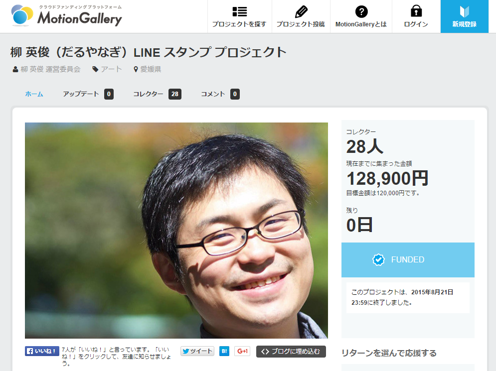

ある朝、目を覚ますといきなり始まっていた“<a href="https://motion-gallery.net/projects/daruyanagi">&#x67F3; &#x82F1;&#x4FCA;&#xFF08;&#x3060;&#x308B;&#x3084;&#x306A;&#x304E;&#xFF09;LINE &#x30B9;&#x30BF;&#x30F3;&#x30D7; &#x30D7;&#x30ED;&#x30B8;&#x30A7;&#x30AF;&#x30C8; </a>”ですが、このたび、皆様のご協力を得て、目標金額への到達を果たすことができました。本当にありがとうございました。そして、この喜び（と戸惑い、動揺、恐怖、呆れ）をどう表現していいのか分からず、お礼を申し上げるのが遅れてしまいましたことをお詫びいたします。

本プロジェクトがゴールできたのも、ひとえに皆様の“だるやなぎ”への熱い愛があればこそ。ご支援をいただきました28人の方々には厚く御礼申し上げます（以下に挙げますお名前は順不同です）。

<ul>
<li><a href="http://shibayan.jp">&#x3057;&#x3070;&#x3084;&#x3093;</a> さま</li>
<li><a href="http://twitter.com/karamem0">karamem0</a> さま</li>
<li>（希望しない）さま</li>
<li>（掲載する名前については希望しません。）さま</li>
<li>Takekazu Omi さま</li>
<li><a href="http://nohako.hatenablog.com">&#x306E;&#x306F;&#x3053;</a> さま</li>
<li>あたご さま</li>
<li><a href="http://bonprosoft.com">&#x307C;&#x3093;&#x3077;&#x308D;</a> さま</li>
<li><a href="http://blog.hamamotsu.jp">&#x306F;&#x307E;&#x3082;&#x3064;</a> さま</li>
<li>@miso_soup3 さま</li>
<li><a href="http://twitter.com/tsuwabuki_">tsuwabuki</a> さま</li>
<li>クズ肉 さま</li>
<li><a href="http://twitter.com/okuzawats">okuzawats</a> さま</li>
<li><a href="http://erion1107.hatenablog.com">ERION1107</a> さま（Twitter: @erion1107）</li>
<li>めんたろ さま</li>
<li>@garicchi さま</li>
<li><a href="http://aka.ms/chack">&#x30C1;&#x30E3;&#x30C3;&#x30AF;</a> さま</li>
<li>返答のない11名の方々</li>
</ul>
正直なところ<i>「こんなプロジェクトにお金払うなら、赤十字かユニセフにでも募金してあげた方が世界のためなのではないか」</i>と思わないでもないのですが、皆様から寄せられた想いを無駄にするわけにはまいりません。これを機に“フリー素材”として粉骨砕身、東奔西走、精励恪勤、奮励努力していく決意を改め、一人でも多くの方に“だるやなぎ”を使っていただけますよう、そして世界に“フリー素材”が広げるために力を尽くしてまいる所存です。

さぁ、みなさんも私と一緒に<i>「レッツ、フリー素材！」</i>

なお、LINE スタンプは目下、鋭意作成中。上級コース向けの特典・だるやなぎ手形もぶりぶり量産しているところです。お楽しみに！

<iframe src="https://hatenablog-parts.com/embed?url=https%3A%2F%2Fblog.daruyanagi.jp%2Fentry%2F2015%2F08%2F19%2F164112" title="助けて！　&quot;柳 英俊（だるやなぎ）LINE スタンプ プロジェクト”が息をしてないの！ - だるろぐ" class="embed-card embed-blogcard" scrolling="no" frameborder="0" style="display: block; width: 100%; height: 190px; max-width: 500px; margin: 10px 0px;"></iframe>

