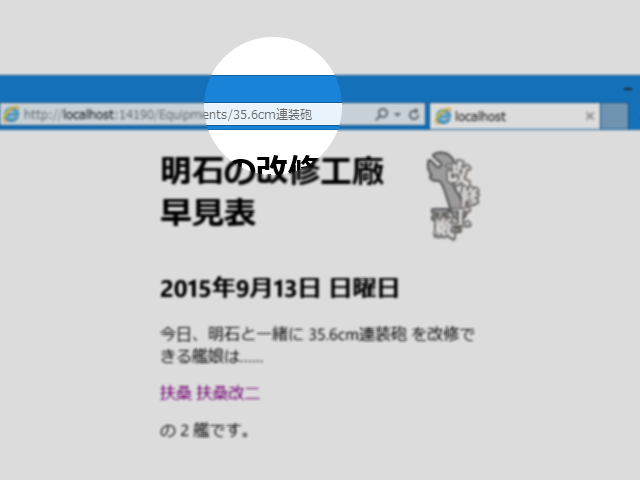

Wiki エンジンなんかを作るときなど、「ドット（.）」を URL に含めたい場合は、Web.config に一行、以下のように加えるといいみたい。

<pre class="code lang-xml" data-lang="xml" data-unlink>&lt;?xml version=&quot;1.0&quot; encoding=&quot;UTF-8&quot;?&gt;
&lt;configuration&gt;
&lt;system.webServer&gt;
&lt;modules runAllManagedModulesForAllRequests=&quot;true&quot; /&gt;
&lt;/system.webServer&gt;
&lt;/configuration&gt;
</pre>
静的リソースまでアプリケーションで処理するようになる（？）ので、効率が悪そうだけど。もっとちゃんと対策したければ、以下の URL が参考になりそう。

<iframe src="//hatenablog-parts.com/embed?url=http%3A%2F%2Fstackoverflow.com%2Fquestions%2F11728846%2Fdots-in-url-causes-404-with-asp-net-mvc-and-iis" title="Dots in URL causes 404 with ASP.NET mvc and IIS" class="embed-card embed-webcard" scrolling="no" frameborder="0" style="display: block; width: 100%; height: 155px; max-width: 500px; margin: 10px 0px;"></iframe>

