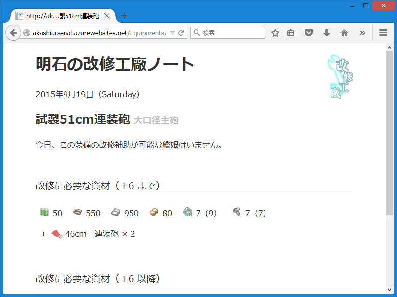
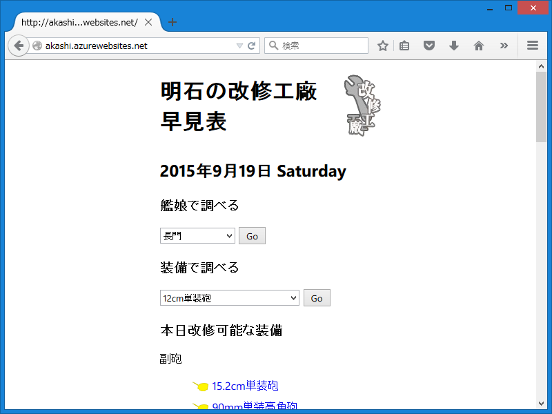
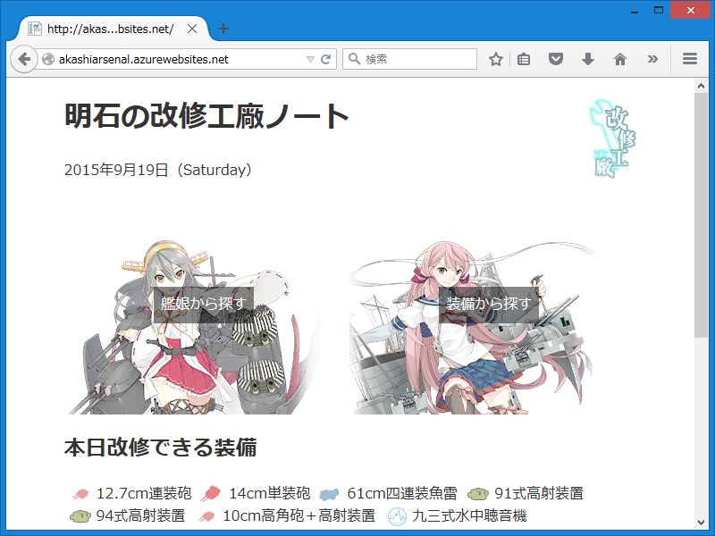

今週は超忙しい＆体調がよろしくなかった“ので”、合間を見つけて前々からほしかった改修工廠の早見表を作ってみた。接続詞が間違っているというツッコミが入りそうだけど、こういうのって、そういうときにこそやりたくならない？

<h3>最初に作ったヤツ</h3>

ASP.NET Web Pages ＋ SQL Server Compact で作ってみたけど、だいぶ遅かった。遅いのは多分、自分が SQL わかってないせいだと思う（SELECT でごっそりとってきたデータを LINQ で加工するとかいうわけのわからないことをやっていた）。SQL が分かんないのは一朝一夕に改善できないので、とりあえずデータベースへの問い合わせ結果をキャッシュしまくってみたけれど、スタートアップの遅さは改善できない。Web サイトがスタンバイ（スリープ？　なに？）したら、キャッシュを一から再構築しなきゃいけないのも困った。

――というわけで、廃棄する予定。

<ul>
<li><a href="http://akashi.azurewebsites.net/">http://akashi.azurewebsites.net/</a></li>
</ul>

<h3>二番目に作ったヤツ</h3>

で、ちょっと考えてみたんだけど、こういうデータっていうのは稀にあるサーバーのメンテナンスのときにしか更新されないわけだ。だったら、なにもデータベースに入れる必要はなかった（CURD のうち R しかやらへんやん？）。JSON か何かでデータを用意しておいて、サーバーのスタートアップ時に読み込めばいい。

俺ってアホだなーと思いながら、ぐちゃぐちゃっと今日半日で作ったら（ロジック組むより、データ打ち込む方がよっぽど時間かかった）、最初に作ったヤツよりだいぶ早くて満足。コードを整理しながらロジック見直せばもうちょっと早くなりそう。なんせ今のは cshtml に foreach が腐るほど埋まってるという正真正銘のクソコードだし……ちょうどいいから今度 GitHub にあげて、GitHub Flow ってのを勉強するネタにしようと思う。

<ul>
<li><a href="http://akashiarsenal.azurewebsites.net/">http://akashiarsenal.azurewebsites.net/</a></li>
</ul>
ほんとうはこれを Windows Phone に移植しておでコンに出したかったけれど、いつの間にか締め切り過ぎてたみたい。残念。艦これ Android 版が出るらしいし、Android アプリにするのもアリかなぁ？　

