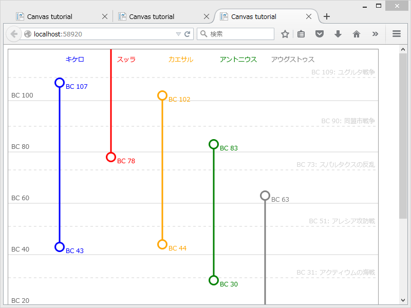

<iframe src="https://hatenablog-parts.com/embed?url=https%3A%2F%2Fblog.daruyanagi.jp%2Fentry%2F2014%2F05%2F27%2F032655" title="ただの日記： HTML5 Canvas に挑戦したった。 - だるろぐ" class="embed-card embed-blogcard" scrolling="no" frameborder="0" style="display: block; width: 100%; height: 190px; max-width: 500px; margin: 10px 0px;"></iframe>

むかし HTML5 Canvas で年表っぽいの作りたいなぁ、って思って一度挑戦したのだけど……すごい、もう一年経ってた。そら、加齢臭も増しますわ。

コーディングは WebMatrix でやったけれど、いまだに JavaScript をいい感じにコンポーネント化するやり方が分かってない(;´･ω･)

前と違うのは縦書きである点だけど、HTML は横に広がるより縦に広がる方が読みやすい気がした。あと、デザイン……センスないのどうやったら改善されるんだろう？

<pre class="code lang-javascript" data-lang="javascript" data-unlink>&lt;script src=&quot;~/Scripts/Chronology.js&quot;&gt;&lt;/script&gt;
&lt;script&gt;
var graph_settings1 = {
:
}

window.onload = function () {
chronology('graph', graph_settings1);
};
&lt;/script&gt;
</pre>
ってな感じで使える気がする。ロゴ云々はキニシナイデ。最初はそれぞれのアイテムにロゴをもたせて、名前の代わりにロゴをレンダリングしてやろうと思ったのだけど、なんかいろいろ難しくてやめた。

<h3>テスト1：三国志の年表</h3>

 

<pre class="code lang-javascript" data-lang="javascript" data-unlink>var graph_settings2 = {
&quot;begin_year&quot;: 190,
&quot;end_year&quot;: 290,
&quot;scale&quot;: 5,
&quot;margin&quot;: 6,
&quot;items&quot;: [
{ &quot;name&quot;: &quot;魏&quot;, &quot;start&quot;: 220, &quot;end&quot;: 265, &quot;color&quot;: &quot;blue&quot; },
{ &quot;name&quot;: &quot;呉&quot;, &quot;start&quot;: 222, &quot;end&quot;: 280, &quot;color&quot;: &quot;red&quot; },
{ &quot;name&quot;: &quot;蜀&quot;, &quot;start&quot;: 221, &quot;end&quot;: 263, &quot;color&quot;: &quot;orange&quot; },
{ &quot;name&quot;: &quot;晋&quot;, &quot;start&quot;: 265, &quot;end&quot;: 316, &quot;color&quot;: &quot;green&quot; },
{ &quot;name&quot;: &quot;後漢&quot;, &quot;start&quot;: 23, &quot;end&quot;: 220, &quot;color&quot;: &quot;gray&quot; },
],
&quot;events&quot;: [
{ &quot;name&quot;: &quot;黄巾の乱&quot;, &quot;year&quot;: 184 },
{ &quot;name&quot;: &quot;赤壁の戦い&quot;, &quot;year&quot;: 208 },
{ &quot;name&quot;: &quot;夷陵の戦い&quot;, &quot;year&quot;: 221 },
{ &quot;name&quot;: &quot;五丈原の戦い&quot;, &quot;year&quot;: 234 },
{ &quot;name&quot;: &quot;高平陵の変&quot;, &quot;year&quot;: 249 },
{ &quot;name&quot;: &quot;公孫淵滅亡&quot;, &quot;year&quot;: 238 },
]
};
</pre>

<h3>テスト2：共和制ローマ末期（紀元前のテスト）</h3>

 

<pre class="code lang-javascript" data-lang="javascript" data-unlink>var graph_settings3 = {
&quot;begin_year&quot;: -120,
&quot;end_year&quot;: 20,
&quot;scale&quot;: 5,
&quot;margin&quot;: 6,
&quot;graduation&quot;: 20,
&quot;items&quot;: [
{ &quot;name&quot;: &quot;キケロ&quot;, &quot;start&quot;: -107, &quot;end&quot;: -43, &quot;color&quot;: &quot;blue&quot; },
{ &quot;name&quot;: &quot;スッラ&quot;, &quot;start&quot;: -138, &quot;end&quot;: -78, &quot;color&quot;: &quot;red&quot; },
{ &quot;name&quot;: &quot;カエサル&quot;, &quot;start&quot;: -102, &quot;end&quot;: -44, &quot;color&quot;: &quot;orange&quot; },
{ &quot;name&quot;: &quot;アントニウス&quot;, &quot;start&quot;: -83, &quot;end&quot;: -30, &quot;color&quot;: &quot;green&quot; },
{ &quot;name&quot;: &quot;アウグストゥス&quot;, &quot;start&quot;: -63, &quot;end&quot;: 14, &quot;color&quot;: &quot;gray&quot; },
],
&quot;events&quot;: [
{ &quot;name&quot;: &quot;アクティウムの海戦&quot;, &quot;year&quot;: -31 },
{ &quot;name&quot;: &quot;アレシア攻防戦&quot;, &quot;year&quot;: -51 },
{ &quot;name&quot;: &quot;同盟市戦争&quot;, &quot;year&quot;: -90 },
{ &quot;name&quot;: &quot;スパルタクスの反乱&quot;, &quot;year&quot;: -73 },
{ &quot;name&quot;: &quot;ユグルタ戦争&quot;, &quot;year&quot;: -109 },
]
};
</pre>
紀元前0年が発生するのは気にしないことにする（ぉ

