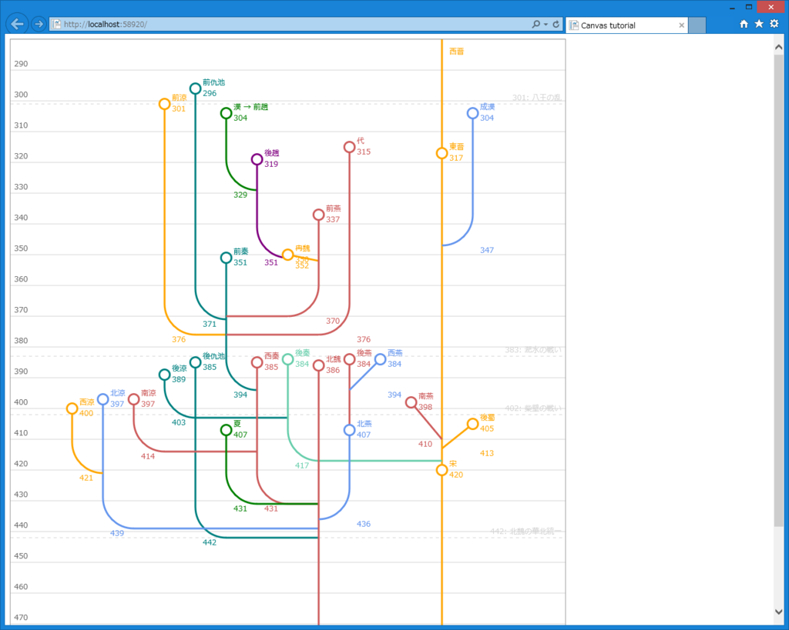

<iframe src="https://hatenablog-parts.com/embed?url=https%3A%2F%2Fblog.daruyanagi.jp%2Fentry%2F2015%2F09%2F22%2F171205" title="一年ぶり： HTML5 Canvas に挑戦したった。 - だるろぐ" class="embed-card embed-blogcard" scrolling="no" frameborder="0" style="display: block; width: 100%; height: 190px; max-width: 500px; margin: 10px 0px;"></iframe>

気分がのってきたので、昨日のスクリプトを改造して王朝の興亡を表せるようにしてみた。世界史の鬼門、五胡十六国・南北朝時代もスッキリ。一応、民族ごとに色分けもしてある。五胡十六国の口火を切った匈奴が少案外ない（前趙ぐらい）のと、氐と鮮卑系の活躍が目立つ。まぁ、鮮卑は○×部ってのがいっぱいあったから多少はね？

ハードコーディングしているところもあるし、年号を書き込む場所なんかに改良の余地があるけど、まぁ、満足した。

