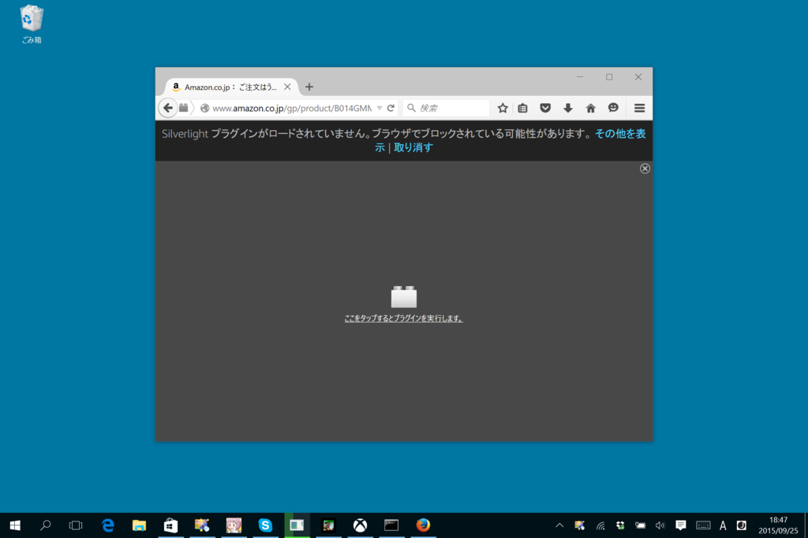
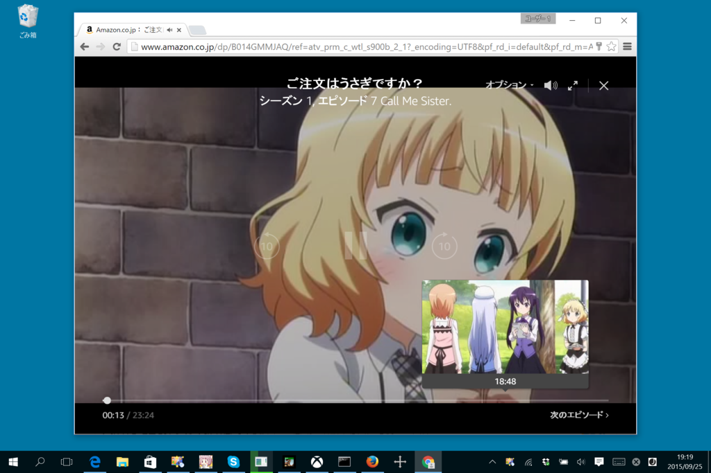
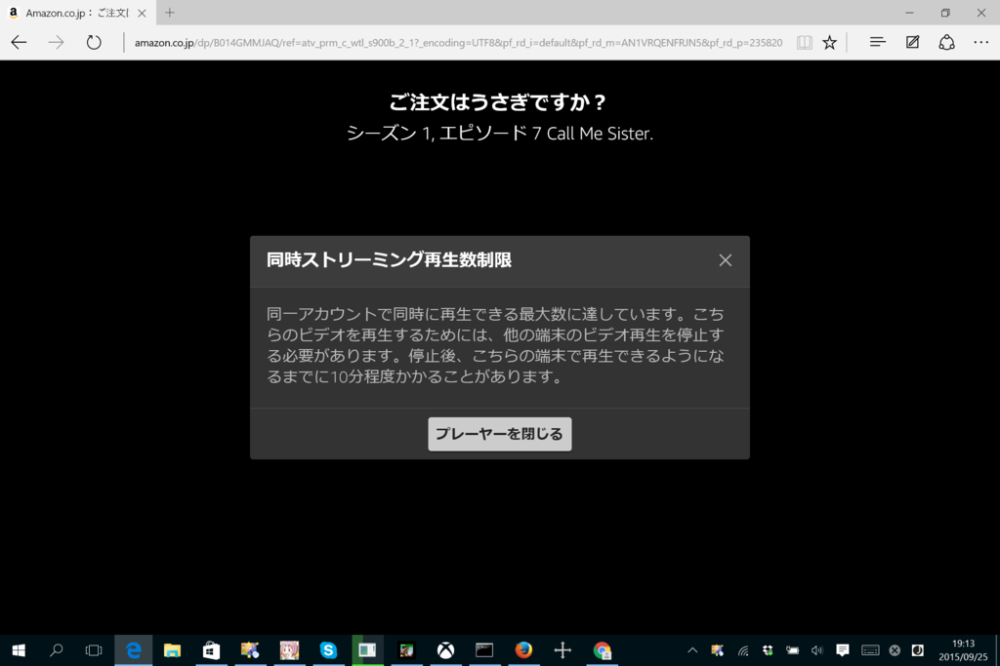

Amazon プライムの会員なら見放題の「プライム・ビデオ」が利用できるようになっていたので、さっそく「Firefox」で鑑賞してみた……ら Silverlight を使っててちょっと笑った。著作権保護周りでの理由なのかな？　こんなところで Silverlight を見るとは思わなかった。

<iframe src="//hatenablog-parts.com/embed?url=http%3A%2F%2Fit.srad.jp%2Fstory%2F15%2F07%2F05%2F0012241%2F" title="Microsoft、Silverlightの使用中止を推奨 | スラド IT" class="embed-card embed-webcard" scrolling="no" frameborder="0" style="display: block; width: 100%; height: 155px; max-width: 500px; margin: 10px 0px;"></iframe>

“Click to Play”でコンテンツがブロックされるが、クリックして解除すれば動画の再生は可能。許可サイトに入れておかないと、次の動画を自動で再生できないみたい。まぁ、「天下の Amazon だし、マズいことになならないだろう」と思うならば、常に再生するようにしておいてもよいかも。

「Google Chrome」は、普通に“video”要素で再生していた。

Silverlight のプレーヤーと違ってシークバーでシーンをプレビューできるのがカッチョいい。

「Internet Explorer」「Microsoft Edge」の場合も「Google Chrome」と同様“video”要素で再生されるが、なぜかビデオのスクリーンショットが撮れない。

ラインナップの充実度は……正直まだよくわからないが、とりあえず『ごちうさ』が見れたので満足。海外ドラマだったら Hulu の方が充実しているかもだけど、そういうのを見ないならば解約しちゃってもいいかなぁ、なんて思い始めた（Netflix はクレカ情報入力するのが面倒でまだ観てない）。

<iframe src="//hatenablog-parts.com/embed?url=http%3A%2F%2Fwww.amazon.co.jp%2Fb%3Fie%3DUTF8%26node%3D3535604051" title="Amazon.co.jp: プライム・ビデオ: Amazon ビデオ" class="embed-card embed-webcard" scrolling="no" frameborder="0" style="display: block; width: 100%; height: 155px; max-width: 500px; margin: 10px 0px;"></iframe>

<h3>おまけ</h3>

遊び過ぎた。

