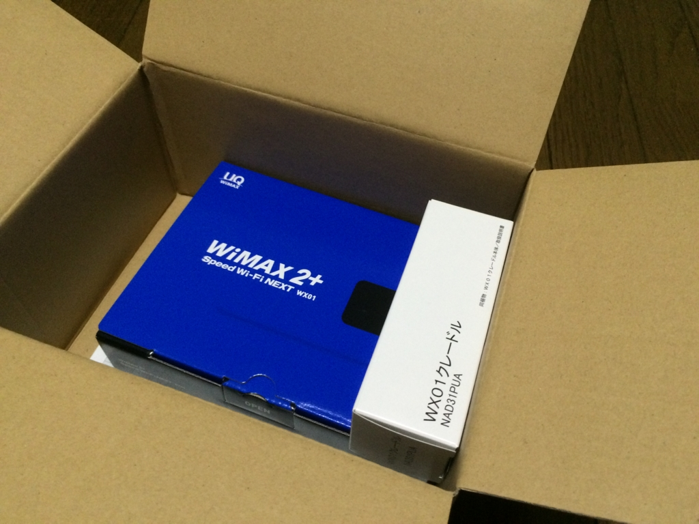
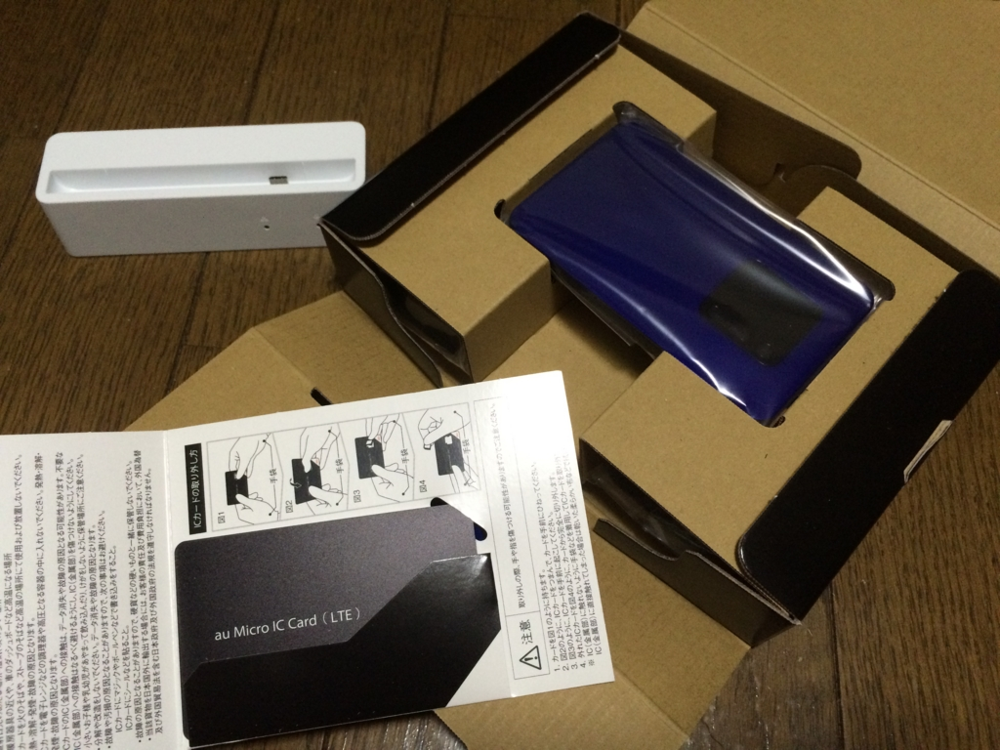
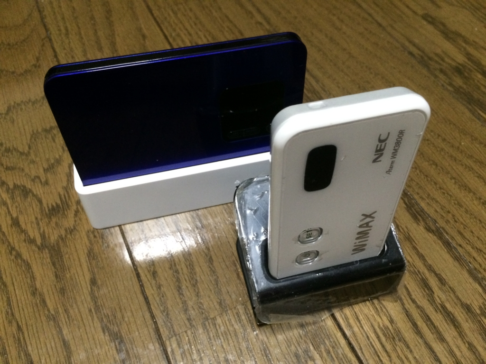
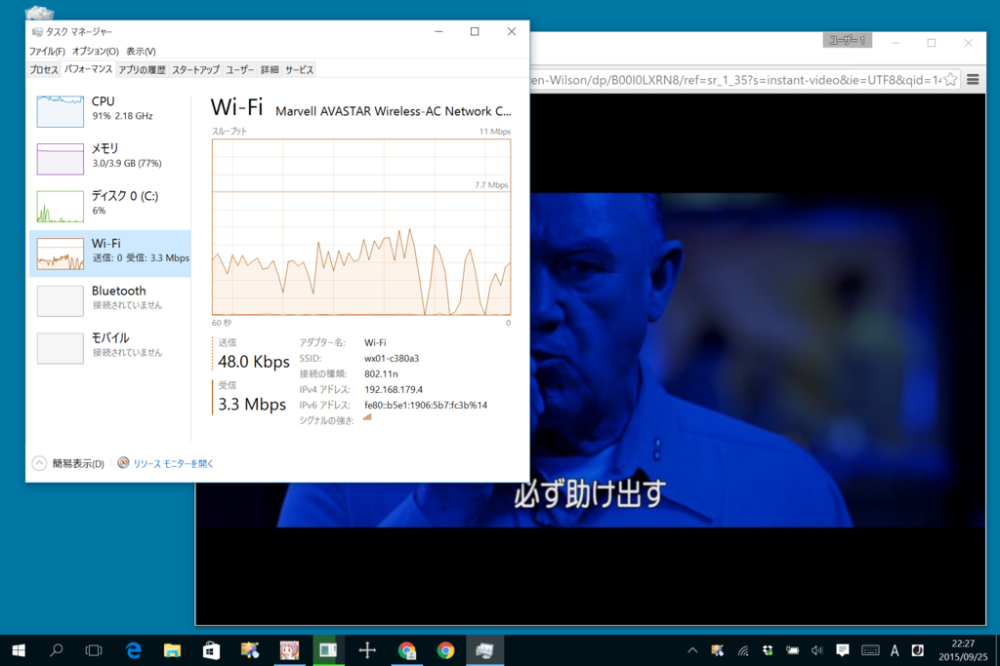

親父が「出張行ったときにネットにつなげられるようにしてほしい（意訳：モバイルルーターがほしい」というので、ウチでは“GMOとくとくBB”で WiMAX ルーターを契約している（料金はなぜか俺が払っている！！　しかも、今は使わずに放置してある！！　仕方ないのでウチのセカンド回線になっとる！！）。

本題に入る前に一言言っておくが、<b>ここはけっして契約すべきではない。</b>メールを読み逃すと3万円のキャッシュバックが得られない、郵送じゃないと解約できない（<b>解約するときは着払いで送ってやろうと思う</b>）、しかも20日を超えると翌月も契約が更新される（<b>解約月を逃したらどうなるか分かるな？</b>）、書類に不備があって20日を過ぎるとやっぱり契約が更新される（<b>解約月を逃したらどうなるか分かるな？</b>）と、ワナが盛りだくさん。これだけみてもまったく良心的ではないのが分かる。正直、早く死ねばいいと思う。

じゃぁ、なんでそんなところを契約したんだというと、自分が使うわけじゃないし、キャッシュバックが一番多かったからだ（ぁ　ワナもワナとわかっていればそんなに怖くない――はず。

まぁ、それはそれとして。

以上の理由から“GMOとくとくBB”からのメールには【重要】のラベルをつけて慎重に目を通しているのだが（クソみたいなメールばっかりなのだけど、読み逃すとえらい目に遭う）、なんかタダで WiMAX2+ への乗り換えできるキャンペーンをやっているらしい。話に聞くと WiMAX のサービスは縮小するらしく、9月末で帯域削減、通信速度も落ちるという（たぶん料金は下がらない）。新しい端末もタダでもらえるというので、<i>「そ、そんなにいうんなら乗り換えてあげなくもないんだからねっ！」</i>って感じで乗り換えの手続きをした。

この会社、解約のハードルはクソ高い癖に、申し込みとかこういう乗り換えの手続きだけは一瞬だから、<b>ほんとゴミだと思う</b>。

でも、新しい端末が来るとやっぱりうれしい（＾ｖ＾）

端末は“Speed Wi-Fi NEXT W01”と、“Speed Wi-Fi NEXT WX01”が選択可能。

<iframe src="//hatenablog-parts.com/embed?url=http%3A%2F%2Fwww.uqwimax.jp%2Fservice%2Fproduct%2Fmodel50%2F" title="Speed Wi-Fi NEXT W01 | UQ WiMAX" class="embed-card embed-webcard" scrolling="no" frameborder="0" style="display: block; width: 100%; height: 155px; max-width: 500px; margin: 10px 0px;"></iframe>

<iframe src="//hatenablog-parts.com/embed?url=http%3A%2F%2Fwww.uqwimax.jp%2Fservice%2Fproduct%2Fmodel51%2F" title="Speed Wi-Fi NEXT WX01 | UQ WiMAX" class="embed-card embed-webcard" scrolling="no" frameborder="0" style="display: block; width: 100%; height: 155px; max-width: 500px; margin: 10px 0px;"></iframe>

“Speed Wi-Fi NEXT W01”はキャリアアグリゲーション（WiMAX と au LTE を切り替える、ただし多少の財力が必要）に対応しており、“Speed Wi-Fi NEXT WX01”は 4×4 MIMO（アンテナ束ねて速くなる）に対応しているのが違い。<b>“広さ”</b>の“W01”か、<b>“速さ”</b>の“WX01”かって感じやね（ほかにもタッチパネルによる操作をサポートしているかなどの違いがあるッぽいが）。

自分は見た感じの<b>カッコよさ</b>優先で“WX01”の青色をチョイスした（ぉ

こっちは実費になるが、クレードルも買っておいた。以前使ってた“WM3800R”と比べると薄い。ポケットに入れることなどを考えると、こういう端末は体積よりも薄さの方が大事だと思うので気に入った。操作はボタンで行うタイプだが、1つボタンが増えているせいか、ちょろっとイジるだけですぐに操作に慣れることができた。専用のアプリもあるので、よく分かんない場合はこっちを入れてもいいカモ（Windows/Mac/iOS/Android 対応）。

<iframe src="//hatenablog-parts.com/embed?url=http%3A%2F%2Fwww.necat.co.jp%2Fwimax%2Fsupport%2Fuqc%2Ftopic%2Fwimax2plus_dl.html" title="NEC WiMAX 2＋ Toolダウンロード" class="embed-card embed-webcard" scrolling="no" frameborder="0" style="display: block; width: 100%; height: 155px; max-width: 500px; margin: 10px 0px;"></iframe>

速さ的にはたいしたことがなかった（たぶん混んでる時間帯だからだと思う）。まぁ、2Mbps もでてりゃ普段使いで困ることはないので問題はない。ウチのマンションは光回線がタダなのだけど、夜の11時ごろは 1Mbps でるかどうかも怪しいウンコ回線なので、割りと助かる。

あ、そうそう、このキャンペーンは月末までなので、まだの人がいればはやく切り替えちゃえばいいと思うよ。たぶん解約月が延びたりする罠があるけど、気にしちゃいけない。

