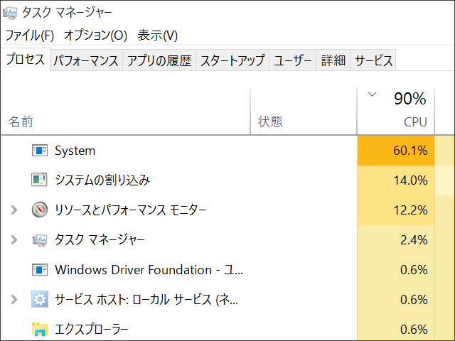
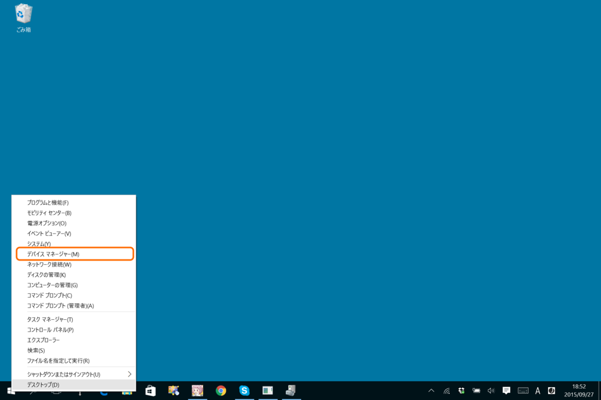
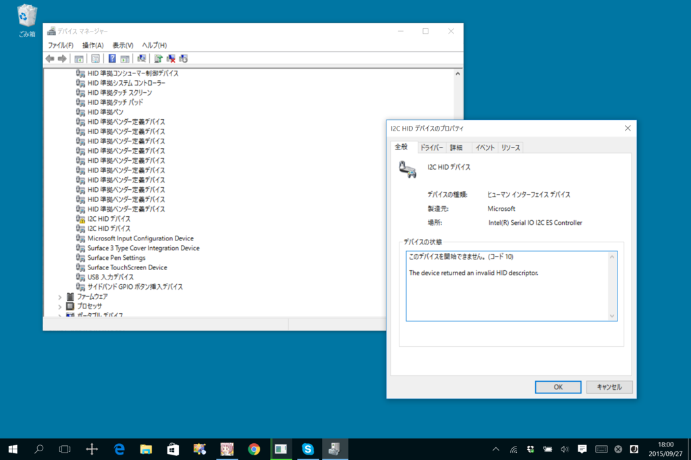
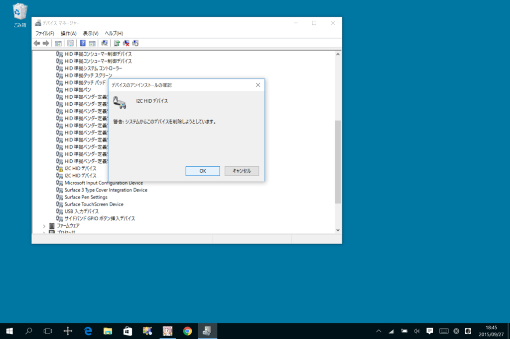
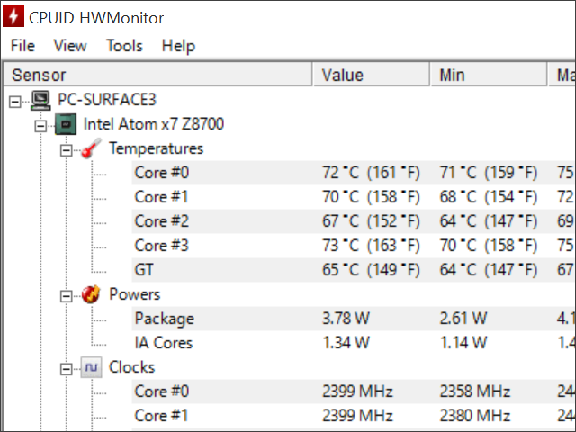

<h3>症状</h3>

 

<ul>
<li>Surface 3 の動作が遅くなる（「タスク マネージャー」や「リソース モニター」をみると“System”と“システムの割り込み”が異常に CPU を食っている）</li>
<li>音が割れる</li>
<li>急に TypeCover でキー入力とタッチバッド入力ができなくなる</li>
</ul>

［スタート］ボタンのコンテキストメニュー（右クリックメニュー。このメニューには［Win］＋［X］キーでアクセスすることも可能）から「デバイス マネージャー」を開く。

すると、「I2C HID デバイス」にビックリマークがついている。

<h3>解決</h3>

コンテキストメニューから「I2C HID デバイス」を削除して、Windows を<b>“完全に”</b>シャットダウンする。Windows を完全にシャットダウンするには“高速スタートアップ”を無効化すればよいが、このケースの場合は Windows の操作が困難だと思われるので、<b>ツー ボタン シャットダウン</b>をお勧めする。

<blockquote cite="http://www.microsoft.com/surface/ja-jp/support/warranty-service-and-recovery/windows-stops-responding?os=windows-8.1-update-1">

<ul>
<li>手順 1: 画面の右端から内側にスワイプして、[設定] をタップまたはクリックします。次に [電源] をタップまたはクリックし、[シャットダウン] をタップまたはクリックして Surface をシャットダウンします。通常の手順で Surface をシャットダウンできない場合は、Surface の電源ボタンを 30 秒間押し続けます。</li>
<li>手順 2:Surface をシャットダウンした後、<b>Surface の音量を上げるボタンと電源ボタンを同時に押し、そのまま 15 秒以上押し続けてから、両方のボタンを離します</b>。</li>
<li>手順 3: 画面に Surface ロゴが短時間表示される場合がありますが、両方のボタンを少なくとも 15 秒間は押し続けてください。</li>
<li>手順 4: <b>ボタンを離した後、10 秒間待ちます</b>。</li>
<li>手順 5: 再度電源ボタンを押して離し、Surface の電源を入れます。</li>
</ul>
<cite><a href="http://www.microsoft.com/surface/ja-jp/support/warranty-service-and-recovery/windows-stops-responding?os=windows-8.1-update-1">Surface &#x3067; Windows &#x304C;&#x5FDC;&#x7B54;&#x3057;&#x306A;&#x3044;</a></cite>
</blockquote>

起動して「デバイス マネージャー」を開き、「I2C HID デバイス」のビックリマークがなくなっていたら解決。

もし解決しない場合は、落ち着いて手順を正確に繰り返してみよう。それでもダメならば、製造元に問い合わせ。

<h3>関係ないかもだけど</h3>

9月に入って部屋のエアコンを切ってから、どうも Surface 3 の調子があちこち悪い。熱暴走したんかなぁ？

<h3>追記（2015/09/28 12:00）</h3>

しばらくしたらまた「I2C HID デバイス」が動作しなくなったので、今度は無効化。このまま使ってみる。

<h3>追記（2015/10/01 10:00）</h3>

あきらめて Windows 8.1 に戻して解決？　かも。

