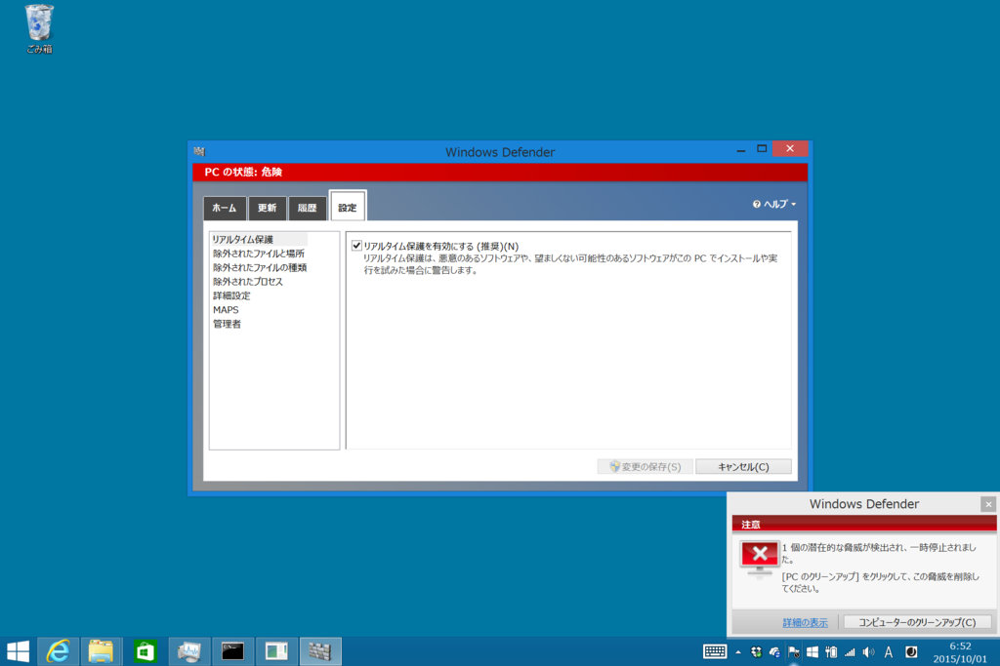
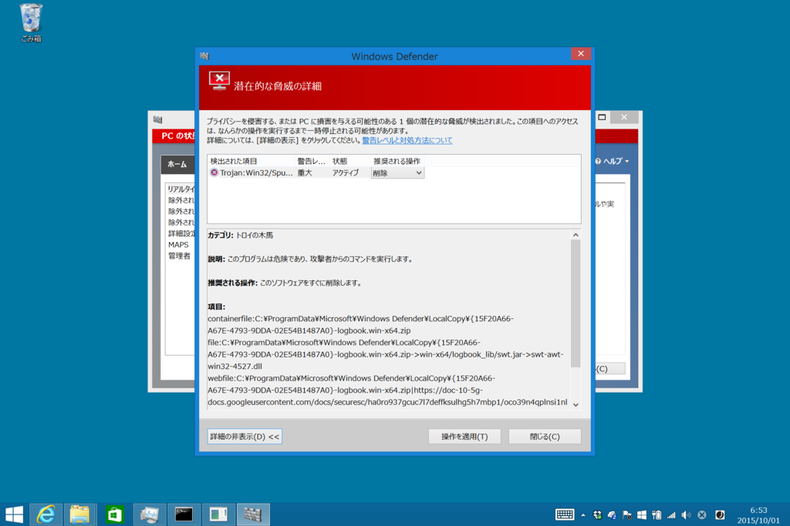
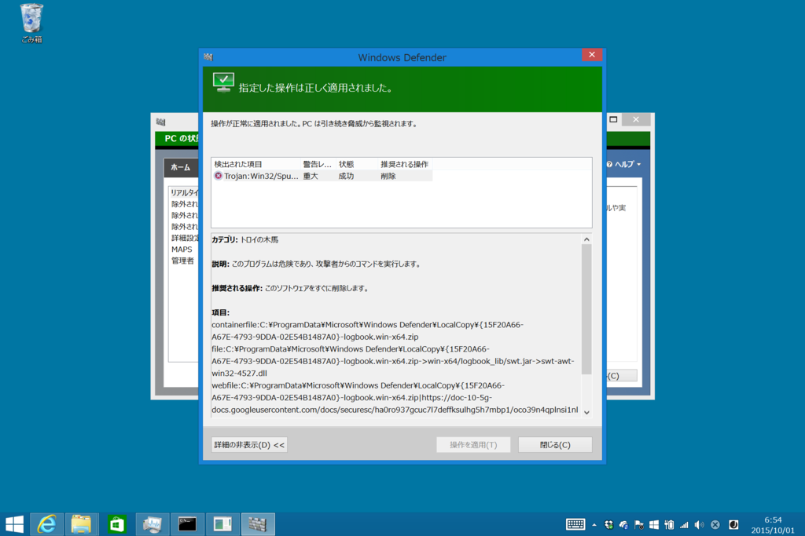

Sueface 3 の問題がどうしても解決しないので、工場出荷時の状態へ戻した。Windows 10 が Windows 8.1 になってしまったけれど、とりあえず今のところは問題がない。その代り、俺提督愛用の「艦これ指令部室」が Windows Defender にブロックされて次元のはざまへと旅立ってしまった。

<iframe src="https://hatenablog-parts.com/embed?url=https%3A%2F%2Fblog.daruyanagi.jp%2Fentry%2F2015%2F09%2F27%2F191456" title="Surface 3 の動作が遅くなる・音が割れる・TypeCover でキー入力とタッチバッド入力ができなくなる - だるろぐ" class="embed-card embed-blogcard" scrolling="no" frameborder="0" style="display: block; width: 100%; height: 190px; max-width: 500px; margin: 10px 0px;"></iframe><cite class="hatena-citation"><a href="https://blog.daruyanagi.jp/entry/2015/09/27/191456">blog.daruyanagi.jp</a></cite>

仕事がらいろんなソフトを試すのだけど、実はウイルス検出の場に出くわすことはあまりなかったりする（ESET のヒューリスティック検知なんかは割と見るけど）。

なお、誤検知だった模様( ﾟДﾟ)

