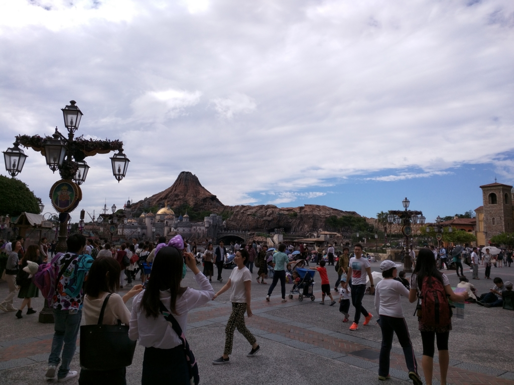
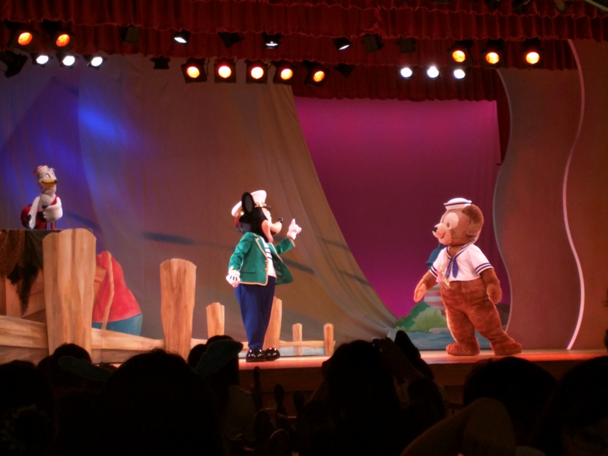

以前、妹と電話していたときに半分冗談で<i>「ネズミ―ランドぐらい兄ちゃんがいつでも連れてってやんよ( ^)o(^ )」</i>と風呂敷を広げたところ、見事に言質をとられてしまい、ほんまに連れていくことになってしまった。しかもそれを聞きつけたおかんまでついてくることに（小さい子いるから、頼もしくはあるんだけど）。最後の抵抗じゃないが、ダメもとで

<ul>
<li>ネズミ―ランドじゃなくて、まだ行ったことのないネズミーシーにしてくれ</li>
<li>混みそうな土日に行くのは絶対嫌なので、平日にしてくれ</li>
</ul>
と要求してみたところ、二人ともこれも快諾。喜々としてキッチリ休みをとってきてくれた。完全に逃げ道をふさがれた格好だ。

<blockquote class="twitter-tweet" data-lang="ja">
いい天気 <a href="http://t.co/RtnWEnGlzS">pic.twitter.com/RtnWEnGlzS</a>
&mdash; だるやなぎ に天使が舞い降りた！ (@daruyanagi) <a href="https://twitter.com/daruyanagi/status/649771665816096769?ref_src=twsrc%5Etfw">2015年10月2日</a></blockquote>

その前日にかなり荒れていたので（松山から東京への飛行機もだいぶ遅れた）天気が心配されたが、その日は秋らしく、とても過ごしやすい天気になった。到着後たった10分で諭吉が二人討ち死に（駐車料金で2,000円弱、三人分の入場料で20,000円弱）して意気消沈だった俺氏も、ちょっとテンションが高まってくる。

<blockquote class="twitter-tweet" data-lang="ja">
なう <a href="http://t.co/6IvO1BrQCq">pic.twitter.com/6IvO1BrQCq</a>
&mdash; だるやなぎ に天使が舞い降りた！ (@daruyanagi) <a href="https://twitter.com/daruyanagi/status/649778149551505408?ref_src=twsrc%5Etfw">2015年10月2日</a></blockquote>

ゲートをくぐると、そこは異世界だった。イスラム風？　ヴェネツィア風？　よくわかんないけれど、生まれて初めて来たので、景色を見てるだけでも割と楽しめる。姪っ子の凜乃ちゃんも、妹が自作したという白雪姫の衣装を着てご機嫌だ。

<blockquote class="twitter-tweet" data-lang="ja">
白雪姫の格好した姪っ子に女子高生が「かわいいー！！」って言ってくれるんだけど、君らのほうが可愛いからおっちゃんとデートしよう
&mdash; だるやなぎ に天使が舞い降りた！ (@daruyanagi) <a href="https://twitter.com/daruyanagi/status/649809540708306944?ref_src=twsrc%5Etfw">2015年10月2日</a></blockquote>

ちなみにわしは妹とおそろいのTシャツを買わされた（再び諭吉死亡）。個人的にはネズミのミミみたいなやつでお茶を濁したかったのだけど、頭がデカすぎて入らない。かといって帽子タイプのやつは少し暑い。残念ながらTシャツでコスプレせざるを得なかった。

<blockquote class="twitter-tweet" data-lang="ja">
罰ゲームでこんなシャツ着せられてる <a href="http://t.co/xSu19BdVzR">pic.twitter.com/xSu19BdVzR</a>
&mdash; だるやなぎ に天使が舞い降りた！ (@daruyanagi) <a href="https://twitter.com/daruyanagi/status/649814059412381696?ref_src=twsrc%5Etfw">2015年10月2日</a></blockquote>

お昼ご飯は、ダッフィーのショーを観ながら。平日のせいか待ち時間もそれほどなく、20分ほどで席へ通してもらえた。

<blockquote class="twitter-tweet" data-lang="ja">
アトラクションに並んで艦これしてる
&mdash; だるやなぎ に天使が舞い降りた！ (@daruyanagi) <a href="https://twitter.com/daruyanagi/status/649781273783734272?ref_src=twsrc%5Etfw">2015年10月2日</a></blockquote>

ここのメニューはハンバーガーが中心のよう。自分はコッドフライのハンバーガーを注文した。ポテトとソフトドリンクのセットで1,000円ぐらい。意外に食事はリーズナブルだなと思ったのだけど、あとで聞いたところによると8,000円ぐらいするところもあるらしい。ほんまネズミーは恐ろしいで。

ちなみに、コッドっていうのはタラのことやね。

<iframe src="https://hatenablog-parts.com/embed?url=https%3A%2F%2Fblog.daruyanagi.jp%2Fentry%2F2015%2F08%2F04%2F231815" title="『魚で始まる世界史: ニシンとタラとヨーロッパ』 - だるろぐ" class="embed-card embed-blogcard" scrolling="no" frameborder="0" style="display: block; width: 100%; height: 190px; max-width: 500px; margin: 10px 0px;"></iframe>

この前本を読んでおいたので、妹に聞かれたときにちゃんとドヤ顔で答えることができた。

ネズミーシーではダッフィーというクマが人気らしい。自分はこのダッフィーというキャラを知らなかったのだけど、ネズミーシーにしかいないとかなんとか。

<blockquote class="twitter-tweet" data-lang="ja">
ダッフィーよりお腹出てないからまだ大丈夫
&mdash; だるやなぎ に天使が舞い降りた！ (@daruyanagi) <a href="https://twitter.com/daruyanagi/status/649796945523773440?ref_src=twsrc%5Etfw">2015年10月2日</a></blockquote>

ショーの筋書きは、周りがリア充だらけで怒髪有頂天のダッフィーが海に「彼女くれ」という手紙を流すも、鬼畜にもそれをミッキーが拾い、「かわいそうだから彼女作ってやろうぜ」と画策するというもの。こうして、シェリーメイという可愛い彼女ができました！　というお話。

<blockquote class="twitter-tweet" data-lang="ja">
ダッフィーが海に手紙流したら、彼女できた。俺もやってみよう
&mdash; だるやなぎ に天使が舞い降りた！ (@daruyanagi) <a href="https://twitter.com/daruyanagi/status/649794408104112128?ref_src=twsrc%5Etfw">2015年10月2日</a></blockquote>

とてもハートフルでいいお話だったと思う。姪っ子も満足してた。

<blockquote class="twitter-tweet" data-lang="ja">
ダッフィーの彼女、服きてないやん
&mdash; だるやなぎ に天使が舞い降りた！ (@daruyanagi) <a href="https://twitter.com/daruyanagi/status/649794813995290624?ref_src=twsrc%5Etfw">2015年10月2日</a></blockquote>

残念ながら、姪っ子がまだ2歳だったのでアトラクションでは遊べなかったのだけど、電車と船には乗った。

姪っ子は電車がお気に入りのようで、電車が走るのを見てとてもはしゃいでいた。なお、電車に乗るのはそんなに好きではない模様。

<blockquote class="twitter-tweet" data-lang="ja">
ビール <a href="http://t.co/vLpKQ9JCzA">pic.twitter.com/vLpKQ9JCzA</a>
&mdash; だるやなぎ に天使が舞い降りた！ (@daruyanagi) <a href="https://twitter.com/daruyanagi/status/649830055762198528?ref_src=twsrc%5Etfw">2015年10月2日</a></blockquote>

おじさんも妹とおかんの許可のもと、ビールをいただいて大満足。ちょっとビターなチュロスも美味しくて、まぁ、混んでさえいなければまたきてやってもいいと思った。

<blockquote class="twitter-tweet" data-lang="ja">
おもろかった <a href="http://t.co/PrD4SEeOEL">pic.twitter.com/PrD4SEeOEL</a>
&mdash; だるやなぎ に天使が舞い降りた！ (@daruyanagi) <a href="https://twitter.com/daruyanagi/status/649875919440449536?ref_src=twsrc%5Etfw">2015年10月2日</a></blockquote> 

<h3>追伸：どうでもいいんだけど</h3>

子どもはほんと物覚えが早い。姪っ子は2歳なのに、iPhone で「写真」アプリを探してフリックでみたい写真や動画を探し出せる。何をみているのか興味があったので覗いてみたら、自分が歩いている動画（しかもコケてた）だった。我がふりをみて反省でもしてるのかしら。アプリの終了のやり方も知っている（妹曰く「この操作は娘に習った」）。

油断してたら一瞬で老害になるなぁ、と薄ら寒く感じるとともに、ちょっと頼もしく感じた。 

