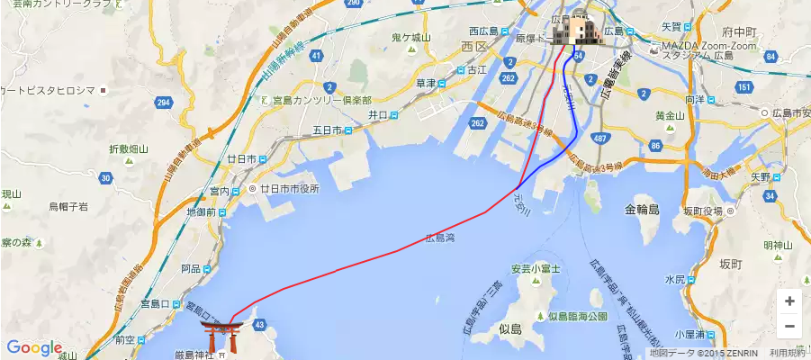
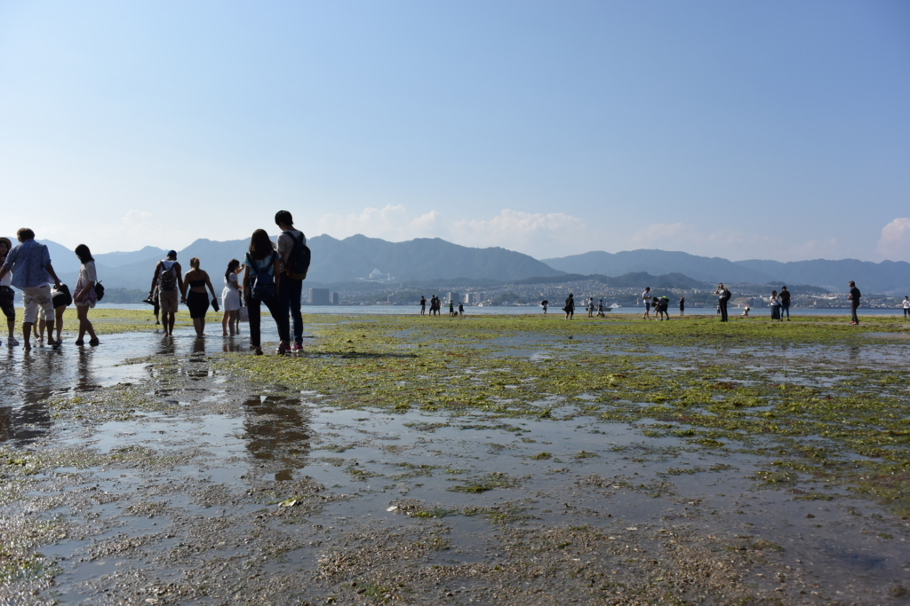

平和祈念資料館などをみたあとは、宮島へ行った。宮島は小さいころに一度行った記憶がある（まだ小学校低学年のころだった気がする？　よく覚えていない）。あのときは、弁当を鹿に食われたり、お店でフルーツ味のもみじ饅頭をくった弟二号が盛大に嘔吐したり<a href="#f-fde3afeb" name="fn-fde3afeb" title="マズかったというより、小さな子どもだったので、思ってた味と実際に食べた味のギャップが激しすぎて吐いてしまったんだと思う">*1</a>、いろいろ大変な旅行だった。懐かしい。

<iframe src="https://hatenablog-parts.com/embed?url=https%3A%2F%2Fblog.daruyanagi.jp%2Fentry%2F2015%2F10%2F10%2F001251" title="終戦記念日：広島行ってきたった。 - だるろぐ" class="embed-card embed-blogcard" scrolling="no" frameborder="0" style="display: block; width: 100%; height: 190px; max-width: 500px; margin: 10px 0px;"></iframe>

平和祈念公園から宮島へは“世界遺産航路”という船を使うと早くて楽ちんだけれど、潮位の関係で欠航になる点、定員があるのですぐの便には乗れないことがある点には注意かも。

所要時間は1時間弱で、運賃は大人 2,000円。同時期に広島へ行ってた妹（別行動）は「高い」と言っていたが、確かにもう少し足せば 松山 → 呉 まで行ける料金なので、高いは高いかもしれない。自分は船が好きなこともあり、あんまり気にならなかったけど。

満潮の時でも頭をぶつけないようにだろうか、背の低い船。デッキに出ることもできたので、ぼーっと海を眺めていた。

お昼頃、宮島に到着。Twitter で得た極秘情報によると、「牡蠣屋」という店がよいらしいので、そこを探した。それにしてもストレートな名前やな。ミナミにある馬肉専門店「ホース」と同じぐらいストレートやな。

<iframe src="https://hatenablog-parts.com/embed?url=http%3A%2F%2Fwww.kaki-ya.jp%2F" title="牡蠣屋・宮島にある" class="embed-card embed-webcard" scrolling="no" frameborder="0" style="display: block; width: 100%; height: 155px; max-width: 500px; margin: 10px 0px;"></iframe>

評判通り、なかなか美味しかった。

牡蠣飯に……

カキフライ。昼間っからビール飲んで、とてもいい気分になる。

昼食のあとは、のんびり人の流れに身を任せて奥へ進んでいく。鹿にはあまり会わなかった気がする。むかし来たときは鹿ばかりいたようなイメージだったが、記憶が改ざんされているのかもしれない。なんかパンフレット食ってるやつとかいたけど。こいつらは何でも食うから困る。奈良へバイクでいったときは、シートにくくっていた袋を食べられて困ったもんだった。破れはしなかったが、よだれでぐちょぐちょになった。

厳島神社は人が多いので外から覗くだけにして、今回はロープウェーで上まで登ってみることにしてみる。

宮島のロープウェーは、麓の紅葉谷と弥山（みさん）を結ぶ。弥山は古来より霊山としてあがめられていたのだそうで、伊藤博文もここからの景色を愛していたのだとか。

<blockquote cite="http://miyajima-ropeway.info/history/">

厳島神社の背景に広がるのは、宮島の最高峰標高約535メートルの霊山「弥山」。1200年もの昔、弥山は弘法大師空海(こうぼうたいしくうかい)により開基されました。弘法大師は100日間の求聞持(ぐもんじ)の修法を行いました。その際、弘法大師が修行を行ったと云われる弥山本堂や1200年以上経った今も燃え続けている きえずの火など、数多くの足跡や伝説を残しています。また、弥山には自然が創り出した巨岩のアーチ、くぐり岩や山頂に神が鎮座すると云われる磐座石など奇岩怪石があり、史跡と相まってすばらしい景観を創り出しています。

<cite><a href="http://miyajima-ropeway.info/history/">&#x5BAE;&#x5CF6;&#x30FB;&#x5F25;&#x5C71;&#x306E;&#x6B74;&#x53F2;&#x63A2;&#x8A2A;&#xFF1A;&#x5BAE;&#x5CF6;&#x30ED;&#x30FC;&#x30D7;&#x30A6;&#x30A8;&#x30FC;&#xFF1A;&#x5BAE;&#x5CF6;&#x30FB;&#x5F25;&#x5C71;&#x30FB;&#x65E5;&#x672C;&#x4E09;&#x666F;&#x30FB;&#x4E16;&#x754C;&#x6587;&#x5316;&#x907A;&#x7523;&#xFF0F;&#x5E83;&#x5CF6;&#x89B3;&#x5149;&#x958B;&#x767A;&#x682A;&#x5F0F;&#x4F1A;&#x793E;</a></cite>
</blockquote>

おそらく海外向けのガイドブックに載っているのだろう、外国人客がすごく多い。小さなゴンドラに大人6人詰め込まれるのは、正直ちょっと閉口した。しかも、同行の @jz5 による極秘情報によると、このロープウェーは過去にも事故を起こしているという（彼はそういう無駄知識ばかり提供してくれるのだ）。まぁ、当然対策何課は施されてるんだろうけど、小さくてボロいゴンドラをみていると、ほんまにここ死ぬかもしれんな、とちょっと思った。

――が、死に場所はここではなかった。

ロープウェーが連れてってくれるのは、弥山の頂上ではなく、その手前の展望台なのだという。頂上までは、まだ30分も歩かなければならない。しかも、最初の10分は下りで、残り20分は上りなのだという。アホなのか、バカなのか！　相殺して上り10分だけにしてくれれば、帰りは下りだけになってまだマシなのに、これでは行きも帰りも最後が上りになってしまう。下手すれば、駅にたどり着く直前に死んでしまうぞ。しかも、山に登るつもりがなかったので、履いてきたのは草履。ほんまに遭難してまう。

<blockquote class="twitter-tweet" data-lang="ja">
死ん…でる <a href="http://t.co/TQE7DGWN5z">pic.twitter.com/TQE7DGWN5z</a>
&mdash; ＪＺ５ (@jz5) <a href="https://twitter.com/jz5/status/632416285725323266?ref_src=twsrc%5Etfw">2015年8月15日</a></blockquote>

どうにかこうにか山頂には就くことができたが、マジで危うく死にかけた。

生き残れたことを神に感謝し、平和を祈るために広島方面に礼をささげる。これはけっして土下座ではなく、クンジョルという韓国式の礼なのだという。このまえ鳩山元首相がやってて知った。

頂上の景色にも飽きたので下界に降りると、潮が引いている。

せっかくなので、なんか海藻がへばりついてグジュグジュになっているのを踏みながら、鳥居に近づいてみた。鳥居にはカキ殻とお金がたくさんへばりついている。@jz5 が「ここでフェリー代を稼ぐ」と言い出す。なんて浅ましい男なのだろうか。俺も500円玉だったらほしい。

今度は人の少ない時期にこようと思った。

<h3>追伸</h3>

揚げもみじと宮島ビールも美味しかった。

<a href="#fn-fde3afeb" name="f-fde3afeb" class="footnote-number">*1</a>:マズかったというより、小さな子どもだったので、思ってた味と実際に食べた味のギャップが激しすぎて吐いてしまったんだと思う

