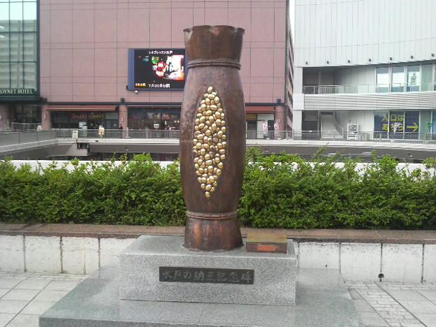

――と思っていた。

会社員のころは季節に一回ぐらい体調が悪くなり、早退やお休みをしていたように思うが、無職＜フリーランス＞になってからはそういうことがなくなった。<i>なんせ無職は働かないと死ぬ。</i>有給休暇なんてものはないし（自分の才覚でねん出することは可能）、育児休暇もない（ので結婚もできない）。健康保険を支払うことはあっても、使うことはない。医者にかかると治療費以上に、収入減が厳しいのだ。なので、たいていのことは気力でカバーするし、またできてしまう。そして、それが無職＜フリーランス＞の誇りでもある。俺はぬるま湯につかってる会社員とは一味違うんだぜ、的な。

でも、最近、体の調子がどうもおかしい。

どうおかしいのかというと、まず<b>納豆を買うようになった</b>。ご存知かもしれないが、<b>関西人は納豆を食わない</b>。自分も大阪生まれなので、<b>納豆を食わない。</b>でも、けっして納豆が食べられないわけではない。母親は東京の人だったので、朝ごはんにはだいたい納豆がいた。なので、納豆は食べた（食べないと殺されるので）。

ただ、大学に進み一人暮らしをするようになってからは食べたことがない。<b>なぜ納豆などというものにお金を出さなければならないのか</b>。納豆って腐ってるんだぞ？　スーパーには新鮮な食材で満ち溢れているわけだ。その中からあえて、腐った豆を選ぶ理由があるのだろうか。豆腐だったらまだしも（これも腐ってんだよな？）、納豆はネバネバしているんだぞ。普通の人間ならば、ネバネバしたものは食べない。自分は自炊暮らしが長いので何回か経験があるのだが、ネバネバしてるやつはだいたいヤバい。だからネバネバは本能が拒否するはずで、そうじゃない人間はなにかがおかしいのだ。

――それにもかかわらずだ。

この前、納豆を買ってしまったんだ。しかも、<b>3個パックで3割引きだ</b>（語呂がいいだろ？）。なぜだかわからないが、納豆売り場の前に立つと口に涎がたまり、全身がわなわなと震える。売り場を通り過ぎても、また戻ってきてしまう。ちゃんと3割引きのモノをより分けて買い物かごに入れるだけの理性は残っているようだが、何かがおかしい。それは、あそこで売っている、半額のカツヲよりも、優先すべき、ものなのか？　カツヲのほうが、旨くないか？（どうせ冷凍モノを溶かしたヤツだけど！）

結局、散々迷って納豆を買ってしまった。自分でお金を出して納豆を買うなんて生まれて初めてのことだ。「♪あたまあたまあたま～　あたま～をたべ～ると～」の音楽すら、その日は耳に入らない。その日の僕は、納豆がとても・激しく・この上なく・何に替えてもほしかったのだ。

そして、家に帰ってさっそく食った納豆のうまいことといったら！　3割引きじゃない納豆だったら、これよりさらに美味しいのだろうか？　15年ぶりに口に入れた納豆が、舌の上でネバネバと踊っている。それがなんとも美味に感じるのだ。冷静に考えたら、美味しいのは納豆のタレなのかもしれないが、それはそれですばらしい。納豆を人類で2回目に食べた人を心底尊敬する。

何が言いたいかっていうと、風邪ひいてしんどい。とりあえず鼻水が止まらないので、ビールを飲んだ。

