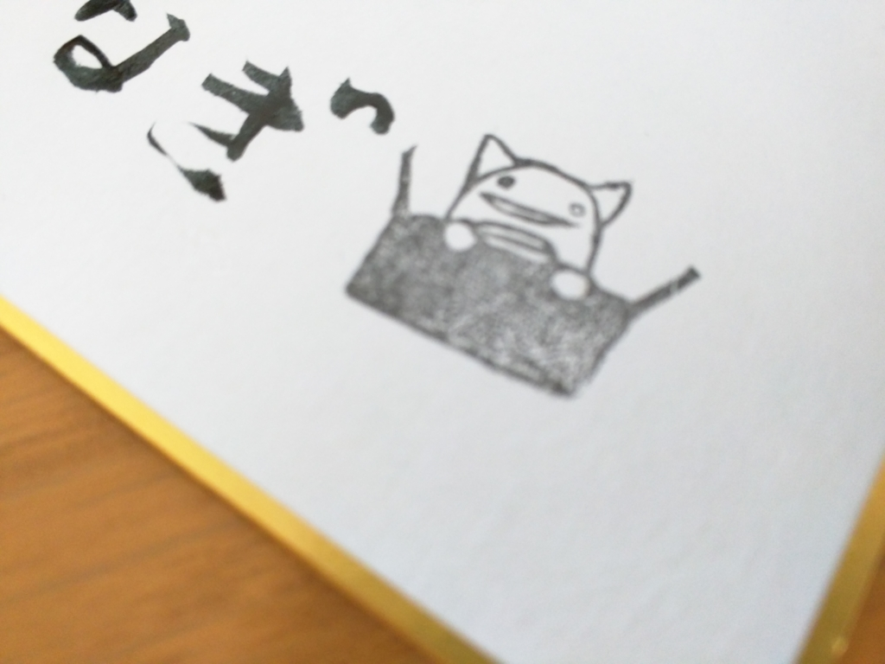

とうとうだるやなぎ LINE スタンプが完成したようです。

<iframe src="//hatenablog-parts.com/embed?url=https%3A%2F%2Fstore.line.me%2Fstickershop%2Fproduct%2F1202603%2Fja" title="柳 英俊（だるやなぎ） - LINE クリエイターズスタンプ" class="embed-card embed-webcard" scrolling="no" frameborder="0" style="display: block; width: 100%; height: 155px; max-width: 500px; margin: 10px 0px;"></iframe>

さっそく使ってみて、相手の反応を確かめてみましょう。

<h3>著名なメイド好きプログラマー S 氏の場合</h3>

めちゃくちゃ気に入ってくれたようです。きっと買ってくれると思います。

<h3>家族の場合</h3>

妹しか反応してくれませんでした（兄から見ても、他人の気持ちを慮ることのできる、デキのいい妹だと思います）が、かなり好評のようですね。なお、このあとサラッと話題を変えられて、バックトゥザフューチャーの話になった模様。

僕は LINE 友達がほとんどいないので、これぐらいしか試せませんでしたが、なかなか好評のようです。ぜひ皆さんには僕の代わりにいろいろなシーンで活用していただきたいと思います（ただし、何が起こるかは保証できませんが……）。

――コーヒー1本分のお値段で得られる、かけがえのない体験。既読スルーを許さない、圧倒的キモさをあなたに。

だるやなぎ LINE スタンプをよろしくお願いします。また、本プロジェクトに出資していただいた方、ありがとうございました！　この場をお借りしまして、お礼申し上げます。お手製色紙をゲットされた方、大事にしてくださいね♪

