
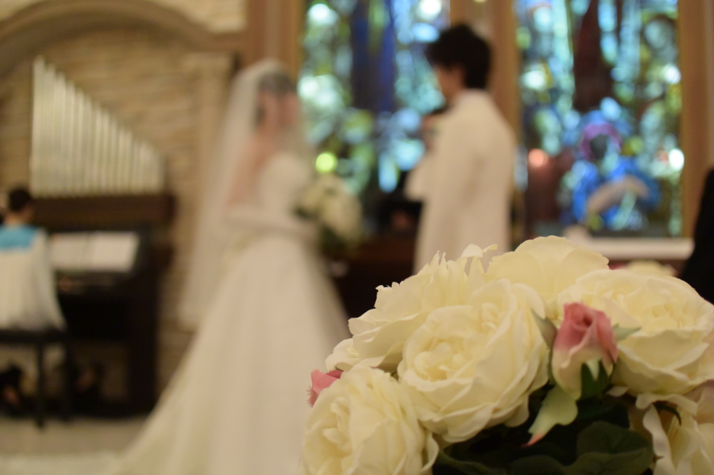

旧友の結婚式に出てきた。「ここ2年ほど遊んでないなぁ」と思ってたら、こやつ、隠れて嫁さん探しをしていたらしい。マラソン大会でスタート前に<i>「一緒にゴールしようぜ☆」</i>とか言ってたくせに、ラストスパートであっさり引き離された気分や。ともあれ、おめでたい。会いたかった友人とも久しぶりに会えたし、割りと楽しかった。

<h3>松山空港から中部国際空港まで</h3>

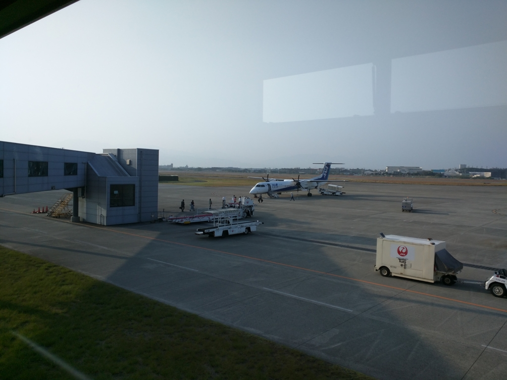

飛行機のチケットと宿は、出張パックみたいなやつでとった。簡単で大変便利なので、旅程がシンプルな時は割りと使っている。たしか、早めに予約をしておいたおかげか、2泊付きで5万円しなかったような（4万ぐらいだっけかな？）。ちなみに松山―中部の正規運賃（ANA）は26,610円との由。便にもよるが、旅割75を使えば10,710円までに割引されるようだ。

機材はボンバルディア DHC8-Q400。2席ずつ縦方向2列、横20列弱の小さなプロペラ機だ。ジェット機ならば大丈夫な手荷物でも持ち込みを断られる場合があるので、なるべく事前に預けておくのが吉。自分はそうしたのでスムーズに乗り込めたが、なかには乗る直前に注意を受ける客もいたようだ。搭乗はボーディングブリッジ……ではなく、一度下に降りてから乗る。中部国際空港ではバスに乗せられて面倒だったので、やはり大きな荷物は預けてしまうに限る。

滑走を始めると、ジェット機ほどの G を感じることなくすっと離陸。よく見ていなかったのだけど、海側から陸側へと飛び立ったのだろうか。左手眼下に松山城の建つ丘をみながら、ゆっくり旋回していくと、景色はタンクの立ち並ぶ海岸から、一面青い山々になる。ジェット機に比べて高度が低いのだろうか、小さいながらも建物までくっきり見えるようだ。途中、雲を湛えた山のダムをみた。ダムの端から雲が零れ落ちるさまはまるで滝のようで、少し不思議。

<h3>中部国際空港から三河安城まで（名鉄～JR東海道線）</h3>

中部国際空港へは定刻より早く到着。ほんとうにあっという間で、もってきた文庫本を思っていたよりも読み進められなかった。空港では“招き猫”がお出迎え。どうやら空港のある街・常滑の名産のようだ。競艇のイメージしかなかった（ぁ

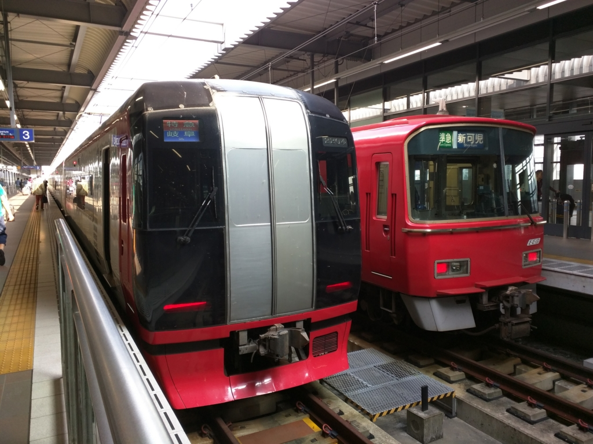

三河安城へは名古屋から新幹線に乗ってもいいのだが、式は三時から。まだ十時で時間にはだいぶ余裕があるので、金山から東海道線に乗ることにした。金山までは名鉄のミュー特急とやらに乗るのだけど、これが割としょぼい。近鉄みたいに駅のホームで指定席を買えるかと思えばそうではなし、車内で特急券を購入しても席のバッティングまでは解決してくれない。しかも、この特急、やたら停まる。名鉄には乗ったことがなく、なんとなく近鉄っぽいのを想像していたけれど、どっちかっていうと京成みたいな雰囲気だった。

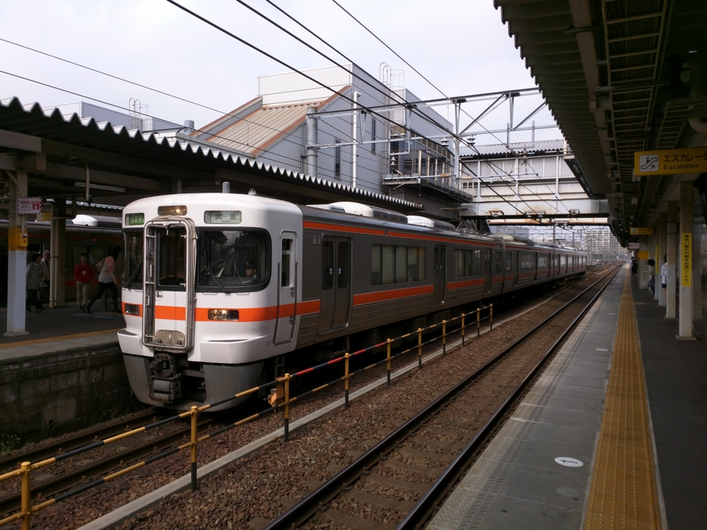

金山で JR 東海道線に乗り換え。

<blockquote class="twitter-tweet" lang="ja">
うおおお、各停に追いつこうとしたら、快速に追い抜かれたあああああん
&mdash; だるやなぎ（LINE  スタンプ販売中） (@daruyanagi) <a href="https://twitter.com/daruyanagi/status/657726428159447040">2015, 10月 24</a></blockquote>

途中、若干の手違いはあったけれど、武豊行きの各駅停車や豊橋行きの各駅停車を乗り継いで無事に三河安城に到着した。

<blockquote class="twitter-tweet" lang="ja">
たけとよ なのか！ たけゆたか ちゃうんか！
&mdash; だるやなぎ（LINE  スタンプ販売中） (@daruyanagi) <a href="https://twitter.com/daruyanagi/status/657722781186945024">2015, 10月 24</a></blockquote>

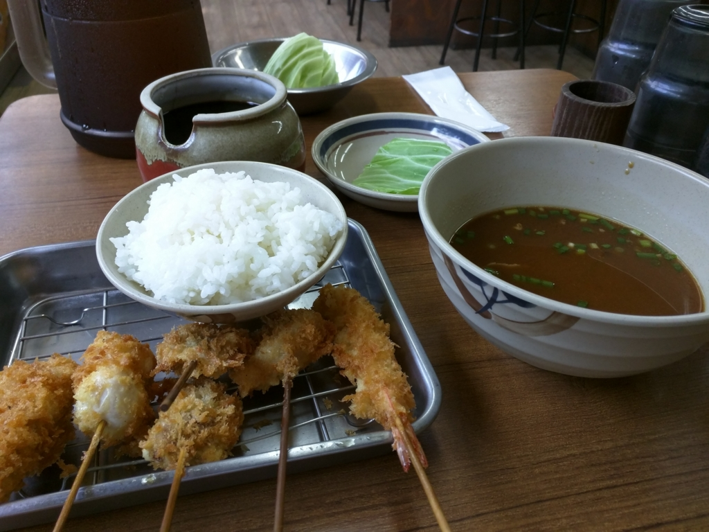

ご褒美にビールと串カツでお昼ご飯をした。

<h3>三河安城</h3>

結婚式はつつがなく終了。久しぶりに礼服を引っ張り出してきたのだけど、家に黒いベルトがなかったのが大失敗。でも少し太ったせいでウエストが程よい塩梅になっていて、ベルトなしでもズボンがずり落ちることがなかった。

それにしても、三河の結婚式はちょっと面白いかもしれない。お菓子投げ？　これは、投げるのをキャッチするより、落ちたのを拾うのが効率がいい。ただし、他の人に踏まれないように細心の注意を払わなければならない。うまい棒一本を焦って、3日間指が使えないのは辛いだろう。あと、おしゃれご飯の最後にひつまぶしが出てきて笑った。ちょうど食べたいなぁ、と思っていたのでナイスタイミングだった。

その次の日は、丸一日ホテルで過ごした。

ほんとうは岡崎城などを観に行こうと思っていたのだけど、安い割に快適なホテルで、珍しく無線 LAN が早かったこともあり、ゴロゴロとニコニコ動画を観るのに最高の環境だったから仕方がない。一つだけ言い訳をするならば、仕事も一つだけやったんだよ。机が使いやすくて、捗った。

<h3>三河安城から中部国際空港まで（知多バス）</h3>

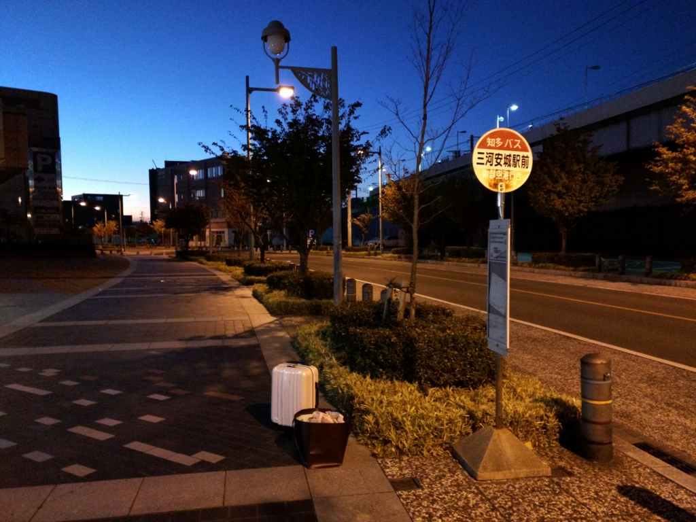

帰りは、知多バスで中部国際空港まで。運賃は1,400円ほどだった。

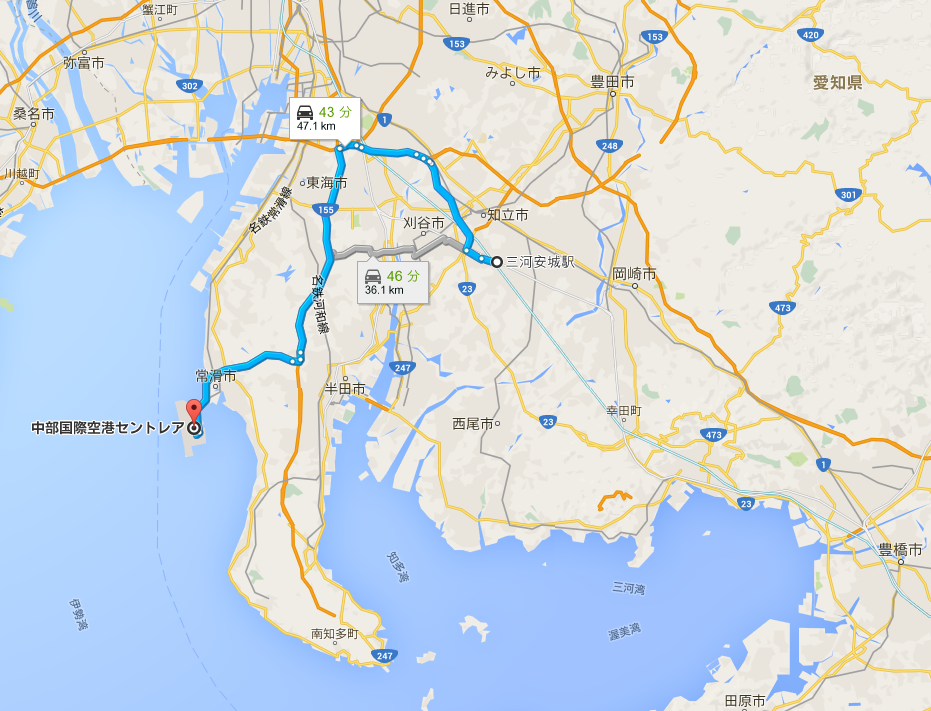

乗り換えが要らないのがメリットだけど、6時前の1本しかないのが気が利かないところ。飛行機の出発は11時半ごろなので正直早すぎるのだけど、通勤・通学ラッシュの電車をスーツケースごろごろしながら乗るのは憚られる。早く着いたらセントレアの探検をすればいいやと思い、この便をチョイスした。

文庫本を開いては閉じ、開いては景色を見ては閉じしている間に、バスは高速道路に乗り、海辺に浮かぶ中部国際空港が見えてきた。

<h3>セントレア</h3>

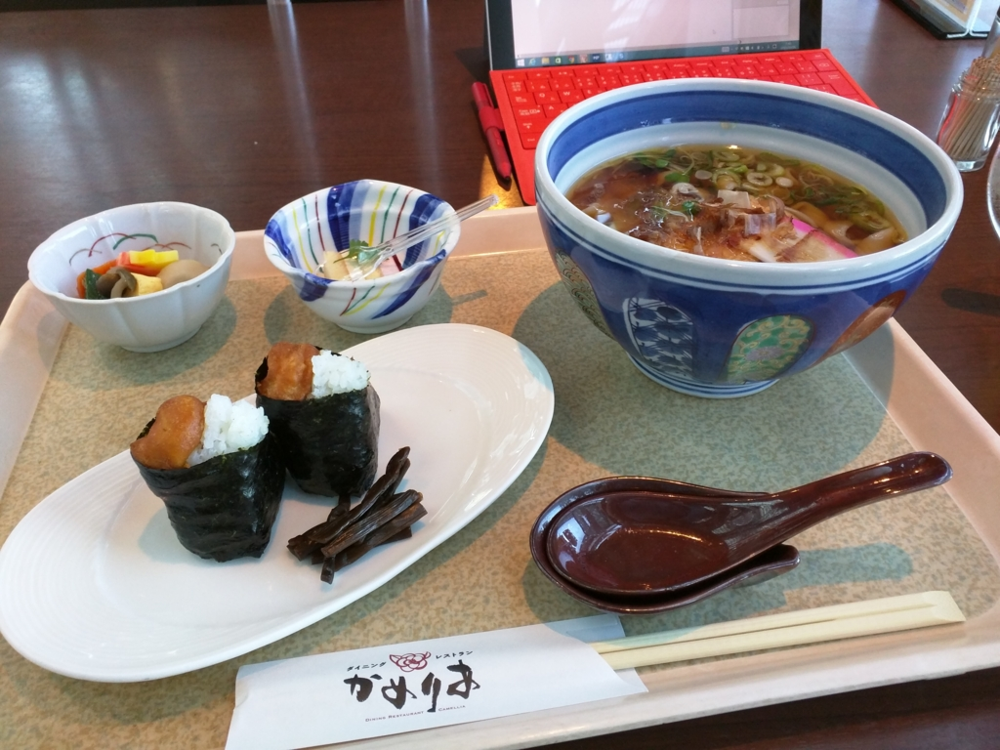

セントレアには8時ごろだったか、無事到着。お腹がすいたので適当なお店に入り、名古屋がまるごと楽しめるというセット（天むすときしめん）を頼んだ。

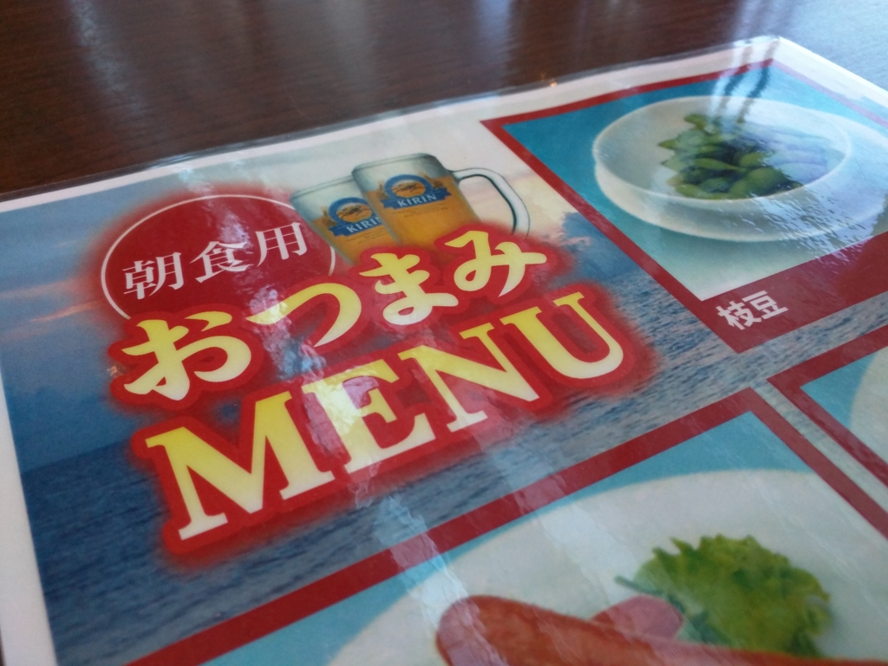

……(＾ω＾)

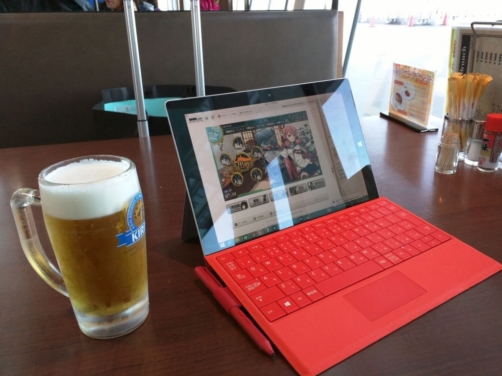

ビールも頼んだ。

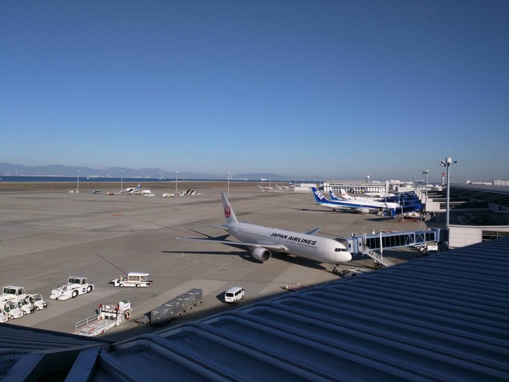

朝食を楽しんだ後は、眺望デッキでしばし飛行機の離陸を眺めた。

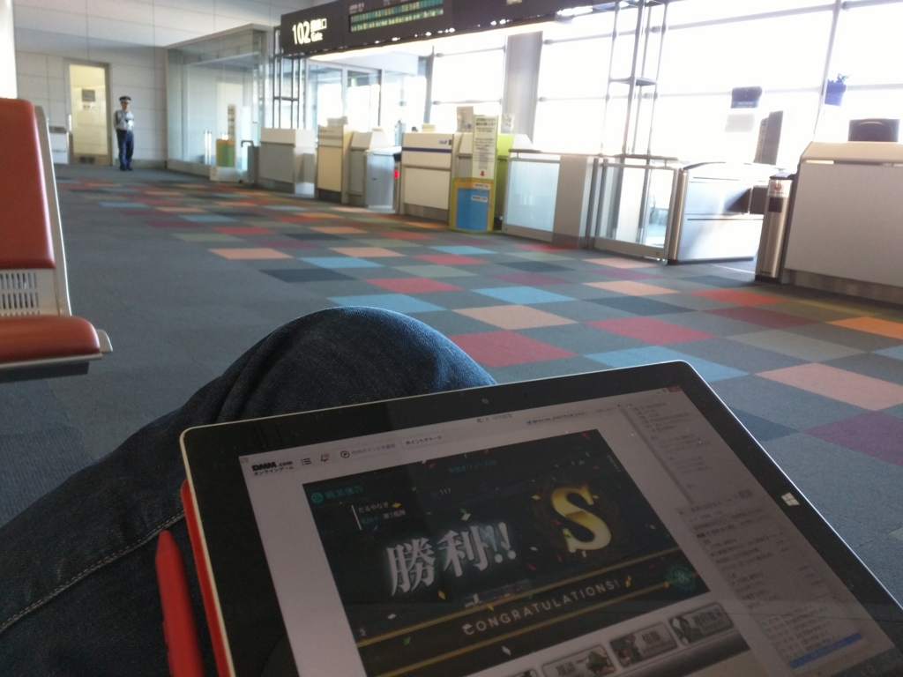

ほんとうならセントレアでは温泉も楽しめるらしいのだけど、この時間はほとんどのお店が閉まっていた。けれど、無料 Wi-Fi も充実しているし、携帯電話の充電スタンドもある。自分みたいに充電用の USB ケーブルをスーツケースに入れてしまい、端末のバッテリーを切らしてしまうなどというドジさえ踏まなければ、3時間ほど潰すのは造作もないことだろう。

