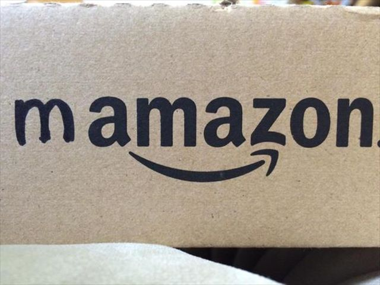
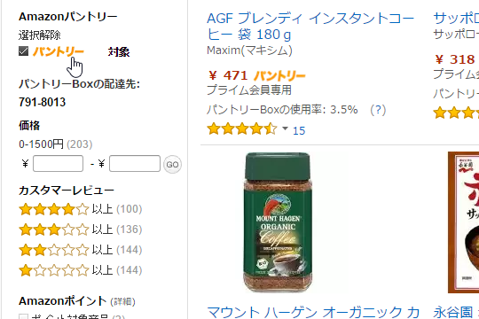
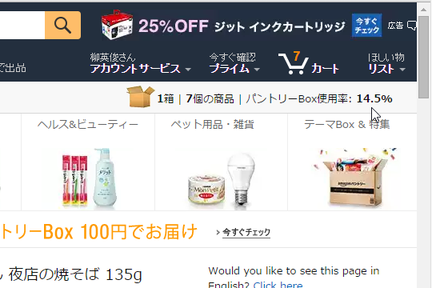
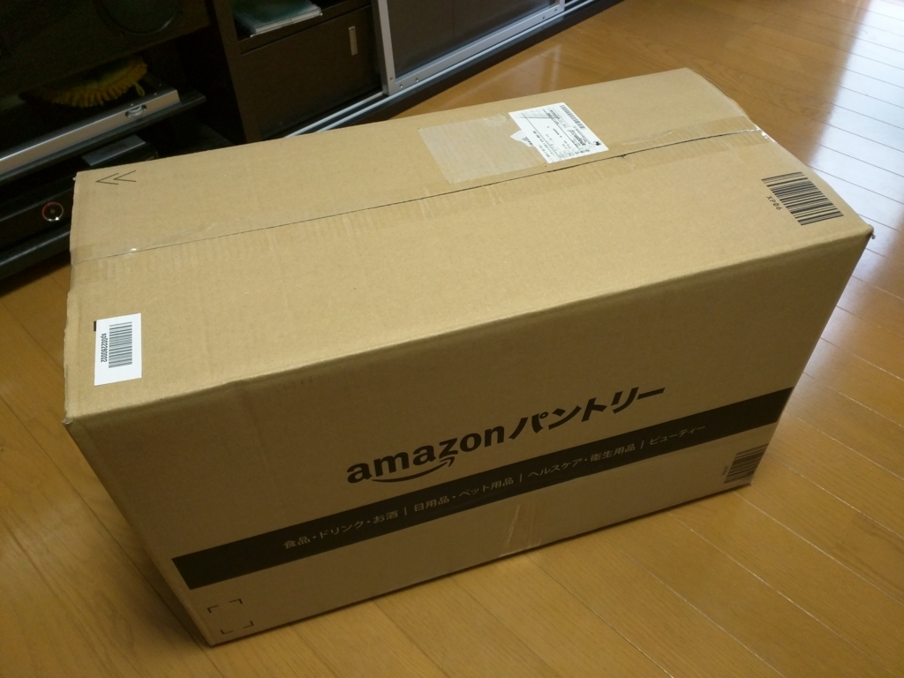
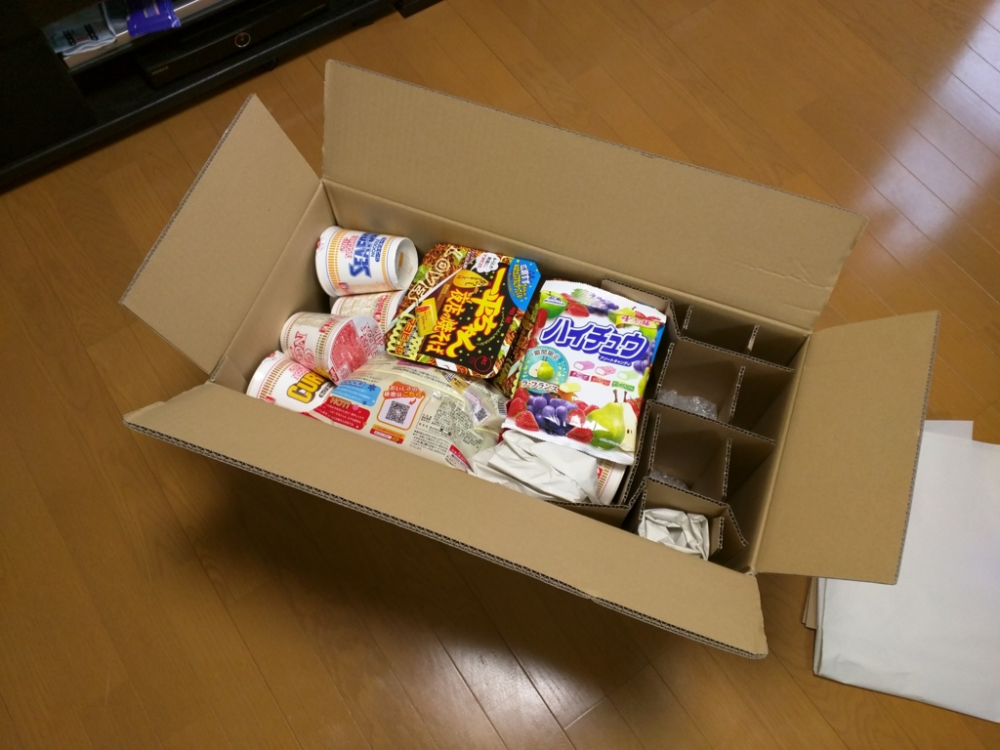

やってみようかなーと思ってつい後回しになってたけど、カップラーメン（<a href="https://blog.daruyanagi.jp/entry/2015/09/04/212234">&#x7C89;&#x672B;&#x888B;&#x306E;&#x4E2D;&#x8EAB;&#x304C;&#x771F;&#x3063;&#x8D64;&#x3063;&#x304B;&#x3067;&#x982D;&#x304A;&#x304B;&#x3057;&#x3044;&#x300C;&#x756A;&#x9577;&#x82B1;&#x9053;&#x8F9B;&#x5473;&#x564C;&#x30E9;&#x30FC;&#x30E1;&#x30F3;&#x300D;&#x304C;12&#x500B;&#x9001;&#x3089;&#x308C;&#x3066;&#x304D;&#x305F;&#x3002; - &#x3060;&#x308B;&#x308D;&#x3050;</a>）を食べつくしたのを機に、“Amazon パントリー”を試してみることにした。

<iframe src="https://hatenablog-parts.com/embed?url=https%3A%2F%2Fwww.amazon.co.jp%2Fl%2Fref%3Dsr_ex_n_0%2F3485873051" title="Amazonパントリー 食品・日用品の宅配、ネット通販" class="embed-card embed-webcard" scrolling="no" frameborder="0" style="display: block; width: 100%; height: 155px; max-width: 500px; margin: 10px 0px;"></iframe>

なにがお得なのか一見よくわかんないサービスだけど、

<ul>
<li>いろんな種類の商品を一つの箱に詰めてまとめて買える（送料は290円）</li>
<li>なので、受け取りも一回で済む</li>
<li>まとめ買いでしか対応していない商品も一つから買える</li>
</ul>
というのがポイントらしい。インスタントラーメンを買うとき、Amazon だと1個セットなんかでしか売ってないんだよね（プライムじゃなければ、そういうセットもあるのだけど、送料かかるから近所のスーパーで買った方がいい）。でも、パントリーならいろんなものを詰め合わせて買うことができるってわけやね。

ちなみに“Amazon プライム”に入っていないと使えないので注意。

使い方は最初よくわからなかったが、“Amazon パントリー”対応の商品を検索してカートに入れると――

箱に入っていく感じらしい。貧乏性なのでついギッチギチに詰めてやろうと思うが、意外になかなか埋まらない。ついには買うものがなくなってしまい、

<ul>
<li>ケチャップ切らしてたし、ぶちこんどこ</li>
<li>お鍋の季節やし、ポン酢あったほうがいいな</li>
<li>そういえばインスタントコーヒーなかったかも</li>
<li>まだ隙間空いてるし、とりあえずビール6本いれとこ</li>
</ul>
などと、余計なものまで買ってしまった。箱いっぱいに詰めて、6,000円程度。占有率あたりの単価が高いビールを抜けば、だいたい5,000円ぐらい詰められる感じかなぁ。

待つこと2日で到着。思ったよりも箱がデカく、クロネコヤマトのお兄さんには申し訳なく思う。

開けてみた。大学に通って一人暮らししてるとき、月末になるとおかんがこういうのを送ってくれたなぁー。米とかカップ麺とかレトルト食品とか、あと、あからさまにお中元かお歳暮でもらった感じのゼリーセットとか、「どうせロクなもんくってねーだろ、たまには帰ってこい」などと書いた手紙とか入ってて。ありがたいもんやな。思い出すだけでちょっと涙出るわ。

それに、今回のパントリーは母ちゃんの救援物資よりもも豪華。“ジオンはあと10年戦える”みたいな謎の心強さがある。実際、自分はそんなにカップ麺食べないから、これだけあれば年内は十分もちそう。

とにかく、使ってみた感想としては――

<ul>
<li>割と楽しいかも。自分で作る“救援物資”みたいな。</li>
<li>お得かどうかは他と比較したことないからわからん。見た感じとくに損した感じはしないけど</li>
<li>どれがパントリー対応商品なのかよくわからん。パントリー対応商品だけのストアサイトとかあればいいのにな</li>
</ul>
みたいな感じ。面白かったし、実用的でもあるので、たぶんまた使うような気がする。

