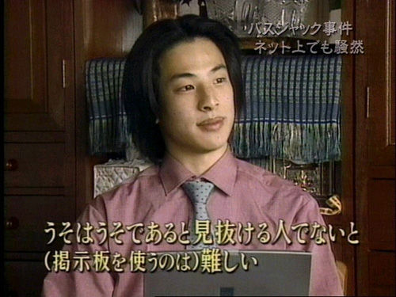

<blockquote cite="http://jp.reuters.com/article/2015/11/03/idJP2015110301001841">

　福岡県警柳川署は３日、自動車運転処罰法違反（過失傷害）と道交法違反（ひき逃げ）の疑いで、同県みやま市の無職の女（９３）を逮捕した。柳川署によると、容疑を否認している。過去に認知症と診断されたことはなく、症状もないとみている。

　逮捕容疑は、２日午後３時５０分ごろ、みやま市瀬高町太神の市道交差点で、運転していた軽自動車でミニバイクの男子高校生＝みやま市＝をはね、逃走した疑い。

　柳川署によると、９０歳代の逮捕は異例。理由について、車を修理に出しており、証拠隠滅の恐れがあったためと説明している。

<cite><a href="http://jp.reuters.com/article/2015/11/03/idJP2015110301001841">&#x3072;&#x304D;&#x9003;&#x3052;&#x5BB9;&#x7591;&#x3067;&#xFF19;&#xFF13;&#x6B73;&#x5973;&#x902E;&#x6355; | Reuters</a></cite>
</blockquote>

故あって全文引用させていただくが……とくに認知症などもない、正常な判断力を備えているであろうお婆さんが、ミニバイクに乗っていた男子高校生をひき逃げして逮捕されたというこの記事。なんか違和感ない？　そう、<i>被害者の容体が書かれていない</i>んだよね。フツーの記事だったら当然書いてあるはずだろう。

ここからは完全な憶測だけど、この記事を書いた人はある目的をもって書いている。

<ul>
<li>最近、老人が運転するクルマによる事故が増えている（ような気がする） → 何らかの規制が必要ではないのか？</li>
<li>９０歳代の逮捕は異例 → 歳よりはめったに逮捕されないことへの疑問提起。もしくは事件の特異性の強調</li>
</ul>
何を意図していたのかは正確にはわからないが、そういうある種の正義感が先走ってしまい、

<ul>
<li>轢かれた高校生、心配だな。どうなったの？</li>
</ul>
という当然あるべき問いへの答えを用意するのを思わず失念してしまった。そんな感じではないかとふと妄想した<a href="#f-25e4261c" name="fn-25e4261c" title="違う媒体で目にしたところ、被害者は重体なのだそうだ。その場で救護できていれば">*1</a>。

こういうのは、スゴく気持ち悪い。記者は自分を操ろうとしていたのではないかという漠然とした疑念。ちょっとした憤り。それに、手品の種を目にしてしまったときの気まずさが足し合わされた、エグみのある気持ち悪さ。

とはいえ、記者が読者にある種の“魔術”を仕掛けるのは、けっして悪いことではないように思う。マスメディアには“個別問題”を掘り起こして“社会問題”を醸成する機能と使命がある。実際、それによって社会が改善されたことも多い。

けれど、そういうのはもっと上品にやらないといけない。当然踏むべき手順を踏んで、文明的・人間的に。

受け取る側も、そういうものだと見抜いて受け取らないといけない。「嘘を嘘と見抜けないと難しい 」というやつだね。

その点、メディアと読者の関係は、操り人形とそれを楽しむ観客に少し似ているかもしれない。操り人形の<s>意図</s>糸が見え見えなのは興ざめだ。しかし、観客が操り人形になってしまうのはもっとバカらしい。

<a href="#fn-25e4261c" name="f-25e4261c" class="footnote-number">*1</a>:違う媒体で目にしたところ、被害者は重体なのだそうだ。その場で救護できていれば

