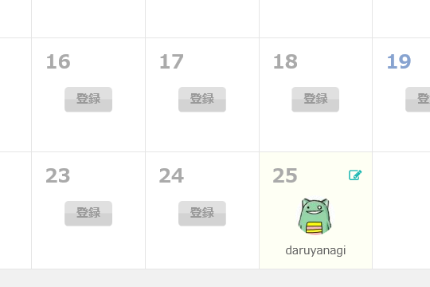

今年も Advent Calendar の季節が近づいてきました。う……頭の中で何かが……

<blockquote class="twitter-tweet" data-lang="ja">
だるやなぎアドバントカレンダー（震え声
&mdash; だるやなぎ に天使が舞い降りた！ (@daruyanagi) <a href="https://twitter.com/daruyanagi/status/662170305729658881?ref_src=twsrc%5Etfw">2015年11月5日</a></blockquote>

黒歴史がフラッシュバックしますね。

<iframe src="https://hatenablog-parts.com/embed?url=http%3A%2F%2Fwww.adventar.org%2Fcalendars%2F431" title="だるやなぎ Advent Calendar 2014 - Adventar" class="embed-card embed-webcard" scrolling="no" frameborder="0" style="display: block; width: 100%; height: 155px; max-width: 500px; margin: 10px 0px;"></iframe>

あの悲惨な歴史は、けっして繰り返してはいけないものです。――にも拘らず。

<blockquote class="twitter-tweet" data-lang="ja">
<a href="https://twitter.com/shibayan?ref_src=twsrc%5Etfw">@shibayan</a> <a href="https://twitter.com/daruyanagi?ref_src=twsrc%5Etfw">@daruyanagi</a> はよ登録して <a href="https://t.co/gfwvxzIgYh">https://t.co/gfwvxzIgYh</a>
&mdash; ＪＺ５ (@jz5) <a href="https://twitter.com/jz5/status/662192336957341696?ref_src=twsrc%5Etfw">2015年11月5日</a></blockquote>

<blockquote class="twitter-tweet" data-lang="ja">
<a href="https://twitter.com/daruyanagi?ref_src=twsrc%5Etfw">@daruyanagi</a> 今年も 25 日の締めを頼むで <a href="https://t.co/IogEhk6Myy">https://t.co/IogEhk6Myy</a>
&mdash; しばやん (@shibayan) <a href="https://twitter.com/shibayan/status/662193767999410177?ref_src=twsrc%5Etfw">2015年11月5日</a></blockquote>

「歴史は繰り返す」という言葉が、脳裏をよぎりました。ほんまこいつら鬼畜やと思います。

 

<h4>追伸</h4>

<iframe src="https://hatenablog-parts.com/embed?url=https%3A%2F%2Fblog.daruyanagi.jp%2Fentry%2F2015%2F10%2F21%2F210059" title="自分でいうのもなんだけど、これはキモい！　だるやなぎ LINE スタンプが満を持して登場 - だるろぐ" class="embed-card embed-blogcard" scrolling="no" frameborder="0" style="display: block; width: 100%; height: 190px; max-width: 500px; margin: 10px 0px;"></iframe>

かわいそうだと思う人は LINE スタンプでも買ってあげてください。

