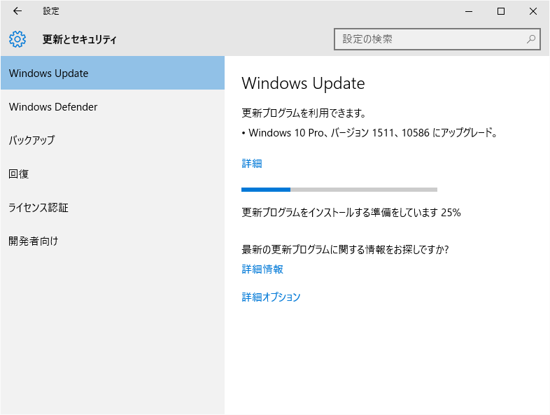
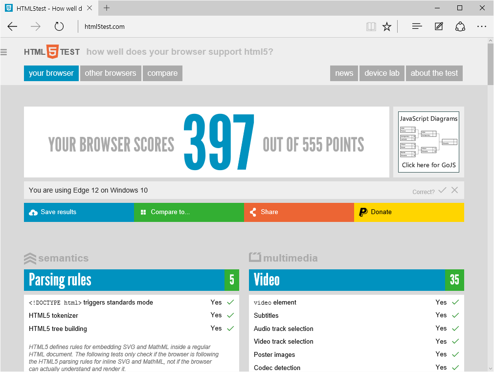
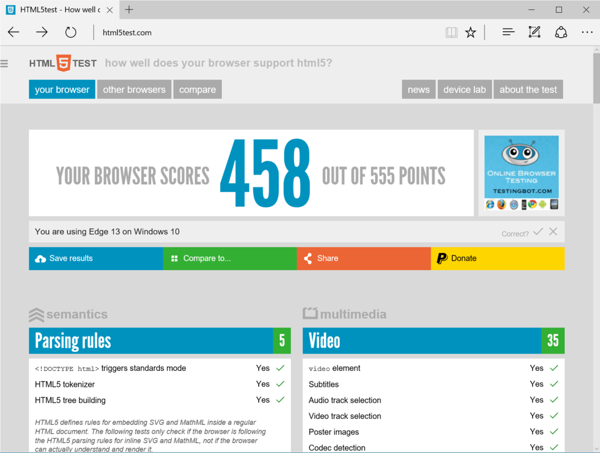
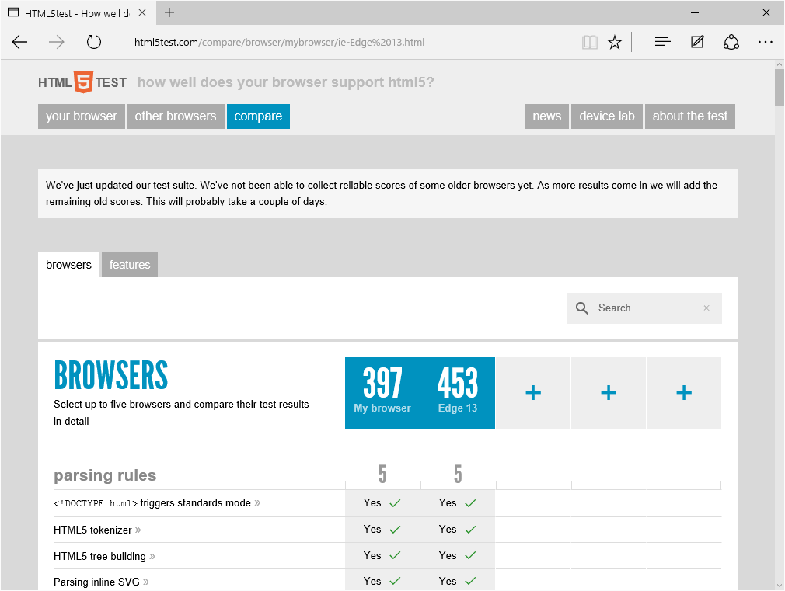
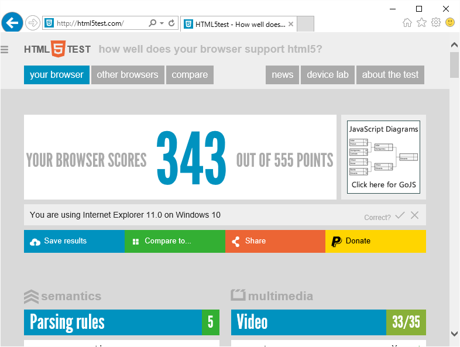

うちにはなかなか Windows 10 の Update がこなくて<a href="#f-c18884c4" name="fn-c18884c4" title="話は変わるけど、この Update の正式名称ってなんなんだろうね。みんな好き勝手に「Threshold 2」とか「Windows 10 Update 1」とか「Windows 10 November Update」とか呼んでるっぽいけど">*1</a>、

<blockquote class="twitter-tweet" lang="ja">
お使いのデバイスは最新の状態です。最終確認日時: 今日、10:46
&mdash; だるやなぎ（LINE  スタンプ販売中） (@daruyanagi) <a href="https://twitter.com/daruyanagi/status/665345300156968960">2015, 11月 14</a></blockquote>

昨日は早めにお布団に入ってしくしく泣いていたのだけれど、今日のお昼になってやっと Update が降ってきた。遅いぞー（#^ω^）

早速更新しているのだが、その間に Microsoft Edge がどれだけ進化したのか、ちょっと見てみることにしよう。

Windows 10 build 10240（デスクトップ）の「Microsoft Edge」の HTML5Test の結果。なんかみんな“402”がでるらしいんだけど、うちは“397”だった。なんでだろう、脆弱性緩和ツールとかいれてるからかもしれない。

ちなみにこの数値は、だいたい iPhone の Safari あたりと同じぐらいだと思う。

一方、Windows 10 build 10586（Insider Preview/Surface Pro 3）の「Microsoft Edge」の HTML5Test の結果は“458”。「Firefox 42」の“468”に迫る結果で、なかなかだと思う。ちなみに「Google Chrome 46」は“521”だった（いずれもちょっと動作があやしい手元の環境での計測）。

ポイント加算の内訳は

<ul>
<li>Elements：+1</li>
<li>Forms：+16</li>
<li>Input：+3</li>
<li>Responsive images：+10</li>
<li>2D Graphics：+7</li>
<li>Peer To Peer：+15</li>
<li>User interaction：+2</li>
<li>Web Components：+2</li>
</ul>
って感じ。フォーム対応の拡充とレスポンシブイメージ、ObjectRTC への対応あたりでポイントを稼いだ感じやね。Build 10576 でWebM/VP9サポートが削除されなければ（いずれ再対応する模様）、もうちょっと点数が稼げたかも。個人的には Web Components のサポートを厚くしてくれたら、ちょっと勉強したいかなって思う。

HTML5Test は機能の多さだけを計るテストなので、このポイントさえ高ければいいってもんでもないけど、「Microsoft Edge」は十分使えるブラウザーになってると思う。まだ拡張機能がないから、メインでは使う気にはなれないけど。

<h4>おまけ</h4>

「Internet Explorer 11」は“343”→“348”。うちの Windows 10 環境はちょっとおかしいっぽいので、“348”で変わらずなんだろう<a href="#f-92a3c017" name="fn-92a3c017" title="Windows 8.1（Surface 3）での「Internet Explorer 11」のスコアは“348”">*2</a>。

<blockquote class="twitter-tweet" lang="ja">
html5test で 5 点低いのが出るのは多分ポインターイベント
&mdash; しばやん (@shibayan) <a href="https://twitter.com/shibayan/status/665375378957963264">2015, 11月 14</a></blockquote>

<a href="#fn-c18884c4" name="f-c18884c4" class="footnote-number">*1</a>:話は変わるけど、この Update の正式名称ってなんなんだろうね。みんな好き勝手に「Threshold 2」とか「Windows 10 Update 1」とか「Windows 10 November Update」とか呼んでるっぽいけど

<a href="#fn-92a3c017" name="f-92a3c017" class="footnote-number">*2</a>:Windows 8.1（Surface 3）での「Internet Explorer 11」のスコアは“348”

