
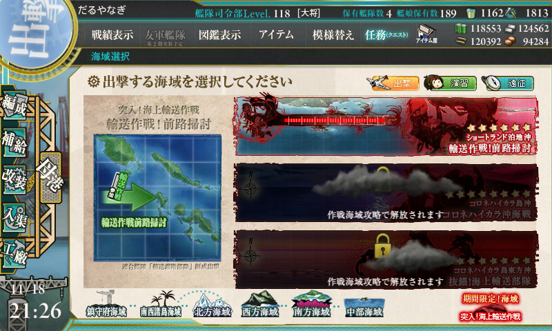

ボスにたどり着くお仕事。

<h3>難易度</h3>

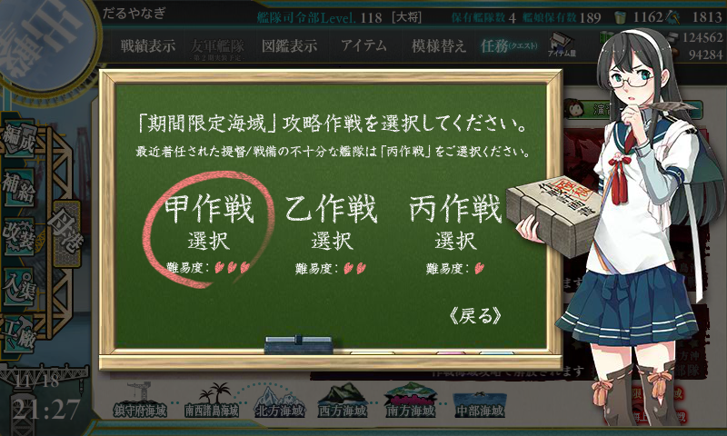

難易度は甲。報酬しょぼかったし、レベル下げてもよかったかもな（「熟練見張り員」がもらえるかどうかでレベルきめてもいいかも）。

<h3>編成</h3>

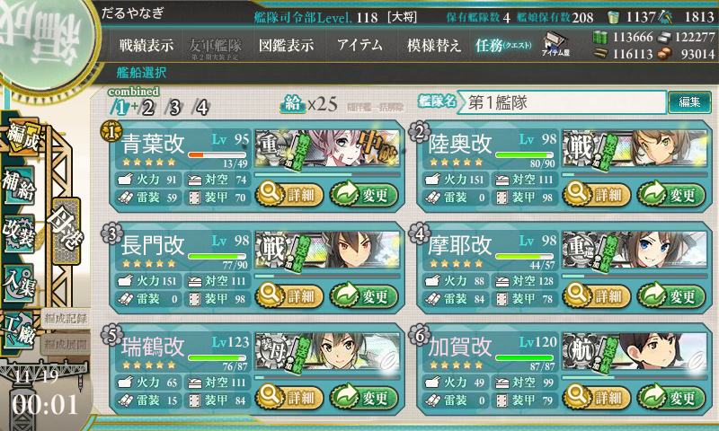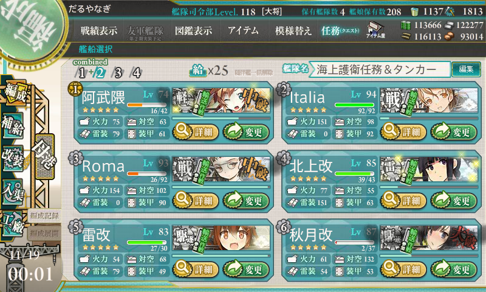

なんとなく【機動部隊】を選択。これがちょっとミスだったかもしれないが、序盤は調子よくボスに到達していたので気にならなかった。ラストアタックで3連続で事故ってちょっと後悔する。

<h4>3戦編成</h4>

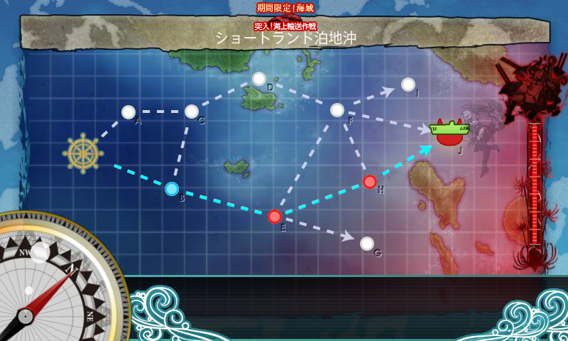

B で能動分岐。H で右方向の索敵エフェクト。

<ul>
<li>第一艦隊
<ul>
<li>青葉</li>
<li>Italia</li>
<li>Roma</li>
<li>摩耶</li>
<li>瑞鶴改二甲</li>
<li>加賀</li>
</ul></li>
<li>第二艦隊
<ul>
<li>阿武隈（改。育成中）</li>
<li>那智</li>
<li>羽黒</li>
<li>秋月</li>
<li>雷</li>
<li>電 → 北上</li>
</ul></li>
</ul>
これで3戦ルートらしい。

<h4>4戦編成</h4>

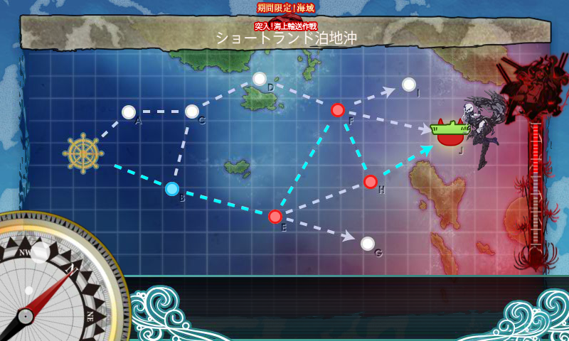

E で上方向の索敵エフェクト。

<ul>
<li>第一艦隊
<ul>
<li>青葉</li>
<li>長門</li>
<li>陸奥</li>
<li>摩耶</li>
<li>瑞鶴改二甲</li>
<li>加賀</li>
</ul></li>
<li>第二艦隊
<ul>
<li>阿武隈（改。育成中）</li>
<li>Italia → 大井</li>
<li>Roma → 木曾</li>
<li>北上</li>
<li>秋月</li>
<li>雷</li>
</ul></li>
</ul>
戦艦3隻以上は4戦になっちゃうみたい？　あと、第二艦隊から戦艦を抜いて雷巡を3隻にしても4戦ルートだった。雷巡が多すぎてもあかんのかな。

想像だけど、【水上部隊】なら初手は A なんだろうな。そのまま上ルートに行けるなら、E の戦艦よりも F の空母の方がマシなので、機動部隊】よりも【水上部隊】がよさげ。

<h3>出撃</h3>

<ul>
<li>B → E → H → J：3戦編成、ボス撃破</li>
<li>B → E → H：大破撤退</li>
<li>B → E → F → H → J：4戦編成、ボス撃破</li>
<li>B → E → F → H → J：4戦編成、ボス撃破</li>
<li>B → E → H：3戦編成、大破撤退</li>
<li>B → E → H：大破撤退</li>
<li>B → E → F → H → J：4戦編成、ボス撃破</li>
<li>B → E：3戦編成、大破撤退</li>
<li>B → E：3戦編成、大破撤退</li>
<li>B → E → H：3戦編成、大破撤退</li>
<li>B → E → F → H：4戦編成、大破撤退</li>
<li>B → E → F → H → J：4戦編成、ボス撃破</li>
</ul>
12回出撃、5回ボス撃破。ドロップは目ぼしいものなし。

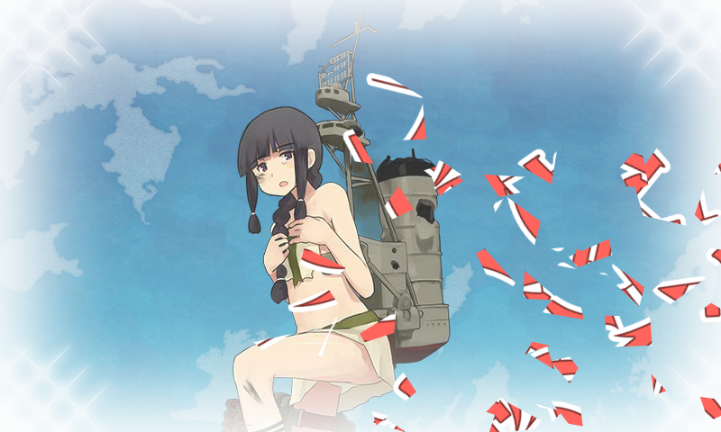

無理に3戦編成にすると、敵をうち漏らして反撃を食らうパターンが多かった。4戦編成の方が火力がある分安定する（ただし、資源消費は多い）。ちょっと手際が悪かったけど、まぁ、仕方なし。

<h3>報酬</h3>

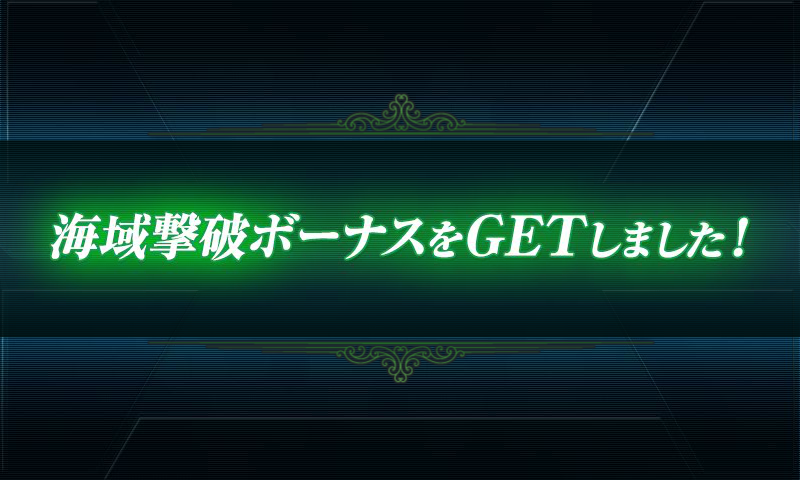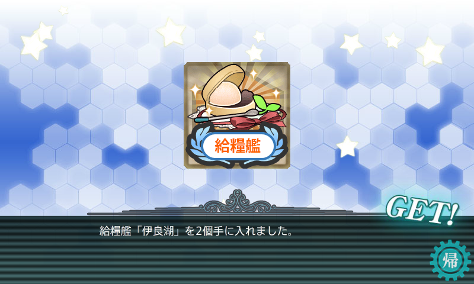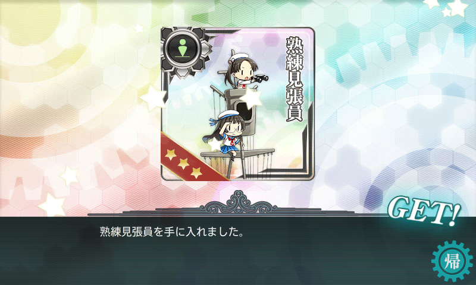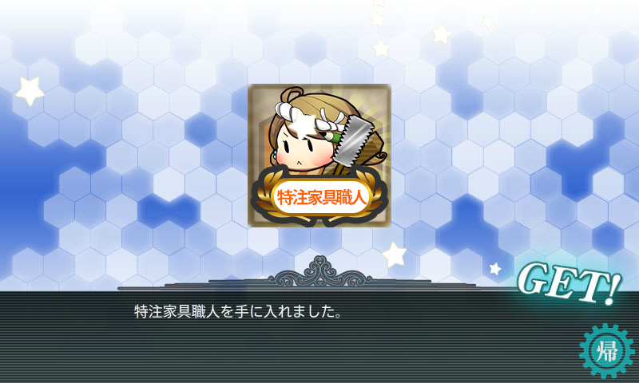

