
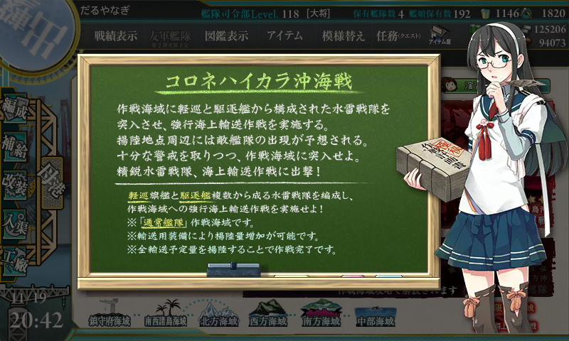

コロンバンガラ島沖海戦がモデルみたい。Wikipedia によると日本軍の参加艦艇は以下の通り（太字は艦これ実装艦）。

<blockquote cite="https://ja.wikipedia.org/wiki/%E3%82%B3%E3%83%AD%E3%83%B3%E3%83%90%E3%83%B3%E3%82%AC%E3%83%A9%E5%B3%B6%E6%B2%96%E6%B5%B7%E6%88%A6">

第二水雷戦隊部隊（二水戦部隊/警戒隊） 
軽巡洋艦：<b>「神通」</b> 
駆逐艦：「清波」、<b>「雪風」</b>、<b>「浜風」</b>、「夕暮」、<b>「三日月」</b>

輸送隊 
駆逐艦：<b>「皐月」</b>、「水無月」、「夕凪」、「松風」

輸送隊は陸兵1,100名、物件約100トンを搭載

<cite><a href="https://ja.wikipedia.org/wiki/%E3%82%B3%E3%83%AD%E3%83%B3%E3%83%90%E3%83%B3%E3%82%AC%E3%83%A9%E5%B3%B6%E6%B2%96%E6%B5%B7%E6%88%A6">&#x30B3;&#x30ED;&#x30F3;&#x30D0;&#x30F3;&#x30AC;&#x30E9;&#x5CF6;&#x6C96;&#x6D77;&#x6226; - Wikipedia</a></cite>
</blockquote>

最初はこの艦隊だけで出撃したろうと思ったのだけど、

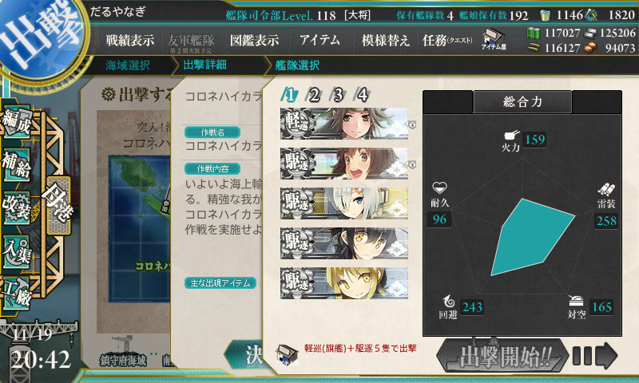

軽巡1、駆逐5にしろという。とりあえず「綾波」ちゃんと足しておいた。

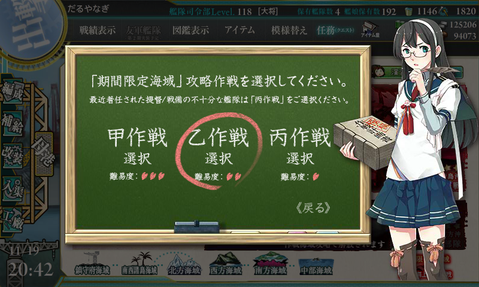

難易度は乙。調べたら報酬がしょぼかったので、ここはレベル下げてさっさとクリアする。

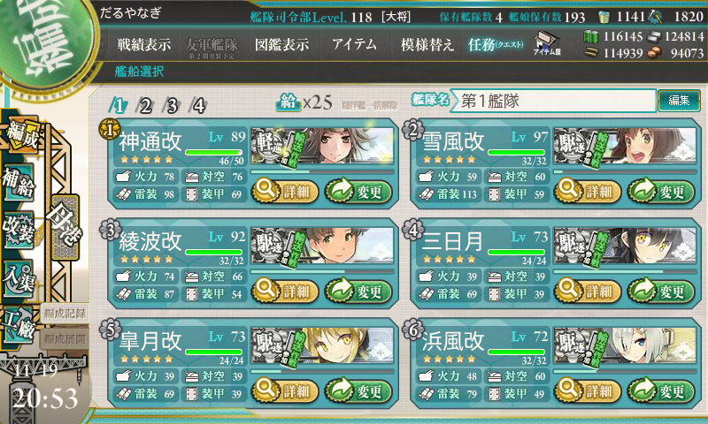

ちなみに、お札がつく。E3 以降どうなるんだろう……。

<h4>ルート＆出撃</h4>

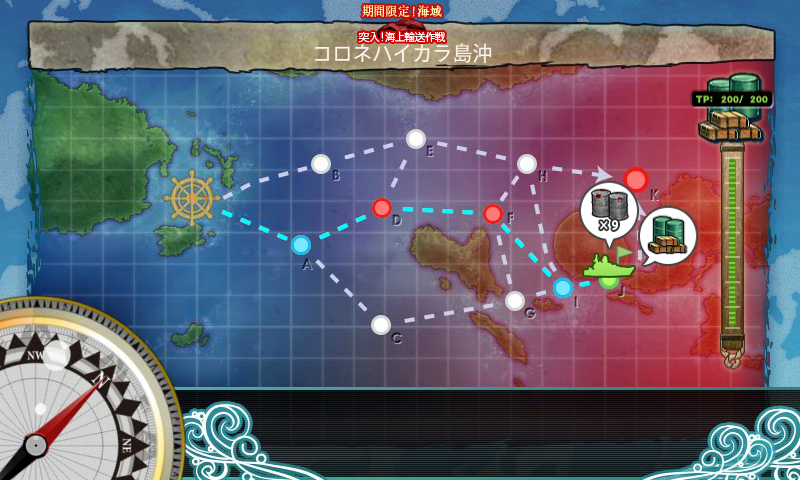

このマップは、

<ul>
<li>J を通って物資を揚陸し、</li>
<li>K（ボス）で A 勝利以上を得ることで、</li>
<li>積載貨物の量（装備しているドラム缶や大発×勝利ランク補正）によって輸送ポイント（TP）が得られる</li>
</ul>
というシステム。TP ゲージを破壊したら、マップクリアとなる（乙の場合は200）。

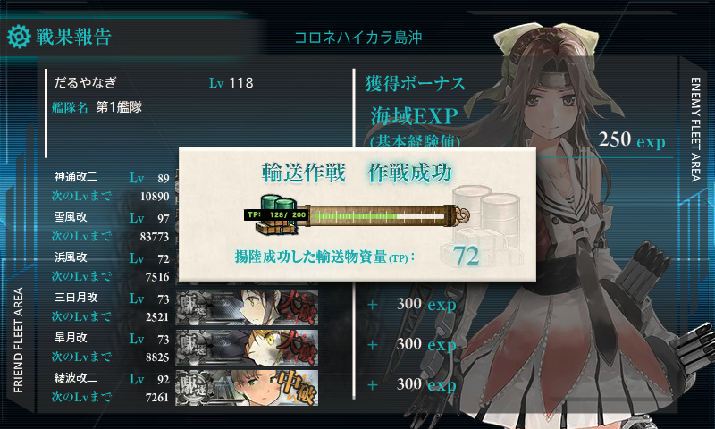

自分の場合、

<ul>
<li>神通：主砲×2、零観</li>
<li>雪風：魚雷×2、見張り員</li>
<li>綾波：主砲×2、照明弾</li>
<li>浜風：ドラム缶×3</li>
<li>三日月：ドラム缶×3</li>
<li>皐月：ドラム缶×3</li>
</ul>
にしてみた。これで J → K を外さなかったが、なんせ試行回数が少ないので、これでルート確定化と言われると自信はない。

「浜風」以下は戦闘に参加してもたいして貢献しないだろうので、ドラム缶要員に。これで S 勝利だと 72TP 稼げるので、3回ボス撃破でマップクリアとなる。

道中・決戦ともに最大限の支援付きで3回出撃でのクリアを目指すが――

<ol>
<li>A → D → F → I → J → K：ボス撃破</li>
<li>A → D：道中支援が来ず。「三日月」大破、撤退。</li>
<li>A → D → F → I → J → K：ボス撃破</li>
<li>A → D → F → I → J → K：ボス撃破</li>
</ol>
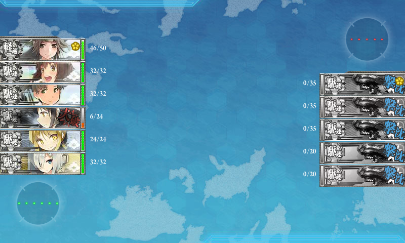

一度だけ徹底の憂き目に。

F の夜戦マスよりも、D の雷撃戦での事故の方が怖いイメージかも。

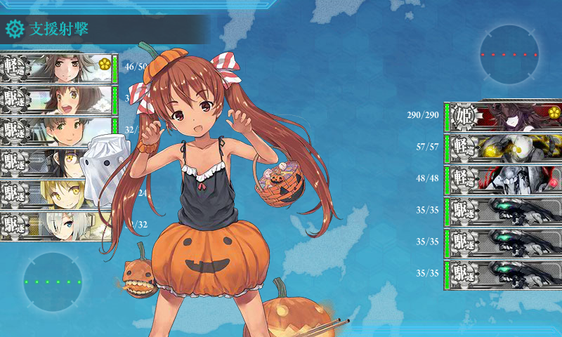

それにしても、こいつはほんまかわいい生き物だな。

<h4>報酬</h4>

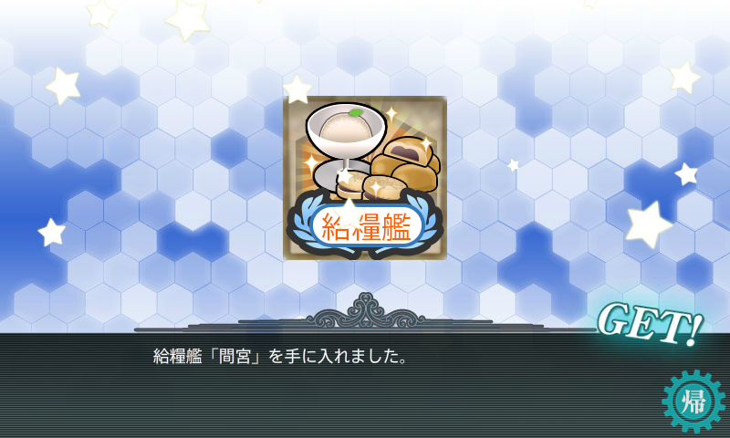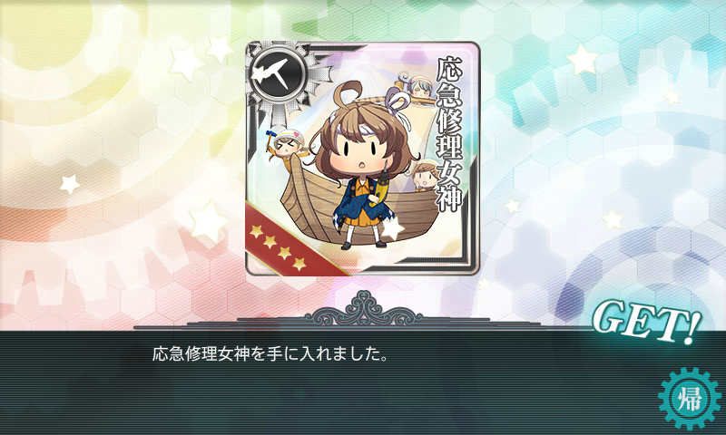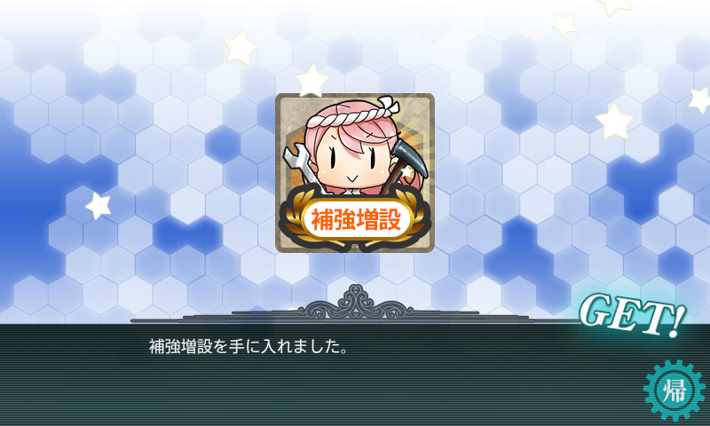

そして、ボス戦 S 勝利で「高波」をゲット。

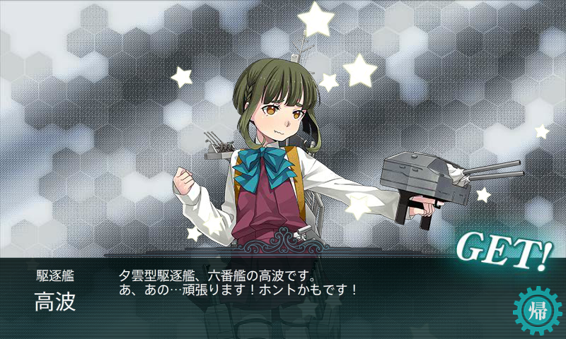

養殖すると「熟練見張員」「22号対水上電探」「13号対空電探」がもらえる美味しい艦娘。大事に育てようと思う。

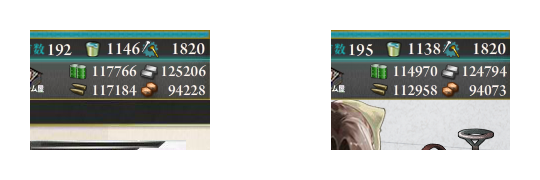

支援が重かったので、燃料3000、弾薬4000、鋼材500、ボーキサイト200を消費。メンバーが固定なので、バケツも8個使った。

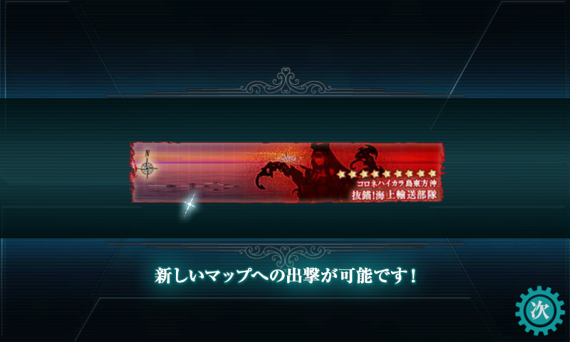

