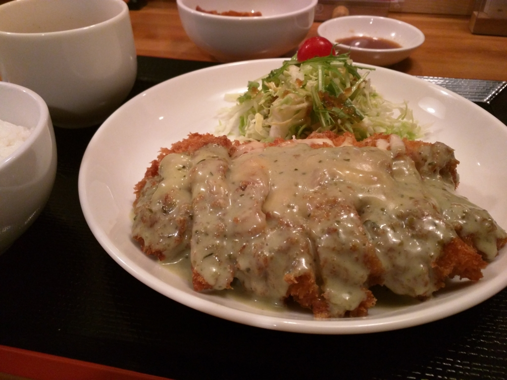
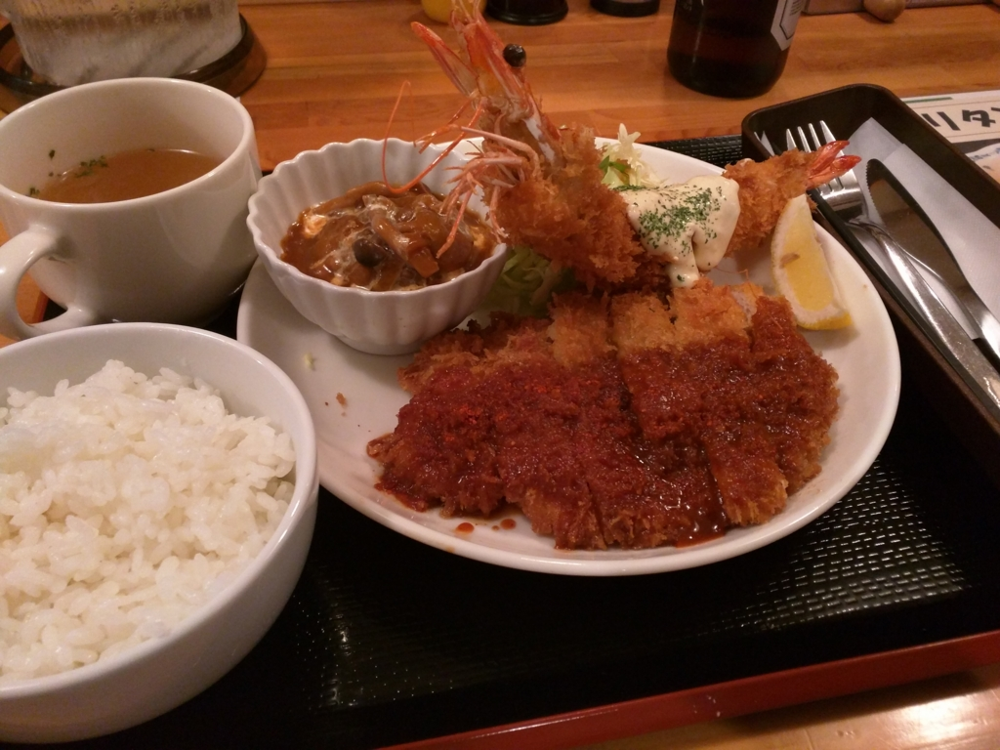
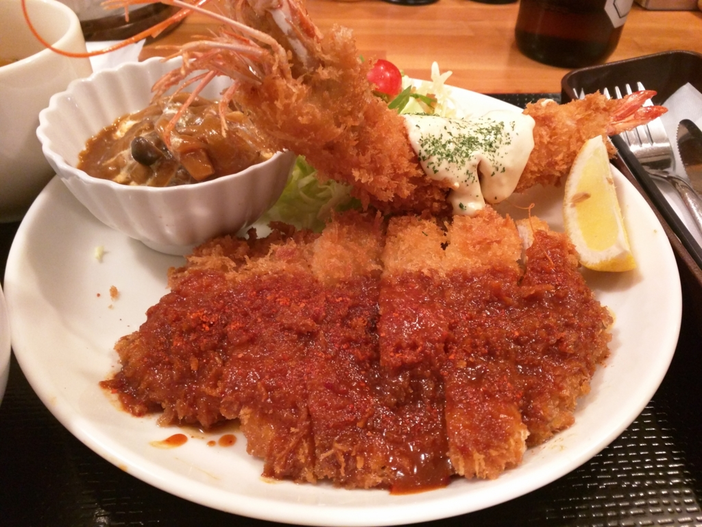
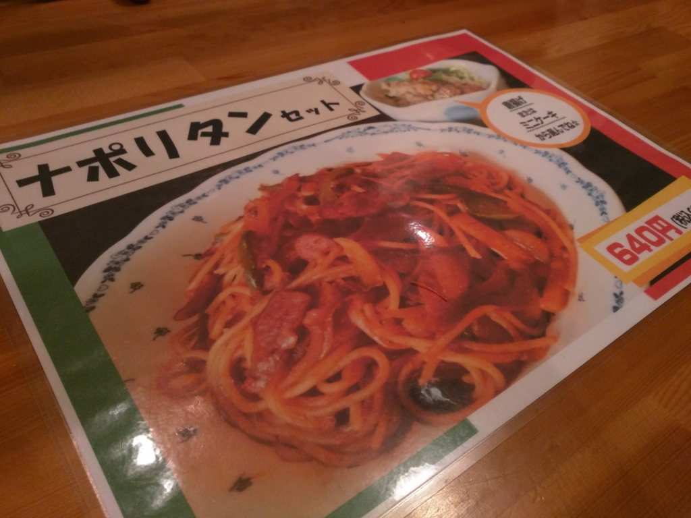

この記事は『<a href="http://www.adventar.org/calendars/1176">&#x611B;&#x5A9B;&#x30FB;&#x677E;&#x5C71;&#x306B;&#x3064;&#x3044;&#x3066;&#x306E;&#x5F92;&#x7136; Advent Calendar 2015 - Adventar</a>』の 2日目です。

ちなみに1日目は、裏業界にいろいろ詳しい沖さんの『<a href="http://okiyasu.biz/?p=306http://okiyasu.biz/?p=306">&#x307C;&#x304F;&#x306E;&#x3057;&#x3063;&#x3066;&#x308B;&#x677E;&#x5C71;&#x57CE;&#x4E0B;&#x753A; | AWS&#x3068;MWS&#x3067;&#x4EBA;&#x751F;&#x5909;&#x3048;&#x3066;&#x307F;&#x308B;&#xFF1F; 3rd</a>』でした。ボクは夜の女の子がいる店にあんまり行かない（お小遣いなくて行けない）ので、大変貴重で有用な話でした。<b>松山について知りたいことはこれですべて知った</b>気になったので、もうアドベントカレンダーやめてもいい気もしたんですが、自分で言い出したことなのにそれもどうかと思いますので、力の続く限り更新を継続したいと思います。

ちなみに、あんまり誰も登録してくれないので、明日もボクが担当する感じです。

――さてさて。

この前、大街道（松山で一番栄えているところ）にある劇場まで、独りで『ARIA The AVVENIRE』を観に行った帰り道。

<iframe src="https://hatenablog-parts.com/embed?url=https%3A%2F%2Fblog.daruyanagi.jp%2Fentry%2F2015%2F10%2F20%2F194242" title="『ARIA The AVVENIRE』はミラクルでできているのかも…… - だるろぐ" class="embed-card embed-blogcard" scrolling="no" frameborder="0" style="display: block; width: 100%; height: 190px; max-width: 500px; margin: 10px 0px;"></iframe>

晩御飯を食べるところを探して徘徊していたところ、木屋町（お城の“ひだりうえ”のあたり）でいい感じの洋食屋さんを見つけました。

<iframe src="https://hatenablog-parts.com/embed?url=https%3A%2F%2Fwww.swarmapp.com%2Fc%2F9hyspA3y2Vr" title="Happiness まるちゃん" class="embed-card embed-webcard" scrolling="no" frameborder="0" style="display: block; width: 100%; height: 155px; max-width: 500px; margin: 10px 0px;"></iframe>

写真はバジルソースのチキンカツでしたが、これが結構イケる。愛媛大学や松山大学に近いせいかな？　ボリュームのわりにお値段もリーズナブル。学生さんでもたまに通うぐらいならばお財布が即死しないと思います。

そのとき、気になったメニューが「まるちゃん　トリプルセット」。今日はこれにチャレンジしてみることにします。瓶ビールを頼んだら、ママさんが注いでくださったので、それを楽しみながら待つこと少々……。

ﾌｧｰ━━━━(ﾟ∀ﾟ)━━━━!!

デッカいエビフライに、でっかいチキンカツ、そしてサラダに煮込みハンバーグまで。情けない話ですが、お皿が運ばれてくるときにこれを見て、ちょっとほっぺたがゆるんでニマーッとしてしまいました。ボクは基本和食が好きなのですが、洋食のこういうところは大好きです。なんかこう、みてるだけでホワッと幸せになれるというんですかね。

チキンカツのソースは4種類から。前回はバジルソースだったので、今回はピリ辛ソースをチョイスしましたが……ピリ辛でビールのアテにちょうどいいですな。ほかのソースにも近いうちに挑戦したいです。

ちなみにお値段は 1,300円 ぐらいでした。ちょっと豪勢に行き過ぎた気もしましたが、ここのメニューはたぶんこれが一番高い感じ。

月末、お財布が寂しい時は、ナポリタンセットあたりを楽しむといいと思います。つか、たまーに食べたくなるよね、ナポリタン。

お店は夜の11時まで。300円のおつまみメニューもあるので、それをアテにビールを飲みながら、ちょっと遅い夕食を待つ……なんてのもありじゃないでしょうか。 
 

<h3>はてなブログユーザーへのお知らせ</h3>

<ul>
<li><a href="http://hatenablog.com/g/6653586347146850343">&#x611B;&#x5A9B; - &#x306F;&#x3066;&#x306A;&#x30D6;&#x30ED;&#x30B0; &#x30B0;&#x30EB;&#x30FC;&#x30D7;</a></li>
<li><a href="http://hatenablog.com/g/6653586347146850264">&#x677E;&#x5C71; - &#x306F;&#x3066;&#x306A;&#x30D6;&#x30ED;&#x30B0; &#x30B0;&#x30EB;&#x30FC;&#x30D7;</a></li>
</ul>
はてなブログ グループも作ってみました。役立てていただけると嬉しいです。

