
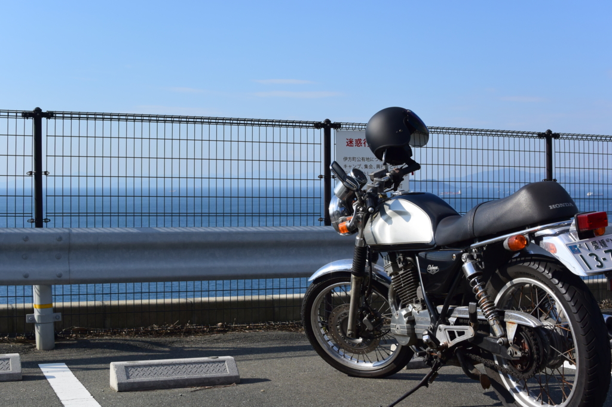

この記事は「<a href="http://www.adventar.org/calendars/1176">&#x611B;&#x5A9B;&#x30FB;&#x677E;&#x5C71;&#x306B;&#x3064;&#x3044;&#x3066;&#x306E;&#x5F92;&#x7136; Advent Calendar 2015 - Adventar</a>」の9日目の記事です。前日の記事は「<a href="http://okiyasu.biz/?p=337">&#x304C;&#x3093;&#x3070;&#x308C;&#x5730;&#x57DF;&#x30B9;&#x30FC;&#x30D1;&#x30FC; | AWS&#x3068;MWS&#x3067;&#x4EBA;&#x751F;&#x5909;&#x3048;&#x3066;&#x307F;&#x308B;&#xFF1F; 2nd</a>」でした。次の日の記事の担当は @daruyanagi さんです (｀･ω･´)ゞ 
 
10月11日の夕方。なんとなくどこかへ行きたくなったので、西の方へ出かけた。予てからやろうと考えていた、四国の先っぽ制覇や。

<ul>
<li>蒲生田岬（四国最東端）：徳島県阿南市</li>
<li><b>佐田岬</b>（四国最西端）：愛媛県西宇和郡伊方町</li>
<li>足摺岬（四国最南端）：高知県土佐清水市</li>
<li>竹居観音岬（四国最北端）：香川県高松市</li>
<li>室戸岬（東側で最も南に張り出している）：高知県室戸市</li>
</ul>
今回行くのは、佐田岬（さだみさき）。四国の西の端やね。

<h4>大分方面への玄関口・八幡浜</h4>

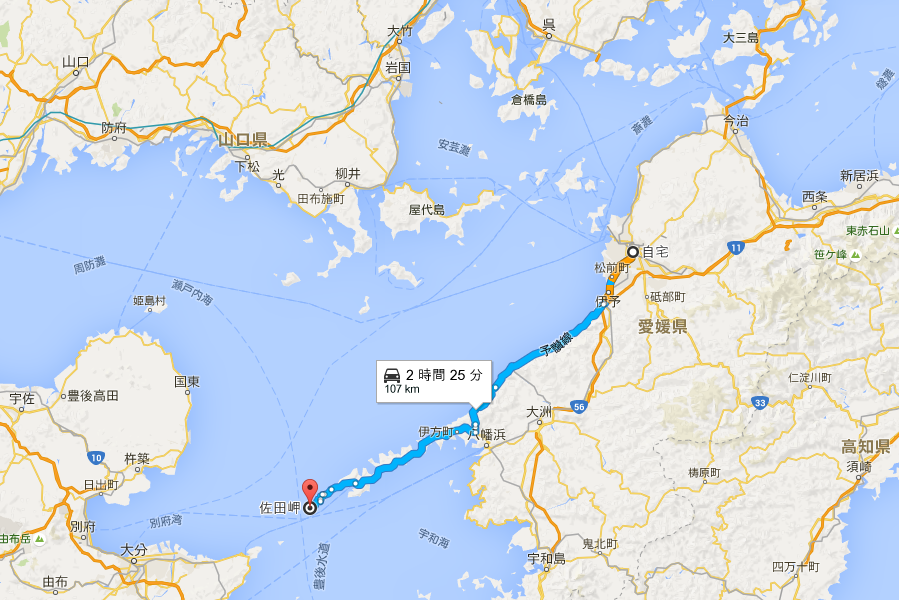

佐田岬までは、松山から車で2時間半ほど。日帰りツーリングができない距離ではないけれど、無理することもあるまいと思い、ちょうど中間地点にある街・八幡浜で宿をとった。この町は大分方面への玄関口になっていて、フェリーが出ている。

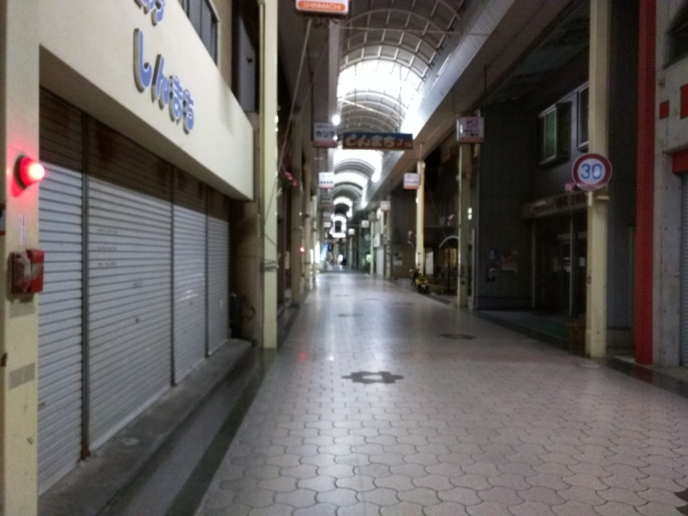

割かし立派な商店街があるが、週末、日が暮れたあとということもあり、空いている店は少ない。食べ物はちゃんぽんが名物だと言ことだが、晩御飯をちゃんぽんで済ますのももったいないので、適当なお寿司・天ぷら屋さんに入ってみた。

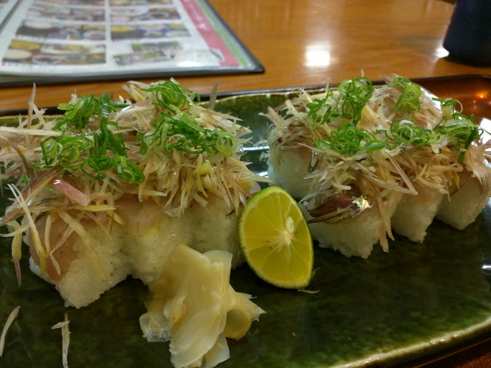

あじのたたき寿司っていうのが割かし美味しかった。

<h4>原発のある街・伊方</h4>

翌日は珍しく早起きしたので、早めに出発。夏っぽい軽装できたのだけど、バイクに乗るとかなり寒く、革ジャンを着てこなかったことを後悔した。ヘルメットの中で歌を歌ってごまかす。

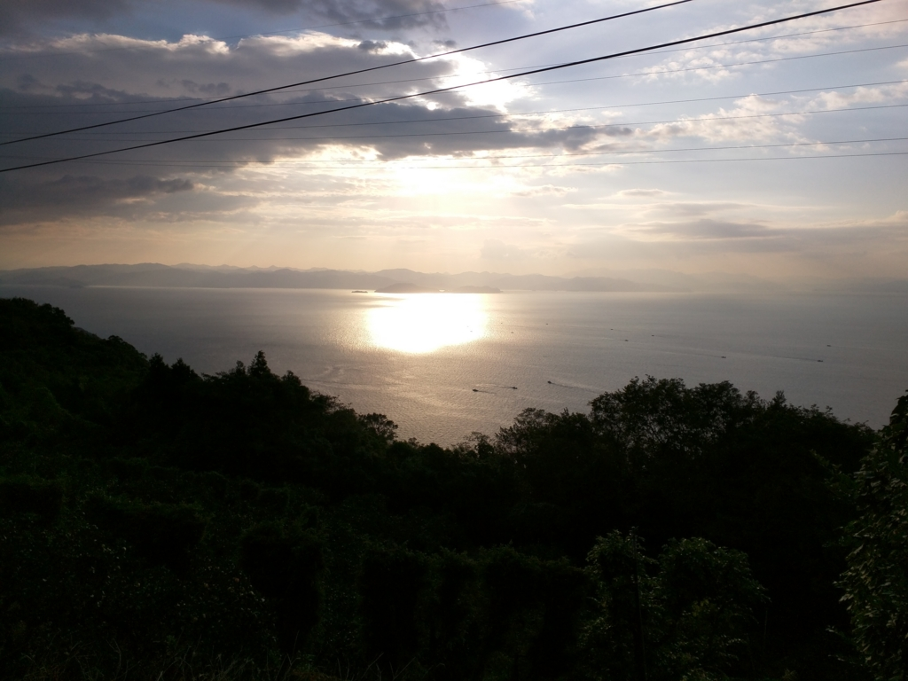

道は整備されていて、左手には宇和海の美しい景色が広がる。ツーリングにはもってこいの道だなぁ。

途中、噂に聞く原発の隣を通った。前を行くクルマというクルマが次々と原発の敷地にのみ込まれていくのが印象的だった。そろそろ再稼働するらしいけど、この辺りでは大きな産業であるらしい。原発の是非を論じるのは、面倒くさい人が来るとイヤなので、ここではやめておく。とにかく、ご安全に。

<h4>四国の先っぽ・佐田岬</h4>

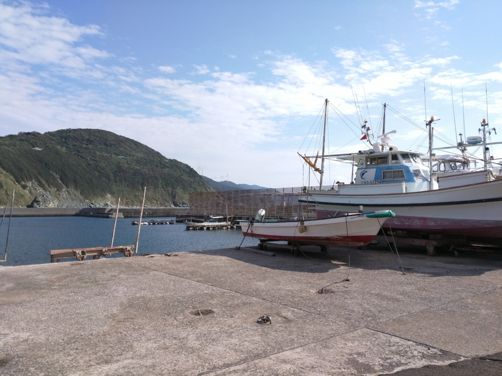

三崎港という漁港を過ぎると、道はぐんと狭くなる（この岬からも別府への船が出ている）。しかし、調子に乗って飛ばしてはいけない。そこら辺の道を、おじいちゃん、おばあちゃんが割と歩いているのだ。安全運転、安全運転。

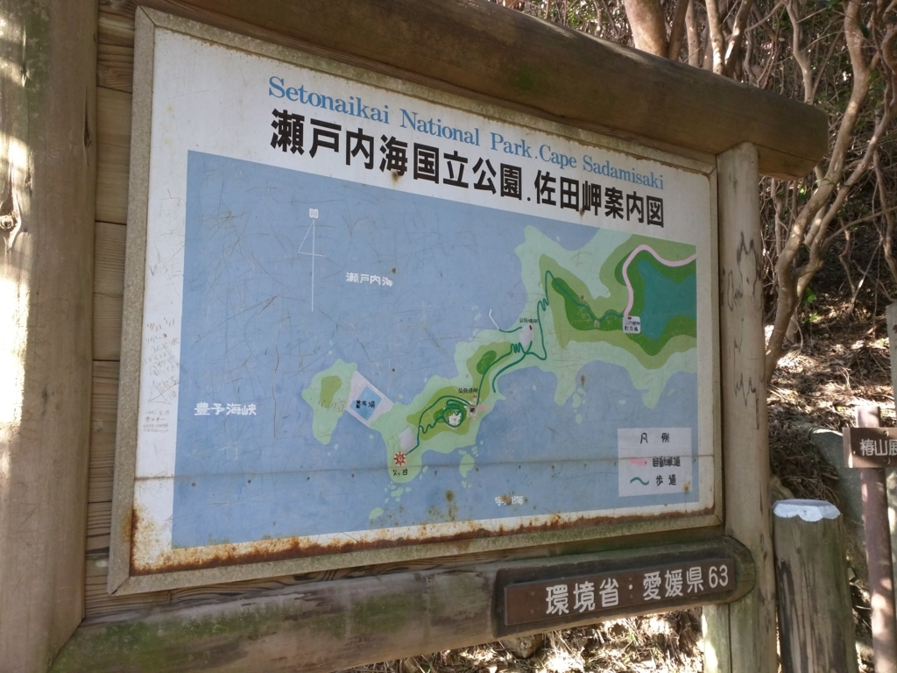

八幡浜を出て1時間ちょっとぐらいで、目的地の佐田岬に到着。駐車場にバイクを置いたが、灯台まではここからさらに2km弱ほど歩かねばならないようだ。入口に陣取っているおばちゃんに捕まって、ミカンを買わされた。

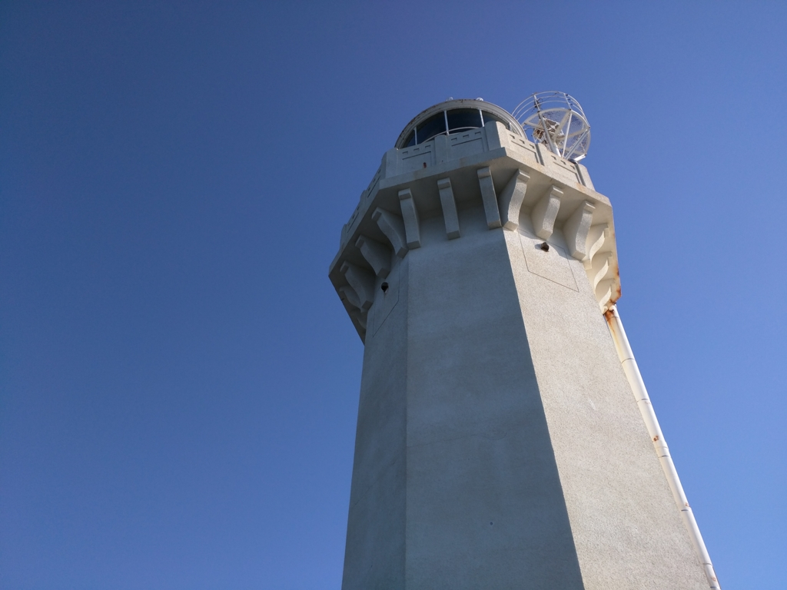

灯台までの道は、ボクのような運動不足のおっさんにとっては険しい。息を切らしながら歩くこと30分ほど、ようやく白い灯台の麓にたどり着いた。

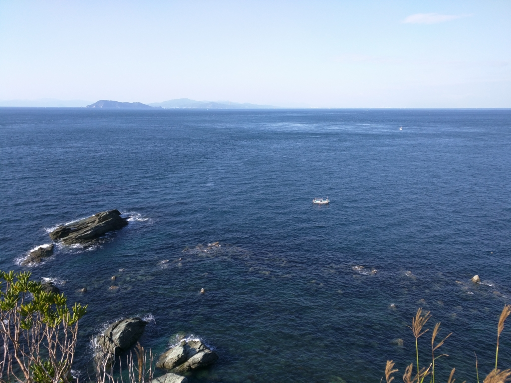

――絶景！！

うっすらと見えるのが、大分県だなぁ。

この海峡は古来より“速吸（はやすい）の瀬戸”と呼ばれているらしい。

<blockquote cite="https://ja.wikipedia.org/wiki/%E8%B1%8A%E4%BA%88%E6%B5%B7%E5%B3%A1">

『古事記』や『日本書紀』においては、神武天皇が東征の途上で速吸門を通ったときに、国つ神の椎根津彦が現れて航路を案内したとの記載があり、この速吸門が豊予海峡のことであると考えられている

<cite><a href="https://ja.wikipedia.org/wiki/%E8%B1%8A%E4%BA%88%E6%B5%B7%E5%B3%A1">&#x8C4A;&#x4E88;&#x6D77;&#x5CE1; - Wikipedia</a></cite>
</blockquote>

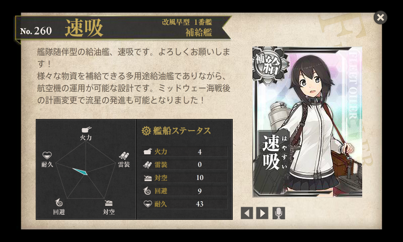

艦これ提督にとっては、給油艦「速吸」の名前の由来と説明したほうが早いかもしれない。ミッドウェー海戦で空母を三隻も失った日本海軍が、ついでに正気も失って「給油しかしないのアホらしいから、哨戒用の水上機も発艦できるようにしようぜ！」と建造した艦。なお、発艦できても着艦はできないため、陸上に基地を確保するかしない限り、出撃したら機体は捨てることになる模様。しかも、その艤装は活用の機会がなく、あっさり潜水艦に雷撃を食らって沈没したらしい。南無い。

まぁ、かわいいからええんやけどな（下種顔

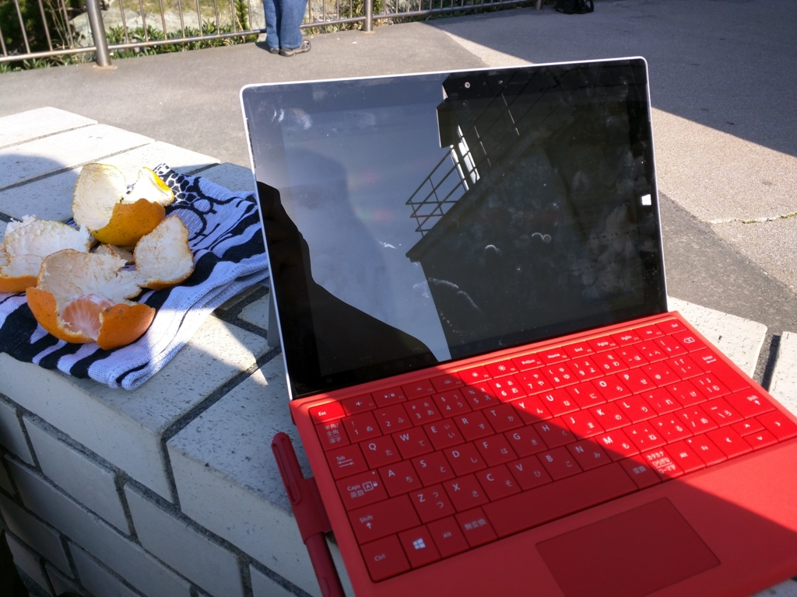

記念に Surface 3 で艦これをやってみたが、電波が悪くて満足に遠征も出せなかった……orz

<h4>おまけ</h4>

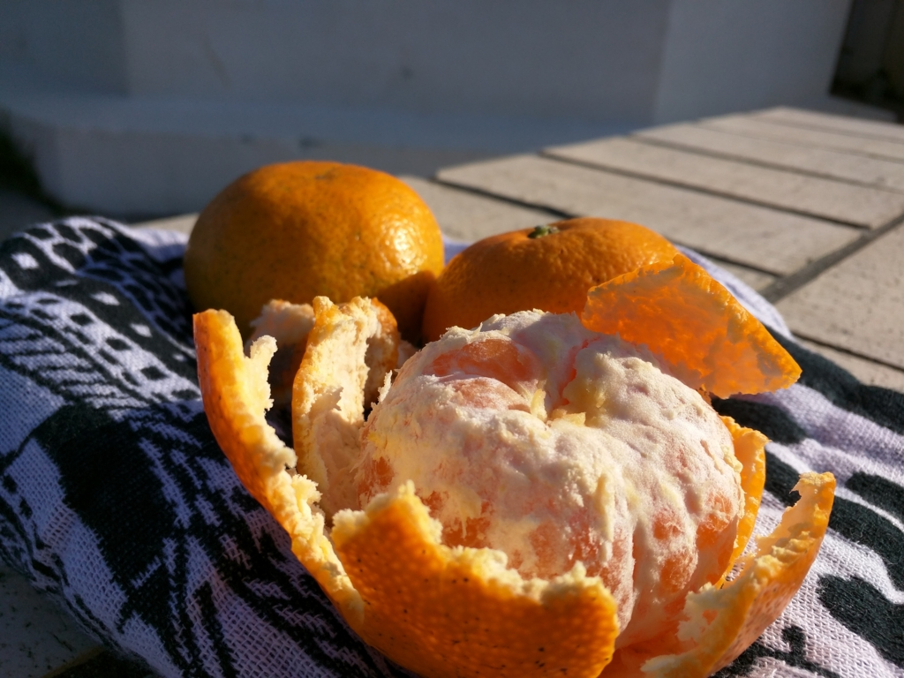

ミカン美味しかったです。

